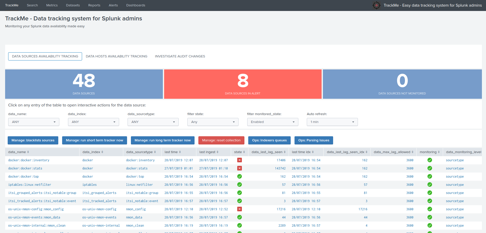
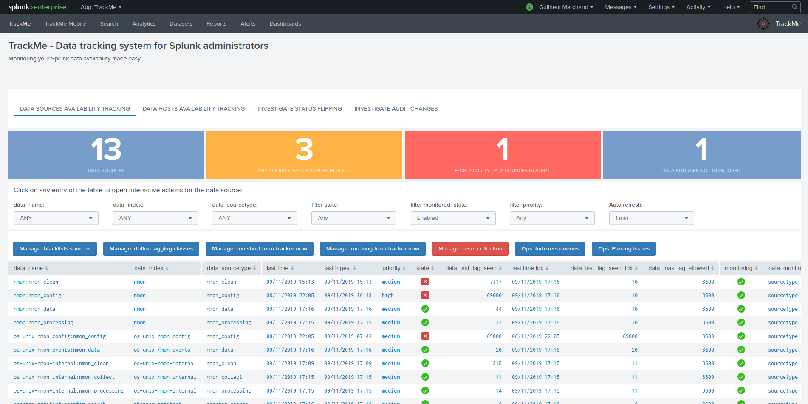
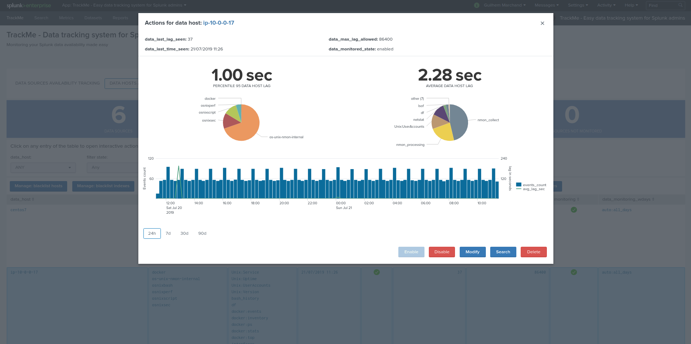

# TrackMe - An application for Splunk administrators to monitor and track data sources and hosts availability the easy way

| branch | build status |
| ---    | ---          |
| master | 

## The Splunk TrackMe application for data source monitoring provides a handy user interface and workflow for Splunk administrators to monitor the availability of their data sources:

- Discover and store data sources and hosts information and states
- Provides a handy and easy user interface to manage states, configuration and quickly trouble shoot alerts
- Analyse and detect lack of data and performance lagging of data sources and hosts
- Easy administration via graphical human interface

## Why this application?

Splunk administrators and engineers have to spend a good amount of time and energy to on-board new data sources, another data source after another data source.

However, it is very frequent to realise after math that something when wrong, for some reason the sender stopped sending, an issue appeared, a network rule was lost...

No administrator should be informed of an issue in the data flow by the customer or end users, this is why you need pro-activity and cost less availability monitoring.

with the massive amount of data sources, this becomes easily a painful and time consuming activity, this application aims to drastically help you in these tasks.

This tiny application provides a handy user interface associated with a simple but efficient data discovery, state and alerting workflow.

Made by Splunk admins for Splunk admins, the TrackMe application provides builtin powerful features to monitor and administer you data source monitoring the easy way!

**Please consult the online documentation:** https://trackme.readthedocs.io
