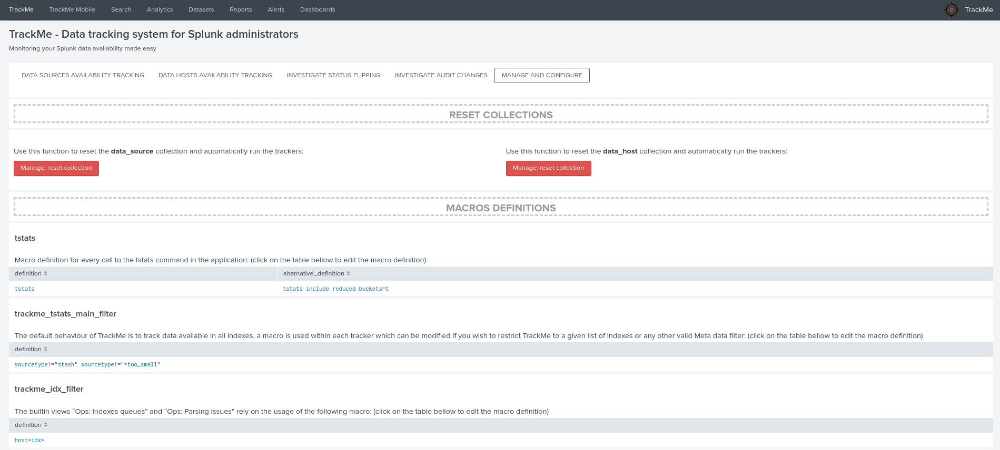
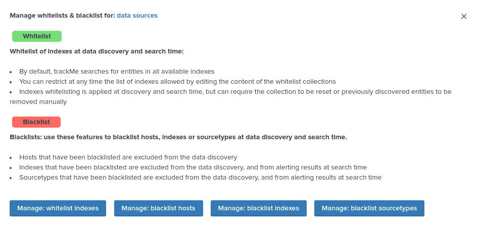
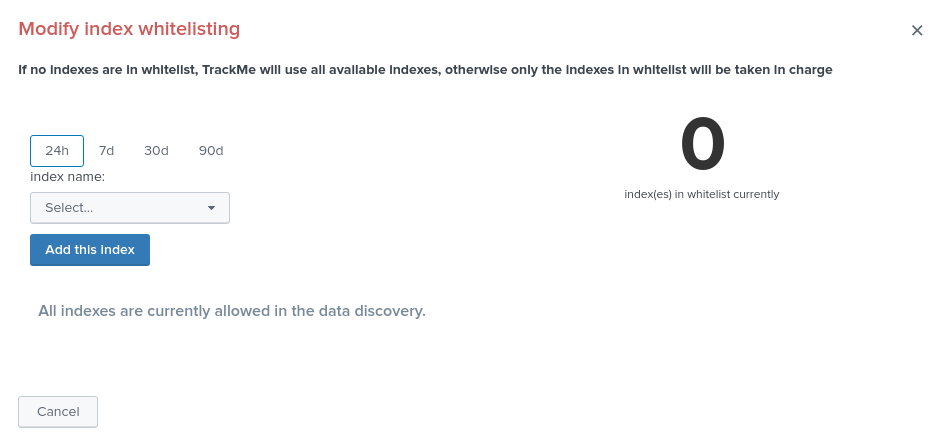

Configuration
#############

**TrackMe does not require any configuration and works out of the box after its installation, however there are some configuration items that can modified up to your needs, jump to the manage and configure tab in the application UI:**

tstats root macro definition
============================

Searches in the main UI rely on the usage of the following macro:

::

    # For Splunk 7.3.x and later, you might want to include include_reduced_buckets=t
    [tstats]
    definition = tstats
    iseval = 0

If you are using Splunk 7.3.x or a later version, you can include the reduced buckets in the tstats results, as:

::

    [tstats]
    definition = tstats include_reduced_buckets=t
    iseval = 0

Indexers macro definition
=========================

The builtin views "Ops: Indexes queues" and "Ops: Parsing issues" rely on the usage of the following macro:

::

    # defined pattern filter for indexers
    [trackme_idx_filter]
    definition = host=idx*
    iseval = 0

Customise the macro definition to match your indexers host naming convention.

Time format for human readable output
=====================================

The UI generates human readable time stamps in the following format:

::

    %d/%m/%Y %H:%M

This is driven by the following macro definition:

::

    [trackme_date_format(1)]
    args = input_field
    definition = eval "$input_field$ (translated)"=strftime($input_field$, "%d/%m/%Y %H:%M")
    iseval = 0

If you prefer to have a different format, customise this macro definition.

Whitelisting and blacklisting
=============================

TrackMe version 1.0.22 introduced builtin support for both whitelisting of indexes and blacklisting of indexes, sourcetypes and hosts.

The default behaviour of TrackMe is to track data available in all indexes, which changes if whitelisting has been defined:

The same UI allows you to define blacklisted items, which are added as part of a "NOT" boolean syntax within the searches.

Finally, in addition the following macro is used within the searches, and can be customized if you need:

::

    # used as the top of the populating searches
    [trackme_tstats_main_filter]
    definition = sourcetype!="stash" sourcetype!="*too_small"
    iseval = 0

Activation of builtin alerts
============================

**TrackMe provides out of the box alerts that can be used to deliver alerting when a monitored component reaches a red state:**

- TrackMe - Alert on data source availability

- TrackMe - Alert on data host availability

- TrackMe - Alert on metric host availability

**These alerts are disabled by default, and need to be manually enabled if you wish to use them in your global alerting workflow.**

trackme_admin role for granular access
======================================

**The application contains a builtin role that can be used for granular permissions:**

- trackme_admin

Any user that will be member of this role, or member of a role that is importing this role, will receive the relevant permissions to configure objects such as collections content related to trackMe.

Default priority for data discovery
===================================

**When a data source or host is discovered by TrackMe, a default value of medium priority is automatically defined via the usage of the following macro:**

- trackme_default_priority

**You can safety customise the macro is you wish to configure a default level of priority by default, which values can be one of the following:**

- low
- medium
- high

*Notes: the high value is designed by default to be the highest SLA failure, which should ideally refer to an alert in your ticketing system.*
