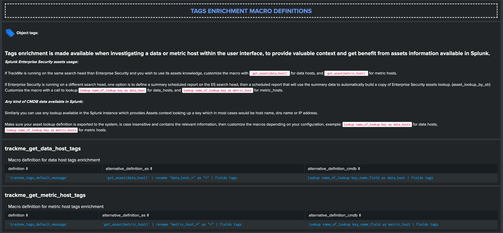

Configuration
#############

**Since the version 1.2.6, TrackMe requires the creation of a metric index, or the configuration of the metric index target if you wish to use an existing index:**

.. image:: img/configure_ui_metrics_idx.png
   :alt: configure_ui_metrics_idx.png
   :align: center

**All main configuration items are macro based, which are exposed in the configuration UI:**

.. image:: img/configure_ui.png
   :alt: configure_ui.png
   :align: center

Tags enrichment macro definitions
=================================



**Tags enrichment is made available when investigating a data or metric host within the user interface, to provide valuable context and get benefit from assets information available in the Splunk deployment.**

**Splunk Enterprise Security assets usage:**

If TrackMe is running on the same search head than Enterprise Security and you wish to use its assets knowledge, customize the macro with ```get_asset(data_host)``` for data hosts, and ```get_asset(metric_host)``` for metric hosts.

If Enterprise Security is running on a different search head, one option is to define a summary scheduled report on the ES search head, then a scheduled report that will use the summary data to automatically build a copy of Enterprise Security assets lookup. (asset_lookup_by_str) Customize the macro with a call to ``lookup lookup name_of_lookup key as data_host`` for data_hosts, and ``lookup name_of_lookup key as metric_host`` for metric_hosts.

**Any kind of CMDB data available in Splunk:**

Similarly you can use any lookup available in the Splunk instance which provides Assets context looking up a key which in most cases would be host name, dns name or IP address.

Make sure your asset lookup definition is exported to the system, is case insensitive and contains the relevant information, then customize the macros depending on your configuration, example: ``lookup name_of_lookup key as data_hosts`` for data hosts, ``lookup name_of_lookup key as metric_hosts`` for metric hosts.

tstats root macro definition
============================

Searches in the main UI rely on the usage of the following macro:

::

    # For Splunk 7.3.x and later, you might want to include include_reduced_buckets=t
    [tstats]
    definition = tstats
    iseval = 0

If you are using Splunk 7.3.x or a later version, you can include the reduced buckets in the tstats results, as:

::

    [tstats]
    definition = tstats include_reduced_buckets=t
    iseval = 0

Summary index macro definition
==============================

Since TrackMe 1.2.0, the application generates summary data events which are indexed in a summary index defined within the following macro:

::

    [trackme_idx]
    definition = index="summary"
    iseval = 0

By default, summary events are indexed in index=summary, customize this macro if you wish to change the index target.

Indexers macro definition
=========================

The builtin views "Ops: Indexes queues" and "Ops: Parsing issues" rely on the usage of the following macro:

::

    # defined pattern filter for indexers
    [trackme_idx_filter]
    definition = host=idx*
    iseval = 0

Customise the macro definition to match your indexers host naming convention.

Whitelisting and blacklisting
=============================

TrackMe version 1.0.22 introduced builtin support for both whitelisting of indexes and blacklisting of indexes, sourcetypes and hosts.

.. image:: img/whitelist_and_blacklist.png
   :alt: whitelist_and_blacklist.png
   :align: center

The default behaviour of TrackMe is to track data available in all indexes, which changes if whitelisting has been defined:

.. image:: img/whitelisting.png
   :alt: .png
   :align: center

The same UI allows you to define blacklisted items, which are added as part of a "NOT" boolean syntax within the searches.

Finally, in addition the following macro is used within the searches, and can be customized if you need:

::

    # used as the top of the populating searches
    [trackme_tstats_main_filter]
    definition = sourcetype!="stash" sourcetype!="*too_small"
    iseval = 0

Activation of builtin alerts
============================

**TrackMe provides out of the box alerts that can be used to deliver alerting when a monitored component reaches a red state:**

- TrackMe - Alert on data source availability

- TrackMe - Alert on data host availability

- TrackMe - Alert on metric host availability

**These alerts are disabled by default, and need to be manually enabled if you wish to use them in your global alerting workflow.**

trackme_admin role for granular access
======================================

**The application contains a builtin role that can be used for granular permissions:**

- trackme_admin

Any user that will be member of this role, or member of a role that is importing this role, will receive the relevant permissions to configure objects such as collections content related to trackMe.

Default priority for data discovery
===================================

**When a data source or host is discovered by TrackMe, a default value of medium priority is automatically defined via the usage of the following macro:**

- trackme_default_priority

**You can safety customise the macro is you wish to configure a default level of priority by default, which values can be one of the following:**

- low
- medium
- high

*Notes: the high value is designed by default to be the highest SLA failure, which should ideally refer to an alert in your ticketing system.*
