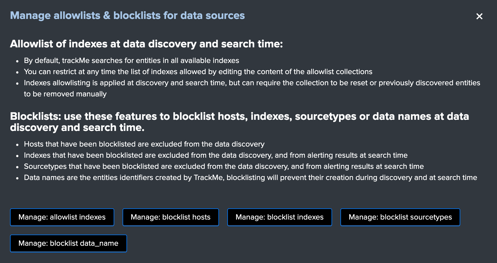
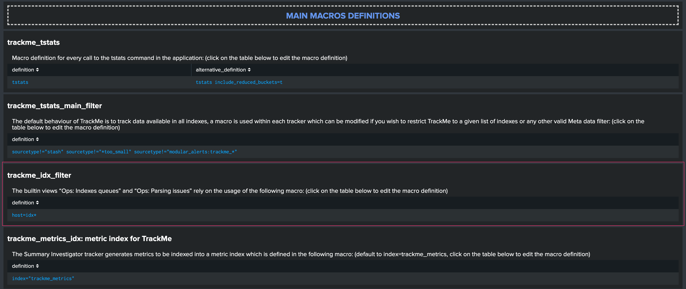
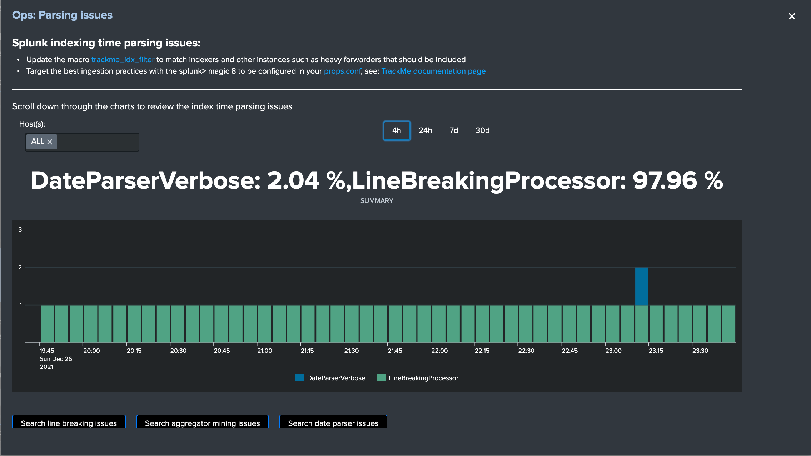
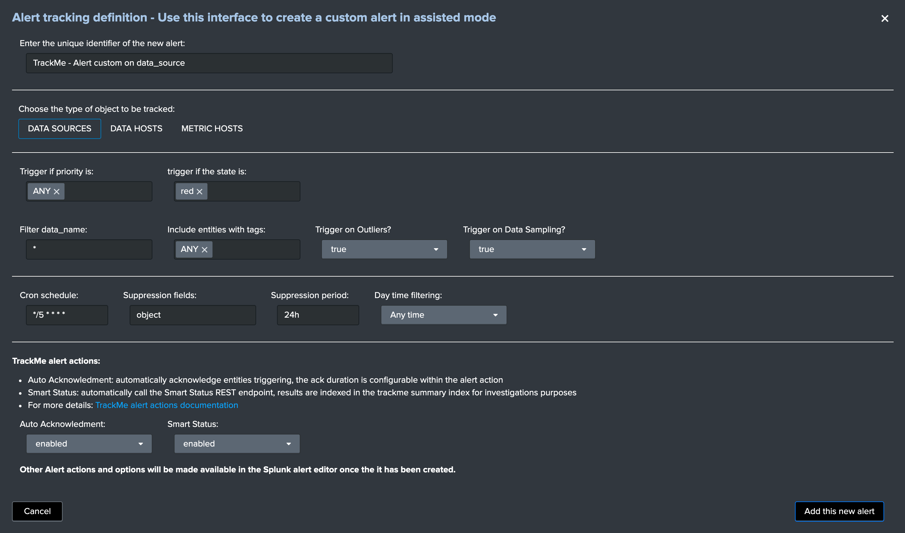

Step by step installation and configuration
###########################################

Step 1: Deploy TrackMe
======================

Where to deploy TrackMe
-----------------------

The first question you need an answer when you look at deploying TrackMe the very first time is generally where to deploy TrackMe?

**To answer this question in a nutshell:**

- TrackMe is deployed exclusively on a search head layer, there are no components running on forwarders (Universal Forwarders, Heavy Forwarders) or Splunk indexers
- The search head layer targets depends on your preference, it can be standalone search head (SH) you are using to run monitoring tools, the monitoring console host (MC) or a Search Head Cluster (SHC)
- The essential part of the content TrackMe is generated in dedicated indexes (summary events and metrics) and non-replicated KVstore collections which have near zero impacts on the search knowledge bundle size that is replicated automatically to your indexers
- One aspect that can drive your decision is the type of users that will deal with TrackMe, if all of them are Splunk administrators then the Monitoring Console is certainly the best candidate. Otherwise, a Search Head Layer that is designed to accomodate with non administrator users might be more adapted.

Configure indexes
-----------------

Once you decided which search head layer will host TrackMe, the next step is to configure its indexes.

TrackMe requires the creation of two indexes, one for the summary events and one for the metrics, the second is a metric type of index opposed to events indexes, TrackMe includes the following indexes.conf:

``default/indexes.conf``

::

    [trackme_summary]
    coldPath = $SPLUNK_DB/trackme_summary/colddb
    homePath = $SPLUNK_DB/trackme_summary/db
    thawedPath = $SPLUNK_DB/trackme_summary/thaweddb

    [trackme_metrics]
    coldPath = $SPLUNK_DB/trackme_metrics/colddb
    homePath = $SPLUNK_DB/trackme_metrics/db
    thawedPath = $SPLUNK_DB/trackme_metrics/thaweddb
    datatype = metric

.. hint:: Indexes definition on Search Heads and Indexers

    - before deploying TrackMe, ensure to declare these indexes on your indexers, in clustering mode this means updating on your indexes on the master-apps and pushing the cluster bundle
    - indexes need to be declared on the search head layer hosting TrackMe too (and other search heads as a good practice), data will not be stored on the search head but this allows autocompletion and collect/mcollect features
    - given that TrackMe comes with a built-in definition as part of the package, you do not need to handle this normally on the search head but on the indexers (unless the default/indexes.conf is trashed via some automation)

In well-designed Splunk environments, you will most likely use volumes on the indexers, you would translate this within your indexer configuration to the following configuration potentially:

::

    [trackme_summary]
    coldPath = volume:primary/trackme_summary/colddb
    homePath = volume:primary/trackme_summary/db
    thawedPath = $SPLUNK_DB/trackme_summary/thaweddb

    [trackme_metrics]
    coldPath = volume:primary/trackme_metrics/colddb
    homePath = volume:primary/trackme_metrics/db
    thawedPath = $SPLUNK_DB/trackme_metrics/thaweddb
    datatype = metric

*To be adapted depending on your volume configuration!*

Using a different naming convention for indexes
^^^^^^^^^^^^^^^^^^^^^^^^^^^^^^^^^^^^^^^^^^^^^^^

In some cases you may need to use a different naming convention for the two TrackMe indexes, this is not an issue and the only thing you will need to update in the application will be defining the custom configuration in the following two macros:

- ``trackme_idx``
- ``trackme_metrics_idx``

The out of the box definition is:

``default/macros.conf``

::

    [trackme_idx]
    definition = index="trackme_summary"
    iseval = 0

    [trackme_metrics_idx]
    definition = index="trackme_metrics"
    iseval = 0

Up to your choice, you can do this manually in the same time you deploy TrackMe (in a local/macros.conf) or you can update this within the UI once the application has been deployed:

``TrackMe manage and configure``

.. image:: img/step_by_step_configure/ui_update_indexes.png
   :alt: ui_update_indexes.png
   :align: center
   :width: 1200px
   :class: with-border

Step 2: Configure TrackMe to match your needs
=============================================

TrackMe components enablement
-----------------------------

**You can decide to enable or disable TrackMe components in the configuration user interface:**

.. image:: img/components/components1.png
   :alt: components1.png
   :align: center
   :width: 1200px
   :class: with-border


**When a component is disabled:**

- It is not visible anymore in the main TrackMe UI
- The associated tracker reports do not execute any longer the trackers, and will output a simple message mentioning that the component is disabled instead

**For instance, if you wish to use only the Data sources tracking component:**

.. image:: img/components/components3.png
   :alt: components3.png
   :align: center
   :width: 1200px
   :class: with-border

.. image:: img/components/components4.png
   :alt: components4.png
   :align: center
   :width: 1200px
   :class: with-border

*The tracker executor logs would show:*

::

   index=_internal sourcetype=trackme:custom_commands:trackmetrackerexecutor "disabled"

*example:*

::
   2022-01-05 11:36:37,043 INFO trackmetrackerexecutor.py generate 148 The metric hosts tracking component is currently disabled, nothing to do

TrackMe strategy for data access - What TrackMe will be looking at
------------------------------------------------------------------

The first thing to consider once your deployed TrackMe is to design your strategy for which data TrackMe will be monitoring.

By default, TrackMe will search efficiently (tstats based queries for events) against any index the search head can access, you can choose between **two** main strategies:

- Either you use ``allow listing`` features to restrict access to explicit list of indexes
- Either you use ``block listing`` features to be looking at everything **but** specific items you exclude explicitly (indexes, sourcetypes, hosts and so forth)

Both approaches are configurable via the TrackMe UI, and both approaches have its advantages and disadvantages:

- Allow listing is the cleaner and more efficient way but requires that you have a deep knowledge of your environment
- Allow listing can lead to be missing things you should have been tracking if not configured properly nor maintained over time
- Block listing can require more work over time as you need to exclude the bad things you do not want to consider

The two approaches are not exclusive, you can use allow listing AND block listing! This means you can restrict the basic index access scope AND block list certain things you do not want to consider.

See :ref:`Allowlisting & Blocklisting` in the User guide.

*Interface to allow listing and block listing definitions:*



.. hint:: Each main TrackMe categories have their own definitions for allow and block listing: ``Data sources``, ``Data hosts`` and ``Metric hosts``

You can define the strategy while you are starting to use TrackMe, and gradually configure what TrackMe accesses to depending on your environment and requirements.

TrackMe Data Sources - Define what works for you
------------------------------------------------

The primary concept of TrackMe is called **data sources**, See :ref:`Data Sources tracking and features` in the User guide for more explanations.

For the purposes of defining the best strategy that works for you, let's explain the different modes available, which you can configure via the ``Trackme manage and configure`` interface:

- Split mode (default)
- Split custom mode
- Merged mode
- Cribl mode

.. image:: img/step_by_step_configure/ui_data_sources_mode.png
   :alt: ui_data_sources_mode.png
   :align: center
   :width: 1200px
   :class: with-border

See :ref:`Your first steps with TrackMe` for more details in the :ref:`User Guide` to start with tracking concepts

Trackme Data Sources - Split mode
^^^^^^^^^^^^^^^^^^^^^^^^^^^^^^^^^

The Split mode is the default mode that TrackMe uses, in this mode, the application discovers, classifies and creates entities based on:

``index + ":" + sourcetype``

Let's take the following simple example, we index Windows Events logs Application, System and Security WinEventLogs each WinEventLog in a specific index, we would endup with 3 entities, for instance:

- oswinsec:XmlWinEventLog
- oswinapp:XmlWinEventLog
- oswinsys:XmlWinEventLog

On the other hand, would we index these 3 WinEventLogs into a unique index, we would end up with 1 entity only, which covers (meaning TrackMe is looking at) all of the logs:

- oswin:XmlWinEventLog

Don't worry, TrackMe has plenty of features that allow you to cover any use cases (Elastic Sources, allow and block listing, etc), the Split mode is generally what covers most use cases, but this is very depending to your context.

Trackme Data Sources - split custom mode
^^^^^^^^^^^^^^^^^^^^^^^^^^^^^^^^^^^^^^^^

The Split custom mode allows you to define an additional indexed field to be used when discovering and maintaining the data sources.

Once you define the indexed field, entities are going to be created as following:

``index + ":" + sourcetype + "|<keyName>:<keyValue>``

Where ``keyName`` is the name of the indexed field, ``keyValue`` the value.

.. hint:: Once enabled, any data source that does not include the indexed field will not be discovered any longer, you can handle any additional use cases as :ref:`Elastic Sources` or create custom trackers in hybrid mode.

Trackme Data Sources - Merged mode
^^^^^^^^^^^^^^^^^^^^^^^^^^^^^^^^^^

The Merged mode removes the concept of sourcetype and basically creates 1 entity per index, no matters what sourcetypes are indexed in it, entities are created as:

``index + ":all"``

This mode can potentially be interesting for you if you dedicate each index to a specific data flow, and you know by design that this is what you care about.

Trackme Data Sources - Cribl mode
^^^^^^^^^^^^^^^^^^^^^^^^^^^^^^^^^

If you are using Cribl, you can integrate TrackMe transparently and get benefits from the Cribl design very easily, in the Cribl mode, we create Data sources based on:

``index + ":" + sourcetype + "|cribl:" + cribl_pipe``

For a complete review of the Cribl mode, see :ref:`Cribl Logstream and TrackMe integration`

Finally, note that if you enable the Cribl mode, TrackMe will only discover automatically data sources coming via Cribl.

TrackMe Data Hosts - Define what works for you
----------------------------------------------

The second big concept in TrackMe is called ``data hosts``, this basically means tracking the activity of host sending data to Splunk, from the ``host Splunk Metadata`` point of view.

There are two modes available, called ``Data hosts global alerting policy``:

- ``granular by host``: instructs TrackMe to consider turning a host red only if there are no more sourcetypes emitting data for that hosts according to the various configuration items

- ``granular by sourcetype``:  instructs TrackMe to consider each sourcetype individually by host, including their own max lagging rules, to determine if a host is having issues or not

.. hint:: This defines the global policy applied by default on all data hosts, this can be overridden on a per host basis if needed

*Configuration of the global policy mode in the management UI:*

.. image:: img/data_hosts_allerting_policy_config.png
   :alt: data_hosts_allerting_policy_config.png
   :align: center
   :width: 1200px
   :class: with-border

See :ref:`Alerting policy for data hosts` for more details in the :ref:`User Guide` to start with data hosts tracking

**Behaviour examples:**

*Alerting policy track per sourcetype:*

.. image:: img/lagging_class_override_data_hosts_ex3.png
   :alt: lagging_class_override_data_hosts_ex3.png
   :align: center
   :width: 1200px
   :class: with-border

*Alerting policy track per host:*

.. image:: img/lagging_class_override_data_hosts_ex4.png
   :alt: lagging_class_override_data_hosts_ex4.png
   :align: center
   :width: 1200px
   :class: with-border

Choosing which mode complies with your requirements all depends on how deep and how granular you need to be monitoring data hosts, many users will be happy with the default mode and would use the granular mode for specific entities, others will need to ensure to track hosts in a very detailed way, your choice!

TrackMe Metric Hosts - Define what works for you
------------------------------------------------

The last big concept is called ``metric hosts`` tracking, this basically monitors all hosts (from the Splunk Metadata point of view) sending metrics to the metric store indexes.

There are specific configuration or mode to choose for metric hosts, your configuration will essentially be based on:

- Allow and Block listing to define which indexes and metric categories you want to track
- Defining threshold policies to configure what delay is acceptable or not on per metric category basis

See :ref:`Metric Hosts tracking and features` in the :ref:`User Guide` to start with metric hosts tracking

Step 3: RBAC and access policies
================================

Roles and permissions
---------------------

**TrackMe can be used by different populations of users, depending on the size of your Splunk implementation its maturity, essentially:**

- Splunk administrators that responsible for the daily monitoring and maintenance of the Splunk deployment
- Ingestion teams responsible for that ingestion data flow from the providers to Splunk (could be the Splunk administrators, or not)
- Department teams that care about their own data sources and need to be able to understand what is available to them and the data source states
- Management
- maybe more!

**From the application point of view, this essentially means two types of profiles:**

- ``trackme admins`` that can achieve modifications of what is tracked, and how
- ``trackme users`` that are looking at entities, without being allowed to perform changes

**Fortunately, TrackMe handles this for you, and provides two types of roles you can use or import to properly define the level of permissions needed:**

- ``trackme_admin`` role
- ``trackme_user`` role

These roles define write or read only permissions on the various objects TrackMe depends on, essentially stored in many KVstore collections.

**Make sure to inherit, or make user member of these roles accordingly.**

.. image:: img/trackme_roles.png
   :alt: trackme_roles.png
   :align: center
   :width: 1200px
   :class: with-border

.. tip:: **capabilities for trackme_admin:**

   - the capability ``list_settings`` is required for trackme admins that are not privileged users, to be able to run actions doing updates via the TrackMe rest endpoints

Data privacy
------------

While TrackMe's job is monitoring data, it does generate its own data as well, and especially it is tracking and performing data quality assessments in the scope of a very powerful feature called :ref:`Data sampling and event formats recognition`.

This results in samples of real events being stored in a dedicated KVstore collection ``trackme_data_sampling``, managed via the data sampling workflow:

.. image:: img/mindmaps/data_sampling_main.png
   :alt: data_sampling_main.png
   :align: center
   :class: with-border

By default, the ``trackme_data_sampling`` is only available in read mode to users member of the ``trackme_user`` and ``trackme_admin`` roles, bellow is the default.meta stanzas:

::

   [transforms/trackme_data_sampling]
   access = read : [ admin, trackme_admin, trackme_user ], write : [ admin, trackme_admin ]

   [collections/kv_trackme_data_sampling]
   access = read : [ admin, trackme_admin, trackme_user ], write : [ admin, trackme_admin ]

If you are concerned about this activity, if for some reasons TrackMe users (and even admins) are not supposed to be able to see samples of real events that TrackMe is looking at, you can enable the :ref:`Data Sampling obfuscation mode`:

.. image:: img/data_sampling_obfuscate.png
   :alt: data_sampling_obfuscate.png
   :align: center
   :width: 1200px
   :class: with-border

- In the default mode, that is ``Disable Data Sampling obfuscation mode``, events that are sampled are stored in the data sampling KVstore collection and can be used to review the results from the latest sampling operation
- In the ``Enable Data Sampling obfuscation mode``, events are not stored anymore and replaced by an admin message, the sampling processing still happens the same way but events cannot be reviewed anymore using the latest sample traces
- In such a case, when then obfuscation mode is enabled, users will need to either run the rules manually to locate the messages that were captured to the conditions being met (bad format, PII data, etc) or use the Smart :ref:`Smart Status` feature to have TrackMe run this operation on demand

Step 4: Indexers macro definition
=================================

**TrackMe provides different views that are related to the Splunk pipelines and queues, such as:**

- ``Ops: Queues Center``
- ``Ops: Parsing Issues``
- In entities tab ``Data Parsing Quality``

**All searches underneath rely on the definition of a macro:**

::

    # defined pattern filter for indexers
    [trackme_idx_filter]
    definition = host=idx*
    iseval = 0

*In TrackMe manage and configure:*



Make sure to update this definition accordingly to match your indexers and potentially Heavy Forwarders naming convention.

*view example:*



Step 5: host tags enrichment
============================

**OPTIONAL: tags enrichment for data and metric hosts**

**This step is optional and depends on your context:**

.. admonition:: Tags enrichment feature

   Tags enrichment is made available when investigating a data or metric host within the user interface, to provide valuable context and get benefit from assets information available in the Splunk deployment.

.. image:: img/macro_tags.png
   :alt: macro_tags.png
   :align: center
   :width: 1200px
   :class: with-border

**Splunk Enterprise Security assets usage:**

If TrackMe is running on the same search head than Enterprise Security and you wish to use its assets knowledge, customize the macro with ```get_asset(data_host)``` for data hosts, and ```get_asset(metric_host)``` for metric hosts.

If Enterprise Security is running on a different search head, one option is to define a summary scheduled report on the ES search head, then a scheduled report that will use the summary data to automatically build a copy of Enterprise Security assets lookup. (asset_lookup_by_str) Customize the macro with a call to ``lookup lookup name_of_lookup key as data_host`` for data_hosts, and ``lookup name_of_lookup key as metric_host`` for metric_hosts.

**Any kind of CMDB data available in Splunk:**

Similarly, you can use any lookup available in the Splunk instance which provides Assets context looking up a key which in most cases would be host name, dns name or IP address.

Make sure your asset lookup definition is exported to the system, is case insensitive and contains the relevant information, then customize the macros depending on your configuration, example: ``lookup name_of_lookup key as data_hosts`` for data hosts, ``lookup name_of_lookup key as metric_hosts`` for metric hosts.

Step 6: entities priority management
====================================

**OTIONAL: third party priority definition**

**When TrackMe discovers a new entity, a level of priority is defined by default:**

- by default, entities are added as ``medium`` priority
- this is controlled via the macro ``trackme_default_priority``
- TrackMe accepts 3 levels of priorities: ``low`` / ``medium`` / ``high``
- The UIs will threat differently ``high`` priority entities to highlight top critical issues in the Splunk environments

See :ref:`Priority management` in the :ref:`User Guide` for more details.

.. hint:: How TrackMe manages the priority value

   - Once a priority is defined for an entity in its collection, this value is always preserved upon iterations of TrackMe jobs or update operations
   - If a collection is reset by an admin, the priority value that was assigned is lost and will be replaced by the system affected priority value

TrackMe does not provide third party integration to define the priority, especially because this would be very likely highly depending on every single user context..

However, because TrackMe relies on KVstore based lookups, it is very straightforward to create your own workflow to enrich and define the entities priority level from any other data you have in Splunk such as a CMDB lookup or Enterprise Security Assets.

*For example, you could define the following scheduled report that updates the priority based on third party enrichment:*

::

   | inputlookup trackme_host_monitoring | eval key=_key
   | lookup asset_lookup_by_str key as data_host OUTPUT priority as es_priority
   | eval priority=case(
      isnull(es_priority) OR es_priority="", priority,
      es_priority="low", es_priority,
      es_priority="medium", es_priority,
      es_priority="high" OR es_priority="critical", es_priority
   )
   | fields - es_priority
   | outputlookup trackme_host_monitoring append=t key_field=key
   | stats c

Such a report would be scheduled to run daily or so, and would automatically maintain the priority definition based on an external integration.

Step 7: enabling out of the box alerts or create your own custom alerts
=======================================================================

**Since TrackMe 1.2.39, a dedicated screen allows to manage alerts within TrackMe, and create your own alert in assisted mode:**

Using out of the box alerts
---------------------------

**TrackMe provides out of the box alerts that can be used to deliver alerting when a monitored component reaches a red state:**

- TrackMe - Alert on data source availability

- TrackMe - Alert on data host availability

- TrackMe - Alert on metric host availability

**In TrackMe main screen, go to the tracking alerts tab:**

.. image:: img/ootb_alerts.png
   :alt: ootb_alerts.png
   :align: center
   :width: 1200px
   :class: with-border

.. hint:: Out of the box alerts

   - Out of the box alerts are disabled by default, you need to enable alerts to start using them
   - Alerts will trigger by default on ``high priority`` entities only, this is controlled via the macro definition ``trackme_alerts_priority``
   - Edit the alert to perform your third party integration, for example ``sending emails`` or creating ``JIRA issues`` based on Splunk alert actions capabilities
   - Out of the box alert enable by default two TrackMe alert actions, ``automatic acknowledgement`` and the ``Smart Status`` alert actions
   - The results of the ``Smart Status`` alert action are automatically indexed in the TrackMe summary index within the sourcetype ``trackme_smart_status`` and can be used for investigation purposes

Creating custom alerts in assisted mode
---------------------------------------

**You can use this interface to a create one or more custom alerts:**

.. image:: img/custom_alerts/img001.png
   :alt: img001.png
   :align: center
   :width: 1200px
   :class: with-border

**This opens the assistant where you can choose between different builtin options depending on the type of entities to be monitoring:**



Once you have created a new alert, it will be immediately visible in the tracking alerts UI, and you can use the Splunk built alert editor to modify the alert to up to your needs such as enabling third party actions, emails actions and so forth.

   .. hint:: Custom alert features

      - Creating custom alerts provide several layers of flexibility depending on your choices and preferences
      - You may for example have alerts handling lowest level of prority with a specific type of alert action, and have a specific alert for highly critical entities
      - Advanced setup can easily be performed such as getting benefits from the tags features and multiple alerts using tag policies to associate data sources and different types of alerts, recipients, actions...
      - You may decide if you wish to enable or disable the TrackMe ``auto acknowledgement`` and ``Smart Status`` alert actions while creating alerts through the assistant

Final: Read the docs and start using TrackMe
============================================

TrackMe is a large, powerful and rich in features Splunk application that goes way beyond these initial configuration steps, there are many more features to discover and handle.

**When you start the integration of TrackMe especially in large environments, it is generally a good approach to:**

- Focus progressively on highly valuable pieces of data, such as data sources used to feed the SOC use cases, the NOC alerts, etc
- Use the priority level and tag policies to qualify and immediately get incredible value from TrackMe
- Use policies for lagging definition rather per entity definition (then you can reset collections if you need!)
- Use tag policies to identify and define data context for even better filtering and value
- Use Identity cards to provide context for TrackMe admins and users, and document or refer to your very own documentations

Reviewing these simple steps should put you on track easily, continue with reading the :ref:`User Guide` for a full coverage!
