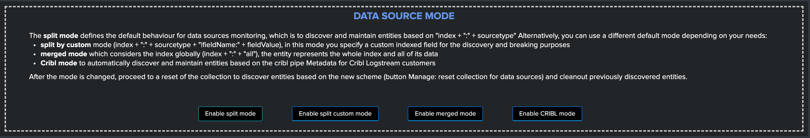

Step by step installation and configuration
###########################################

Step 1: Deploy TrackMe
======================

Where to deploy TrackMe
-----------------------

The first question you need an answer when you look at deploying TrackMe the very first time is generally where to deploy TrackMe?

**To answer this question in a nutshell:**

- TrackMe runs exclusively on a search head layer, there are no components running on forwarders (Universal Forwarders, Heavy Forwarders) or Splunk indexers
- The seach head layer targets deponds on your preference, it can be standalone search head you are using to run monitoring tools, it can be the monitoring console host or a Search Head Cluster
- The essential part of the content TrackMe is generated in dedicated indexes (summary events and metrics) and non replicated KVstore collections which have near zero impacts on the search knowledge bundle size that is replicated automatically to your indexers

Configure indexes
-----------------

Once you decided which search head layer will host TrackMe, the next step is to configure its indexes.

TrackMe requires the creation of two indexes, one for the summary events and one for the metrics, the second is a metric type of index opposed to events indexes, TrackMe includes the following indexes.conf:

``default/indexes.conf``

::

    [trackme_summary]
    coldPath = $SPLUNK_DB/trackme_summary/colddb
    homePath = $SPLUNK_DB/trackme_summary/db
    thawedPath = $SPLUNK_DB/trackme_summary/thaweddb

    [trackme_metrics]
    coldPath = $SPLUNK_DB/trackme_metrics/colddb
    homePath = $SPLUNK_DB/trackme_metrics/db
    thawedPath = $SPLUNK_DB/trackme_metrics/thaweddb
    datatype = metric

In well designed Splunk environments, you will most likely use volumes on the indexers, you would translate this within your indexer configuration to the following configuration potentially:

::

    [trackme_summary]
    coldPath = volume:primary/trackme_summary/colddb
    homePath = volume:primary/trackme_summary/db
    thawedPath = $SPLUNK_DB/trackme_summary/thaweddb

    [trackme_metrics]
    coldPath = volume:primary/trackme_metrics/colddb
    homePath = volume:primary/trackme_metrics/db
    thawedPath = $SPLUNK_DB/trackme_metrics/thaweddb
    datatype = metric

*To be adapted depending on your volume configuration!*

.. hint:: In properly configured Splunk environments, your indexes should be defined on ``both`` the search heads and in the indexers, on the search head this allows autocompletion and is required by collect/mcollect at some levels

Using a different naming convention for indexes
^^^^^^^^^^^^^^^^^^^^^^^^^^^^^^^^^^^^^^^^^^^^^^^

In some cases you may need to use a different naming convention for the two TrackMe indexes, this is not an issue and the only thing you will need to update in the application will be defining the custom configuration in the following two macros:

- ``trackme_idx``
- ``trackme_metrics_idx``

The out of the box definition is:

``default/macros.conf``

::

    [trackme_idx]
    definition = index="trackme_summary"
    iseval = 0

    [trackme_metrics_idx]
    definition = index="trackme_metrics"
    iseval = 0

Up to your choice, you can do this manually in the same time you deploy TrackMe (in a local/macros.conf) or you can update this within the UI once the application has been deployed:

``TrackMe manage and configure``

.. image:: img/step_by_step_configure/ui_update_indexes.png
   :alt: ui_update_indexes.png
   :align: center
   :width: 1200px

Step 2: Configure TrackMe to match your needs
=============================================

TrackMe strategy for data access - What TrackMe will be looking at
------------------------------------------------------------------

The first thing to consider once your deployed TrackMe is to design your strategy for which data TrackMe will be monitoring.

By default, TrackMe will search efficiently (tstats based queries for events) against any index the search head can access, you can choose between **two** main strategies:

- Either you use ``allow listing`` features to restrict access to explicit list of indexes
- Either you use ``block listing`` features to be looking at everything **but** specific items you exclude explicitly (indexes, sourcetypes, hosts and so forth)

Both approaches are configurable via the TrackMe UI, and both approaches have its advantages and inconvenients:

- Allow listing is the cleaner and more effiscient way but requires that you have a deep knowledge of your environment
- Allow listing can lead to be missing things you should have been tracking if not configured properly nor maintained over time
- Block listing can require more work over time as you need to exclude the bad things you do not want to consider

The two approaches are not exclusive, you can use allow listing AND block listing! This means you can restrict the basic index access scope AND block list certain things you do not want to consider.

See :ref:`Allowlisting & Blocklisting` in the User guide.

*Interface to allow listing and block listing definitions:*

.. image:: img/allowlist_and_blocklist.png
   :alt: allowlist_and_blocklist.png
   :align: center
   :width: 800px

.. hint:: Each main TrackMe categories have their own definitions for allow and block listing: ``Data souces``, ``Data hosts`` and ``Metric hosts``

You can define the strategy while you are starting to use TrackMe, and gradually configure what TrackMe accesses to depending on your environment and requirements.

TrackMe Data Sources - Define what works for you
------------------------------------------------

The primary concept of TrackMe is called **data sources**, See :ref:`Data Sources tracking and features` in the User guide for more explanations.

For the purposes of defining the best strategy that works for you, let's explain the 3 modes available, which you can configure via the ``Trackme manage and configure`` interface:

- Split mode (default)
- Merge mode
- Cribl mode

Trackme Data Sources - Split mode
^^^^^^^^^^^^^^^^^^^^^^^^^^^^^^^^^

The Split mode is the default mode that TrackMe uses, in this mode, the application discovers, classifies and creates entities based on:

``index + ":" + sourcetype``

Let's take the following simple example, we index Windows Events logs Application, System and Security WinEventLogs each WinEventLog in a specific index, we would endup with 3 entities, for instance:

- oswinsec:XmlWinEventLog
- oswinapp:XmlWinEventLog
- oswinsys:XmlWinEventLog

On the other hand, would we index these 3 WinEventLogs into a unique index, we would end up with 1 entity only, which covers (meaning TrackMe is looking at) all of the logs:

- oswin:XmlWinEventLog

Don't worry, TrackMe has plenty of features that allow you to cover any use cases (Elastic Sources, allow and block listing, etc), the Split mode is generally what covers most use cases, but this is very depending to your context.

Trackme Data Sources - Merged mode
^^^^^^^^^^^^^^^^^^^^^^^^^^^^^^^^^^

On the opposite, the Merged mode removes the concept of sourcetype and basically creates 1 entity per index, no matters what sourcetypes are indexed in it, entities are created as:

``index + ":all"``

This mode can potentially be interesting for you if you dedicate each index to a specific data flow, and you know by design that this is what you care about.

Trackme Data Sources - Cribl mode
^^^^^^^^^^^^^^^^^^^^^^^^^^^^^^^^^

If you are using Cribl, you can integrate TrackMe transparently and get benefits from the Cribl design very easily, in the Cribl mode, we create Data sources based on:

``index + ":" + sourcetype + "|cribl:" + cribl_pipe``

For a complete review of the Cribl mode, see :ref:`Cribl and TrackMe integration`

Finally, note that if you enable the Cribl mode, TrackMe will only discover automatically data sources coming via Cribl.

