Cribl and TrackMe integration
=============================

**If you are using Cribl, you can easily integrate TrackMe in a just a few steps, using the excellent native Cribl design, TrackMe will take into account the concept of Cribl pipelines to create, monitor and render the data sources automatically.**

*In a nutshell:*

- A configuration parameter is available in TrackMe to enable the Cribl mode
- Once activated, the Cribl mode updates the way TrackMe is identifying and breaking the data sources
- To achieve this, TrackMe relies on the **crible_pipe** indexed field automatically created by Cribl when data is indexed in Splunk
- Related searches transparenly use the **crible_pipe** information, that accurately represents the data pipeline as it should be monitored, from Cribl to Splunk

Enable the Cribl mode
---------------------

**To enable the Cribl mode, go in "TrackMe manage and configure" and click on the enable Cribl mode:**

**Once the Cribl mode is enabled, perform a reset of the data source collection:**

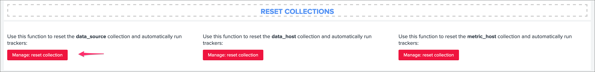

Cribl mode data sources
-----------------------

**Let's assume the following simple scenario:**

- Cribl receives incoming data from any kind of sources, and streams to Splunk with associated pipelines
- In our example, we instruct Cribl to index data in Splunk into a few indexes, but we have many more pipelines since we perform various operations on Cribl, indexes and sourcetypes are likely fed by much more than just one pipeline
- In regular TrackMe mode, TrackMe would represent the data sources broken by indexes and sourcetypes, however, this does not represent what the incoming data flow is underneath, and does not provide the valuable information and monitoring layer we need
- Once we enable the Cribl mode, TrackMe relies on the ``cribl_pipe`` pipeline information to properly distinguish the real data flow as it is from the data provider (Cribl) perspective

*Cribl pipeline examples:*

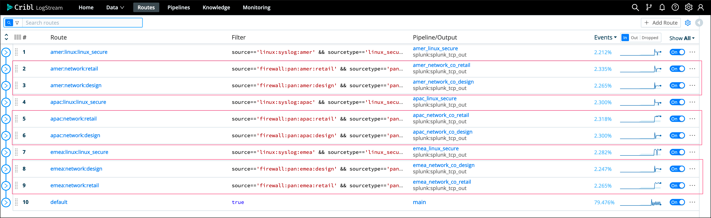

*In this example, the default TrackMe mode has different issues, we stream data to an index called "network", however we have different pipelines that are potentially linked to multiple sources and from the Cribl point of view could be affected independently in case of an issue or misconfiguration:*

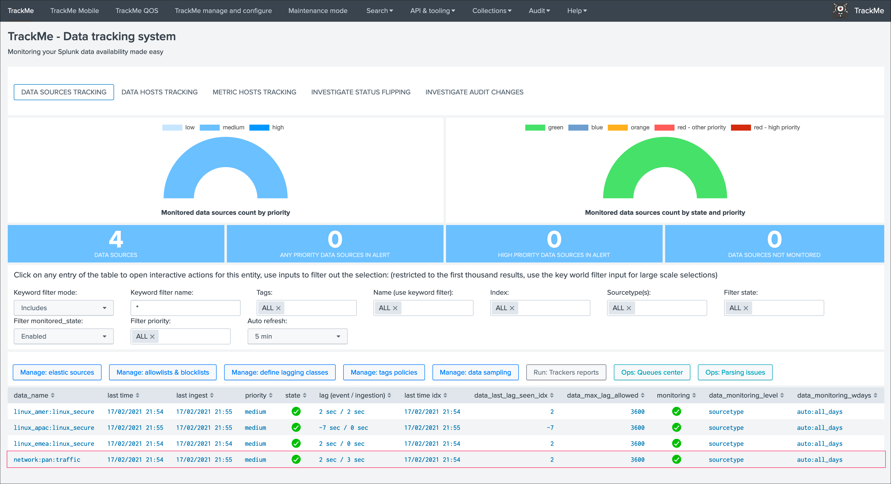

*Once we enable the Cribl mode, we see a very different picture, TrackMe automatically creates data sources broken by index, sourcetype and cribl_pipe:*

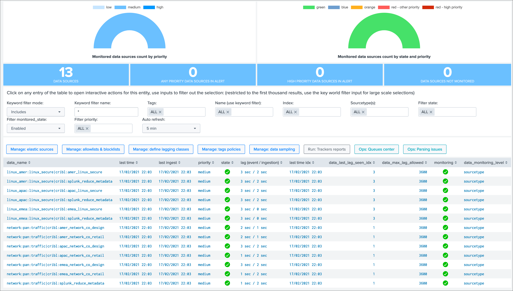

Data sources are created as ``index + ":" + sourcetype + ":" + cribl_pipe``, this represents the data flow from Cirbl to Splunk.

Every search actioned by trackMe now automatically recycles the cribl_pipe information naturally, such as latency tracking, data sampling, open in search buttons, etc:

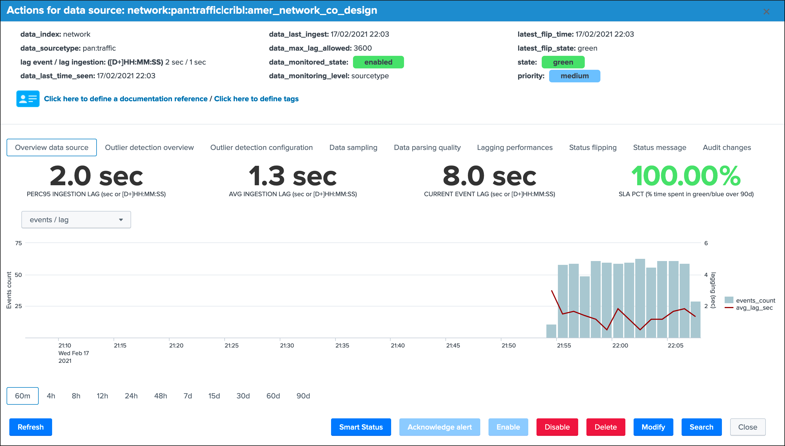

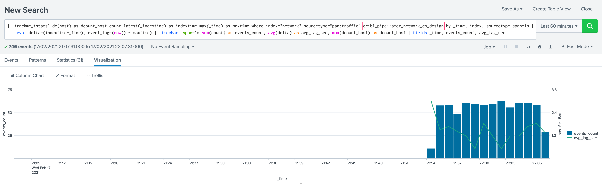

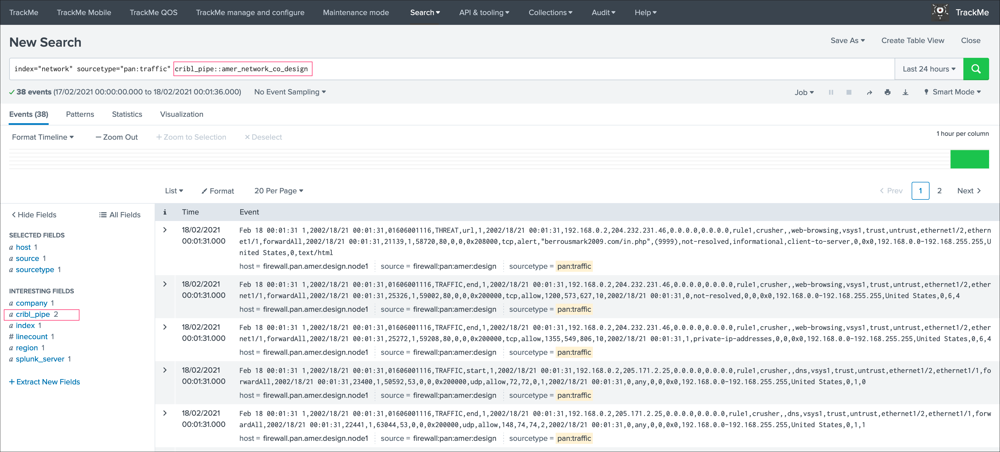

Cribl pre-processing pipelines and cribl_pipe field
---------------------------------------------------

If you have a proprocessing pipelines in your Cribl workflow, the ``cribl_pipe`` field becomes a multi-value indexed field that contains both the processing pipeline and pre-processing pipeline:

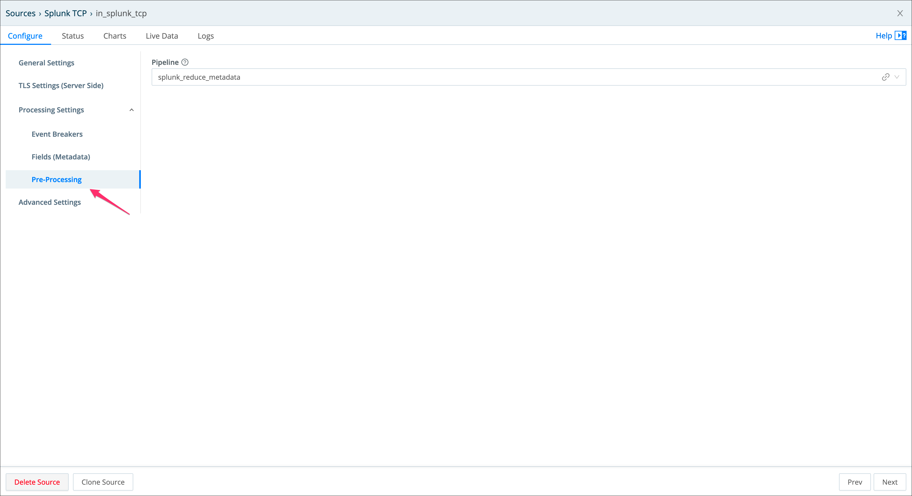

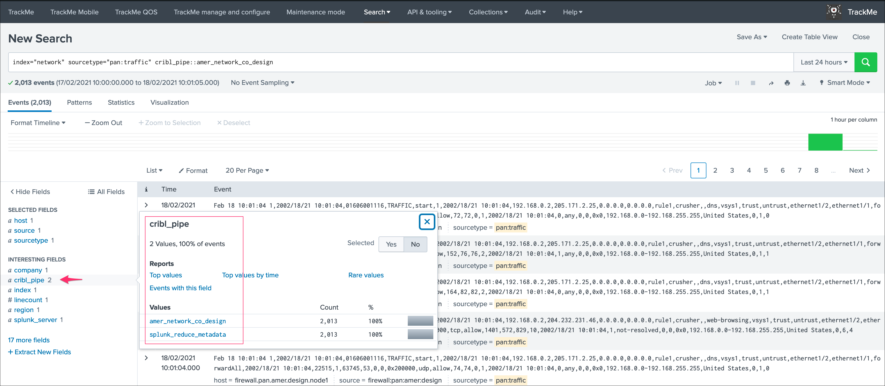

In the TrackMe context, this means that for the same data source, we get at least two entities, one per pipeline and one for the pre-processing pipeline:

.. image:: img/cribl/cribl_preprocessing_pipeline2.png
   :alt: cribl_preprocessing_pipeline2.png
   :align: center
   :width: 1200px

From the TrackMe point of view, the pre-processing pipeline view has no value and all that we care about is the data flow itself, to get rid of these entities automatically, we can add a data_name blocklist based in a very simple regular expression:

- from the main TrackMe screen, go to "Manage: allowlists & blocklists"
- add a new data_name blocklist according to the name of your pre-processing pipeline, in our case we will use ``.*cribl:splunk_reduce_metadata``
- once it has been added, existing entities are not taken into account anymore, and if new data sources are discovered, these will exclude the pre-processing pipeline automatically

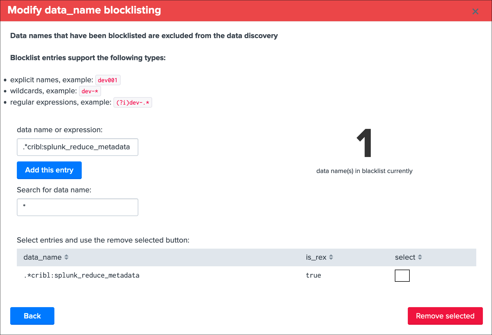

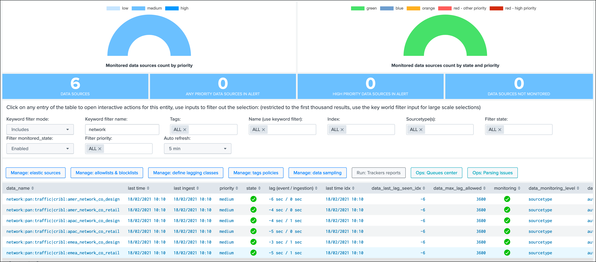

Congratulations!

You have a now a comprehensive integration between the wonderful and amazing Cribl and TrackMe allowing you to track your Splunk data the easy way!
