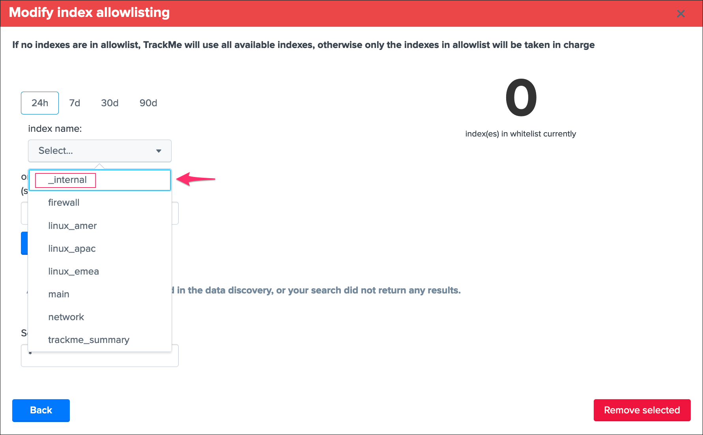
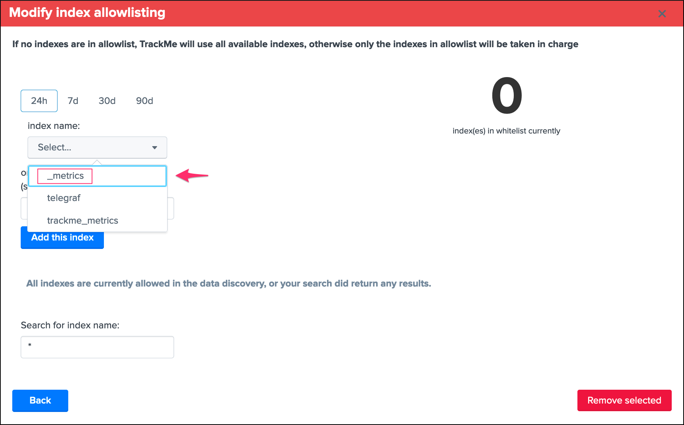
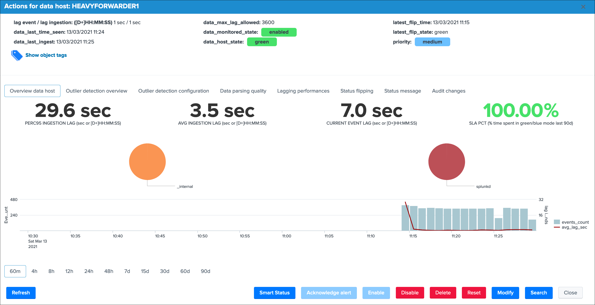
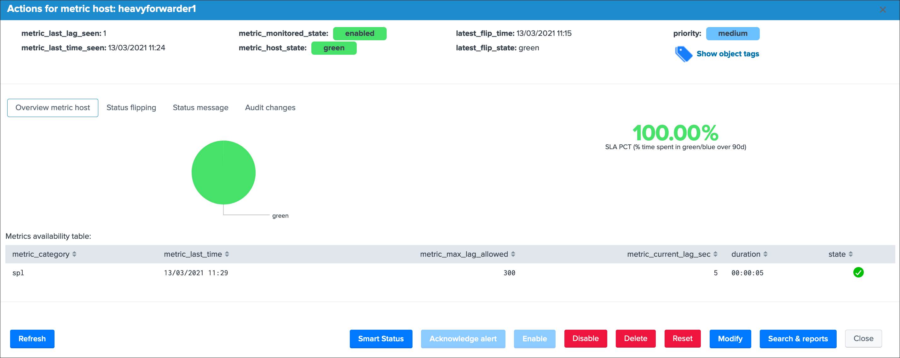
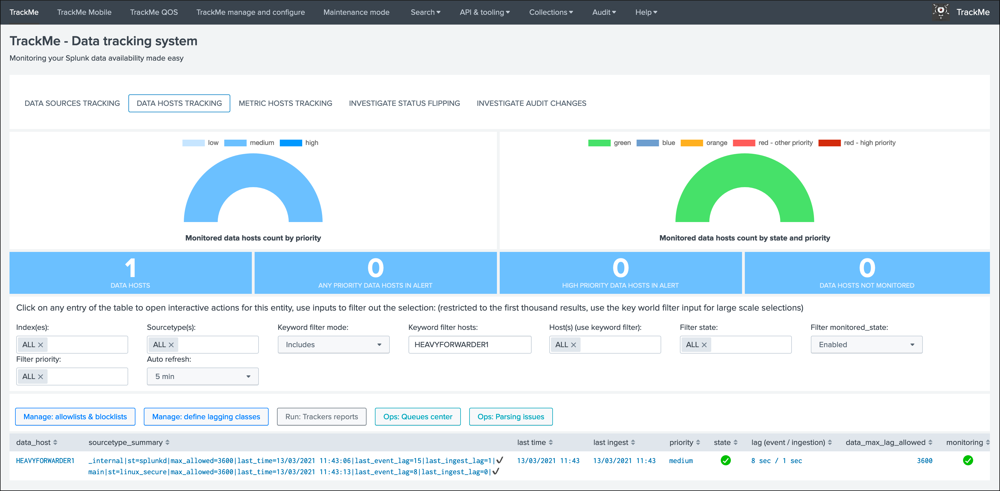
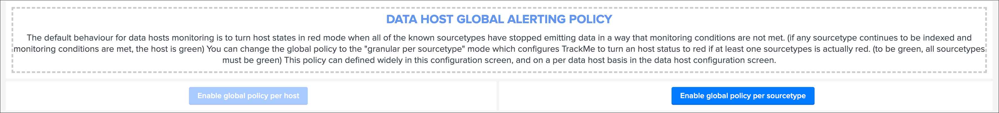
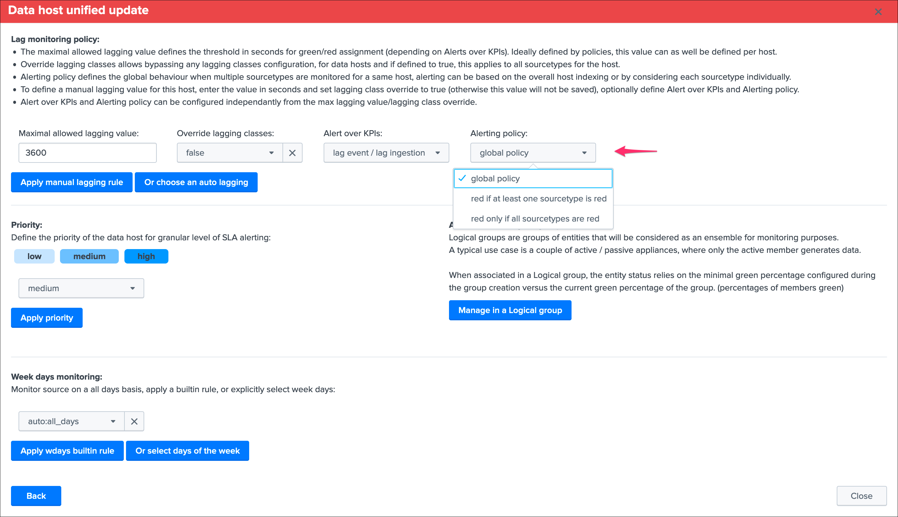
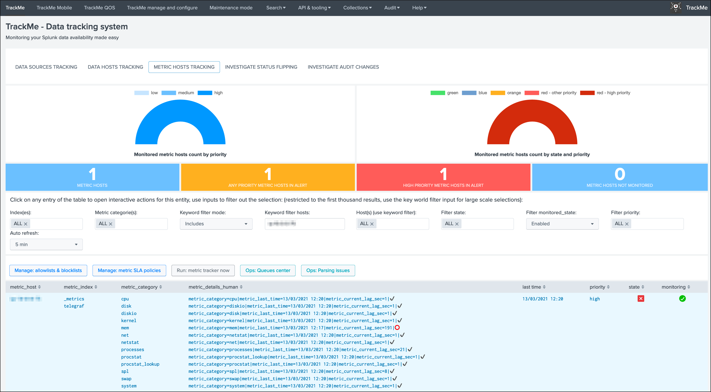

Monitor Splunk instances forwarding
===================================

**TrackMe monitors by default any Splunk instance forwarding to the Splunk indexing layer, this includes:**

- Universal Forwarder instances
- Heavy Forwarder instances
- All other types of instances from your Splunk infrastructure

**Forwarding is monitored via:**

- ``data hosts`` by tracking the ``index=_internal sourcetype=splunkd``
- ``metric hosts`` by trackking the ``spl`` metrics stored in the ``_metrics`` index

.. image:: img/splunk_forwarding/data_hosts.png
   :alt: data_hosts.png
   :align: center
   :width: 1200px
   :class: with-border

.. image:: img/splunk_forwarding/metric_hosts.png
   :alt: metric_hosts.png
   :align: center
   :width: 1200px
   :class: with-border

Requirements
------------

Splunk forwarding good practices configuration
^^^^^^^^^^^^^^^^^^^^^^^^^^^^^^^^^^^^^^^^^^^^^^

**Splunk good configuration practices implies that you are systematically forwarding the Splunk internals (and metrics) to the indexing layer in your outputs.conf configuration, see the Splunk PS base config apps:**

- `Configurations Base Apps <https://drive.google.com/open?id=107qWrfsv17j5bLxc21ymTagjtHG0AobF>`_

- `Configurations Cluster Apps <https://drive.google.com/open?id=10aVQXjbgQC99b9InTvncrLFWUrXci3gz>`_

*See: org_all_forwarder_outputs / org_cluster_forwarder_outputs*

Concretely, this implies that you configure the Splunk instances (all but indexers) to have an outputs.conf sanza similar to:

::

    [tcpout]
    defaultGroup = primary_indexers

    forwardedindex.2.whitelist = (_audit|_introspection|_internal|_metrics)

TrackMe allow lists and block lists
^^^^^^^^^^^^^^^^^^^^^^^^^^^^^^^^^^^

**The default configuration of TrackMe implies monitoring every single index including the _internal (limited to sourcetype=splunkd) and the _metrics, if you use allowlisting & blocklisting, you need to make sure to include these items accordingly:**

*For data hosts, allow the _internal*

*For metric hosts, allow the _metrics*

Usage
-----

**A Splunk instance that does not generate any data out of the internal will appear with the single _internal / splunkd combination in data hosts, and the spl metrics in metrics hosts:**

**A green status basically indicates that:**

- Splunk service is up and running
- The instance is able to reach the indexing layer and properly ingest data as it is forwarding effectively its own data and metrics (which validates configuration and network layers theoritically)
- The instance is expected to be acting in a normal and sane state

Data hosts tracking
^^^^^^^^^^^^^^^^^^^

**When a Splunk instance does more than just indexing its own data and the host Metadata is refering to itself, the Splunk internal data and metrics appear as part of the indexing flow:**

The default behaviour driven by the global host policy implies that as long as the Splunk instance is forwarding data, the host will remain green even if the sources monitored by and as this host runs into troubles, you can on a global basis change the :ref:`Data Hosts alerting policy<TrackMe Data Hosts - Define what works for you>` or selectively on a per host basis:

*Global policy in TrackMe manage and configure:*

*Per data host policy:*

**When the global policy, or the per host policy, is set to track per sourcetype, the data host will appear in a non green status if at least one sourcetype is red (for example even if Splunk internal is still going through):**

.. image:: img/splunk_forwarding/heavyforwarder2.png
   :alt: heavyforwarder2.png
   :align: center
   :width: 1200px
   :class: with-border

Metric hosts tracking
^^^^^^^^^^^^^^^^^^^^^

**Metrics tracking acts differently, if any of the metric categories does not comply with monitoring rules (including the spl metrics), the host will turn into a red state:**

Congratulations, you have now a builtin, easy and efficient monitoring of your Splunk instances availability, enable and configure alerts up to your preferences the :ref:`Alerts tracking` and the job is done!
