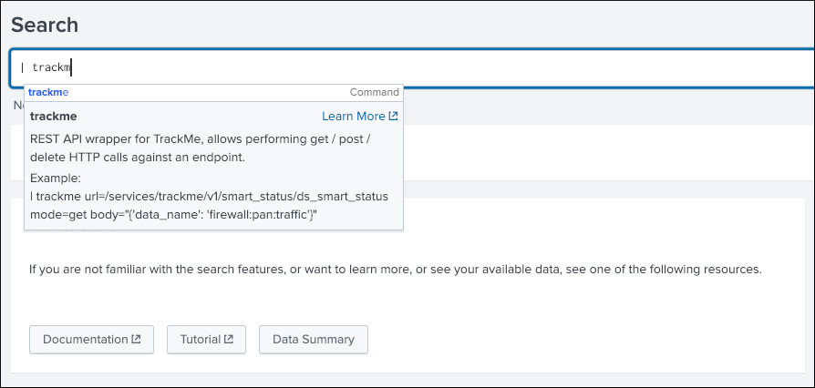
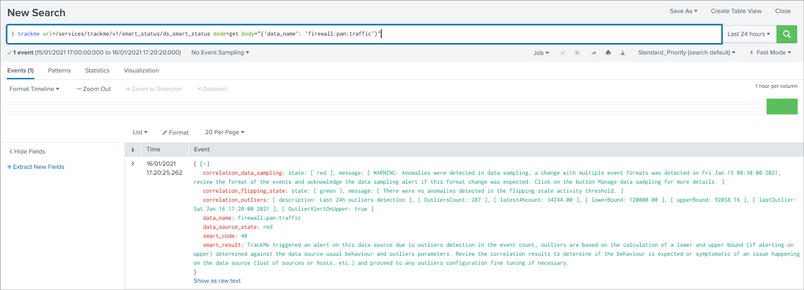
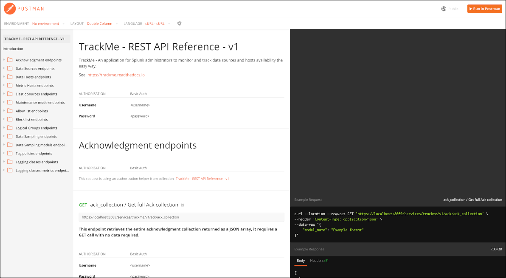
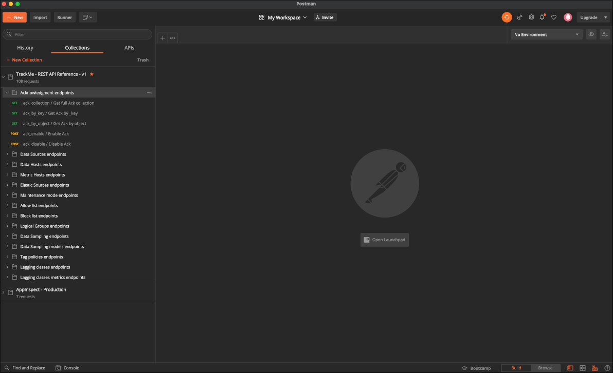

REST API Reference Manual
=========================

Introduction
------------

TrackMe provides a builtin Python based API, serviced by the Splunk API, and categorized by resource groups.

These resource groups are accessible by specific endpoint paths as following:

+----------------------------------------------+----------------------------------------------+
| Resource group                               | API Path                                     |
+==============================================+==============================================+
| :ref:`Acknowledgment endpoints`              | /services/trackme/v1/ack                     |
+----------------------------------------------+----------------------------------------------+
| :ref:`Data Sources endpoints`                | /services/trackme/v1/data_sources            |
+----------------------------------------------+----------------------------------------------+
| :ref:`Data Hosts endpoints`                  | /services/trackme/v1/data_hosts              |
+----------------------------------------------+----------------------------------------------+
| :ref:`Metric Hosts endpoints`                | /services/trackme/v1/metric_hosts            |
+----------------------------------------------+----------------------------------------------+
| :ref:`Elastic Sources endpoints`             | /services/trackme/v1/elastic_sources         |
+----------------------------------------------+----------------------------------------------+
| :ref:`Maintenance mode endpoints`            | /services/trackme/v1/maintenance             |
+----------------------------------------------+----------------------------------------------+
| :ref:`Allow list endpoints`                  | /services/trackme/v1/allowlist               |
+----------------------------------------------+----------------------------------------------+
| :ref:`Block list endpoints`                  | /services/trackme/v1/blocklist               |
+----------------------------------------------+----------------------------------------------+
| :ref:`Data Sampling endpoints`               | /services/trackme/v1/data_sampling           |
+----------------------------------------------+----------------------------------------------+
| :ref:`Data Sampling models endpoints`        | /services/trackme/v1/data_sampling_models    |
+----------------------------------------------+----------------------------------------------+
| :ref:`Logical Groups endpoints`              | /services/trackme/v1/logical_groups          |
+----------------------------------------------+----------------------------------------------+
| :ref:`Tag policies endpoints`                | /services/trackme/v1/tag_policies            |
+----------------------------------------------+----------------------------------------------+
| :ref:`Lagging classes endpoints`             | /services/trackme/v1/lagging_classes         |
+----------------------------------------------+----------------------------------------------+
| :ref:`Lagging classes metrics endpoints`     | /services/trackme/v1/lagging_classes_metrics |
+----------------------------------------------+----------------------------------------------+
| :ref:`Smart Status endpoints`                | /services/trackme/v1/smart_status            |
+----------------------------------------------+----------------------------------------------+
| :ref:`Backup and Restore endpoints`          | /services/trackme/v1/backup_and_restore      |
+----------------------------------------------+----------------------------------------------+
| :ref:`Identity Cards endpoints`              | /services/trackme/v1/identity_cards          |
+----------------------------------------------+----------------------------------------------+
| :ref:`Hybrid trackers endpoints`             | /services/trackme/v1/hybrid_tracker          |
+----------------------------------------------+----------------------------------------------+

These endpoints can be used to interract with TrackMe in a programmatic fashion, for instance to perform integration tasks with automation systems.

REST API trackme SPL command
----------------------------

Interacting with the REST API in SPL queries
^^^^^^^^^^^^^^^^^^^^^^^^^^^^^^^^^^^^^^^^^^^^

TrackMe provides a Python based custom command ``trackme`` that acts as a REST API wrapper to interract with the API endpoints.

Syntax
''''''

::

    | trackme url=<API endpoint> mode=<HTTP method: get/post/delete> body=<Optional: provides the HTTP body in a json format>

**Arguments:**

- ``url``: (required) describes the API endpoint url, such as ``/services/trackme/v1/smart_status/ds_smart_status``
- ``mode``: (required) the HTTP mode, valid options are ``get``, ``post``, ``delete``
- ``body``: the http body, optional for a get query depending on the endpoint, required for post and delete calls

Example
'''''''

*This example calls the smart_status endpoint for a target data_source:*

::

    | trackme url=/services/trackme/v1/smart_status/ds_smart_status mode=get body="{'data_name': 'firewall:pan:traffic'}"

Every endpoint described in the present REST API reference documentation can be actioned via the trackme custom command, authentication and capabilities are transparently inherited from the user environment running the SPL query.

Authentication
--------------

User and roles
^^^^^^^^^^^^^^

You can use any combination of user and roles depending on your preferences, technically, using the TrackMe API endpoint requires read and write permissions to various objects hosted in the TrackMe namespace.

TrackMe contains a builtin role ``trackme_admin`` which defines required accesses to these objects, you can use this role and make sure the user that will be achieving the rest calls is member of this role, or inherits from it.

Prior Splunk 7.3.0
^^^^^^^^^^^^^^^^^^

Prior to Splunk Splunk 7.3.0, the easiest is to used a standard login / password approach to authenticate against Splunk API, similary to:

::

    curl -k -u admin:'ch@ngeM3'

Alternatively, it is possible to perform first the authentication and retrieve a temporary token to be used for the REST calls:

See: `Splunk docs API token <https://docs.splunk.com/Documentation/Splunk/latest/RESTUM/RESTusing#Authentication_and_authorization>`_

*Example:*

::

    curl -k https://localhost:8089/services/auth/login --data-urlencode username=svc_splunk --data-urlencode password=pass

    <response>
      <sessionKey>DWGNbGpJgSj30w0GxTAxMj8t0dZKjvjxLYaP^yphdluFN_FGz4gz^NhcgPCLDkjWH3BUQa1Vewt8FTF8KXyyfI09HqjOicIthMuBIB70dVJA8Jg</sessionKey>
      <messages>
        <msg code=""></msg>
      </messages>
    </response>

    export token="DWGNbGpJgSj30w0GxTAxMj8t0dZKjvjxLYaP^yphdluFN_FGz4gz^NhcgPCLDkjWH3BUQa1Vewt8FTF8KXyyfI09HqjOicIthMuBIB70dVJA8Jg"

A token remains valid for the time of a session. (1 hour by default)

The token would be used as following:

::

    curl -k -H "Authorization: Splunk $token"

For Splunk 7.3.0 and later
^^^^^^^^^^^^^^^^^^^^^^^^^^

Splunk 7.3.0 introduced the usage of proper authentication tokens, which is the recommended way to authenticate against splunkd API:

See: `Splunk docs JSON authentication token <https://docs.splunk.com/Documentation/Splunk/latest/Security/UseAuthTokens>`_

Once you have created an authentication token for the user to be used as the service account, using curl specify the bearer token:

::

    curl -k –H "Authorization: Bearer <token>"

Postman - API referential and development
-----------------------------------------

**TrackMe API endpoints are described in a Postman format at the following public URL:**

- https://documenter.getpostman.com/view/7845664/TVt2c3a9#105ff830-5834-4c95-b928-75ab553f5020

If you use Postman, you can consult the API documentation link above and easily import the entire API reference for your testing and development purposes.

Acknowledgment endpoints
------------------------

**Resources summary:**

+-------------------------------------------------------+--------------------------------------------------+
| Resource                                              | API Path                                         |
+=======================================================+==================================================+
| :ref:`ack_collection / Get full Ack collection`       | /services/trackme/v1/ack/ack_collection          |
+-------------------------------------------------------+--------------------------------------------------+
| :ref:`ack_by_key / Get Ack by _key`                   | /services/trackme/v1/ack/ack_by_key              |
+-------------------------------------------------------+--------------------------------------------------+
| :ref:`ack_by_object / Get Ack by object`              | /services/trackme/v1/ack/ack_by_object           |
+-------------------------------------------------------+--------------------------------------------------+
| :ref:`ack_enable / Enable Ack`                        | /services/trackme/v1/ack/ack_enable              |
+-------------------------------------------------------+--------------------------------------------------+
| :ref:`ack_disable / Disable Ack`                      | /services/trackme/v1/ack/ack_disable             |
+-------------------------------------------------------+--------------------------------------------------+

ack_collection / Get full Ack collection
^^^^^^^^^^^^^^^^^^^^^^^^^^^^^^^^^^^^^^^^

**This endpoint retrieves the entire acknowledgment collection returned as a JSON array, it requires a GET call with no data required:**

*External:*

::

    curl -k -u admin:'ch@ngeM3' -X GET https://localhost:8089/services/trackme/v1/ack/ack_collection

*SPL query:*

::

    | trackme url="/services/trackme/v1/ack/ack_collection" mode="get"

*JSON response: (full collection)*

::

    [
     {
      "ack_expiration": "1607796255.2581134",
      "ack_mtime": "1607709855.2581134",
      "ack_state": "active",
      "keyid": "5fd3b49f5cfa0d7b797c6181",
      "limit_expiration": "1607795955.2581134",
      "object": "pan:traffic",
      "object_category": "data_source",
      "_user": "nobody",
      "_key": "5fd3b49f5cfa0d7b797c6181"
     },
     {
      "ack_expiration": "1607848092.4875946",
      "ack_mtime": "1607761692.4875946",
      "ack_state": "active",
      "keyid": "5fd47f165cfa0d7b797c8e8f",
      "limit_expiration": "1607847792.4875946",
      "object": "docker_logs:httpevent",
      "object_category": "data_source",
      "object_current_state": "red",
      "_user": "nobody",
      "_key": "5fd47f165cfa0d7b797c8e8f"
     }
    ]
    ...

ack_by_key / Get Ack by _key
^^^^^^^^^^^^^^^^^^^^^^^^^^^^

**This endpoint retrieves an existing acknowledgment record by the Kvstore key, it requires a GET call with the following information:**

- ``"_key":`` KVstore unique identifier for this record

*External:*

::

    curl -k -u admin:'ch@ngeM3' -X GET https://localhost:8089/services/trackme/v1/ack/ack_by_key -d '{"_key": "5fd3fe737b1bef735d3f3532"}'

*SPL query:*

::

    | trackme url="/services/trackme/v1/ack/ack_by_key" mode="get" body="{\"_key\": \"5fd3fe737b1bef735d3f3532\"}"

*JSON response:*

::

    {
     "ack_expiration": "1608333555",
     "ack_mtime": "1607728755",
     "ack_state": "active",
     "keyid": "5fd3fe737b1bef735d3f3532",
     "limit_expiration": "1608333255",
     "object": "network:pan:traffic",
     "object_category": "data_source",
     "object_current_state": "red",
     "_user": "nobody",
     "_key": "5fd3fe737b1bef735d3f3532"
    }

ack_by_object / Get Ack by object
^^^^^^^^^^^^^^^^^^^^^^^^^^^^^^^^^

**This endpoint retrieves an existing acknowledgment record by the object name, it requires a GET call with the following information:**

*External:*

- ``"object_category":`` type of object (data_source / data_host / metric_host)"
- ``"object":`` name of the entity

::

    curl -k -u admin:'ch@ngeM3' -X GET https://localhost:8089/services/trackme/v1/ack/ack_by_object -d '{"object_category": "data_source", "object": "network:pan:traffic"}'

*SPL query:*

::

    | trackme url="/services/trackme/v1/ack/ack_by_object" mode="get" body="{\"object_category\": \"data_source\", \"object\": \"network:pan:traffic\"}"

*JSON response:*

::

    [
     {
      "ack_expiration": "1608333555",
      "ack_mtime": "1607728755",
      "ack_state": "active",
      "keyid": "5fd3fe737b1bef735d3f3532",
      "limit_expiration": "1608333255",
      "object": "network:pan:traffic",
      "object_category": "data_source",
      "object_current_state": "red",
      "_user": "nobody",
      "_key": "5fd3fe737b1bef735d3f3532"
     }
    ]

ack_enable / Enable Ack
^^^^^^^^^^^^^^^^^^^^^^^

**This endpoint will enable an acknowledgment by the object name, it requires a POST call with the following information:**

- ``"object_category":`` type of object (data_source / data_host / metric_host)
- ``"object":`` name of the entity
- ``"ack_period":`` period for the acknowledgment in seconds
- ``"update_comment":`` Optional, a comment for the update, comments are added to the audit record, if unset will be defined to: API update

*External:*

::

    curl -k -u admin:'ch@ngeM3' -X POST https://localhost:8089/services/trackme/v1/ack/ack_enable -d '{"object_category": "data_source", "object": "network:pan:traffic", "ack_period": "86400", "update_comment": "Updated by automation."}'

*SPL query:*

::

    | trackme url="/services/trackme/v1/ack/ack_enable" mode="post" body="{\"object_category\": \"data_source\", \"object\": \"network:pan:traffic\", \"ack_period\": \"86400\", \"update_comment\": \"Updated by automation.\"}"

*JSON response:*

::

    {
     "object": "network:pan:traffic",
     "object_category": "data_source",
     "ack_expiration": "1607815805.7918282",
     "ack_state": "active",
     "ack_mtime": "1607729405.7918282",
     "_user": "nobody",
     "_key": "5fd3fe737b1bef735d3f3532"
    }

ack_disable / Disable Ack
^^^^^^^^^^^^^^^^^^^^^^^^^

**This endpoint will disable an acknowledgment by the object name, it requires a POST call with the following information:**

- ``"object_category":`` type of object (data_source / data_host / metric_host)"
- ``"object":`` name of the entity
- ``"update_comment":`` Optional, a comment for the update, comments are added to the audit record, if unset will be defined to: API update

*External:*

::

    curl -k -u admin:'ch@ngeM3' -X POST https://localhost:8089/services/trackme/v1/ack/ack_disable -d '{"object_category": "data_source", "object": "network:pan:traffic", "update_comment": "Updated by automation."}'

*SPL query:*

::

    | trackme url="/services/trackme/v1/ack/ack_disable" mode="post" body="{\"object_category\": \"data_source\", \"object\": \"network:pan:traffic\", \"update_comment\": \"Updated by automation.\"}"

*JSON response:*

::

    {
     "object": "network:pan:traffic",
     "object_category": "data_source",
     "ack_expiration": "N/A",
     "ack_state": "inactive",
     "ack_mtime": "1607729326.6667607",
     "_user": "nobody",
     "_key": "5fd3fe737b1bef735d3f3532"
    }

Data Sources endpoints
----------------------

**Resources summary:**

+----------------------------------------------------------------------------+---------------------------------------------------------------------------+
| Resource                                                                   | API Path                                                                  |
+============================================================================+===========================================================================+
| :ref:`ds_collection / Get full Data Sources collection`                    | /services/trackme/v1/data_sources/ds_collection                           |
+----------------------------------------------------------------------------+---------------------------------------------------------------------------+
| :ref:`ds_by_key / Get Data Source by _key`                                 | /services/trackme/v1/data_sources/ds_by_key                               |
+----------------------------------------------------------------------------+---------------------------------------------------------------------------+
| :ref:`ds_by_name / Get Data Source by name`                                | /services/trackme/v1/data_sources/ds_by_name                              |
+----------------------------------------------------------------------------+---------------------------------------------------------------------------+
| :ref:`ds_enable_monitoring / Enable monitoring`                            | /services/trackme/v1/data_sources/ds_enable_monitoring                    |
+----------------------------------------------------------------------------+---------------------------------------------------------------------------+
| :ref:`ds_disable_monitoring / Disable monitoring`                          | /services/trackme/v1/data_sources/ds_disable_monitoring                   |
+----------------------------------------------------------------------------+---------------------------------------------------------------------------+
| :ref:`ds_update_priority / Update priority`                                | /services/trackme/v1/data_sources/ds_update_priority                      |
+----------------------------------------------------------------------------+---------------------------------------------------------------------------+
| :ref:`ds_update_lag_policy / Update lagging policy`                        | /services/trackme/v1/data_sources/ds_update_lag_policy                    |
+----------------------------------------------------------------------------+---------------------------------------------------------------------------+
| :ref:`ds_update_min_dcount_host / Update minimal host dcount`              | /services/trackme/v1/data_sources/ds_update_min_dcount_host               |
+----------------------------------------------------------------------------+---------------------------------------------------------------------------+
| :ref:`ds_update_wdays_by_name / Update week days monitoring`               | /services/trackme/v1/data_sources/ds_update_wdays                         |
+----------------------------------------------------------------------------+---------------------------------------------------------------------------+
| :ref:`ds_update_hours_ranges_by_name / Update hours ranges monitoring`     | /services/trackme/v1/data_sources/ds_update_hours_ranges                  |
+----------------------------------------------------------------------------+---------------------------------------------------------------------------+
| :ref:`ds_update_outliers / Update outliers detection configuration`        | /services/trackme/v1/data_sources/ds_update_outliers                      |
+----------------------------------------------------------------------------+---------------------------------------------------------------------------+
| :ref:`ds_update_monitoring_level / Update monitoring level`                | /services/trackme/v1/data_sources/ds_update_monitoring_level              |
+----------------------------------------------------------------------------+---------------------------------------------------------------------------+
| :ref:`ds_delete_temporary / Delete temporary`                              | /services/trackme/v1/data_sources/ds_delete_temporary                     |
+----------------------------------------------------------------------------+---------------------------------------------------------------------------+
| :ref:`ds_delete_permanent / Delete permanently`                            | /services/trackme/v1/data_sources/ds_delete_permanent                     |
+----------------------------------------------------------------------------+---------------------------------------------------------------------------+
| :ref:`ds_enable_data_sampling / Enable data sampling`                      | /services/trackme/v1/data_sources/ds_enable_data_sampling                 |
+----------------------------------------------------------------------------+---------------------------------------------------------------------------+
| :ref:`ds_disable_data_sampling / Disable data sampling`                    | /services/trackme/v1/data_sources/ds_disable_data_sampling                |
+----------------------------------------------------------------------------+---------------------------------------------------------------------------+
| :ref:`ds_update_data_sampling_records_nr / Update sampling no of records`  | /services/trackme/v1/data_sources/ds_update_data_sampling_records_nr      |
+----------------------------------------------------------------------------+---------------------------------------------------------------------------+

ds_collection / Get full Data Sources collection
^^^^^^^^^^^^^^^^^^^^^^^^^^^^^^^^^^^^^^^^^^^^^^^^

**This endpoint retrieves the entire data sources collection returned as a JSON array, it requires a GET call with no data required:**

*External:*

::

    curl -k -u admin:'ch@ngeM3' -X GET https://localhost:8089/services/trackme/v1/data_sources/ds_collection

*SPL query:*

::

    | trackme url="/services/trackme/v1/data_sources/ds_collection" mode="get"

*JSON response: (full collection)*

::

    [
     {
      "OutlierAlertOnUpper": "false",
      "OutlierLowerThresholdMultiplier": "4",
      "OutlierMinEventCount": "0",
      "OutlierSpan": "5m",
      "OutlierTimePeriod": "-7d",
      "OutlierUpperThresholdMultiplier": "4",
      "_time": "1607779500",
      ...

ds_by_key / Get Data Source by _key
^^^^^^^^^^^^^^^^^^^^^^^^^^^^^^^^^^^

**This endpoint retrieves an existing data source record by the Kvstore key, it requires a GET call with the following information:**

- ``"_key":`` KVstore unique identifier for this record

*External:*

::

    curl -k -u admin:'ch@ngeM3' -X GET https://localhost:8089/services/trackme/v1/data_sources/ds_by_key -d '{"_key": "7e8670878a9ad91844f18655f1819c06"}'

*SPL query:*

::

    | trackme url="/services/trackme/v1/data_sources/ds_by_key" mode="get" body="{\"_key\": \"7e8670878a9ad91844f18655f1819c06\"}"

*JSON response: (full record)*

::

    {
    "OutlierAlertOnUpper": "false",
    "OutlierLowerThresholdMultiplier": "4",
    "OutlierMinEventCount": "0",
    "OutlierSpan": "5m",
    "OutlierTimePeriod": "-7d",
    "OutlierUpperThresholdMultiplier": "4",
    "_time": "1607770500",
    "current_state": "green",
    ...

ds_by_name / Get Data Source by name
^^^^^^^^^^^^^^^^^^^^^^^^^^^^^^^^^^^^

**This endpoint retrieves an existing data source record by the data source name (data_name), it requires a GET call with the following information:**

- ``"data_name":`` name of the data source

*External:*

::

    curl -k -u admin:'ch@ngeM3' -X GET https://localhost:8089/services/trackme/v1/data_sources/ds_by_name -d '{"data_name": "network:pan:traffic"}'

*SPL query:*

::

    | trackme url="/services/trackme/v1/data_sources/ds_by_name" mode="get" body="{\"data_name\": \"network:pan:traffic\"}"

*JSON response: (full record)*

::

    {
    "OutlierAlertOnUpper": "false",
    "OutlierLowerThresholdMultiplier": "4",
    "OutlierMinEventCount": "0",
    "OutlierSpan": "5m",
    "OutlierTimePeriod": "-7d",
    "OutlierUpperThresholdMultiplier": "4",
    "_time": "1607770500",
    "current_state": "green",
    ...

ds_enable_monitoring / Enable monitoring
^^^^^^^^^^^^^^^^^^^^^^^^^^^^^^^^^^^^^^^^

**This endpoint enables data monitoring for an existing data source by the data source name (data_name), it requires a POST call with the following information:**

- ``"data_name":`` name of the data source
- ``"update_comment":`` Optional, a comment for the update, comments are added to the audit record, if unset will be defined to: API update

*External:*

::

    curl -k -u admin:'ch@ngeM3' -X POST https://localhost:8089/services/trackme/v1/data_sources/ds_enable_monitoring -d '{"data_name": "network:pan:traffic", "update_comment": "Updated by automation."}'

*SPL query:*

::

    | trackme url="/services/trackme/v1/data_sources/ds_enable_monitoring" mode="post" body="{\"data_name\": \"network:pan:traffic\", \"update_comment\": \"Updated by automation.\"}"

*JSON response: (full record)*

::

    {
    "OutlierAlertOnUpper": "false",
    "OutlierLowerThresholdMultiplier": "4",
    "OutlierMinEventCount": "0",
    "OutlierSpan": "5m",
    "OutlierTimePeriod": "-7d",
    "OutlierUpperThresholdMultiplier": "4",
    "_time": "1607770500",
    "current_state": "green",
    ...

ds_disable_monitoring / Disable monitoring
^^^^^^^^^^^^^^^^^^^^^^^^^^^^^^^^^^^^^^^^^^

**This endpoint disables data monitoring for an existing data source by the data source name (data_name), it requires a POST call with the following information:**

- ``"data_name":`` name of the data source
- ``"update_comment":`` Optional, a comment for the update, comments are added to the audit record, if unset will be defined to: API update

*External:*

::

    curl -k -u admin:'ch@ngeM3' -X POST https://localhost:8089/services/trackme/v1/data_sources/ds_disable_monitoring -d '{"data_name": "network:pan:traffic", "update_comment": "Updated by automation."}'

*SPL query:*

::

    | trackme url="/services/trackme/v1/data_sources/ds_disable_monitoring" mode="post" body="{\"data_name\": \"network:pan:traffic\", \"update_comment\": \"Updated by automation.\"}"

*JSON response: (full record)*

::

    {
    "OutlierAlertOnUpper": "false",
    "OutlierLowerThresholdMultiplier": "4",
    "OutlierMinEventCount": "0",
    "OutlierSpan": "5m",
    "OutlierTimePeriod": "-7d",
    "OutlierUpperThresholdMultiplier": "4",
    "_time": "1607770500",
    "current_state": "green",
    ...

ds_update_priority / Update priority
^^^^^^^^^^^^^^^^^^^^^^^^^^^^^^^^^^^^

**This endpoint updates the priority definition for an existing data source by the data source name (data_name), it requires a POST call with the following information:**

- ``"data_name":`` name of the data source
- ``"priority":`` priority value, valid options are low / medium / high
- ``"update_comment":`` Optional, a comment for the update, comments are added to the audit record, if unset will be defined to: API update

*External:*

::

    curl -k -u admin:'ch@ngeM3' -X POST https://localhost:8089/services/trackme/v1/data_sources/ds_update_priority -d '{"data_name": "network:pan:traffic", "priority": "high", "update_comment": "Updated by automation."}'

*SPL query:*

::

    | trackme url="/services/trackme/v1/data_sources/ds_update_priority" mode="post" body="{\"data_name\": \"network:pan:traffic\", \"priority\": \"high\", \"update_comment\": \"Updated by automation.\"}"

*JSON response: (full record)*

::

    {
    "OutlierAlertOnUpper": "false",
    "OutlierLowerThresholdMultiplier": "4",
    "OutlierMinEventCount": "0",
    "OutlierSpan": "5m",
    "OutlierTimePeriod": "-7d",
    "OutlierUpperThresholdMultiplier": "4",
    "_time": "1607770500",
    "current_state": "green",
    ...

ds_update_lag_policy / Update lagging policy
^^^^^^^^^^^^^^^^^^^^^^^^^^^^^^^^^^^^^^^^^^^^

**This endpoint configures the lagging policy for an existing data source, it requires a POST call with the following information:**

- ``"data_name":`` name of the data source
- ``"data_lag_alert_kpis":`` KPIs policy to be applied, valid options are all_kpis / lag_ingestion_kpi / lag_event_kpi
- ``"data_max_lag_allowed":`` maximal accepted lagging value in seconds, must be an integer
- ``"data_override_lagging_class":`` overrides lagging classes, valid options are true / false
- ``"update_comment":`` Optional, a comment for the update, comments are added to the audit record, if unset will be defined to: API update

*External:*

::

    curl -k -u admin:'ch@ngeM3' -X POST https://localhost:8089/services/trackme/v1/data_sources/ds_update_lag_policy -d '{"data_name": "network:pan:traffic", "update_comment": "Updated by automation.", "data_lag_alert_kpis": "lag_ingestion_kpi", "data_max_lag_allowed": "300", "data_override_lagging_class": "true"}'

*SPL query:*

::

    | trackme url="/services/trackme/v1/data_sources/ds_update_lag_policy" mode="post" body="{\"data_name\": \"network:pan:traffic\", \"update_comment\": \"Updated by automation.\", \"data_lag_alert_kpis\": \"lag_ingestion_kpi\", \"data_max_lag_allowed\": \"300\", \"data_override_lagging_class\": \"true\"}"

*JSON response: (full record)*

::

    {
    "OutlierAlertOnUpper": "false",
    "OutlierLowerThresholdMultiplier": "4",
    "OutlierMinEventCount": "0",
    "OutlierSpan": "5m",
    "OutlierTimePeriod": "-7d",
    "OutlierUpperThresholdMultiplier": "4",
    "_time": "1607770500",
    "current_state": "green",
    ...

ds_update_min_dcount_host / Update minimal host dcount
^^^^^^^^^^^^^^^^^^^^^^^^^^^^^^^^^^^^^^^^^^^^^^^^^^^^^^

**This endpoint configures the minimal number of distinct hosts count for an existing data source, it requires a POST call with the following information:**

- ``"data_name": name of the data source``
- ``"min_dcount_host": minimal accepted number of distinct count hosts, must be an integer or any to disable the feature``
- ``"update_comment": Optional, a comment for the update, comments are added to the audit record, if unset will be defined to: API update``

*External:*

::

    curl -k -u admin:'ch@ngeM3' -X POST https://localhost:8089/services/trackme/v1/data_sources/ds_update_min_dcount_host -d '{"data_name": "network:pan:traffic", "update_comment": "Updated by automation.", "min_dcount_host": "100"}'

*SPL query:*

::

    | trackme url="/services/trackme/v1/data_sources/ds_update_min_dcount_host" mode="post" body="{\"data_name\": \"network:pan:traffic\", \"update_comment\": \"Updated by automation.\", \"min_dcount_host\": \"100\"}"

*JSON response: (full record)*

::

    {
    "OutlierAlertOnUpper": "false",
    "OutlierLowerThresholdMultiplier": "4",
    "OutlierMinEventCount": "0",
    "OutlierSpan": "5m",
    "OutlierTimePeriod": "-7d",
    "OutlierUpperThresholdMultiplier": "4",
    "_time": "1607770500",
    "current_state": "green",
    ...

ds_update_wdays_by_name / Update week days monitoring
^^^^^^^^^^^^^^^^^^^^^^^^^^^^^^^^^^^^^^^^^^^^^^^^^^^^^

**This endpoint configures the week days monitoring rule for an existing data source, it requires a POST call with the following information:**

- ``"data_name": name of the data source``
- ``"data_monitoring_wdays":  the week days rule, valid options are manual:all_days / manual:monday-to-friday / manual:monday-to-saturday / [ 0, 1, 2, 3, 4, 5, 6 ] where Sunday is 0``
- ``"update_comment": Optional, a comment for the update, comments are added to the audit record, if unset will be defined to: API update``

*External:*

::

    curl -k -u admin:'ch@ngeM3' -X POST https://localhost:8089/services/trackme/v1/data_sources/ds_update_wdays -d '{"data_name": "network:pan:traffic", "update_comment": "Updated by automation.", "data_monitoring_wdays": "manual:monday-to-friday"}'

*SPL query:*

::

    | trackme url="/services/trackme/v1/data_sources/ds_update_wdays" mode="post" body="{\"data_name\": \"network:pan:traffic\", \"update_comment\": \"Updated by automation.\", \"data_monitoring_wdays\": \"manual:monday-to-friday\"}"

*JSON response: (full record)*

::

    {
    "OutlierAlertOnUpper": "false",
    "OutlierLowerThresholdMultiplier": "4",
    "OutlierMinEventCount": "0",
    "OutlierSpan": "5m",
    "OutlierTimePeriod": "-7d",
    "OutlierUpperThresholdMultiplier": "4",
    "_time": "1607770500",
    "current_state": "green",
    ...

ds_update_hours_ranges_by_name / Update hours ranges monitoring
^^^^^^^^^^^^^^^^^^^^^^^^^^^^^^^^^^^^^^^^^^^^^^^^^^^^^^^^^^^^^^^

**This endpoint configures the hours ranges monitoring rule for an existing data source, it requires a POST call with the following information:**

- ``"data_name":`` name of the data source
- ``"data_monitoring_hours_ranges":`` the hours ranges rule when monitoring applies, valid options are manual:all_ranges / manual:08h-to-20h / [ 0, 1, 2, 3, 4, 5, 6, 7, 8, 9, 10, 11, 12, 13, 14, 15, 16, 17, 18, 19, 21, 22, 23 ] where 00h00 to 00h59 is 0
- ``"update_comment":`` Optional, a comment for the update, comments are added to the audit record, if unset will be defined to: API update``

*External:*

::

    curl -k -u admin:'ch@ngeM3' -X POST https://localhost:8089/services/trackme/v1/data_sources/ds_update_hours_ranges -d '{"data_name": "network:pan:traffic", "update_comment": "Updated by automation.", "data_monitoring_hours_ranges": "manual:8,9,10,11,12,13,14,15,16,17,18,19"}'

*SPL query:*

::

    | trackme url="/services/trackme/v1/data_sources/ds_update_wdays" mode="post" body="{\"data_name\": \"network:pan:traffic\", \"update_comment\": \"Updated by automation.\", \"data_monitoring_hours_ranges\": \"manual:8,9,10,11,12,13,14,15,16,17,18,19\"}"

*JSON response: (full record)*

::

    {
    "OutlierAlertOnUpper": "false",
    "OutlierLowerThresholdMultiplier": "4",
    "OutlierMinEventCount": "0",
    "OutlierSpan": "5m",
    "OutlierTimePeriod": "-7d",
    "OutlierUpperThresholdMultiplier": "4",
    "_time": "1607770500",
    "current_state": "green",
    ...

ds_update_outliers / Update outliers detection configuration
^^^^^^^^^^^^^^^^^^^^^^^^^^^^^^^^^^^^^^^^^^^^^^^^^^^^^^^^^^^^

**This endpoint configures the week days monitoring rule for an existing data source, it requires a POST call with the following information:**

- ``"data_name": name of the data source``
- ``"OutlierMinEventCount": the minimal number of events, if set to anything bigger than 0, the lower bound becomes a static value, needs to be an integer, default to 0 (disabled)``
- ``"OutlierLowerThresholdMultiplier": The lower bound threshold multiplier, must be an integer, defaults to 4``
- ``"OutlierUpperThresholdMultiplier": The upper bound threshold multiplier, must be integer, defaults to 4``
- ``"OutlierAlertOnUpper": "Enables / Disables alerting on upper outliers detection, valid options are true / false, defaults to false``
- ``"OutlierTimePeriod": relative time period for outliers calculation, default to -7d``
- ``"OutlierSpan": span period Splunk notation for outliers UI rendering, defaults to 5m``
- ``"enable_behaviour_analytic": "Enables / Disables outliers detection for that object, valid options are true / false, defaults to true``
- ``"update_comment": Optional, a comment for the update, comments are added to the audit record, if unset will be defined to: API update``

*External:*

::

    curl -k -u admin:'ch@ngeM3' -X POST https://localhost:8089/services/trackme/v1/data_sources/ds_update_outliers -d '{"data_name": "network:pan:traffic", "update_comment": "Updated by automation.", "OutlierMinEventCount": "0", "OutlierLowerThresholdMultiplier": "6", "OutlierUpperThresholdMultiplier": "6", "OutlierAlertOnUpper": "false", "OutlierTimePeriod": "7d", "OutlierSpan": "5m", "enable_behaviour_analytic": "true"}'

*SPL query:*

::

    | trackme url="/services/trackme/v1/data_sources/ds_update_outliers" mode="post" body="{\"data_name\": \"network:pan:traffic\", \"update_comment\": \"Updated by automation.\", \"OutlierMinEventCount\": \"0\", \"OutlierLowerThresholdMultiplier\": \"6\", \"OutlierUpperThresholdMultiplier\": \"6\", \"OutlierAlertOnUpper\": \"false\", \"OutlierTimePeriod\": \"7d\", \"OutlierSpan\": \"5m\", \"enable_behaviour_analytic\": \"true\"}"

*JSON response: (full record)*

::

    {
    "OutlierAlertOnUpper": "false",
    "OutlierLowerThresholdMultiplier": "4",
    "OutlierMinEventCount": "0",
    "OutlierSpan": "5m",
    "OutlierTimePeriod": "-7d",
    "OutlierUpperThresholdMultiplier": "4",
    "_time": "1607770500",
    "current_state": "green",
    ...

ds_update_monitoring_level / Update monitoring level
^^^^^^^^^^^^^^^^^^^^^^^^^^^^^^^^^^^^^^^^^^^^^^^^^^^^

**This endpoint updates the monitoring level for an existing data source, it requires a POST call with the following information:**

- ``"data_name": name of the data source``
- ``"data_monitoring_level": the monitoring level definition, valid options are index / sourcetype``
- ``"update_comment": Optional, a comment for the update, comments are added to the audit record, if unset will be defined to: API update``

*External:*

::

    curl -k -u admin:'ch@ngeM3' -X POST https://localhost:8089/services/trackme/v1/data_sources/ds_update_monitoring_level -d '{"data_name": "network:pan:traffic", "update_comment": "Updated by automation.", "data_monitoring_level": "sourcetype"}'

*SPL query:*

::

    | trackme url="/services/trackme/v1/data_sources/ds_update_monitoring_level" mode="post" body="{\"data_name\": \"network:pan:traffic\", \"update_comment\": \"Updated by automation.\", \"data_monitoring_level\": \"sourcetype\"}"

*JSON response: (full record)*

::

    {
    "OutlierAlertOnUpper": "false",
    "OutlierLowerThresholdMultiplier": "4",
    "OutlierMinEventCount": "0",
    "OutlierSpan": "5m",
    "OutlierTimePeriod": "-7d",
    "OutlierUpperThresholdMultiplier": "4",
    "_time": "1607770500",
    "current_state": "green",
    ...

ds_delete_temporary / Delete temporary
^^^^^^^^^^^^^^^^^^^^^^^^^^^^^^^^^^^^^^

**This endpoint performs a temporary deletion of an existing data source, it requires a DELETE call with the following information:**

- ``"data_name": name of the data source``
- ``"update_comment": Optional, a comment for the update, comments are added to the audit record, if unset will be defined to: API update``

Note: A temporary deletion removes the entity and its configuration, if search conditions such as data avaibility allow it, the same entitiy will be re-created automatically by the Trackers.

*External:*

::

    curl -k -u admin:'ch@ngeM3' -X DELETE https://localhost:8089/services/trackme/v1/data_sources/ds_delete_temporary -d '{"data_name": "network:pan:traffic"}'

*SPL query:*

::

    | trackme url="/services/trackme/v1/data_sources/ds_delete_temporary" mode="delete" body="{\"data_name\": \"network:pan:traffic\"}"

*JSON response: (full record)*

::

    Record with _key 7e8670878a9ad91844f18655f1819c06 was temporarily deleted from the collection.%

ds_delete_permanent / Delete permanently
^^^^^^^^^^^^^^^^^^^^^^^^^^^^^^^^^^^^^^^^

**This endpoint performs a permanent deletion of an existing data source, it requires a DELETE call with the following information:**

- ``"data_name": name of the data source``
- ``"update_comment": Optional, a comment for the update, comments are added to the audit record, if unset will be defined to: API update``

Note: A permanent deletion removes the entity and its configuration, in addition its a specific audit record to prevent the entity from being created as long as the audit record is not purged. if the audit record is purged and the search conditions such as data avaibility allow it, the same entitiy will be re-created automatically by the Trackers.

*External:*

::

    curl -k -u admin:'ch@ngeM3' -X DELETE https://localhost:8089/services/trackme/v1/data_sources/ds_delete_permanent -d '{"data_name": "network:pan:traffic"}'

*SPL query:*

::

    | trackme url="/services/trackme/v1/data_sources/ds_delete_permanent" mode="delete" body="{\"data_name\": \"network:pan:traffic\"}"

*JSON response: (full record)*

::

    Record with _key 7e8670878a9ad91844f18655f1819c06 was permanently deleted from the collection.% 

ds_enable_data_sampling / Enable data sampling
^^^^^^^^^^^^^^^^^^^^^^^^^^^^^^^^^^^^^^^^^^^^^^

**This endpoint enables the data sampling feature for an existing data source by the data source name (data_name), it requires a POST call with the following information:**

- ``"data_name": name of the data source``
- ``"update_comment": Optional, a comment for the update, comments are added to the audit record, if unset will be defined to: API update``

*External:*

::

    curl -k -u admin:'ch@ngeM3' -X POST https://localhost:8089/services/trackme/v1/data_sources/ds_enable_data_sampling -d '{"data_name": "network:pan:traffic", "update_comment": "Updated by automation."}'

*SPL query:*

::

    | trackme url="/services/trackme/v1/data_sources/ds_enable_data_sampling" mode="post" body="{\"data_name\": \"network:pan:traffic\", \"update_comment\": \"Updated by automation.\"}"

*JSON response: (full record)*

::

    {
     "data_name": "network:pan:traffic",
     "data_sample_feature": "enabled",
     "_user": "nobody",
     "_key": "7e8670878a9ad91844f18655f1819c06"
    }

ds_disable_data_sampling / Disable data sampling
^^^^^^^^^^^^^^^^^^^^^^^^^^^^^^^^^^^^^^^^^^^^^^^^

**This endpoint disables the data sampling feature for an existing data source by the data source name (data_name), it requires a POST call with the following information:**

- ``"data_name": name of the data source``
- ``"update_comment": Optional, a comment for the update, comments are added to the audit record, if unset will be defined to: API update``

*External:*

::

    curl -k -u admin:'ch@ngeM3' -X POST https://localhost:8089/services/trackme/v1/data_sources/ds_disable_data_sampling -d '{"data_name": "network:pan:traffic", "update_comment": "Updated by automation."}'

*SPL query:*

::

    | trackme url="/services/trackme/v1/data_sources/ds_disable_data_sampling" mode="post" body="{\"data_name\": \"network:pan:traffic\", \"update_comment\": \"Updated by automation.\"}"

*JSON response: (full record)*

::

    {
     "data_name": "network:pan:traffic",
     "data_sample_feature": "disabled",
     "_user": "nobody",
     "_key": "7e8670878a9ad91844f18655f1819c06"
    }

ds_update_data_sampling_records_nr / Update sampling no of records
^^^^^^^^^^^^^^^^^^^^^^^^^^^^^^^^^^^^^^^^^^^^^^^^^^^^^^^^^^^^^^^^^^

**This endpoint enables the data sampling feature for an existing data source by the data source name (data_name), it requires a POST call with the following information:**

- ``"data_name": name of the data source``
- ``"data_sampling_nr": number of records to be sampled per data source and data sampling execution (defaults to 100 at first sampling, then 50)``
- ``"update_comment": Optional, a comment for the update, comments are added to the audit record, if unset will be defined to: API update``

*External:*

::

    curl -k -u admin:'ch@ngeM3' -X POST https://localhost:8089/services/trackme/v1/data_sources/ds_update_data_sampling_records_nr -d '{"data_name": "network:pan:traffic", "data_sampling_nr": "200", "update_comment": "Updated by automation."}'

*SPL query:*

::

    | trackme url="/services/trackme/v1/data_sources/ds_update_data_sampling_records_nr" mode="post" body="{\"data_name\": \"network:pan:traffic\", \"data_sampling_nr\": \"200\", \"update_comment\": \"Updated by automation.\"}"

*JSON response:*

::

    {
     "data_name": "network:pan:traffic",
     "data_sampling_nr": "200",
     "raw_sample": [
     ...

Data Hosts endpoints
--------------------

**Resources summary:**

+------------------------------------------------------------------------+-----------------------------------------------------------------+
| Resource                                                               | API Path                                                        | 
+========================================================================+=================================================================+
| :ref:`dh_collection / Get full Data Hosts collection`                  | /services/trackme/v1/data_hosts/dh_collection                   |
+------------------------------------------------------------------------+-----------------------------------------------------------------+
| :ref:`dh_by_key / Get Data host by _key`                               | /services/trackme/v1/data_hosts/dh_by_key                       |
+------------------------------------------------------------------------+-----------------------------------------------------------------+
| :ref:`dh_by_name / Get Data host by name`                              | /services/trackme/v1/data_hosts/dh_by_name                      |
+------------------------------------------------------------------------+-----------------------------------------------------------------+
| :ref:`dh_enable_monitoring / Enable monitoring`                        | /services/trackme/v1/data_hosts/dh_enable_monitoring            |
+------------------------------------------------------------------------+-----------------------------------------------------------------+
| :ref:`dh_disable_monitoring / Disable monitoring`                      | /services/trackme/v1/data_hosts/dh_disable_monitoring           |
+------------------------------------------------------------------------+-----------------------------------------------------------------+
| :ref:`dh_update_priority / Update priority`                            | /services/trackme/v1/data_hosts/dh_update_priority              |
+------------------------------------------------------------------------+-----------------------------------------------------------------+
| :ref:`dh_reset / Reset data host`                                      | /services/trackme/v1/data_hosts/dh_reset                        |
+------------------------------------------------------------------------+-----------------------------------------------------------------+
| :ref:`dh_update_lag_policy / Update lagging policy`                    | /services/trackme/v1/data_hosts/dh_update_lag_policy            |
+------------------------------------------------------------------------+-----------------------------------------------------------------+
| :ref:`dh_update_wdays / Update week days monitoring`                   | /services/trackme/v1/data_hosts/dh_update_wdays                 |
+------------------------------------------------------------------------+-----------------------------------------------------------------+
| :ref:`dh_update_hours_ranges_by_name / Update hours ranges monitoring` | /services/trackme/v1/data_hosts/dh_update_hours_ranges          |
+------------------------------------------------------------------------+-----------------------------------------------------------------+
| :ref:`dh_update_outliers / Update outliers detection configuration`    | /services/trackme/v1/data_hosts/dh_update_outliers              |
+------------------------------------------------------------------------+-----------------------------------------------------------------+
| :ref:`dh_delete_temporary / Delete temporary`                          | /services/trackme/v1/data_hosts/dh_delete_temporary             |
+------------------------------------------------------------------------+-----------------------------------------------------------------+
| :ref:`dh_delete_permanent / Delete permanently`                        | /services/trackme/v1/data_hosts/dh_delete_permanent             |
+------------------------------------------------------------------------+-----------------------------------------------------------------+

dh_collection / Get full Data Hosts collection
^^^^^^^^^^^^^^^^^^^^^^^^^^^^^^^^^^^^^^^^^^^^^^

**This endpoint retrieves the entire data hosts collection returned as a JSON array, it requires a GET call with no data required:**

*External:*

::

    curl -k -u admin:'ch@ngeM3' -X GET https://localhost:8089/services/trackme/v1/data_hosts/dh_collection

*SPL query:*

::

    | trackme url="/services/trackme/v1/data_hosts/dh_collection" mode="get"

*JSON response: (full collection)*

::

    [
     {
     "OutlierAlertOnUpper": "false",
     "OutlierLowerThresholdMultiplier": "4",
     "OutlierMinEventCount": "0",
     "OutlierSpan": "5m",
     "OutlierTimePeriod": "-7d",
     "OutlierUpperThresholdMultiplier": "4",
     "_time": "1607781900",
     "current_state": "green",
     "data_custom_max_lag_allowed": "0",
     "data_eventcount": "60",
     "data_first_time_seen": "1607781871",
     "data_host": "FIREWALL.PAN.AMER.DESIGN.NODE1",
     "data_host_alerting_policy": "global_policy",
     ...

dh_by_key / Get data host by _key
^^^^^^^^^^^^^^^^^^^^^^^^^^^^^^^^^^^

**This endpoint retrieves an existing data host record by the Kvstore key, it requires a GET call with the following information:**

- ``"_key": KVstore unique identifier for this record``

*External:*

::

    curl -k -u admin:'ch@ngeM3' -X GET https://localhost:8089/services/trackme/v1/data_hosts/dh_by_key -d '{"_key": "14781cf495c76f1373382197f071c5d6"}'

*SPL query:*

::

    | trackme url="/services/trackme/v1/data_hosts/dh_by_key" mode="get" body="{\"_key\": \"14781cf495c76f1373382197f071c5d6\"}"

*JSON response: (full record)*

::

    {
     "OutlierAlertOnUpper": "false",
     "OutlierLowerThresholdMultiplier": "4",
     "OutlierMinEventCount": "0",
     "OutlierSpan": "5m",
     "OutlierTimePeriod": "-7d",
     "OutlierUpperThresholdMultiplier": "4",
     "_time": "1607781900",
     "current_state": "green",
     "data_custom_max_lag_allowed": "0",
     "data_eventcount": "60",
     "data_first_time_seen": "1607781871",
     "data_host": "FIREWALL.PAN.AMER.DESIGN.NODE1",
     ...

dh_by_name / Get data host by name
^^^^^^^^^^^^^^^^^^^^^^^^^^^^^^^^^^^^

**This endpoint retrieves an existing data host record by the data host name (data_host), it requires a GET call with the following information:**

- ``"data_host": name of the data host``

*External:*

::

    curl -k -u admin:'ch@ngeM3' -X GET https://localhost:8089/services/trackme/v1/data_hosts/dh_by_name -d '{"data_host": "FIREWALL.PAN.AMER.DESIGN.NODE1"}'

*SPL query:*

::

    | trackme url="/services/trackme/v1/data_hosts/dh_by_name" mode="get" body="{\"data_host\": \"FIREWALL.PAN.AMER.DESIGN.NODE1\"}"

*JSON response: (full record)*

::

    [
     {
      "OutlierAlertOnUpper": "false",
      "OutlierLowerThresholdMultiplier": "4",
      "OutlierMinEventCount": "0",
      "OutlierSpan": "5m",
      "OutlierTimePeriod": "-7d",
      "OutlierUpperThresholdMultiplier": "4",
      "_time": "1607782200",
      "current_state": "green",
      "data_custom_max_lag_allowed": "0",
      "data_eventcount": "338",
      "data_first_time_seen": "1607781871",
      "data_host": "FIREWALL.PAN.AMER.DESIGN.NODE1",
      ...

dh_enable_monitoring / Enable monitoring
^^^^^^^^^^^^^^^^^^^^^^^^^^^^^^^^^^^^^^^^

**This endpoint enables data monitoring for an existing data host by the data host name (data_host), it requires a POST call with the following information:**

- ``"data_host": name of the data host``
- ``"update_comment": Optional, a comment for the update, comments are added to the audit record, if unset will be defined to: API update``

*External:*

::

    curl -k -u admin:'ch@ngeM3' -X POST https://localhost:8089/services/trackme/v1/data_hosts/dh_enable_monitoring -d '{"data_host": "FIREWALL.PAN.AMER.DESIGN.NODE1", "update_comment": "Updated by automation."}'

*SPL query:*

::

    | trackme url="/services/trackme/v1/data_hosts/dh_enable_monitoring" mode="post" body="{\"data_host\": \"FIREWALL.PAN.AMER.DESIGN.NODE1\", \"update_comment\": \"Updated by automation.\"}"

*JSON response: (full record)*

::

    {
     "object_category": "data_host",
     "data_host": "FIREWALL.PAN.AMER.DESIGN.NODE1",
     "data_index": "firewall",
     "data_sourcetype": "pan:traffic",
     "data_last_lag_seen": "-5",
     "data_last_ingestion_lag_seen": "0",
     "data_eventcount": "338",
     "data_first_time_seen": "1607781871",
     ...

dh_disable_monitoring / Disable monitoring
^^^^^^^^^^^^^^^^^^^^^^^^^^^^^^^^^^^^^^^^^^

**This endpoint disables data monitoring for an existing data host by the data host name (data_host), it requires a POST call with the following information:**

- ``"data_host": name of the data host``
- ``"update_comment": Optional, a comment for the update, comments are added to the audit record, if unset will be defined to: API update``

*External:*

::

    curl -k -u admin:'ch@ngeM3' -X POST https://localhost:8089/services/trackme/v1/data_hosts/dh_disable_monitoring -d '{"data_host": "FIREWALL.PAN.AMER.DESIGN.NODE1", "update_comment": "Updated by automation."}'

*SPL query:*

::

    | trackme url="/services/trackme/v1/data_hosts/dh_disable_monitoring" mode="post" body="{\"data_host\": \"FIREWALL.PAN.AMER.DESIGN.NODE1\", \"update_comment\": \"Updated by automation.\"}"

*JSON response: (full record)*

::

    {
     "object_category": "data_host",
     "data_host": "FIREWALL.PAN.AMER.DESIGN.NODE1",
     "data_index": "firewall",
     "data_sourcetype": "pan:traffic",
     "data_last_lag_seen": "-5",
     "data_last_ingestion_lag_seen": "0",
     "data_eventcount": "338",
     "data_first_time_seen": "1607781871",
     ...

dh_update_priority / Update priority
^^^^^^^^^^^^^^^^^^^^^^^^^^^^^^^^^^^^

**This endpoint updates the priority definition for an existing data host by the data host name (data_host), it requires a POST call with the following information:**

- ``"data_host": name of the data host``
- ``"priority": priority value, valid options are low / medium / high``
- ``"update_comment": Optional, a comment for the update, comments are added to the audit record, if unset will be defined to: API update``

*External:*

::

    curl -k -u admin:'ch@ngeM3' -X POST https://localhost:8089/services/trackme/v1/data_hosts/dh_update_priority -d '{"data_host": "FIREWALL.PAN.AMER.DESIGN.NODE1", "priority": "high", "update_comment": "Updated by automation."}'

*SPL query:*

::

    | trackme url="/services/trackme/v1/data_hosts/dh_update_priority" mode="post" body="{\"data_host\": \"FIREWALL.PAN.AMER.DESIGN.NODE1\", \"priority\": \"high\", \"update_comment\": \"Updated by automation.\"}"

*JSON response: (full record)*

::

    {
     "object_category": "data_host",
     "data_host": "FIREWALL.PAN.AMER.DESIGN.NODE1",
     "data_last_lag_seen": "-2",
     "data_last_ingestion_lag_seen": "0",
     "data_eventcount": "2585",
     ...

dh_reset / Reset data host
^^^^^^^^^^^^^^^^^^^^^^^^^^

**This endpoint resets (removal of index and sourcetype knowledge) an existing data host by the data host name (data_host), it requires a POST call with the following information:**

- ``"data_host": name of the data host``
- ``"update_comment": Optional, a comment for the update, comments are added to the audit record, if unset will be defined to: API update``

*External:*

::

    curl -k -u admin:'ch@ngeM3' -X POST https://localhost:8089/services/trackme/v1/data_hosts/dh_reset -d '{"data_host": "FIREWALL.PAN.AMER.DESIGN.NODE1", "update_comment": "Updated by automation."}'

*SPL query:*

::

    | trackme url="/services/trackme/v1/data_hosts/dh_reset" mode="post" body="{\"data_host\": \"FIREWALL.PAN.AMER.DESIGN.NODE1\", \"update_comment\": \"Updated by automation.\"}"

*JSON response: (full record)*

::

    {
     "object_category": "data_host",
     "data_host": "FIREWALL.PAN.AMER.DESIGN.NODE1",
     "data_last_lag_seen": "-2",
     "data_last_ingestion_lag_seen": "0",
     "data_eventcount": "2585",
     ...

dh_update_lag_policy / Update lagging policy
^^^^^^^^^^^^^^^^^^^^^^^^^^^^^^^^^^^^^^^^^^^^

**This endpoint configures the lagging policy for an existing data host, it requires a POST call with the following information:**

- ``"data_host": name of the data host``
- ``"data_lag_alert_kpis": KPIs policy to be applied, valid options are all_kpis / lag_ingestion_kpi / lag_event_kpi``
- ``"data_max_lag_allowed": maximal accepted lagging value in seconds, must be an integer``
- ``"data_override_lagging_class": overrides lagging classes, valid options are true / false``
- ``"data_host_alerting_policy": policy alerting, valid options are global_policy / track_per_sourcetype / track_per_host``
- ``"update_comment": Optional, a comment for the update, comments are added to the audit record, if unset will be defined to: API update``

*External:*

::

    curl -k -u admin:'ch@ngeM3' -X POST https://localhost:8089/services/trackme/v1/data_hosts/dh_update_lag_policy -d '{"data_host": "FIREWALL.PAN.AMER.DESIGN.NODE1", "update_comment": "Updated by automation.", "data_lag_alert_kpis": "lag_ingestion_kpi", "data_max_lag_allowed": "300", "data_override_lagging_class": "true", "data_host_alerting_policy": "track_per_sourcetype"}'

*SPL query:*

::

    | trackme url="/services/trackme/v1/data_hosts/dh_update_lag_policy" mode="post" body="{\"data_host\": \"FIREWALL.PAN.AMER.DESIGN.NODE1\", \"update_comment\": \"Updated by automation.\", \"data_lag_alert_kpis\": \"lag_ingestion_kpi\", \"data_max_lag_allowed\": \"300\", \"data_override_lagging_class\": \"true\", \"data_host_alerting_policy\": \"track_per_sourcetype\"}"

*JSON response: (full record)*

::

    {
     "object_category": "data_host",
     "data_host": "FIREWALL.PAN.AMER.DESIGN.NODE1",
     "data_index": "firewall",
     "data_sourcetype": "pan:traffic",
     "data_last_lag_seen": "-4",
     "data_last_ingestion_lag_seen": "0",
     "data_eventcount": "5756",
     "data_first_time_seen": "1607205117",
     ...

dh_update_wdays / Update week days monitoring
^^^^^^^^^^^^^^^^^^^^^^^^^^^^^^^^^^^^^^^^^^^^^

**This endpoint configures the week days monitoring rule for an existing data host, it requires a POST call with the following information:**

- ``"data_host": name of the data host``
- ``"data_monitoring_wdays":  the week days rule, valid options are manual:all_days / manual:monday-to-friday / manual:monday-to-saturday / [ 0, 1, 2, 3, 4, 5, 6 ] where Sunday is 0``
- ``"update_comment": Optional, a comment for the update, comments are added to the audit record, if unset will be defined to: API update``

*External:*

::

    curl -k -u admin:'ch@ngeM3' -X POST https://localhost:8089/services/trackme/v1/data_hosts/dh_update_wdays -d '{"data_host": "FIREWALL.PAN.AMER.DESIGN.NODE1", "update_comment": "Updated by automation.", "data_monitoring_wdays": "manual:monday-to-friday"}'

*SPL query:*

::

    | trackme url="/services/trackme/v1/data_hosts/dh_update_wdays" mode="post" body="{\"data_host\": \"FIREWALL.PAN.AMER.DESIGN.NODE1\", \"update_comment\": \"Updated by automation.\", \"data_monitoring_wdays\": \"manual:monday-to-friday\"}"

*JSON response: (full record)*

::

    {
     "object_category": "data_host",
     "data_host": "FIREWALL.PAN.AMER.DESIGN.NODE1",
     "data_index": "firewall",
     "data_sourcetype": "pan:traffic",
     "data_last_lag_seen": "-7",
     "data_last_ingestion_lag_seen": "0",
     "data_eventcount": "938",
     "data_first_time_seen": "1607781871",
     ...

dh_update_hours_ranges_by_name / Update hours ranges monitoring
^^^^^^^^^^^^^^^^^^^^^^^^^^^^^^^^^^^^^^^^^^^^^^^^^^^^^^^^^^^^^^^

**This endpoint configures the hours ranges monitoring rule for an existing data host, it requires a POST call with the following information:**

- ``"data_host":`` name of the data host
- ``"data_monitoring_hours_ranges":`` the hours ranges rule when monitoring applies, valid options are manual:all_ranges / manual:08h-to-20h / [ 0, 1, 2, 3, 4, 5, 6, 7, 8, 9, 10, 11, 12, 13, 14, 15, 16, 17, 18, 19, 21, 22, 23 ] where 00h00 to 00h59 is 0
- ``"update_comment":`` Optional, a comment for the update, comments are added to the audit record, if unset will be defined to: API update``

*External:*

::

    curl -k -u admin:'ch@ngeM3' -X POST https://localhost:8089/services/trackme/v1/data_hosts/ds_update_hours_ranges -d '{"data_host": "FIREWALL.PAN.AMER.DESIGN.NODE1", "update_comment": "Updated by automation.", "data_monitoring_hours_ranges": "manual:8,9,10,11,12,13,14,15,16,17,18,19"}'

*SPL query:*

::

    | trackme url="/services/trackme/v1/data_hosts/dh_update_wdays" mode="post" body="{\"data_host\": \"FIREWALL.PAN.AMER.DESIGN.NODE1\", \"update_comment\": \"Updated by automation.\", \"data_monitoring_hours_ranges\": \"manual:8,9,10,11,12,13,14,15,16,17,18,19\"}"

*JSON response: (full record)*

::

    {
     "object_category": "data_host",
     "data_host": "FIREWALL.PAN.AMER.DESIGN.NODE1",
     "data_index": "firewall",
     "data_sourcetype": "pan:traffic",
     "data_last_lag_seen": "-7",
     "data_last_ingestion_lag_seen": "0",
     "data_eventcount": "938",
     "data_first_time_seen": "1607781871",
     ...

dh_update_outliers / Update outliers detection configuration
^^^^^^^^^^^^^^^^^^^^^^^^^^^^^^^^^^^^^^^^^^^^^^^^^^^^^^^^^^^^

**This endpoint configures the week days monitoring rule for an existing data host, it requires a POST call with the following information:**

- ``"data_host": name of the data host``
- ``"OutlierMinEventCount": the minimal number of events, if set to anything bigger than 0, the lower bound becomes a static value, needs to be an integer, default to 0 (disabled)``
- ``"OutlierLowerThresholdMultiplier": The lower bound threshold multiplier, must be an integer, defaults to 4``
- ``"OutlierUpperThresholdMultiplier": The upper bound threshold multiplier, must be integer, defaults to 4``
- ``"OutlierAlertOnUpper": "Enables / Disables alerting on upper outliers detection, valid options are true / false, defaults to false``
- ``"OutlierTimePeriod": relative time period for outliers calculation, default to -7d``
- ``"OutlierSpan": span period Splunk notation for outliers UI rendering, defaults to 5m``
- ``"enable_behaviour_analytic": "Enables / Disables outliers detection for that object, valid options are true / false, defaults to true``
- ``"update_comment": Optional, a comment for the update, comments are added to the audit record, if unset will be defined to: API update``

*External:*

::

    curl -k -u admin:'ch@ngeM3' -X POST https://localhost:8089/services/trackme/v1/data_hosts/dh_update_outliers -d '{"data_host": "FIREWALL.PAN.AMER.DESIGN.NODE1", "update_comment": "Updated by automation.", "OutlierMinEventCount": "0", "OutlierLowerThresholdMultiplier": "6", "OutlierUpperThresholdMultiplier": "6", "OutlierAlertOnUpper": "false", "OutlierTimePeriod": "7d", "OutlierSpan": "5m", "enable_behaviour_analytic": "true"}'

*SPL query:*

::

    | trackme url="/services/trackme/v1/data_hosts/dh_update_outliers" mode="post" body="{\"data_host\": \"FIREWALL.PAN.AMER.DESIGN.NODE1\", \"update_comment\": \"Updated by automation.\", \"OutlierMinEventCount\": \"0\", \"OutlierLowerThresholdMultiplier\": \"6\", \"OutlierUpperThresholdMultiplier\": \"6\", \"OutlierAlertOnUpper\": \"false\", \"OutlierTimePeriod\": \"7d\", \"OutlierSpan\": \"5m\", \"enable_behaviour_analytic\": \"true\"}"

*JSON response: (full record)*

::

    {
     "object_category": "data_host",
     "data_host": "FIREWALL.PAN.AMER.DESIGN.NODE1",
     "data_index": "firewall",
     "data_sourcetype": "pan:traffic",
     "data_last_lag_seen": "-7",
     "data_last_ingestion_lag_seen": "0",
     "data_eventcount": "938",
     ...

dh_delete_temporary / Delete temporary
^^^^^^^^^^^^^^^^^^^^^^^^^^^^^^^^^^^^^^

**This endpoint performs a temporary deletion of an existing data host, it requires a DELETE call with the following information:**

- ``"data_host": name of the data host``
- ``"update_comment": Optional, a comment for the update, comments are added to the audit record, if unset will be defined to: API update``

Note: A temporary deletion removes the entity and its configuration, if search conditions such as data avaibility allow it, the same entitiy will be re-created automatically by the Trackers.

*External:*

::

    curl -k -u admin:'ch@ngeM3' -X DELETE https://localhost:8089/services/trackme/v1/data_hosts/dh_delete_temporary -d '{"data_host": "FIREWALL.PAN.AMER.DESIGN.NODE1"}'

*SPL query:*

::

    | trackme url="/services/trackme/v1/data_hosts/dh_delete_temporary" mode="delete" body="{\"data_host\": \"FIREWALL.PAN.AMER.DESIGN.NODE1\"}"

*JSON response: (full record)*

::

    Record with _key 7e8670878a9ad91844f18655f1819c06 was temporarily deleted from the collection.%

dh_delete_permanent / Delete permanently
^^^^^^^^^^^^^^^^^^^^^^^^^^^^^^^^^^^^^^^^

**This endpoint performs a permanent deletion of an existing data host, it requires a DELETE call with the following information:**

- ``"data_host": name of the data host``
- ``"update_comment": Optional, a comment for the update, comments are added to the audit record, if unset will be defined to: API update``

Note: A permanent deletion removes the entity and its configuration, in addition its a specific audit record to prevent the entity from being created as long as the audit record is not purged. if the audit record is purged and the search conditions such as data avaibility allow it, the same entitiy will be re-created automatically by the Trackers.

*External:*

::

    curl -k -u admin:'ch@ngeM3' -X DELETE https://localhost:8089/services/trackme/v1/data_hosts/dh_delete_permanent -d '{"data_host": "FIREWALL.PAN.AMER.DESIGN.NODE1"}'

*SPL query:*

::

    | trackme url="/services/trackme/v1/data_hosts/dh_delete_permanent" mode="delete" body="{\"data_host\": \"FIREWALL.PAN.AMER.DESIGN.NODE1\"}"

*JSON response: (full record)*

::

    Record with _key 7e8670878a9ad91844f18655f1819c06 was permanently deleted from the collection.% 

Metric Hosts endpoints
----------------------

**Resources summary:**

+---------------------------------------------------------------------+-----------------------------------------------------------------+
| Resource                                                            | API Path                                                        | 
+=====================================================================+=================================================================+
| :ref:`mh_collection / Get full Metric Hosts collection`             | /services/trackme/v1/metric_hosts/mh_collection                 |
+---------------------------------------------------------------------+-----------------------------------------------------------------+
| :ref:`mh_by_key / Get Metric host by _key`                          | /services/trackme/v1/metric_hosts/mh_by_key                     |
+---------------------------------------------------------------------+-----------------------------------------------------------------+
| :ref:`mh_by_name / Get Metric host by name`                         | /services/trackme/v1/metric_hosts/mh_by_name                    |
+---------------------------------------------------------------------+-----------------------------------------------------------------+
| :ref:`mh_enable_monitoring / Enable monitoring`                     | /services/trackme/v1/metric_hosts/mh_enable_monitoring          |
+---------------------------------------------------------------------+-----------------------------------------------------------------+
| :ref:`mh_disable_monitoring / Disable monitoring`                   | /services/trackme/v1/metric_hosts/mh_disable_monitoring         |
+---------------------------------------------------------------------+-----------------------------------------------------------------+
| :ref:`mh_update_priority / Update priority`                         | /services/trackme/v1/metric_hosts/mh_update_priority            |
+---------------------------------------------------------------------+-----------------------------------------------------------------+
| :ref:`mh_reset / Reset metrics`                                     | /services/trackme/v1/metric_hosts/mh_reset                      |
+---------------------------------------------------------------------+-----------------------------------------------------------------+
| :ref:`mh_delete_temporary / Delete temporary`                       | /services/trackme/v1/metric_hosts/mh_delete_temporary           |
+---------------------------------------------------------------------+-----------------------------------------------------------------+
| :ref:`mh_delete_permanent / Delete permanently`                     | /services/trackme/v1/metric_hosts/mh_delete_permanent           |
+---------------------------------------------------------------------+-----------------------------------------------------------------+

mh_collection / Get full Metric Hosts collection
^^^^^^^^^^^^^^^^^^^^^^^^^^^^^^^^^^^^^^^^^^^^^^^^

**This endpoint retrieves the entire metric hosts collection returned as a JSON array, it requires a GET call with no data required:**

*External:*

::

    curl -k -u admin:'ch@ngeM3' -X GET https://localhost:8089/services/trackme/v1/metric_hosts/mh_collection

*SPL query:*

::

    | trackme url="/services/trackme/v1/metric_hosts/mh_collection" mode="get"

*JSON response: (full collection)*

::

    [
     {
      "_time": "1607815039",
      "current_state": "green",
      "info_max_time": "1607815039.000",
      "info_min_time": "1607814739.000",
      "info_search_time": "1607815039.524",
      "info_sid": "1607815039.126",
      "latest_flip_state": "green",
      "latest_flip_time": "1607815039",
      ...

mh_by_key / Get metric host by _key
^^^^^^^^^^^^^^^^^^^^^^^^^^^^^^^^^^^

**This endpoint retrieves an existing metric host record by the Kvstore key, it requires a GET call with the following information:**

- ``"_key": KVstore unique identifier for this record``

*External:*

::

    curl -k -u admin:'ch@ngeM3' -X GET https://localhost:8089/services/trackme/v1/metric_hosts/mh_by_key -d '{"_key": "afb0c5fc92f20c8011ecac371b04f77e"}'

*SPL query:*

::

    | trackme url="/services/trackme/v1/metric_hosts/mh_by_key" mode="get" body="{\"_key\": \"afb0c5fc92f20c8011ecac371b04f77e\"}"

*JSON response: (full record)*

::

    {
     "_time": "1607815039",
     "current_state": "green",
     "info_max_time": "1607815039.000",
     "info_min_time": "1607814739.000",
     "info_search_time": "1607815039.524",
     "info_sid": "1607815039.126",
     "latest_flip_state": "green",
     "latest_flip_time": "1607815039",
     ...

mh_by_name / Get metric host by name
^^^^^^^^^^^^^^^^^^^^^^^^^^^^^^^^^^^^

**This endpoint retrieves an existing metric host record by the metric host name (metric_host), it requires a GET call with the following information:**

- ``"metric_host": name of the metric host``

*External:*

::

    curl -k -u admin:'ch@ngeM3' -X GET https://localhost:8089/services/trackme/v1/metric_hosts/mh_by_name -d '{"metric_host": "telegraf-node1"}'

*SPL query:*

::

    | trackme url="/services/trackme/v1/metric_hosts/mh_by_name" mode="get" body="{\"metric_host\": \"telegraf-node1\"}"

*JSON response: (full record)*

::

    [
     {
      "_time": "1607815200",
      "current_state": "green",
      "info_max_time": "1607815200.000",
      "info_min_time": "1607814900.000",
      "info_search_time": "1607815201.133",
      "info_sid": "scheduler__admin__trackme__RMD56299d9dc7b583db4_at_1607815200_6",
      "latest_flip_state": "green",
      "latest_flip_time": "1607815039",
      ...

mh_enable_monitoring / Enable monitoring
^^^^^^^^^^^^^^^^^^^^^^^^^^^^^^^^^^^^^^^^

**This endpoint enables data monitoring for an existing metric host by the metric host name (metric_host), it requires a POST call with the following information:**

- ``"metric_host": name of the metric host``
- ``"update_comment": Optional, a comment for the update, comments are added to the audit record, if unset will be defined to: API update``

*External:*

::

    curl -k -u admin:'ch@ngeM3' -X POST https://localhost:8089/services/trackme/v1/metric_hosts/mh_enable_monitoring -d '{"metric_host": "telegraf-node1", "update_comment": "Updated by automation."}'

*SPL query:*

::

    | trackme url="/services/trackme/v1/metric_hosts/mh_enable_monitoring" mode="post" body="{\"metric_host\": \"telegraf-node1\", \"update_comment\": \"Updated by automation.\"}"

*JSON response: (full record)*

::

    {
     "object_category": "metric_host",
     "metric_host": "telegraf-node1",
     "metric_index": "telegraf",
     "metric_category": "docker,docker_container_blkio,docker_container_cpu,docker_container_health,docker_container_mem,docker_container_net,docker_container_status",
     ...

mh_disable_monitoring / Disable monitoring
^^^^^^^^^^^^^^^^^^^^^^^^^^^^^^^^^^^^^^^^^^

**This endpoint disables data monitoring for an existing metric host by the metric host name (metric_host), it requires a POST call with the following information:**

- ``"metric_host": name of the metric host``
- ``"update_comment": Optional, a comment for the update, comments are added to the audit record, if unset will be defined to: API update``

*External:*

::

    curl -k -u admin:'ch@ngeM3' -X POST https://localhost:8089/services/trackme/v1/metric_hosts/mh_disable_monitoring -d '{"metric_host": "telegraf-node1", "update_comment": "Updated by automation."}'

*SPL query:*

::

    | trackme url="/services/trackme/v1/metric_hosts/mh_disable_monitoring" mode="post" body="{\"metric_host\": \"telegraf-node1\", \"update_comment\": \"Updated by automation.\"}"

*JSON response: (full record)*

::

    {
     "object_category": "metric_host",
     "metric_host": "telegraf-node1",
     "metric_index": "telegraf",
     "metric_category": "docker,docker_container_blkio,docker_container_cpu,docker_container_health,docker_container_mem,docker_container_net,docker_container_status",
     ...

mh_update_priority / Update priority
^^^^^^^^^^^^^^^^^^^^^^^^^^^^^^^^^^^^

**This endpoint updates the priority definition for an existing metric host, it requires a POST call with the following information:**

- ``"metric_host": name of the metric host``
- ``"priority": priority value, valid options are low / medium / high``
- ``"update_comment": Optional, a comment for the update, comments are added to the audit record, if unset will be defined to: API update``

*External:*

::

    curl -k -u admin:'ch@ngeM3' -X POST https://localhost:8089/services/trackme/v1/metric_hosts/mh_update_priority -d '{"metric_host": "telegraf-node1", "priority": "high", "update_comment": "Updated by automation."}'

*SPL query:*

::

    | trackme url="/services/trackme/v1/metric_hosts/mh_update_priority" mode="post" body="{\"metric_host\": \"telegraf-node1\", \"priority\": \"high\", \"update_comment\": \"Updated by automation.\"}"

*JSON response: (full record)*

::

    {
     "object_category": "metric_host",
     "metric_host": "telegraf-node1",
     "metric_index": "telegraf",
     "metric_last_lag_seen": "8",
     ...

mh_reset / Reset metrics
^^^^^^^^^^^^^^^^^^^^^^^^

**This endpoint resets (removal of indexes and metrics knowledge) an existing metric host by the metric host name (metric_host), it requires a POST call with the following information:**

- ``"metric_host": name of the metric host``
- ``"update_comment": Optional, a comment for the update, comments are added to the audit record, if unset will be defined to: API update``

*External:*

::

    curl -k -u admin:'ch@ngeM3' -X POST https://localhost:8089/services/trackme/v1/metric_hosts/mh_reset -d '{"metric_host": "telegraf-node1", "update_comment": "Updated by automation."}'

*SPL query:*

::

    | trackme url="/services/trackme/v1/metric_hosts/mh_reset" mode="post" body="{\"metric_host\": \"telegraf-node1\", \"update_comment\": \"Updated by automation.\"}"

*JSON response: (full record)*

::

    {
     "object_category": "metric_host",
     "metric_host": "telegraf-node1",
     "metric_index": "telegraf",
     "metric_last_lag_seen": "8",
     ...

mh_delete_temporary / Delete temporary
^^^^^^^^^^^^^^^^^^^^^^^^^^^^^^^^^^^^^^

**This endpoint performs a temporary deletion of an existing metric host, it requires a DELETE call with the following information:**

- ``"metric_host": name of the metric host``
- ``"update_comment": Optional, a comment for the update, comments are added to the audit record, if unset will be defined to: API update``

Note: A temporary deletion removes the entity and its configuration, if search conditions such as data avaibility allow it, the same entitiy will be re-created automatically by the Trackers.

*External:*

::

    curl -k -u admin:'ch@ngeM3' -X DELETE https://localhost:8089/services/trackme/v1/metric_hosts/mh_delete_temporary -d '{"metric_host": "telegraf-node1"}'

*SPL query:*

::

    | trackme url="/services/trackme/v1/metric_hosts/mh_delete_temporary" mode="delete" body="{\"metric_host\": \"telegraf-node1\"}"

*JSON response: (full record)*

::

    Record with _key afb0c5fc92f20c8011ecac371b04f77e was temporarily deleted from the collection.%

mh_delete_permanent / Delete permanently
^^^^^^^^^^^^^^^^^^^^^^^^^^^^^^^^^^^^^^^^

**This endpoint performs a permanent deletion of an existing metric host, it requires a DELETE call with the following information:**

- ``"metric_host": name of the metric host``
- ``"update_comment": Optional, a comment for the update, comments are added to the audit record, if unset will be defined to: API update``

Note: A permanent deletion removes the entity and its configuration, in addition its a specific audit record to prevent the entity from being created as long as the audit record is not purged. if the audit record is purged and the search conditions such as data avaibility allow it, the same entitiy will be re-created automatically by the Trackers.

*External:*

::

    curl -k -u admin:'ch@ngeM3' -X DELETE https://localhost:8089/services/trackme/v1/metric_hosts/mh_delete_permanent -d '{"metric_host": "telegraf-node1"}'

*SPL query:*

::

    | trackme url="/services/trackme/v1/metric_hosts/mh_delete_permanent" mode="delete" body="{\"metric_host\": \"telegraf-node1\"}"

*JSON response: (full record)*

::

    Record with _key afb0c5fc92f20c8011ecac371b04f77e was permanently deleted from the collection.%

Elastic Sources endpoints
-------------------------

**Resources summary:**

+-------------------------------------------------------------------------------+-------------------------------------------------------------------+
| Resource                                                                      | API Path                                                          | 
+===============================================================================+===================================================================+
| :ref:`elastic_shared / Get shared Elastic Sources collection`                 | /services/trackme/v1/elastic_sources/elastic_shared               |
+-------------------------------------------------------------------------------+-------------------------------------------------------------------+
| :ref:`elastic_dedicated / Get dedicated Elastic Sources collection`           | /services/trackme/v1/elastic_sources/elastic_dedicated            |
+-------------------------------------------------------------------------------+-------------------------------------------------------------------+
| :ref:`elastic_shared_by_name / Get shared Elastic Source by name`             | /services/trackme/v1/elastic_sources/elastic_shared_by_name       |
+-------------------------------------------------------------------------------+-------------------------------------------------------------------+
| :ref:`elastic_dedicated_by_name / Get shared Elastic Source by name`          | /services/trackme/v1/elastic_sources/elastic_dedicated_by_name    |
+-------------------------------------------------------------------------------+-------------------------------------------------------------------+
| :ref:`elastic_shared_add / Add or update a new shared Elastic Source`         | /services/trackme/v1/elastic_sources/elastic_shared_add           |
+-------------------------------------------------------------------------------+-------------------------------------------------------------------+
| :ref:`elastic_dedicated_add / Add or update a new dedicated Elastic Source`   | /services/trackme/v1/elastic_sources/elastic_dedicated_add        |
+-------------------------------------------------------------------------------+-------------------------------------------------------------------+
| :ref:`elastic_shared_del / Delete a new shared Elastic Source`                | /services/trackme/v1/elastic_sources/elastic_shared_del           |
+-------------------------------------------------------------------------------+-------------------------------------------------------------------+
| :ref:`elastic_dedicated_del / Delete a new shared Elastic Source`             | /services/trackme/v1/elastic_sources/elastic_dedicated_del        |
+-------------------------------------------------------------------------------+-------------------------------------------------------------------+

elastic_shared / Get shared Elastic Sources collection
^^^^^^^^^^^^^^^^^^^^^^^^^^^^^^^^^^^^^^^^^^^^^^^^^^^^^^

**This endpoint retrieves the entired shared Elastic Sources collection returned as a JSON array, it requires a GET call with no data required:**

*External:*

::

    curl -k -u admin:'ch@ngeM3' -X GET https://localhost:8089/services/trackme/v1/elastic_sources/elastic_shared

*SPL query:*

::

    | trackme url="/services/trackme/v1/elastic_sources/elastic_shared" mode="get"

*JSON response:*

::

    [
     {
      "data_name": "elastic:shared:example:tstats",
      "search_constraint": "index=\"network\" sourcetype=\"pan:traffic\" source=\"network:pan:amer\"",
      "search_mode": "tstats",
      "elastic_data_index": "network",
      "elastic_data_sourcetype": "pan:traffic",
      "_user": "nobody",
      "_key": "5fdbc1a4a507cc26ee02af61"
     }
    ]

elastic_dedicated / Get dedicated Elastic Sources collection
^^^^^^^^^^^^^^^^^^^^^^^^^^^^^^^^^^^^^^^^^^^^^^^^^^^^^^^^^^^^

**This endpoint retrieves the entired dedicated Elastic Sources collection returned as a JSON array, it requires a GET call with no data required:**

*External:*

::

    curl -k -u admin:'ch@ngeM3' -X GET https://localhost:8089/services/trackme/v1/elastic_sources/elastic_dedicated

*SPL query:*

::

    | trackme url="/services/trackme/v1/elastic_sources/elastic_dedicated" mode="get"

*JSON response:*

::

    [
     {
      "data_name": "elastic:shared:example:tstats",
      "search_constraint": "index=\"network\" sourcetype=\"pan:traffic\" source=\"network:pan:amer\"",
      "search_mode": "tstats",
      "elastic_data_index": "network",
      "elastic_data_sourcetype": "pan:traffic",
      "_user": "nobody",
      "_key": "5fdbc1a4a507cc26ee02af61"
     }
    ]

elastic_shared_by_name / Get shared Elastic Source by name
^^^^^^^^^^^^^^^^^^^^^^^^^^^^^^^^^^^^^^^^^^^^^^^^^^^^^^^^^^

**This endpoint retrieves a shared Elastic Source configuration stored in the collection returned as a JSON array, it requires a GET call with the following information:**

- ``"data_name": name of the Elastic Source``

*External:*

::

    curl -k -u admin:'ch@ngeM3' -X GET https://localhost:8089/services/trackme/v1/elastic_sources/elastic_shared_by_name -d '{"data_name": "elastic:shared:example:tstats"}'

*SPL query:*

::

    | trackme url="/services/trackme/v1/elastic_sources/elastic_shared_by_name" mode="get" body="{\"data_name\": \"elastic:shared:example:tstats\"}"

*JSON response:*

::

    [
     {
      "data_name": "elastic:shared:example:tstats",
      "search_constraint": "index=\"network\" sourcetype=\"pan:traffic\" source=\"network:pan:amer\"",
      "search_mode": "tstats",
      "elastic_data_index": "network",
      "elastic_data_sourcetype": "pan:traffic",
      "_user": "nobody",
      "_key": "5fdbc1a4a507cc26ee02af61"
     }
    ]

elastic_dedicated_by_name / Get shared Elastic Source by name
^^^^^^^^^^^^^^^^^^^^^^^^^^^^^^^^^^^^^^^^^^^^^^^^^^^^^^^^^^^^^

**This endpoint retrieves a dedicated Elastic Source configuration stored in the collection returned as a JSON array, it requires a GET call with the following information:**

- ``"data_name": name of the Elastic Source``

*External:*

::

    curl -k -u admin:'ch@ngeM3' -X GET https://localhost:8089/services/trackme/v1/elastic_sources/elastic_dedicated_by_name -d '{"data_name": "elastic:dedicated:example:tstats"}'

*SPL query:*

::

    | trackme url="/services/trackme/v1/elastic_sources/elastic_dedicated_by_name" mode="get" body="{\"data_name\": \"elastic:dedicated:example:tstats\"}"

*JSON response:*

::

    [
     {
      "data_name": "elastic:shared:example:tstats",
      "search_constraint": "index=\"network\" sourcetype=\"pan:traffic\" source=\"network:pan:amer\"",
      "search_mode": "tstats",
      "elastic_data_index": "network",
      "elastic_data_sourcetype": "pan:traffic",
      "_user": "nobody",
      "_key": "5fdbc1a4a507cc26ee02af61"
     }
    ]

elastic_shared_add / Add or update a new shared Elastic Source
^^^^^^^^^^^^^^^^^^^^^^^^^^^^^^^^^^^^^^^^^^^^^^^^^^^^^^^^^^^^^^

**This endpoint create a new shared Elastic Source, if the entity already exists it will be updated using the data provided, it requires a POST call with the following information:**

- ``"data_name": name of the Elastic Source``
- ``"search_constraint": the SPL code for this entity, double quotes need to be escaped``
- ``"search_mode": the search mode, valid options are tstats / raw / from / mstats / rest_tstats / rest_raw / rest_from / rest_mstats``
- ``"elastic_index": pseudo index value, this value will be used in the UI but has no impacts on the search``
- ``"elastic_sourcetype": pseudo sourcetype value name, this value will be used in the UI but has no impacts on the search``
- ``"update_comment": Optional, a comment for the update, comments are added to the audit record, if unset will be defined to: API update``

**Defining the search constraint:**

- **tstats**: this represents the where part of a tstats search, as: ``index=my_index source=my_source``
- **raw**: Any filter that is before stats calculation, as: ``index=my_index tag=authentication app=my_application``
- **from (datamodel)**: a search using from is in 2 parts with a pipe separation, where the 1st segment is the object and the 2nd a search constraint, as: ``datamodel:"Authentication" | search user="*" action="success" app="my_application"``
- **from (lookup)**: A lookup can be monitored with the from command, it requires the lookup to have a time field concept, and a field _time in epoch time format needs to be created using an eval function with strftime/strptime, such as: ``lookup:"my_lookup" | eval _time=strptime(lastUpdated, "%d/%m/%Y %H:%M:%S")``
- **mstats**: Allows monitoring metric indexes according to your constraints including dimensions, as: ``index="k8s_metrics" metric_name="k8s.*" cluster_name="production"``
- **rest**: these are special remote searches performed against the Splunk API using the SPL rest command. This allows tracking data that is not available to the search head(s) hosting TrackMe.

*Syntax examples for rest searches, the first part before the pipe needs to contain the rest target:*

``splunk_server="my_search_head" | index=my_index source=my_source``

``splunk_server_group="dmc_searchheadclustergroup_shc1" | lookup:asset_cmdb_lookup | eval _time=strptime(lastUpdated, "%d/%m/%Y %H:%M:%S")``

*Filters can include a time range which will override the default 4 hours time range of the wrapper tracker, as: earliest="-15m" latest="+15m"*

**tstats based example:**

*External:*

::

    curl -k -u admin:'ch@ngeM3' -X POST https://localhost:8089/services/trackme/v1/elastic_sources/elastic_shared_add -d '{"data_name": "elastic:shared:example:tstats", "search_constraint": "index=\"network\" sourcetype=\"pan:traffic\" source=\"network:pan:amer\"", "search_mode": "tstats", "elastic_data_index": "network", "elastic_data_sourcetype": "pan:traffic"}'

*SPL query:*

::

    | trackme url="/services/trackme/v1/elastic_sources/elastic_shared_add" mode="post" body="{\"data_name\": \"elastic:shared:example:tstats\", \"search_constraint\": \"index=\\\"network\\\" sourcetype=\\\"pan:traffic\\\" source=\\\"network:pan:amer\\\"\", \"search_mode\": \"tstats\", \"elastic_data_index\": \"network\", \"elastic_data_sourcetype\": \"pan:traffic\"}"

*JSON response:*

::

    [
     {
      "data_name": "elastic:shared:example:tstats",
      "search_constraint": "index=\"network\" sourcetype=\"pan:traffic\" source=\"network:pan:amer\"",
      "search_mode": "tstats",
      "elastic_data_index": "network",
      "elastic_data_sourcetype": "pan:traffic",
      "_user": "nobody",
      "_key": "5fdbc1a4a507cc26ee02af61"
     }
    ]

**raw based example:**

*External:*

::

    curl -k -u admin:'ch@ngeM3' -X POST https://localhost:8089/services/trackme/v1/elastic_sources/elastic_shared_add -d '{"data_name": "elastic:shared:example:raw", "search_constraint": "index=\"network\" sourcetype=\"pan:traffic\" source=\"network:pan:amer\" earliest=\"-30m\"", "search_mode": "raw", "elastic_data_index": "network", "elastic_data_sourcetype": "pan:traffic"}'

*SPL query:*

::

    | trackme url="/services/trackme/v1/elastic_sources/elastic_shared_add" mode="post" body="{\"data_name\": \"elastic:shared:example:raw\", \"search_constraint\": \"index=\\\"network\\\" sourcetype=\\\"pan:traffic\\\" source=\\\"network:pan:amer\\\" earliest=\\\"-30m\\\"\", \"search_mode\": \"raw\", \"elastic_data_index\": \"network\", \"elastic_data_sourcetype\": \"pan:traffic\"}"

**from datamodel based example:**

*External:*

::

    curl -k -u admin:'ch@ngeM3' -X POST https://localhost:8089/services/trackme/v1/elastic_sources/elastic_shared_add -d '{"data_name": "elastic:shared:from:datamodel:example", "search_constraint": "datamodel:\"Authentication\" | search user=* action=*", "search_mode": "from", "elastic_data_index": "datamodel", "elastic_data_sourcetype": "auth:example"}'

*SPL query:*

::

    | trackme url="/services/trackme/v1/elastic_sources/elastic_shared_add" mode="post" body="{\"data_name\": \"elastic:shared:from:datamodel:example\", \"search_constraint\": \"datamodel:\\\"Authentication\\\" | search user=* action=*\", \"search_mode\": \"from\", \"elastic_data_index\": \"datamodel\", \"elastic_data_sourcetype\": \"auth:example\"}"

**from lookup based example:**

*External:*

::

    curl -k -u admin:'ch@ngeM3' -X POST https://localhost:8089/services/trackme/v1/elastic_sources/elastic_shared_add -d '{"data_name": "elastic:shared:from:lookup:example", "search_constraint": "lookup:\"acme_cmdb_lookup\"", "search_mode": "from", "elastic_data_index": "lookup", "elastic_data_sourcetype": "cmdb:example"}'

*SPL query:*

::

    | trackme url="/services/trackme/v1/elastic_sources/elastic_shared_add" mode="post" body="{\"data_name\": \"elastic:shared:from:lookup:example\", \"search_constraint\": \"lookup:\\\"acme_cmdb_lookup\\\"\", \"search_mode\": \"from\", \"elastic_data_index\": \"lookup\", \"elastic_data_sourcetype\": \"cmdb:example\"}"

*External:*

**mstats based example:**

::

    curl -k -u admin:'ch@ngeM3' -X POST https://localhost:8089/services/trackme/v1/elastic_sources/elastic_shared_add -d '{"data_name": "elastic:shared:mstats:example", "search_constraint": "index=* metric_name=\"docker_container_cpu*\" earliest=\"-5m\" latest=now", "search_mode": "mstats", "elastic_data_index": "metrics", "elastic_data_sourcetype": "metrics:docker"}'

*SPL query:*

::

    | trackme url="/services/trackme/v1/elastic_sources/elastic_shared_add" mode="post" body="{\"data_name\": \"elastic:shared:mstats:example\", \"search_constraint\": \"index=* metric_name=\\\"docker_container_cpu*\\\" earliest=\\\"-5m\\\" latest=now\", \"search_mode\": \"mstats\", \"elastic_data_index\": \"metrics\", \"elastic_data_sourcetype\": \"metrics:docker\"}"

elastic_dedicated_add / Add or update a new dedicated Elastic Source
^^^^^^^^^^^^^^^^^^^^^^^^^^^^^^^^^^^^^^^^^^^^^^^^^^^^^^^^^^^^^^^^^^^^

**This endpoint create a new shared Elastic Source, if the entity already exists it will be updated using the data provided, it requires a POST call with the following information:**

*Note: if the entity exists already, both the collection and the scheduled report (including the search constraint) will be updated*

- ``"data_name": name of the Elastic Source``
- ``"search_constraint": the SPL code for this entity, double quotes need to be escaped``
- ``"search_mode": the search mode, valid options are tstats / raw / from / mstats / rest_tstats / rest_raw / rest_from / rest_mstats``
- ``"elastic_index": pseudo index value, this value will be used in the UI but has no impacts on the search``
- ``"elastic_sourcetype": pseudo sourcetype value name, this value will be used in the UI but has no impacts on the search``
- ``"earliest_time": Optional, earliest time for the scheduled report definition, if unset will be defined to -4h``
- ``"latest_time": Optional, latest time for the scheduled report definition, if unset will be defined to -4h``
- ``"update_comment": Optional, a comment for the update, comments are added to the audit record, if unset will be defined to: API update``

**Defining the search constraint:**

- **tstats**: this represents the where part of a tstats search, as: ``index=my_index source=my_source``
- **raw**: Any filter that is before stats calculation, as: ``index=my_index tag=authentication app=my_application``
- **from (datamodel)**: a search using from is in 2 parts with a pipe separation, where the 1st segment is the object and the 2nd a search constraint, as: ``datamodel:"Authentication" | search user="*" action="success" app="my_application"``
- **from (lookup)**: A lookup can be monitored with the from command, it requires the lookup to have a time field concept, and a field _time in epoch time format needs to be created using an eval function with strftime/strptime, such as: ``lookup:"my_lookup" | eval _time=strptime(lastUpdated, "%d/%m/%Y %H:%M:%S")``
- **mstats**: Allows monitoring metric indexes according to your constraints including dimensions, as: ``index="k8s_metrics" metric_name="k8s.*" cluster_name="production"``
- **rest**: these are special remote searches performed against the Splunk API using the SPL rest command. This allows tracking data that is not available to the search head(s) hosting TrackMe.

*Syntax examples for rest searches, the first part before the pipe needs to contain the rest target:*

``splunk_server="my_search_head" | index=my_index source=my_source``

``splunk_server_group="dmc_searchheadclustergroup_shc1" | lookup:asset_cmdb_lookup | eval _time=strptime(lastUpdated, "%d/%m/%Y %H:%M:%S")``

*Filters can include a time range which will override the default 4 hours time range of the wrapper tracker, as: earliest="-15m" latest="+15m"*

*External:*

::

    curl -k -u admin:'ch@ngeM3' -X POST https://localhost:8089/services/trackme/v1/elastic_sources/elastic_dedicated_add -d '{"data_name": "elastic:dedicated:example:tstats", "search_constraint": "index=\"network\" sourcetype=\"pan:traffic\" source=\"network:pan:amer\"", "search_mode": "tstats", "elastic_data_index": "network", "elastic_data_sourcetype": "pan:traffic", "earliest_time": "-4h", "latest_time": "+4h"}'

*SPL query:*

::

    | trackme url="/services/trackme/v1/elastic_sources/elastic_dedicated_add" mode="post" body="{\"data_name\": \"elastic:dedicated:example:tstats\", \"search_constraint\": \"index=\\\"network\\\" sourcetype=\\\"pan:traffic\\\" source=\\\"network:pan:amer\\\"\", \"search_mode\": \"tstats\", \"elastic_data_index\": \"network\", \"elastic_data_sourcetype\": \"pan:traffic\", \"earliest_time\": \"-4h\", \"latest_time\": \"+4h\"}"

*JSON response:*

::

    [
     {
      "data_name": "elastic:dedicated:example:tstats",
      "search_constraint": "index=\"network\" sourcetype=\"pan:traffic\" source=\"network:pan:amer\"",
      "search_mode": "tstats",
      "elastic_data_index": "network",
      "elastic_data_sourcetype": "pan:traffic",
      "elastic_report": "TrackMe - elastic:dedicated:example tracker 0e9ec926-b179-4e30-8295-3b2283efbbc6",
      "_user": "nobody",
      "_key": "5fdbc3b5a507cc26ee02af63"
     }
    ]

**raw based example:**

*External:*

::

    curl -k -u admin:'ch@ngeM3' -X POST https://localhost:8089/services/trackme/v1/elastic_sources/elastic_dedicated_add -d '{"data_name": "elastic:dedicated:example:raw", "search_constraint": "index=\"network\" sourcetype=\"pan:traffic\" source=\"network:pan:amer\"", "search_mode": "raw", "elastic_data_index": "network", "elastic_data_sourcetype": "pan:traffic", "earliest": "-30m", "latest": "now"}'

*SPL query:*

::

    | trackme url="/services/trackme/v1/elastic_sources/elastic_dedicated_add" mode="post" body="{\"data_name\": \"elastic:dedicated:example:raw\", \"search_constraint\": \"index=\\\"network\\\" sourcetype=\\\"pan:traffic\\\" source=\\\"network:pan:amer\\\"\", \"search_mode\": \"raw\", \"elastic_data_index\": \"network\", \"elastic_data_sourcetype\": \"pan:traffic\", \"earliest\": \"-30m\", \"latest\": \"now\"}"

**from datamodel based example:**

*External:*

::

    curl -k -u admin:'ch@ngeM3' -X POST https://localhost:8089/services/trackme/v1/elastic_sources/elastic_dedicated_add -d '{"data_name": "elastic:dedicated:from:datamodel:example", "search_constraint": "datamodel:\"Authentication\" | search user=* action=*", "search_mode": "from", "elastic_data_index": "datamodel", "elastic_data_sourcetype": "auth:example", "earliest": "-30m", "latest": "now"}'

*SPL query:*

::

    | trackme url="/services/trackme/v1/elastic_sources/elastic_dedicated_add" mode="post" body="{\"data_name\": \"elastic:dedicated:from:datamodel:example\", \"search_constraint\": \"datamodel:\\\"Authentication\\\" | search user=* action=*\", \"search_mode\": \"from\", \"elastic_data_index\": \"datamodel\", \"elastic_data_sourcetype\": \"auth:example\", \"earliest\": \"-30m\", \"latest\": \"now\"}"

**from lookup based example:**

*External:*

::

    curl -k -u admin:'ch@ngeM3' -X POST https://localhost:8089/services/trackme/v1/elastic_sources/elastic_dedicated_add -d '{"data_name": "elastic:dedicated:from:lookup:example", "search_constraint": "lookup:\"acme_cmdb_lookup\"", "search_mode": "from", "elastic_data_index": "lookup", "elastic_data_sourcetype": "cmdb:example"}'

*SPL query:*

::

    | trackme url="/services/trackme/v1/elastic_sources/elastic_dedicated_add" mode="post" body="{\"data_name\": \"elastic:dedicated:from:lookup:example\", \"search_constraint\": \"lookup:\\\"acme_cmdb_lookup\\\"\", \"search_mode\": \"from\", \"elastic_data_index\": \"lookup\", \"elastic_data_sourcetype\": \"cmdb:example\"}"

**mstats based example:**

*External:*

::

    curl -k -u admin:'ch@ngeM3' -X POST https://localhost:8089/services/trackme/v1/elastic_sources/elastic_dedicated_add -d '{"data_name": "elastic:dedicated:mstats:example", "search_constraint": "index=* metric_name=\"docker_container_cpu*\"", "search_mode": "mstats", "elastic_data_index": "metrics", "elastic_data_sourcetype": "metrics:docker", "earliest": "-5m", "latest": "now"}'

*SPL query:*

::

    | trackme url="/services/trackme/v1/elastic_sources/elastic_dedicated_add" mode="post" body="{\"data_name\": \"elastic:dedicated:mstats:example\", \"search_constraint\": \"index=* metric_name=\\\"docker_container_cpu*\\\"\", \"search_mode\": \"mstats\", \"elastic_data_index\": \"metrics\", \"elastic_data_sourcetype\": \"metrics:docker\", \"earliest\": \"-5m\", \"latest\": \"now\"}"

elastic_shared_del / Delete a new shared Elastic Source
^^^^^^^^^^^^^^^^^^^^^^^^^^^^^^^^^^^^^^^^^^^^^^^^^^^^^^^

**This endpoint deletes a shared Elastic Source, it requires a DELETE call with the following information:**

- ``"data_name": name of the Elastic Source``
- ``"update_comment": Optional, a comment for the update, comments are added to the audit record, if unset will be defined to: API update``

**Notes:**

- The elastic source record is deleted from the shared Elastic Sources collection
- The associated record in the data sources collection is deleted
- All settings related to these objects will be removed permanently after being audited

*External:*

::

    curl -k -u admin:'ch@ngeM3' -X DELETE https://localhost:8089/services/trackme/v1/elastic_sources/elastic_shared_del -d '{"data_name": "elastic:shared:example:tstats"}'

*SPL query:*

::

    | trackme url="/services/trackme/v1/elastic_sources/elastic_shared_del" mode="delete" body="{\"data_name\": \"elastic:shared:example:tstats\"}"

*response:*

::

    Record with _key 5fdd373e19456602e57e3a38 was deleted from the Elastic source collection, record with _key 221edfe4bec95befadc820fd36cbbfba was deleted from the data sources collection.

elastic_dedicated_del / Delete a new shared Elastic Source
^^^^^^^^^^^^^^^^^^^^^^^^^^^^^^^^^^^^^^^^^^^^^^^^^^^^^^^^^^

**This endpoint deletes a dedicated Elastic Source, it requires a DELETE call with the following information:**

- ``"data_name": name of the Elastic Source``
- ``"update_comment": Optional, a comment for the update, comments are added to the audit record, if unset will be defined to: API update``

**Notes:**

- The elastic source record is deleted from the shared Elastic Sources collection
- The associated scheduled report is deleted
- The associated record in the data sources collection is deleted
- All settings related to these objects will be removed permanently after being audited

*External:*

::

    curl -k -u admin:'ch@ngeM3' -X DELETE https://localhost:8089/services/trackme/v1/elastic_sources/elastic_dedicated_del -d '{"data_name": "elastic:dedicated:example:tstats"}'

*SPL query:*

::

    | trackme url="/services/trackme/v1/elastic_sources/elastic_dedicated_del" mode="delete" body="{\"data_name\": \"elastic:dedicated:example:tstats\"}"

*response:*

::

    Record with _key 5fdd366719456602e57e3a34 was deleted from the Elastic source collection, report with name TrackMe - elastic:test:dedicated tracker 64b23aa6-5445-4512-94e8-1130361c3cea was deleted, record with _key e903269a757dbdf1a8e4d26feee96d2a was deleted from the data sources collection.

Maintenance mode endpoints
--------------------------

**Resources summary:**

+---------------------------------------------------------------------+-----------------------------------------------------------------+
| Resource                                                            | API Path                                                        | 
+=====================================================================+=================================================================+
| :ref:`maintenance_status / Get maintenance mode`                    | /services/trackme/v1/maintenance/maintenance_status             |
+---------------------------------------------------------------------+-----------------------------------------------------------------+
| :ref:`maintenance_enable / Enable maintenance mode`                 | /services/trackme/v1/maintenance/maintenance_enable             |
+---------------------------------------------------------------------+-----------------------------------------------------------------+
| :ref:`maintenance_disable / Disable maintenance mode`               | /services/trackme/v1/maintenance/maintenance_disable            |
+---------------------------------------------------------------------+-----------------------------------------------------------------+

maintenance_status / Get maintenance mode
^^^^^^^^^^^^^^^^^^^^^^^^^^^^^^^^^^^^^^^^^

**This endpoint retrieves the current maintenance mode collection returned as a JSON array, it requires a GET call with no data required:**

*External:*

::

    curl -k -u admin:'ch@ngeM3' -X GET https://localhost:8089/services/trackme/v1/maintenance/maintenance_status

*SPL query:*

::

    | trackme url="/services/trackme/v1/maintenance/maintenance_status" mode="get"

*JSON response: (full collection)*

::

    [
     {
      "maintenance_mode": "disabled",
      "time_updated": "1607859191",
      "_user": "nobody",
      "_key": "5fd5fd92b21b3338341e63c1"
     }
    ]

maintenance_enable / Enable maintenance mode
^^^^^^^^^^^^^^^^^^^^^^^^^^^^^^^^^^^^^^^^^^^^

**This endpoint enables the maintenance mode, it requires a POST call with the following information:**

- ``"maintenance_duration": integer``

Optional, the duration of the maintenance window in seconds, if unspecified and maintenance_mode_end is not specified either, defaults to now plus 24 hours

- ``"maintenance_mode_end": integer``

Optional, the date time in epochtime format for the end of the maintenance window, it is overriden by maintenance_duration if specified, defaults to now plus 24 hours if not specified and maintenance_duration is not specified

- ``"maintenance_mode_start": integer``

Optional, the date time in epochtime format for the start of the maintennce window, defaults to now if not specified

- ``"update_comment": string``

Optional, a comment for the update, comments are added to the audit record, if unset will be defined to: API update

**Immediately start a maintenance window for 24 hours:**

*External:*

::

    curl -k -u admin:'ch@ngeM3' -X POST https://localhost:8089/services/trackme/v1/maintenance/maintenance_enable -d '{"updated_comment": "Beginning a 24 hours maintenance window."}'

*SPL query:*

::

    | trackme url="/services/trackme/v1/maintenance/maintenance_enable" mode="post" body="{\"updated_comment\": \"Beginning a 24 hours maintenance window.\"}"

**Immediately start a maintenance window for 1 hour:**

*External:*

::

    curl -k -u admin:'ch@ngeM3' -X POST https://localhost:8089/services/trackme/v1/maintenance/maintenance_enable -d '{"updated_comment": "Beginning maintenance window for 1 hour.", "maintenance_duration": "3600"}'

*SPL query:*

::

    | trackme url="/services/trackme/v1/maintenance/maintenance_enable" mode="post" body="{\"updated_comment\": \"Beginning maintenance window for 1 hour.\", \"maintenance_duration\": \"3600\"}"

**Create a scheduled maintenance window with an explicit start and end in epochtime:**

*External:*

::

    curl -k -u admin:'ch@ngeM3' -X POST https://localhost:8089/services/trackme/v1/maintenance/maintenance_enable -d '{"updated_comment": "Beginning maintenance window for 1 hour.", "maintenance_mode_start": "1607878800", "maintenance_mode_end": "1607904000"}'

*SPL query:*

::

    | trackme url="/services/trackme/v1/maintenance/maintenance_enable" mode="post" body="{\"updated_comment\": \"Beginning maintenance window for 1 hour.\", \"maintenance_mode_start\": \"1607878800\", \"maintenance_mode_end\": \"1607904000\"}"

*JSON response:*

::

    [
     {
      "maintenance_mode": "enabled",
      "time_updated": "1607859834",
      "maintenance_mode_start": "1607859834",
      "maintenance_mode_end": "1607946234",
      "_user": "nobody",
      "_key": "5fd5fd92b21b3338341e63c1"
     }
    ]

maintenance_disable / Disable maintenance mode
^^^^^^^^^^^^^^^^^^^^^^^^^^^^^^^^^^^^^^^^^^^^^^

**This endpoint disables the maintenance mode, it requires a POST call with the following information:**

- ``"update_comment": Optional, a comment for the update, comments are added to the audit record, if unset will be defined to: API update``

**Immediately stops the maintenance window:**

*External:*

::

    curl -k -u admin:'ch@ngeM3' -X POST https://localhost:8089/services/trackme/v1/maintenance/maintenance_disable -d '{"updated_comment": "Terminating the maintenance window."}'

*SPL query:*

::

    | trackme url="/services/trackme/v1/maintenance/maintenance_disable" mode="post" body="{\"updated_comment\": \"Terminating the maintenance window.\"}"

*JSON response:*

::

    [
     {
      "maintenance_mode": "disabled",
      "time_updated": "1607860485",
      "maintenance_mode_start": "N/A",
      "maintenance_mode_end": "N/A",
      "_user": "nobody",
      "_key": "5fd600aec14381564521b181"
     }
    ]

Allow list endpoints
--------------------

**Resources summary:**

+---------------------------------------------------------------------+-----------------------------------------------------------------+
| Resource                                                            | API Path                                                        | 
+=====================================================================+=================================================================+
| :ref:`allowlist_ds / Get current allow list for data sources`       | /services/trackme/v1/allowlist/allowlist_ds                     |
+---------------------------------------------------------------------+-----------------------------------------------------------------+
| :ref:`allowlist_dh / Get current allow list for data hosts`         | /services/trackme/v1/allowlist/allowlist_dh                     |
+---------------------------------------------------------------------+-----------------------------------------------------------------+
| :ref:`allowlist_mh / Get current allow list for metric hosts`       | /services/trackme/v1/allowlist/allowlist_mh                     |
+---------------------------------------------------------------------+-----------------------------------------------------------------+
| :ref:`allowlist_ds_add / Add index allow list for data sources`     | /services/trackme/v1/allowlist/allowlist_ds_add                 |
+---------------------------------------------------------------------+-----------------------------------------------------------------+
| :ref:`allowlist_ds_del / Remove index allow list for data sources`  | /services/trackme/v1/allowlist/allowlist_ds_del                 |
+---------------------------------------------------------------------+-----------------------------------------------------------------+
| :ref:`allowlist_dh_add / Add index allow list for data hosts`       | /services/trackme/v1/allowlist/allowlist_dh_add                 |
+---------------------------------------------------------------------+-----------------------------------------------------------------+
| :ref:`allowlist_dh_del / Remove index allow list for data hosts`    | /services/trackme/v1/allowlist/allowlist_dh_del                 |
+---------------------------------------------------------------------+-----------------------------------------------------------------+
| :ref:`allowlist_mh_add / Add index allow list for metric hosts`     | /services/trackme/v1/allowlist/allowlist_mh_add                 |
+---------------------------------------------------------------------+-----------------------------------------------------------------+
| :ref:`allowlist_mh_del / Remove index allow list for metric hosts`  | /services/trackme/v1/allowlist/allowlist_mh_del                 |
+---------------------------------------------------------------------+-----------------------------------------------------------------+

allowlist_ds / Get current allow list for data sources
^^^^^^^^^^^^^^^^^^^^^^^^^^^^^^^^^^^^^^^^^^^^^^^^^^^^^^

**This endpoint retrieves the current allow list collection returned as a JSON array, it requires a GET call with no data required:**

*External:*

::

    curl -k -u admin:'ch@ngeM3' -X GET https://localhost:8089/services/trackme/v1/allowlist/allowlist_ds

*SPL query:*

::

    | trackme url="/services/trackme/v1/allowlist/allowlist_ds" mode="get"

*JSON response: (full collection)*

::

    [
     {
      "_user": "nobody", 
      "_key": "5fd6378bba5afb0b0c37b5a1", 
      "_time": "1607874443", 
      "data_index": "network"
     }
    ]

allowlist_dh / Get current allow list for data hosts
^^^^^^^^^^^^^^^^^^^^^^^^^^^^^^^^^^^^^^^^^^^^^^^^^^^^

**This endpoint retrieves the current allow list collection returned as a JSON array, it requires a GET call with no data required:**

*External:*

::

    curl -k -u admin:'ch@ngeM3' -X GET https://localhost:8089/services/trackme/v1/allowlist/allowlist_dh

*SPL query:*

::

    | trackme url="/services/trackme/v1/allowlist/allowlist_dh" mode="get"

*JSON response: (full collection)*

::

    [
     {
      "_user": "nobody", 
      "_key": "5fd637a6ba5afb0bbe206350", 
      "_time": "1607874470", 
      "data_index": "network"
     }
    ]

allowlist_mh / Get current allow list for metric hosts
^^^^^^^^^^^^^^^^^^^^^^^^^^^^^^^^^^^^^^^^^^^^^^^^^^^^^^

**This endpoint retrieves the current allow list collection returned as a JSON array, it requires a GET call with no data required:**

*External:*

::

    curl -k -u admin:'ch@ngeM3' -X GET https://localhost:8089/services/trackme/v1/allowlist/allowlist_mh

*SPL query:*

::

    | trackme url="/services/trackme/v1/allowlist/allowlist_mh" mode="get"

*JSON response: (full collection)*

::

    [
     {
      "_user": "nobody", 
      "_key": "5fd637b1ba5afb12790c7261", 
      "_time": "1607874481", 
      "metric_index": "telegraf"
     }
    ]

allowlist_ds_add / Add index allow list for data sources
^^^^^^^^^^^^^^^^^^^^^^^^^^^^^^^^^^^^^^^^^^^^^^^^^^^^^^^^

**This endpoint adds a new allow list record for data sources, it requires a POST call with the following information:**

- ``"data_index": name of the index to be allowed, wildcards are accepted``
- ``"update_comment": Optional, a comment for the update, comments are added to the audit record, if unset will be defined to: API update``

*External:*

::

    curl -k -u admin:'ch@ngeM3' -X POST https://localhost:8089/services/trackme/v1/allowlist/allowlist_ds_add -d '{"data_index": "network*"}'

*SPL query:*

::

    | trackme url="/services/trackme/v1/allowlist/allowlist_ds_add" mode="post" body="{\"data_index\": \"network*\"}"

*JSON response:*

::

    [
     {
      "_key": "5fd638beba5afb01ff1cfd97", 
      "data_index": "network*", 
      "_user": "nobody"
     }
    ]

allowlist_ds_del / Remove index allow list for data sources
^^^^^^^^^^^^^^^^^^^^^^^^^^^^^^^^^^^^^^^^^^^^^^^^^^^^^^^^^^^

**This endpoint deletes an allow list record for data sources, it requires a DELETE call with the following information:**

- ``"data_index": name of the index to be allowed, wildcards are accepted``
- ``"update_comment": Optional, a comment for the update, comments are added to the audit record, if unset will be defined to: API update``

*External:*

::

    curl -k -u admin:'ch@ngeM3' -X DELETE https://localhost:8089/services/trackme/v1/allowlist/allowlist_ds_del -d '{"data_index": "network*"}'

*SPL query:*

::

    | trackme url="/services/trackme/v1/allowlist/allowlist_ds_del" mode="delete" body="{\"data_index\": \"network*\"}"

*response:*

::

    Record with _key 5fd66c07ba5afb01ff00d595 was deleted from the collection.

allowlist_dh_add / Add index allow list for data hosts
^^^^^^^^^^^^^^^^^^^^^^^^^^^^^^^^^^^^^^^^^^^^^^^^^^^^^^

**This endpoint adds a new allow list record for data hosts, it requires a POST call with the following information:**

- ``"data_index": name of the index to be allowed, wildcards are accepted``
- ``"update_comment": Optional, a comment for the update, comments are added to the audit record, if unset will be defined to: API update``

*External:*

::

    curl -k -u admin:'ch@ngeM3' -X POST https://localhost:8089/services/trackme/v1/allowlist/allowlist_dh_add -d '{"data_index": "network*"}'

*SPL query:*

::

    | trackme url="/services/trackme/v1/allowlist/allowlist_dh_add" mode="post" body="{\"data_index\": \"network*\"}"

*response:*

::

    [
     {
      "_key": "5fd6685eba5afb01ff1cfd99", 
      "_user": "nobody", 
      "data_index": "network*"
     }
    ]

allowlist_dh_del / Remove index allow list for data hosts
^^^^^^^^^^^^^^^^^^^^^^^^^^^^^^^^^^^^^^^^^^^^^^^^^^^^^^^^^

**This endpoint deletes an allow list record for data hosts, it requires a DELETE call with the following information:**

- ``"data_index": name of the index to be allowed, wildcards are accepted``
- ``"update_comment": Optional, a comment for the update, comments are added to the audit record, if unset will be defined to: API update``

*External:*

::

    curl -k -u admin:'ch@ngeM3' -X DELETE https://localhost:8089/services/trackme/v1/allowlist/allowlist_dh_del -d '{"data_index": "network*"}'

*SPL query:*

::

    | trackme url="/services/trackme/v1/allowlist/allowlist_dh_del" mode="delete" body="{\"data_index\": \"network*\"}"

*response:*

::

    Record with _key 5fd66c3cba5afb01ff00d598 was deleted from the collection.

allowlist_mh_add / Add index allow list for metric hosts
^^^^^^^^^^^^^^^^^^^^^^^^^^^^^^^^^^^^^^^^^^^^^^^^^^^^^^^^

**This endpoint adds a new allow list record for metric hosts, it requires a POST call with the following information:**

- ``"metric_index": name of the index to be allowed, wildcards are accepted``
- ``"update_comment": Optional, a comment for the update, comments are added to the audit record, if unset will be defined to: API update``

*External:*

::

    curl -k -u admin:'ch@ngeM3' -X POST https://localhost:8089/services/trackme/v1/allowlist/allowlist_mh_add -d '{"metric_index": "telegraf"}'

*SPL query:*

::

    | trackme url="/services/trackme/v1/allowlist/allowlist_mh_add" mode="post" body="{\"metric_index\": \"telegraf\"}"

*JSON response:*

::

    [
     {
      "_user": "nobody", 
      "metric_index": "telegraf", 
      "_key": "5fd66877ba5afb01ff1cfd9b"
     }
    ]

allowlist_mh_del / Remove index allow list for metric hosts
^^^^^^^^^^^^^^^^^^^^^^^^^^^^^^^^^^^^^^^^^^^^^^^^^^^^^^^^^^^

**This endpoint deletes an allow list record for metric hosts, it requires a DELETE call with the following information:**

- ``"metric_index": name of the index to be allowed, wildcards are accepted``
- ``"update_comment": Optional, a comment for the update, comments are added to the audit record, if unset will be defined to: API update``

*External:*

::

    curl -k -u admin:'ch@ngeM3' -X DELETE https://localhost:8089/services/trackme/v1/allowlist/allowlist_mh_del -d '{"metric_index": "telegraf"}'

*SPL query:*

::

    | trackme url="/services/trackme/v1/allowlist/allowlist_mh_del" mode="delete" body="{\"metric_index\": \"telegraf\"}"

*response:*

::

    Record with _key 5fd66c55ba5afb01ff00d59b was deleted from the collection.

Block list endpoints
--------------------

**Resources summary:**

+---------------------------------------------------------------------------------------------------+-----------------------------------------------------------------+
| Resource                                                                                          | API Path                                                        | 
+===================================================================================================+=================================================================+
| :ref:`blocklist_ds_host / Get current block list for data sources (hosts)`                        | /services/trackme/v1/blocklist/blocklist_ds_host                |
+---------------------------------------------------------------------------------------------------+-----------------------------------------------------------------+
| :ref:`blocklist_ds_index / Get current block list for data sources (index)`                       | /services/trackme/v1/blocklist/blocklist_ds_index               |
+---------------------------------------------------------------------------------------------------+-----------------------------------------------------------------+
| :ref:`blocklist_ds_sourcetype / Get current block list for data sources (sourcetype)`             | /services/trackme/v1/blocklist/blocklist_ds_sourcetype          |
+---------------------------------------------------------------------------------------------------+-----------------------------------------------------------------+
| :ref:`blocklist_ds_data_name / Get current block list for data names (data_name)`                 | /services/trackme/v1/blocklist/blocklist_ds_data_name           |
+---------------------------------------------------------------------------------------------------+-----------------------------------------------------------------+
| :ref:`blocklist_dh_host / Get current block list for data hosts (hosts)`                          | /services/trackme/v1/blocklist/blocklist_dh_host                |
+---------------------------------------------------------------------------------------------------+-----------------------------------------------------------------+
| :ref:`blocklist_dh_index / Get current block list for data hosts (index)`                         | /services/trackme/v1/blocklist/blocklist_dh_index               |
+---------------------------------------------------------------------------------------------------+-----------------------------------------------------------------+
| :ref:`blocklist_dh_sourcetype / Get current block list for data hosts (sourcetype)`               | /services/trackme/v1/blocklist/blocklist_dh_sourcetype          |
+---------------------------------------------------------------------------------------------------+-----------------------------------------------------------------+
| :ref:`blocklist_mh_host / Get current block list for metric hosts (host)`                         | /services/trackme/v1/blocklist/blocklist_mh_host                |
+---------------------------------------------------------------------------------------------------+-----------------------------------------------------------------+
| :ref:`blocklist_mh_index / Get current block list for metric hosts (index)`                       | /services/trackme/v1/blocklist/blocklist_mh_index               |
+---------------------------------------------------------------------------------------------------+-----------------------------------------------------------------+
| :ref:`blocklist_mh_metric_category / Get current block list for metric hosts (metric_category)`   | /services/trackme/v1/blocklist/blocklist_mh_metric_category     |
+---------------------------------------------------------------------------------------------------+-----------------------------------------------------------------+
| :ref:`blocklist_ds_host_add / Add host in block list for data sources`                            | /services/trackme/v1/blocklist/blocklist_ds_host_add            |
+---------------------------------------------------------------------------------------------------+-----------------------------------------------------------------+
| :ref:`blocklist_ds_index_add / Add index in block list for data sources`                          | /services/trackme/v1/blocklist/blocklist_ds_index_add           |
+---------------------------------------------------------------------------------------------------+-----------------------------------------------------------------+
| :ref:`blocklist_ds_sourcetype_add / Add sourcetype in block list for data sources`                | /services/trackme/v1/blocklist/blocklist_ds_sourcetype_add      |
+---------------------------------------------------------------------------------------------------+-----------------------------------------------------------------+
| :ref:`blocklist_ds_data_name_add / Add data name in block list for data sources`                  | /services/trackme/v1/blocklist/blocklist_ds_data_name_add       |
+---------------------------------------------------------------------------------------------------+-----------------------------------------------------------------+
| :ref:`blocklist_dh_host_add / Add host in block list for data hosts`                              | /services/trackme/v1/blocklist/blocklist_dh_host_add            |
+---------------------------------------------------------------------------------------------------+-----------------------------------------------------------------+
| :ref:`blocklist_dh_index_add / Add index in block list for data hosts`                            | /services/trackme/v1/blocklist/blocklist_dh_index_add           |
+---------------------------------------------------------------------------------------------------+-----------------------------------------------------------------+
| :ref:`blocklist_dh_sourcetype_add / Add sourcetype in block list for data hosts`                  | /services/trackme/v1/blocklist/blocklist_dh_sourcetype_add      |
+---------------------------------------------------------------------------------------------------+-----------------------------------------------------------------+
| :ref:`blocklist_mh_host_add / Add host in block list for metric hosts`                            | /services/trackme/v1/blocklist/blocklist_mh_host_add            |
+---------------------------------------------------------------------------------------------------+-----------------------------------------------------------------+
| :ref:`blocklist_mh_index_add / Add index in block list for metric hosts`                          | /services/trackme/v1/blocklist/blocklist_mh_index_add           |
+---------------------------------------------------------------------------------------------------+-----------------------------------------------------------------+
| :ref:`blocklist_mh_metric_category_add / Add metric_category in block list for metric hosts`      | /services/trackme/v1/blocklist/blocklist_mh_metric_category_add |
+---------------------------------------------------------------------------------------------------+-----------------------------------------------------------------+
| :ref:`blocklist_ds_host_del / Delete host in block list for data sources`                         | /services/trackme/v1/blocklist/blocklist_ds_host_del            |
+---------------------------------------------------------------------------------------------------+-----------------------------------------------------------------+
| :ref:`blocklist_ds_index_del / Delete index in block list for data sources`                       | /services/trackme/v1/blocklist/blocklist_ds_index_del           |
+---------------------------------------------------------------------------------------------------+-----------------------------------------------------------------+
| :ref:`blocklist_ds_sourcetype_del / Delete sourcetype in block list for data sources`             | /services/trackme/v1/blocklist/blocklist_ds_sourcetype_del      |
+---------------------------------------------------------------------------------------------------+-----------------------------------------------------------------+
| :ref:`blocklist_ds_data_name_del / Delete data name in block list for data sources`               | /services/trackme/v1/blocklist/blocklist_ds_data_name_del       |
+---------------------------------------------------------------------------------------------------+-----------------------------------------------------------------+
| :ref:`blocklist_dh_host_del / Delete host in block list for data hosts`                           | /services/trackme/v1/blocklist/blocklist_dh_host_del            |
+---------------------------------------------------------------------------------------------------+-----------------------------------------------------------------+
| :ref:`blocklist_dh_index_del / Delete index in block list for data hosts`                         | /services/trackme/v1/blocklist/blocklist_dh_index_del           |
+---------------------------------------------------------------------------------------------------+-----------------------------------------------------------------+
| :ref:`blocklist_dh_sourcetype_del / Delete sourcetype in block list for data hosts`               | /services/trackme/v1/blocklist/blocklist_dh_sourcetype_del      |
+---------------------------------------------------------------------------------------------------+-----------------------------------------------------------------+
| :ref:`blocklist_mh_host_del / Delete host in block list for metric hosts`                         | /services/trackme/v1/blocklist/blocklist_mh_host_del            |
+---------------------------------------------------------------------------------------------------+-----------------------------------------------------------------+
| :ref:`blocklist_mh_index_del / Delete index in block list for metric hosts`                       | /services/trackme/v1/blocklist/blocklist_mh_index_del           |
+---------------------------------------------------------------------------------------------------+-----------------------------------------------------------------+
| :ref:`blocklist_mh_metric_category_del / Delete metric_category in block list for metric hosts`   | /services/trackme/v1/blocklist/blocklist_mh_metric_category_del |
+---------------------------------------------------------------------------------------------------+-----------------------------------------------------------------+

blocklist_ds_host / Get current block list for data sources (hosts)
^^^^^^^^^^^^^^^^^^^^^^^^^^^^^^^^^^^^^^^^^^^^^^^^^^^^^^^^^^^^^^^^^^^

**This endpoint retrieves the current block list collection returned as a JSON array, it requires a GET call with no data required:**

*External:*

::

    curl -k -u admin:'ch@ngeM3' -X GET https://localhost:8089/services/trackme/v1/blocklist/blocklist_ds_host

*SPL query:*

::

    | trackme url="/services/trackme/v1/blocklist/blocklist_ds_host" mode="get"

*JSON response: (full collection)*

::

    [
     {
      "data_host": "bad_host", 
      "_user": "nobody", 
      "data_blacklist_state": "true", 
      "_time": "1607890641", 
      "_key": "5fd676d1ba5afb1f305fe551"
     }
    ]

blocklist_ds_index / Get current block list for data sources (index)
^^^^^^^^^^^^^^^^^^^^^^^^^^^^^^^^^^^^^^^^^^^^^^^^^^^^^^^^^^^^^^^^^^^^

**This endpoint retrieves the current block list collection returned as a JSON array, it requires a GET call with no data required:**

*External:*

::

    curl -k -u admin:'ch@ngeM3' -X GET https://localhost:8089/services/trackme/v1/blocklist/blocklist_ds_index

*SPL query:*

::

    | trackme url="/services/trackme/v1/blocklist/blocklist_ds_index" mode="get"

*JSON response: (full collection)*

::

    [
     {
      "_time": "1607898808",
      "data_blacklist_state": "true",
      "data_index": "bad_index",
      "_user": "nobody",
      "_key": "5fd696b8d2b7c008be57cb71"
     }
    ]

blocklist_ds_sourcetype / Get current block list for data sources (sourcetype)
^^^^^^^^^^^^^^^^^^^^^^^^^^^^^^^^^^^^^^^^^^^^^^^^^^^^^^^^^^^^^^^^^^^^^^^^^^^^^^

**This endpoint retrieves the current block list collection returned as a JSON array, it requires a GET call with no data required:**

*External:*

::

    curl -k -u admin:'ch@ngeM3' -X GET https://localhost:8089/services/trackme/v1/blocklist/blocklist_ds_sourcetype

*SPL query:*

::

    | trackme url="/services/trackme/v1/blocklist/blocklist_ds_sourcetype" mode="get"

*JSON response: (full collection)*

::

    [
     {
      "data_sourcetype": "bad_sourcetype", 
      "_user": "nobody", 
      "data_blacklist_state": "true", 
      "_time": "1607890661", 
      "_key": "5fd676e5ba5afb1f305fe552"
     }
    ]

blocklist_ds_data_name / Get current block list for data names (data_name)
^^^^^^^^^^^^^^^^^^^^^^^^^^^^^^^^^^^^^^^^^^^^^^^^^^^^^^^^^^^^^^^^^^^^^^^^^^

**This endpoint retrieves the current block list collection returned as a JSON array, it requires a GET call with no data required:**

*External:*

::

    curl -k -u admin:'ch@ngeM3' -X GET https://localhost:8089/services/trackme/v1/blocklist/blocklist_ds_data_name

*SPL query:*

::

    | trackme url="/services/trackme/v1/blocklist/blocklist_ds_data_name" mode="get"

*JSON response: (full collection)*

::

    [
      {
        "data_name": ".*cribl:splunk_reduce_metadata",
        "data_blacklist_state": "true",
        "_user": "nobody",
        "_key": "602e37bac436b3754709064b"
      }
    ]

blocklist_dh_host / Get current block list for data hosts (hosts)
^^^^^^^^^^^^^^^^^^^^^^^^^^^^^^^^^^^^^^^^^^^^^^^^^^^^^^^^^^^^^^^^^

**This endpoint retrieves the current block list collection returned as a JSON array, it requires a GET call with no data required:**

*External:*

::

    curl -k -u admin:'ch@ngeM3' -X GET https://localhost:8089/services/trackme/v1/blocklist/blocklist_dh_host

*SPL query:*

::

    | trackme url="/services/trackme/v1/blocklist/blocklist_dh_host" mode="get"

*JSON response:*

::

    [
     {
      "data_blacklist_state": "true", 
      "_user": "nobody", 
      "_key": "5fd67e17ba5afb743339de21", 
      "_time": "1607892503", 
      "data_host": "bad_host"
     }
    ]

blocklist_dh_index / Get current block list for data hosts (index)
^^^^^^^^^^^^^^^^^^^^^^^^^^^^^^^^^^^^^^^^^^^^^^^^^^^^^^^^^^^^^^^^^^

**This endpoint retrieves the current block list collection returned as a JSON array, it requires a GET call with no data required:**

*External:*

::

    curl -k -u admin:'ch@ngeM3' -X GET https://localhost:8089/services/trackme/v1/blocklist/blocklist_dh_index

*SPL query:*

::

    | trackme url="/services/trackme/v1/blocklist/blocklist_dh_index" mode="get"

*JSON response:*

::

    [
     {
      "data_blacklist_state": "true", 
      "data_index": "bad_index", 
      "_key": "5fd67e1fba5afb77831e3d51", 
      "_time": "1607892511", 
      "_user": "nobody"
     }
    ]

blocklist_dh_sourcetype / Get current block list for data hosts (sourcetype)
^^^^^^^^^^^^^^^^^^^^^^^^^^^^^^^^^^^^^^^^^^^^^^^^^^^^^^^^^^^^^^^^^^^^^^^^^^^^

**This endpoint retrieves the current block list collection returned as a JSON array, it requires a GET call with no data required:**

*External:*

::

    curl -k -u admin:'ch@ngeM3' -X GET https://localhost:8089/services/trackme/v1/blocklist/blocklist_dh_sourcetype

*SPL query:*

::

    | trackme url="/services/trackme/v1/blocklist/blocklist_dh_sourcetype" mode="get"

*JSON response:*

::

    [
     {
      "data_blacklist_state": "true", 
      "_user": "nobody", 
      "_key": "5fd67e2dba5afb743339de22", 
      "_time": "1607892525", 
      "data_sourcetype": "bad_sourcetype"
     }
    ]

blocklist_mh_host / Get current block list for metric hosts (host)
^^^^^^^^^^^^^^^^^^^^^^^^^^^^^^^^^^^^^^^^^^^^^^^^^^^^^^^^^^^^^^^^^^

**This endpoint retrieves the current block list collection returned as a JSON array, it requires a GET call with no data required:**

*External:*

::

    curl -k -u admin:'ch@ngeM3' -X GET https://localhost:8089/services/trackme/v1/blocklist/blocklist_mh_host

*SPL query:*

::

    | trackme url="/services/trackme/v1/blocklist/blocklist_mh_host" mode="get"

*JSON response:*

::

    [
     {
      "metric_blacklist_state": "true", 
      "_key": "5fd67f35ba5afb8386035111", 
      "_time": "1607892789", 
      "metric_host": "bad_host", 
      "_user": "nobody"
     }
    ]

blocklist_mh_index / Get current block list for metric hosts (index)
^^^^^^^^^^^^^^^^^^^^^^^^^^^^^^^^^^^^^^^^^^^^^^^^^^^^^^^^^^^^^^^^^^^^

**This endpoint retrieves the current block list collection returned as a JSON array, it requires a GET call with no data required:**

*External:*

::

    curl -k -u admin:'ch@ngeM3' -X GET https://localhost:8089/services/trackme/v1/blocklist/blocklist_mh_index

*SPL query:*

::

    | trackme url="/services/trackme/v1/blocklist/blocklist_mh_index" mode="get"

*JSON response:*

::

    [
     {
      "metric_blacklist_state": "true", 
      "_user": "nobody", 
      "_key": "5fd67f3dba5afb8b17532b11", 
      "_time": "1607892797", 
      "metric_index": "bad_index"
     }
    ]

blocklist_mh_metric_category / Get current block list for metric hosts (metric_category)
^^^^^^^^^^^^^^^^^^^^^^^^^^^^^^^^^^^^^^^^^^^^^^^^^^^^^^^^^^^^^^^^^^^^^^^^^^^^^^^^^^^^^^^^

**This endpoint retrieves the current block list collection returned as a JSON array, it requires a GET call with no data required:**

*External:*

::

    curl -k -u admin:'ch@ngeM3' -X GET https://localhost:8089/services/trackme/v1/blocklist/blocklist_mh_metric_category

*SPL query:*

::

    | trackme url="/services/trackme/v1/blocklist/blocklist_mh_metric_category" mode="get"

*JSON response:*

::

    [
     {
      "metric_blacklist_state": "true", 
      "_key": "5fd67f48ba5afb8386035112", 
      "metric_category": "docker_container_status", 
      "_time": "1607892808", 
      "_user": "nobody"
     }
    ]

blocklist_ds_host_add / Add host in block list for data sources
^^^^^^^^^^^^^^^^^^^^^^^^^^^^^^^^^^^^^^^^^^^^^^^^^^^^^^^^^^^^^^^

**This endpoint adds a new record returned as a JSON array, it requires a POST call with no data required:**

- ``"data_host": value to be added to the blocklist, accepts wildcards and regular expressions``
- ``"update_comment": Optional, a comment for the update, comments are added to the audit record, if unset will be defined to: API update``

*External:*

::

    curl -k -u admin:'ch@ngeM3' -X POST https://localhost:8089/services/trackme/v1/blocklist/blocklist_ds_host_add -d '{"data_host": "bad_host2", "update_comment": "Updated by automation."}'

*SPL query:*

::

    | trackme url="/services/trackme/v1/blocklist/blocklist_ds_host_add" mode="post" body="{\"data_host\": \"bad_host2\", \"update_comment\": \"Updated by automation.\"}"

*JSON response:*

::

    [
     {
      "data_host": "bad_host2",
      "data_blacklist_state": "true",
      "_user": "nobody",
      "_key": "5fd6997291a48072a339d0bb"
     }
    ]

blocklist_ds_index_add / Add index in block list for data sources
^^^^^^^^^^^^^^^^^^^^^^^^^^^^^^^^^^^^^^^^^^^^^^^^^^^^^^^^^^^^^^^^^

**This endpoint adds a new record returned as a JSON array, it requires a POST call with no data required:**

- ``"data_index": value to be added to the blocklist, accepts wildcards and regular expressions``
- ``"update_comment": Optional, a comment for the update, comments are added to the audit record, if unset will be defined to: API update``

*External:*

::

    curl -k -u admin:'ch@ngeM3' -X POST https://localhost:8089/services/trackme/v1/blocklist/blocklist_ds_index_add -d '{"data_index": "bad_index2", "update_comment": "Updated by automation."}'

*SPL query:*

::

    | trackme url="/services/trackme/v1/blocklist/blocklist_ds_index_add" mode="post" body="{\"data_index\": \"bad_index2\", \"update_comment\": \"Updated by automation.\"}"

*JSON response:*

::

    [
     {
      "data_index": "bad_index2",
      "data_blacklist_state": "true",
      "_user": "nobody",
      "_key": "5fd699b991a48072a339d0bd"
     }
    ]

blocklist_ds_sourcetype_add / Add sourcetype in block list for data sources
^^^^^^^^^^^^^^^^^^^^^^^^^^^^^^^^^^^^^^^^^^^^^^^^^^^^^^^^^^^^^^^^^^^^^^^^^^^

**This endpoint adds a new record returned as a JSON array, it requires a POST call with no data required:**

- ``"data_sourcetype": value to be added to the blocklist, accepts wildcards and regular expressions``
- ``"update_comment": Optional, a comment for the update, comments are added to the audit record, if unset will be defined to: API update``

*External:*

::

    curl -k -u admin:'ch@ngeM3' -X POST https://localhost:8089/services/trackme/v1/blocklist/blocklist_ds_sourcetype_add -d '{"data_sourcetype": "bad_sourcetype2", "update_comment": "Updated by automation."}'

*SPL query:*

::

    | trackme url="/services/trackme/v1/blocklist/blocklist_ds_sourcetype_add" mode="post" body="{\"data_sourcetype\": \"bad_sourcetype2\", \"update_comment\": \"Updated by automation.\"}"

*JSON response:*

::

    [
     {
      "data_sourcetype": "bad_sourcetype2",
      "data_blacklist_state": "true",
      "_user": "nobody",
      "_key": "5fd69d8b91a48072a339d0bf"
     }
    ]

blocklist_ds_data_name_add / Add data name in block list for data sources
^^^^^^^^^^^^^^^^^^^^^^^^^^^^^^^^^^^^^^^^^^^^^^^^^^^^^^^^^^^^^^^^^^^^^^^^^

**This endpoint adds a new record returned as a JSON array, it requires a POST call with no data required:**

- ``"data_name": value to be added to the blocklist, accepts wildcards and regular expressions``
- ``"update_comment": Optional, a comment for the update, comments are added to the audit record, if unset will be defined to: API update``

*External:*

::

    curl -k -u admin:'ch@ngeM3' -X POST https://localhost:8089/services/trackme/v1/blocklist/blocklist_ds_data_name_add -d '{"data_name": ".*cribl:splunk_reduce_metadata", "update_comment": "Updated by automation."}'

*SPL query:*

::

    | trackme url="/services/trackme/v1/blocklist/blocklist_ds_data_name_add" mode="post" body="{\"data_name\": \".*cribl:splunk_reduce_metadata\", \"update_comment\": \"Updated by automation.\"}"

*JSON response:*

::

    {
    "_time": "1613617055",
    "data_blacklist_state": "true",
    "data_name": ".*cribl:splunk_reduce_metadata",
    "_user": "nobody",
    "_key": "602dd79f6305d730c367c461"
    }

blocklist_dh_host_add / Add host in block list for data hosts
^^^^^^^^^^^^^^^^^^^^^^^^^^^^^^^^^^^^^^^^^^^^^^^^^^^^^^^^^^^^^

**This endpoint adds a new record returned as a JSON array, it requires a POST call with no data required:**

- ``"data_host": value to be added to the blocklist, accepts wildcards and regular expressions``
- ``"update_comment": Optional, a comment for the update, comments are added to the audit record, if unset will be defined to: API update``

*External:*

::

    curl -k -u admin:'ch@ngeM3' -X POST https://localhost:8089/services/trackme/v1/blocklist/blocklist_dh_host_add -d '{"data_host": "bad_host2", "update_comment": "Updated by automation."}'

*SPL query:*

::

    | trackme url="/services/trackme/v1/blocklist/blocklist_dh_host_add" mode="post" body="{\"data_host\": \"bad_host2\", \"update_comment\": \"Updated by automation.\"}"

*JSON response:*

::

    [
     {
      "data_host": "bad_host2",
      "data_blacklist_state": "true",
      "_user": "nobody",
      "_key": "5fd69def91a48072a339d0c1"
     }
    ]

blocklist_dh_index_add / Add index in block list for data hosts
^^^^^^^^^^^^^^^^^^^^^^^^^^^^^^^^^^^^^^^^^^^^^^^^^^^^^^^^^^^^^^^

**This endpoint adds a new record returned as a JSON array, it requires a POST call with no data required:**

- ``"data_index": value to be added to the blocklist, accepts wildcards and regular expressions``
- ``"update_comment": Optional, a comment for the update, comments are added to the audit record, if unset will be defined to: API update``

*External:*

::

    curl -k -u admin:'ch@ngeM3' -X POST https://localhost:8089/services/trackme/v1/blocklist/blocklist_dh_index_add -d '{"data_index": "bad_index2", "update_comment": "Updated by automation."}'

*SPL query:*

::

    | trackme url="/services/trackme/v1/blocklist/blocklist_dh_index_add" mode="post" body="{\"data_index\": \"bad_index2\", \"update_comment\": \"Updated by automation.\"}"

*JSON response:*

::

    [
     {
      "data_index": "bad_index2",
      "data_blacklist_state": "true",
      "_user": "nobody",
      "_key": "5fd69e2d91a48072a339d0c3"
     }
    ]

blocklist_dh_sourcetype_add / Add sourcetype in block list for data hosts
^^^^^^^^^^^^^^^^^^^^^^^^^^^^^^^^^^^^^^^^^^^^^^^^^^^^^^^^^^^^^^^^^^^^^^^^^

**This endpoint adds a new record returned as a JSON array, it requires a POST call with no data required:**

- ``"data_sourcetype": value to be added to the blocklist, accepts wildcards and regular expressions``
- ``"update_comment": Optional, a comment for the update, comments are added to the audit record, if unset will be defined to: API update``

*External:*

::

    curl -k -u admin:'ch@ngeM3' -X POST https://localhost:8089/services/trackme/v1/blocklist/blocklist_dh_sourcetype_add -d '{"data_sourcetype": "bad_sourcetype2", "update_comment": "Updated by automation."}'

*SPL query:*

::

    | trackme url="/services/trackme/v1/blocklist/blocklist_dh_sourcetype_add" mode="post" body="{\"data_sourcetype\": \"bad_sourcetype2\", \"update_comment\": \"Updated by automation.\"}"

*JSON response:*

::

    [
     {
      "data_sourcetype": "bad_sourcetype2",
      "data_blacklist_state": "true",
      "_user": "nobody",
      "_key": "5fd69ee291a48072a339d0c5"
     }
    ]

blocklist_mh_host_add / Add host in block list for metric hosts
^^^^^^^^^^^^^^^^^^^^^^^^^^^^^^^^^^^^^^^^^^^^^^^^^^^^^^^^^^^^^^^

**This endpoint adds a new record returned as a JSON array, it requires a POST call with no data required:**

- ``"metric_host": value to be added to the blocklist, accepts wildcards and regular expressions``
- ``"update_comment": Optional, a comment for the update, comments are added to the audit record, if unset will be defined to: API update``

*External:*

::

    curl -k -u admin:'ch@ngeM3' -X POST https://localhost:8089/services/trackme/v1/blocklist/blocklist_mh_host_add -d '{"metric_host": "bad_host2", "update_comment": "Updated by automation."}'

*SPL query:*

::

    | trackme url="/services/trackme/v1/blocklist/blocklist_mh_host_add" mode="post" body="{\"metric_host\": \"bad_host2\", \"update_comment\": \"Updated by automation.\"}"

*JSON response:*

::

    [
     {
      "metric_host": "bad_host2",
      "data_blacklist_state": "true",
      "_user": "nobody",
      "_key": "5fd69f4a91a48072a339d0c7"
     }
    ]

blocklist_mh_index_add / Add index in block list for metric hosts
^^^^^^^^^^^^^^^^^^^^^^^^^^^^^^^^^^^^^^^^^^^^^^^^^^^^^^^^^^^^^^^^^

**This endpoint adds a new record returned as a JSON array, it requires a POST call with no data required:**

- ``"metric_index": value to be added to the blocklist, accepts wildcards and regular expressions``
- ``"update_comment": Optional, a comment for the update, comments are added to the audit record, if unset will be defined to: API update``

*External:*

::

    curl -k -u admin:'ch@ngeM3' -X POST https://localhost:8089/services/trackme/v1/blocklist/blocklist_mh_index_add -d '{"metric_index": "bad_index2", "update_comment": "Updated by automation."}'

*SPL query:*

::

    | trackme url="/services/trackme/v1/blocklist/blocklist_mh_index_add" mode="post" body="{\"metric_index\": \"bad_index2\", \"update_comment\": \"Updated by automation.\"}"

*JSON response:*

::

    [
     {
      "metric_index": "bad_index2",
      "data_blacklist_state": "true",
      "_user": "nobody",
      "_key": "5fd6a34c91a48072a339d0c9"
     }
    ]

blocklist_mh_metric_category_add / Add metric_category in block list for metric hosts
^^^^^^^^^^^^^^^^^^^^^^^^^^^^^^^^^^^^^^^^^^^^^^^^^^^^^^^^^^^^^^^^^^^^^^^^^^^^^^^^^^^^^

**This endpoint adds a new record returned as a JSON array, it requires a POST call with no data required:**

- ``"metric_category": value to be added to the blocklist, accepts wildcards and regular expressions``
- ``"update_comment": Optional, a comment for the update, comments are added to the audit record, if unset will be defined to: API update``

*External:*

::

    curl -k -u admin:'ch@ngeM3' -X POST https://localhost:8089/services/trackme/v1/blocklist/blocklist_mh_metric_category_add -d '{"metric_category": "bad_metric", "update_comment": "Updated by automation."}'

*SPL query:*

::

    | trackme url="/services/trackme/v1/blocklist/blocklist_mh_metric_category_add" mode="post" body="{\"metric_category\": \"bad_metric\", \"update_comment\": \"Updated by automation.\"}"

*JSON response:*

::

    [
     {
      "metric_category": "bad_metric",
      "data_blacklist_state": "true",
      "_user": "nobody",
      "_key": "5fd6a3e091a48072a339d0cc"
     }
    ]

blocklist_ds_host_del / Delete host in block list for data sources
^^^^^^^^^^^^^^^^^^^^^^^^^^^^^^^^^^^^^^^^^^^^^^^^^^^^^^^^^^^^^^^^^^

**This endpoint deletes an existing record returned as a JSON array, it requires a DELETE call with the following arguments:**

- ``"data_host": value to be removed from the collection``
- ``"update_comment": Optional, a comment for the update, comments are added to the audit record, if unset will be defined to: API update``

*External:*

::

    curl -k -u admin:'ch@ngeM3' -X DELETE https://localhost:8089/services/trackme/v1/blocklist/blocklist_ds_host_del -d '{"data_host": "bad_host2", "update_comment": "Updated by automation."}'

*SPL query:*

::

    | trackme url="/services/trackme/v1/blocklist/blocklist_ds_host_del" mode="delete" body="{\"data_host\": \"bad_host2\", \"update_comment\": \"Updated by automation.\"}"

*response:*

::

    Record with _key 5fd6997291a48072a339d0bb was deleted from the collection.

blocklist_ds_index_del / Delete index in block list for data sources
^^^^^^^^^^^^^^^^^^^^^^^^^^^^^^^^^^^^^^^^^^^^^^^^^^^^^^^^^^^^^^^^^^^^

**This endpoint deletes an existing record returned as a JSON array, it requires a DELETE call with the following arguments:**

- ``"data_index": value to be removed from the collection``
- ``"update_comment": Optional, a comment for the update, comments are added to the audit record, if unset will be defined to: API update``

*External:*

::

    curl -k -u admin:'ch@ngeM3' -X DELETE https://localhost:8089/services/trackme/v1/blocklist/blocklist_ds_index_del -d '{"data_index": "bad_index2", "update_comment": "Updated by automation."}'

*SPL query:*

::

    | trackme url="/services/trackme/v1/blocklist/blocklist_ds_index_del" mode="delete" body="{\"data_index\": \"bad_index2\", \"update_comment\": \"Updated by automation.\"}"

*response:*

::

    Record with _key 5fd699b991a48072a339d0bd was deleted from the collection.

blocklist_ds_sourcetype_del / Delete sourcetype in block list for data sources
^^^^^^^^^^^^^^^^^^^^^^^^^^^^^^^^^^^^^^^^^^^^^^^^^^^^^^^^^^^^^^^^^^^^^^^^^^^^^^

**This endpoint deletes an existing record returned as a JSON array, it requires a DELETE call with the following arguments:**

- ``"data_sourcetype": value to be removed from the collection``
- ``"update_comment": Optional, a comment for the update, comments are added to the audit record, if unset will be defined to: API update``

*External:*

::

    curl -k -u admin:'ch@ngeM3' -X DELETE https://localhost:8089/services/trackme/v1/blocklist/blocklist_ds_sourcetype_del -d '{"data_sourcetype": "bad_sourcetype2", "update_comment": "Updated by automation."}'

*SPL query:*

::

    | trackme url="/services/trackme/v1/blocklist/blocklist_ds_sourcetype_del" mode="delete" body="{\"data_sourcetype\": \"bad_sourcetype2\", \"update_comment\": \"Updated by automation.\"}"

*response:*

::

    Record with _key 5fd69d8b91a48072a339d0bf was deleted from the collection.

blocklist_ds_data_name_del / Delete data name in block list for data sources
^^^^^^^^^^^^^^^^^^^^^^^^^^^^^^^^^^^^^^^^^^^^^^^^^^^^^^^^^^^^^^^^^^^^^^^^^^^^

**This endpoint deletes an existing record returned as a JSON array, it requires a DELETE call with the following arguments:**

- ``"data_name": value to be removed from the collection``
- ``"update_comment": Optional, a comment for the update, comments are added to the audit record, if unset will be defined to: API update``

*External:*

::

    curl -k -u admin:'ch@ngeM3' -X DELETE https://localhost:8089/services/trackme/v1/blocklist/blocklist_ds_data_name_del -d '{"data_name": ".*cribl:splunk_reduce_metadata", "update_comment": "Updated by automation."}'

*SPL query:*

::

    | trackme url="/services/trackme/v1/blocklist/blocklist_ds_data_name_del" mode="delete" body="{\"data_name\": \".*cribl:splunk_reduce_metadata\", \"update_comment\": \"Updated by automation.\"}"

*response:*

::

    Record with _key 602e37bac436b3754709064b was deleted from the collection.

blocklist_dh_host_del / Delete host in block list for data hosts
^^^^^^^^^^^^^^^^^^^^^^^^^^^^^^^^^^^^^^^^^^^^^^^^^^^^^^^^^^^^^^^^

**This endpoint deletes an existing record returned as a JSON array, it requires a DELETE call with the following arguments:**

- ``"data_host": value to be removed from the collection``
- ``"update_comment": Optional, a comment for the update, comments are added to the audit record, if unset will be defined to: API update``

*External:*

::

    curl -k -u admin:'ch@ngeM3' -X DELETE https://localhost:8089/services/trackme/v1/blocklist/blocklist_dh_host_del -d '{"data_host": "bad_host2", "update_comment": "Updated by automation."}'

*SPL query:*

::

    | trackme url="/services/trackme/v1/blocklist/blocklist_dh_host_del" mode="delete" body="{\"data_host\": \"bad_host2\", \"update_comment\": \"Updated by automation.\"}"

*response:*

::

    Record with _key 5fd69def91a48072a339d0c1 was deleted from the collection.

blocklist_dh_index_del / Delete index in block list for data hosts
^^^^^^^^^^^^^^^^^^^^^^^^^^^^^^^^^^^^^^^^^^^^^^^^^^^^^^^^^^^^^^^^^^

**This endpoint deletes an existing record returned as a JSON array, it requires a DELETE call with the following arguments:**

- ``"data_index": value to be removed from the collection``
- ``"update_comment": Optional, a comment for the update, comments are added to the audit record, if unset will be defined to: API update``

*External:*

::

    curl -k -u admin:'ch@ngeM3' -X DELETE https://localhost:8089/services/trackme/v1/blocklist/blocklist_dh_index_del -d '{"data_index": "bad_index2", "update_comment": "Updated by automation."}'

*SPL query:*

::

    | trackme url="/services/trackme/v1/blocklist/blocklist_dh_index_del" mode="delete" body="{\"data_index\": \"bad_index2\", \"update_comment\": \"Updated by automation.\"}"

*response:*

::

    Record with _key 5fd69e2d91a48072a339d0c3 was deleted from the collection.

blocklist_dh_sourcetype_del / Delete sourcetype in block list for data hosts
^^^^^^^^^^^^^^^^^^^^^^^^^^^^^^^^^^^^^^^^^^^^^^^^^^^^^^^^^^^^^^^^^^^^^^^^^^^^

**This endpoint deletes an existing record returned as a JSON array, it requires a DELETE call with the following arguments:**

- ``"data_sourcetype": value to be removed from the collection``
- ``"update_comment": Optional, a comment for the update, comments are added to the audit record, if unset will be defined to: API update``

*External:*

::

    curl -k -u admin:'ch@ngeM3' -X DELETE https://localhost:8089/services/trackme/v1/blocklist/blocklist_dh_sourcetype_del -d '{"data_sourcetype": "bad_sourcetype2", "update_comment": "Updated by automation."}'

*SPL query:*

::

    | trackme url="/services/trackme/v1/blocklist/blocklist_dh_sourcetype_del" mode="delete" body="{\"data_sourcetype\": \"bad_sourcetype2\", \"update_comment\": \"Updated by automation.\"}"

*response:*

::

    Record with _key 5fd69ee291a48072a339d0c5 was deleted from the collection.

blocklist_mh_host_del / Delete host in block list for metric hosts
^^^^^^^^^^^^^^^^^^^^^^^^^^^^^^^^^^^^^^^^^^^^^^^^^^^^^^^^^^^^^^^^^^

**This endpoint deletes an existing record returned as a JSON array, it requires a DELETE call with the following arguments:**

- ``"metric_host": value to be removed from the collection``
- ``"update_comment": Optional, a comment for the update, comments are added to the audit record, if unset will be defined to: API update``

*External:*

::

    curl -k -u admin:'ch@ngeM3' -X DELETE https://localhost:8089/services/trackme/v1/blocklist/blocklist_mh_host_del -d '{"metric_host": "bad_host2", "update_comment": "Updated by automation."}'

*SPL query:*

::

    | trackme url="/services/trackme/v1/blocklist/blocklist_mh_host_del" mode="delete" body="{\"metric_host\": \"bad_host2\", \"update_comment\": \"Updated by automation.\"}"

*response:*

::

    Record with _key 5fd69f4a91a48072a339d0c7 was deleted from the collection.

blocklist_mh_index_del / Delete index in block list for metric hosts
^^^^^^^^^^^^^^^^^^^^^^^^^^^^^^^^^^^^^^^^^^^^^^^^^^^^^^^^^^^^^^^^^^^^

**This endpoint deletes an existing record returned as a JSON array, it requires a DELETE call with the following arguments:**

- ``"metric_index": value to be removed from the collection``
- ``"update_comment": Optional, a comment for the update, comments are added to the audit record, if unset will be defined to: API update``

*External:*

::

    curl -k -u admin:'ch@ngeM3' -X DELETE https://localhost:8089/services/trackme/v1/blocklist/blocklist_mh_index_del -d '{"metric_index": "bad_index2", "update_comment": "Updated by automation."}'

*SPL query:*

::

    | trackme url="/services/trackme/v1/blocklist/blocklist_mh_index_del" mode="delete" body="{\"metric_index\": \"bad_index2\", \"update_comment\": \"Updated by automation.\"}"

*response:*

::

    Record with _key 5fd6ae4c1814da1e704d47a3 was deleted from the collection.

blocklist_mh_metric_category_del / Delete metric_category in block list for metric hosts
^^^^^^^^^^^^^^^^^^^^^^^^^^^^^^^^^^^^^^^^^^^^^^^^^^^^^^^^^^^^^^^^^^^^^^^^^^^^^^^^^^^^^^^^

**This endpoint deletes an existing record returned as a JSON array, it requires a DELETE call with the following arguments:**

- ``"metric_category": value to be removed from the collection``
- ``"update_comment": Optional, a comment for the update, comments are added to the audit record, if unset will be defined to: API update``

*External:*

::

    curl -k -u admin:'ch@ngeM3' -X DELETE https://localhost:8089/services/trackme/v1/blocklist/blocklist_mh_metric_category_del -d '{"metric_category": "bad_metric", "update_comment": "Updated by automation."}'

*SPL query:*

::

    | trackme url="/services/trackme/v1/blocklist/blocklist_mh_metric_category_del" mode="delete" body="{\"metric_category\": \"bad_metric\", \"update_comment\": \"Updated by automation.\"}"

*response:*

::

    Record with _key 5fd6afee8c70e663460209c5 was deleted from the collection.

Logical Groups endpoints
------------------------

**Resources summary:**

+---------------------------------------------------------------------------------------------------+--------------------------------------------------------------------+
| Resource                                                                                          | API Path                                                           |
+===================================================================================================+====================================================================+
| :ref:`logical_groups_collection / Get entire logical groups collection`                           | /services/trackme/v1/logical_groups/logical_groups_collection      |
+---------------------------------------------------------------------------------------------------+--------------------------------------------------------------------+
| :ref:`logical_groups_get_grp / Get a logical group`                                               | /services/trackme/v1/logical_groups/logical_groups_get_grp         |
+---------------------------------------------------------------------------------------------------+--------------------------------------------------------------------+
| :ref:`logical_groups_add_grp / Add a new or update a logical group`                               | /services/trackme/v1/logical_groups/logical_groups_add_grp         |
+---------------------------------------------------------------------------------------------------+--------------------------------------------------------------------+
| :ref:`logical_groups_del_grp / Delete a logical group`                                            | /services/trackme/v1/logical_groups/logical_groups_del_grp         |
+---------------------------------------------------------------------------------------------------+--------------------------------------------------------------------+
| :ref:`logical_groups_associate_group /  Associate an object with an existing logical group`       | /services/trackme/v1/logical_groups/logical_groups_associate_group |
+---------------------------------------------------------------------------------------------------+--------------------------------------------------------------------+
| :ref:`logical_groups_unassociate / Unassociate an object from any logical group it is member of`  | /services/trackme/v1/logical_groups/logical_groups_unassociate     |
+---------------------------------------------------------------------------------------------------+--------------------------------------------------------------------+

logical_groups_collection / Get entire logical groups collection
^^^^^^^^^^^^^^^^^^^^^^^^^^^^^^^^^^^^^^^^^^^^^^^^^^^^^^^^^^^^^^^^

**This endpoint retrieves the entire Logical Groups collection returned as a JSON array, it requires a GET call with no data required:**

*External:*

::

    curl -k -u admin:'ch@ngeM3' -X GET https://localhost:8089/services/trackme/v1/logical_groups/logical_groups_collection

*SPL query:*

::

    | trackme url="/services/trackme/v1/logical_groups/logical_groups_collection" mode="get"

*JSON response:*

::

    [
     {
      "object_group_name": "logical group example",
      "object_group_members": [
      [
          "telegraf-node1",
          "telegraf-node2"
      ]
     ],
     "object_group_min_green_percent": "50",
     "object_group_mtime": "1608481445.3048441",
     "_user": "nobody",
     "_key": "5fdf7aa55af72855ab693b47"
     }
    ]

logical_groups_get_grp / Get a logical group
^^^^^^^^^^^^^^^^^^^^^^^^^^^^^^^^^^^^^^^^^^^^

**This endpoint retrieve a specific logical group record, it requires a GET call with the following information:**

- ``"object_group_name": name of the logical group``

*External:*

::

    curl -k -u admin:'ch@ngeM3' -X GET https://localhost:8089/services/trackme/v1/logical_groups/logical_groups_get_grp -d '{"object_group_name": "logical group example"}'

*SPL query:*

::

    | trackme url="/services/trackme/v1/logical_groups/logical_groups_get_grp" mode="get" body="{\"object_group_name\": \"logical group example\"}"

*JSON response:*

::

    [
     {
      "object_group_name": "logical group example",
      "object_group_members": [
      [
          "telegraf-node1",
          "telegraf-node2"
      ]
     ],
     "object_group_min_green_percent": "50",
     "object_group_mtime": "1608481445.3048441",
     "_user": "nobody",
     "_key": "5fdf7aa55af72855ab693b47"
     }
    ]

logical_groups_add_grp / Add a new or update a logical group
^^^^^^^^^^^^^^^^^^^^^^^^^^^^^^^^^^^^^^^^^^^^^^^^^^^^^^^^^^^^

**This endpoint creates a new logical group, it requires a POST call with the following data required:**

- ``"object_group_name": name of the logical group to be created``
- ``"object_group_members": comma separated list of the group members``
- ``"object_group_min_green_percent"``: 

Optional, minimal percentage of hosts that need to be green for the logical group to be green, if unset defaults to 50. Recommended options for this value: 12.5 / 33.33 / 50

- ``"update_comment"``: 

Optional, a comment for the update, comments are added to the audit record, if unset will be defined to: API update

*If the logical group exists already, it will be updated with the information provided.*

*External:*

::

    curl -k -u admin:'ch@ngeM3' -X POST https://localhost:8089/services/trackme/v1/logical_groups/logical_groups_add_grp -d '{"object_group_name": "logical group example", "object_group_members": "telegraf-node1, telegraf-node2", "object_group_min_green_percent": "50", "comment_update": "Automated API driven logical group creation."}'

*SPL query:*

::

    | trackme url="/services/trackme/v1/logical_groups/logical_groups_add_grp" mode="post" body="{\"object_group_name\": \"logical group example\", \"object_group_members\": \"telegraf-node1, telegraf-node2\", \"object_group_min_green_percent\": \"50\", \"comment_update\": \"Automated API driven logical group creation.\"}"

*JSON response:*

::

    [
     {
      "object_group_name": "logical group example",
      "object_group_members": [
     [
         "telegraf-node1",
         "telegraf-node2"
     ]
     ],
     "object_group_min_green_percent": "50",
     "object_group_mtime": "1608481445.3048441",
     "_user": "nobody",
     "_key": "5fdf7aa55af72855ab693b47"
     }
    ]

logical_groups_del_grp / Delete a logical group
^^^^^^^^^^^^^^^^^^^^^^^^^^^^^^^^^^^^^^^^^^^^^^^

**This endpoint deletes a logical group, it requires a DELETE call with the following data required:**

- ``"object_group_name": name of the logical group to be removed``
- ``"update_comment": Optional, a comment for the update, comments are added to the audit record, if unset will be defined to: API update``

*External:*

::

    curl -k -u admin:'ch@ngeM3' -X DELETE https://localhost:8089/services/trackme/v1/logical_groups/logical_groups_del_grp -d '{"object_group_name": "logical group example", "comment_update": "Automated API driven logical group deletion."}'

*SPL query:*

::

    | trackme url="/services/trackme/v1/logical_groups/logical_groups_del_grp" mode="delete" body="{\"object_group_name\": \"logical group example\", \"comment_update\": \"Automated API driven logical group deletion.\"}"

*response:*

::

    Record with _key 5fdf7aa55af72855ab693b47 was deleted from the logical groups collection.

logical_groups_associate_group /  Associate an object with an existing logical group
^^^^^^^^^^^^^^^^^^^^^^^^^^^^^^^^^^^^^^^^^^^^^^^^^^^^^^^^^^^^^^^^^^^^^^^^^^^^^^^^^^^^

**This endpoint associates an object (data host or metric host) with an existing logical group (existing members of the logical groups are preserved and this object membership will be removed), it requires a POST call with the following data required:**

- ``"object": the name of the data host or the metric host``
- ``"key": the KVstore unique key of the logical group``
- ``"update_comment": Optional, a comment for the update, comments are added to the audit record, if unset will be defined to: API update``

*External:*

::

    curl -k -u admin:'ch@ngeM3' -X POST https://localhost:8089/services/trackme/v1/logical_groups/logical_groups_associate_group -d '{"object": "telegraf-node3", "key": "604356885ea0f10084356707", "comment_update": "Automated API driven logical group creation."}'

*SPL query:*

::

    | trackme url="/services/trackme/v1/logical_groups/logical_groups_associate_group" mode="post" body="{\"object\": \"telegraf-node3\", \"key\": \"604356885ea0f10084356707\", \"comment_update\": \"Automated API driven logical group creation.\"}"

*response:*

::

    {
      "object_group_name": "logical group example",
      "object_group_members": [
      "telegraf-node1",
      "telegraf-node2",
      "telegraf-node3"
    ],
      "object_group_min_green_percent": "50",
      "object_group_mtime": "1615025866.585574",
      "_user": "nobody",
      "_key": "604356885ea0f10084356707"
    }

logical_groups_unassociate / Unassociate an object from any logical group it is member of
^^^^^^^^^^^^^^^^^^^^^^^^^^^^^^^^^^^^^^^^^^^^^^^^^^^^^^^^^^^^^^^^^^^^^^^^^^^^^^^^^^^^^^^^^

**This endpoint unassociates an object (data host or metric host) from a logical group it is member of (existing associations of the logical groups are preserved), it requires a POST call with the following data required:**

- ``"object": the object name (data host or metric host) to remove association for``
- ``"key": the KVstore unique key of the logical group``
- ``"update_comment": Optional, a comment for the update, comments are added to the audit record, if unset will be defined to: API update``

*External:*

::

    curl -k -u admin:'ch@ngeM3' -X POST https://localhost:8089/services/trackme/v1/logical_groups/logical_groups_unassociate -d '{"object": "telegraf-node3", "key": "6043a23b33d53e70d86fc091", "comment_update": "Automated API driven logical group update."}'

*SPL query:*

::

    | trackme url="/services/trackme/v1/logical_groups/logical_groups_unassociate" mode="post" body="{\"object\": \"telegraf-node3\", \"key\": \"6043a23b33d53e70d86fc091\", \"comment_update\": \"Automated API driven logical group update.\"}"

*response:*

::

    {
        "response": "object telegraf-node3 has been unassociated from logical group record key: 604356885ea0f10084356707"
    }

Data Sampling endpoints
-----------------------

**Resources summary:**

+---------------------------------------------------------------------------------------------------+------------------------------------------------------------------------------+
| Resource                                                                                          | API Path                                                                     | 
+===================================================================================================+==============================================================================+
| :ref:`data_sampling_collection / Get Data sampling collection`                                    | /services/trackme/v1/data_sampling/data_sampling_collection                  |
+---------------------------------------------------------------------------------------------------+------------------------------------------------------------------------------+
| :ref:`data_sampling_by_name / Get Data sampling record by data source`                            | /services/trackme/v1/data_sampling/data_sampling_by_name                     |
+---------------------------------------------------------------------------------------------------+------------------------------------------------------------------------------+
| :ref:`data_sampling_del / Delete a data sampling record for a given data source`                  | /services/trackme/v1/data_sampling/data_sampling_del                         |
+---------------------------------------------------------------------------------------------------+------------------------------------------------------------------------------+
| :ref:`data_sampling_reset / Reset and run data sampling for a given data source`                  | /services/trackme/v1/data_sampling/data_sampling_reset                       |
+---------------------------------------------------------------------------------------------------+------------------------------------------------------------------------------+

data_sampling_collection / Get Data sampling collection
^^^^^^^^^^^^^^^^^^^^^^^^^^^^^^^^^^^^^^^^^^^^^^^^^^^^^^^

**This endpoint retrieves the data sampling collection, it requires a GET call with no options required:**

*External:*

::

    curl -k -u admin:'ch@ngeM3' -X GET https://localhost:8089/services/trackme/v1/data_sampling/data_sampling_collection

*SPL query:*

::

    | trackme url="/services/trackme/v1/data_sampling/data_sampling_collection" mode="get"

*JSON response:*

::

    [
     {
      "current_detected_format": "syslog_no_timestamp",
      "current_detected_format_dcount": "1",
      "current_detected_format_id": "d01bcd8d79beb285c118872c7c039bd6",
      "data_name": "linux_emea:linux_secure",
      "data_sample_anomaly_ack_mtime": "N/A",
      ...

data_sampling_by_name / Get Data sampling record by data source
^^^^^^^^^^^^^^^^^^^^^^^^^^^^^^^^^^^^^^^^^^^^^^^^^^^^^^^^^^^^^^^

**This endpoint retrieves a data sampling record, it requires a GET call with the following data:**

- ``"data_name": name of the data source``

*External:*

::

    curl -k -u admin:'ch@ngeM3' -X GET https://localhost:8089/services/trackme/v1/data_sampling/data_sampling_by_name -d '{"data_name": "main:retail_transaction"}'

*SPL query:*

::

    | trackme url="/services/trackme/v1/data_sampling/data_sampling_collection" mode="get" -body "{\"data_name\": \"main:retail_transaction\"}"

*JSON response:*

::

    {
     "current_detected_format": [
      "PII",
      "raw_start_by_timestamp %a %d %b %Y %H:%M:%S"
      ],
     "current_detected_format_dcount": "2",
     "current_detected_format_id": [
     "7b5eb471694ac78273e516b7e3fb78c9",
     "84fb236745d5ed942ed495037b8187e8"
     ],
     ...

data_sampling_del / Delete a data sampling record for a given data source
^^^^^^^^^^^^^^^^^^^^^^^^^^^^^^^^^^^^^^^^^^^^^^^^^^^^^^^^^^^^^^^^^^^^^^^^^

**This endpoint deletes a data sampling record for a given data source, it requires a DELETE call with the following data:**

- ``"data_name": name of the data source``
- ``"update_comment": Optional, a comment for the update, comments are added to the audit record, if unset will be defined to: API update``

*External:*

::

    curl -k -u admin:'ch@ngeM3' -X DELETE https://localhost:8089/services/trackme/v1/data_sampling/data_sampling_del -d '{"data_name": "main:retail_transaction", "comment_update": "Automated API driven deletion."}'

*SPL query:*

::

    | trackme url="/services/trackme/v1/data_sampling/data_sampling_del" mode="delete" body="{\"data_name\": \"main:retail_transaction\", \"comment_update\": \"Automated API driven deletion.\"}"

*response:*

::

    Record with _key ab994e3b00751d45591c7abc2b7a1061 was deleted from the collection.

data_sampling_reset / Reset and run data sampling for a given data source
^^^^^^^^^^^^^^^^^^^^^^^^^^^^^^^^^^^^^^^^^^^^^^^^^^^^^^^^^^^^^^^^^^^^^^^^^

**This endpoint clears the data sampling record state and runs the sampling operation for a given data source, it requires a POST call with the following data:**

- ``"data_name": name of the data source``
- ``"update_comment": Optional, a comment for the update, comments are added to the audit record, if unset will be defined to: API update``

*External:*

::

    curl -k -u admin:'ch@ngeM3' -X POST https://localhost:8089/services/trackme/v1/data_sampling/data_sampling_reset -d '{"data_name": "main:retail_transaction", "comment_update": "Automated API driven deletion."}'

*SPL query:*

::

    | trackme url="/services/trackme/v1/data_sampling/data_sampling_reset" mode="post" body="{\"data_name\": \"main:retail_transaction\", \"comment_update\": \"Automated API driven deletion.\"}"

*response:*

::

    Data sampling state for: main:sample9-customformat was cleared and sampling operation ran, data sampling state is: green

Data Sampling models endpoints
------------------------------

**Resources summary:**

+---------------------------------------------------------------------------------------------------+-----------------------------------------------------------------+
| Resource                                                                                          | API Path                                                        | 
+===================================================================================================+=================================================================+
| :ref:`data_sampling_models / Get data sampling custom models`                                     | /services/trackme/v1/data_sampling/data_sampling_models         |
+---------------------------------------------------------------------------------------------------+-----------------------------------------------------------------+
| :ref:`data_sampling_models_by_name / Get data sampling custom model by name`                      | /services/trackme/v1/data_sampling/data_sampling_models_by_name |
+---------------------------------------------------------------------------------------------------+-----------------------------------------------------------------+
| :ref:`data_sampling_models_add / Add a new custom model or update`                                | /services/trackme/v1/data_sampling/data_sampling_models_add     |
+---------------------------------------------------------------------------------------------------+-----------------------------------------------------------------+
| :ref:`data_sampling_models_del / Delete a custom model`                                           | /services/trackme/v1/data_sampling/data_sampling_models_del     |
+---------------------------------------------------------------------------------------------------+-----------------------------------------------------------------+

data_sampling_models / Get data sampling custom models
^^^^^^^^^^^^^^^^^^^^^^^^^^^^^^^^^^^^^^^^^^^^^^^^^^^^^^

**This endpoint retrieves the data sampling custom models collection, it requires a GET call with no options required:**

*External:*

::

    curl -k -u admin:'ch@ngeM3' -X GET https://localhost:8089/services/trackme/v1/data_sampling/data_sampling_models

*SPL query:*

::

    | trackme url="/services/trackme/v1/data_sampling/data_sampling_models" mode="get"

*JSON response:*

::

    [
     {
      "model_name": "Example format",
      "model_regex": "^\\{\"extraData\":",
      "model_type": "inclusive",
      "model_id": "4c46a2fe5f07006e456bf9b659c7ce7d",
      "sourcetype_scope": "sample9-customformat",
      "mtime": 1609073607143,
      "_user": "nobody",
      "_key": "5fe883c7fdf8f9160636c132"
     }
    ]

data_sampling_models_by_name / Get data sampling custom model by name
^^^^^^^^^^^^^^^^^^^^^^^^^^^^^^^^^^^^^^^^^^^^^^^^^^^^^^^^^^^^^^^^^^^^^

**This endpoint retrieves a data sampling custom model collection, it requires a GET call with the following data:**

- ``"model_name": name of the custom model``

*External:*

::

    curl -k -u admin:'ch@ngeM3' -X GET https://localhost:8089/services/trackme/v1/data_sampling/data_sampling_models_by_name -d '{"model_name": "Example format"}'

*SPL query:*

::

    | trackme url="/services/trackme/v1/data_sampling/data_sampling_models_by_name" mode="get" body="{\"model_name\": \"Example format\"}"

*JSON response:*

::

    {
     "model_name": "Example format",
     "model_regex": "^\\{\"extraData\":",
     "model_type": "inclusive",
     "model_id": "4c46a2fe5f07006e456bf9b659c7ce7d",
     "sourcetype_scope": "sample9-customformat",
     "mtime": 1609073607143,
     "_user": "nobody",
     "_key": "5fe883c7fdf8f9160636c132"
    }

data_sampling_models_add / Add a new custom model or update
^^^^^^^^^^^^^^^^^^^^^^^^^^^^^^^^^^^^^^^^^^^^^^^^^^^^^^^^^^^

**This endpoint creates a new data sampling custom model, it requires a POST call with the following data:**

- ``"model_name": name of the custom model``
- ``"model_regex":``

The regular expression to be used by the custom model, special characters should be escaped.

- ``"model_type":``

The type of match for this model, valid options are "inclusive" (rule must match) and "exclusive" (rule must not match)

- ``"sourcetype_scope":``

Optional, value of the sourcetype to match, if unset defaults to "*".
You can enter a list of sourcetypes as a comma separated list of values, wilcards and spaces should not be used.

- ``"update_comment": Optional, a comment for the update, comments are added to the audit record, if unset will be defined to: API update``

*Note: if a custom model referenced under the same name exists already, it will be updated using the information provided.*

*External:*

::

    curl -k -u admin:'ch@ngeM3' -X POST https://localhost:8089/services/trackme/v1/data_sampling/data_sampling_models_add -d '{"model_name": "Example format", "model_type": "inclusive", "model_regex": "^\\{\"extraData\":", "sourcetype_scope": "sample9-customformat", "comment_update": "Automated API driven creation."}'

*SPL query:*

::

    | trackme url="/services/trackme/v1/data_sampling/data_sampling_models_add" mode="post" body="{\"model_name\": \"Example format\", \"model_type\": \"inclusive\", \"model_regex\": \"^\\\\{\\\"extraData\\\":\", \"sourcetype_scope\": \"sample9-customformat\", \"comment_update\": \"Automated API driven creation.\"}"

*JSON response:*

::

    [
     {
      "model_name": "Example format",
      "model_regex": "^\\{\"extraData\":",
      "model_type": "inclusive",
      "model_id": "4c46a2fe5f07006e456bf9b659c7ce7d",
      "sourcetype_scope": "sample9-customformat",
      "mtime": 1609073607143,
      "_user": "nobody",
      "_key": "5fe883c7fdf8f9160636c132"
     }
    ]

data_sampling_models_del / Delete a custom model
^^^^^^^^^^^^^^^^^^^^^^^^^^^^^^^^^^^^^^^^^^^^^^^^

**This endpoint deletes a custom data sampling model, it requires a DELETE call with the following data:**

- ``"model_name": name of the custom model``
- ``"update_comment": Optional, a comment for the update, comments are added to the audit record, if unset will be defined to: API update``

*External:*

::

    curl -k -u admin:'ch@ngeM3' -X DELETE https://localhost:8089/services/trackme/v1/data_sampling/data_sampling_models_del -d '{"model_name": "Example format", "comment_update": "Automated API driven deletion."}'

*SPL query:*

::

| trackme url="/services/trackme/v1/data_sampling/data_sampling_models_del" mode="delete" body="{\"model_name\": \"Example format\", \"comment_update\": \"Automated API driven deletion.\"}"

*response:*

::

    Record with _key 5fe883c7fdf8f9160636c132 was deleted from the collection.

Tag policies endpoints
----------------------

**Resources summary:**

+---------------------------------------------------------------------------------------------------+-----------------------------------------------------------------+
| Resource                                                                                          | API Path                                                        | 
+===================================================================================================+=================================================================+
| :ref:`tag_policies / Get tag policies`                                                            | /services/trackme/v1/tag_policies/tag_policies                  |
+---------------------------------------------------------------------------------------------------+-----------------------------------------------------------------+
| :ref:`tag_policies_by_id / Get tag policy by id`                                                  | /services/trackme/v1/tag_policies/tag_policies_by_id            |
+---------------------------------------------------------------------------------------------------+-----------------------------------------------------------------+
| :ref:`tag_policies_add / Add a new tag policy or update`                                          | /services/trackme/v1/tag_policies/tag_policies_add              |
+---------------------------------------------------------------------------------------------------+-----------------------------------------------------------------+
| :ref:`tag_policies_del / Delete a tag policy`                                                     | /services/trackme/v1/tag_policies/tag_policies_del              |
+---------------------------------------------------------------------------------------------------+-----------------------------------------------------------------+

tag_policies / Get tag policies
^^^^^^^^^^^^^^^^^^^^^^^^^^^^^^^

**This endpoint retrieves the tag policies collection, it requires a GET call with no options required:**

*External:*

::

    curl -k -u admin:'ch@ngeM3' -X GET https://localhost:8089/services/trackme/v1/tag_policies/tag_policies

*SPL query:*

::

| trackme url="/services/trackme/v1/tag_policies/tag_policies" mode="get"

*JSON response:*

::

    [
     {
      "_time": "1608597719",
      "mtime": "1608597718",
      "tags_policy_id": "Example policy",
      "tags_policy_regex": "linux_*",
      "tags_policy_value": "OS,Linux",
      "_user": "nobody",
      "_key": "5fe140d77f1e835045091651"
     }
    ]

tag_policies_by_id / Get tag policy by id
^^^^^^^^^^^^^^^^^^^^^^^^^^^^^^^^^^^^^^^^^

**This endpoint retrieves a tag policy by its id, it requires a GET call with the following data:**

- ``"tags_policy_id": ID of the tags policy``

*External:*

::

    curl -k -u admin:'ch@ngeM3' -X GET https://localhost:8089/services/trackme/v1/tag_policies/tag_policies_by_id -d '{"tags_policy_id": "Example policy"}'

*SPL query:*

::

    | trackme url="/services/trackme/v1/tag_policies/tag_policies_by_id" mode="get" body="{\"tags_policy_id\": \"Example policy\"}"

*JSON response:*

::

    {
     "_time": "1608597719",
     "mtime": "1608597718",
     "tags_policy_id": "Example policy",
     "tags_policy_regex": "linux_*",
     "tags_policy_value": "OS,Linux",
     "_user": "nobody",
     "_key": "5fe140d77f1e835045091651"
    }

tag_policies_add / Add a new tag policy or update
^^^^^^^^^^^^^^^^^^^^^^^^^^^^^^^^^^^^^^^^^^^^^^^^^

**This endpoint creates a new tag policy, it requires a POST call with the following data:**

- ``"tags_policy_id": ID of the tag policy``
- ``"tags_policy_regex": The regular expression to be used by the tags policy, special characters should be escaped.``
- ``"tags_policy_value": List of tags to be applied as a comma separated list of values``
- ``"update_comment": Optional, a comment for the update, comments are added to the audit record, if unset will be defined to: API update``

*Note: if a tag policy referenced with the same ID exists already, it will be updated using the information provided.*

*External:*

::

    curl -k -u admin:'ch@ngeM3' -X POST https://localhost:8089/services/trackme/v1/tag_policies/tag_policies_add -d '{"tags_policy_id": "Example policy", "tags_policy_regex": "linux_*", "tags_policy_value": "OS,Linux", "comment_update": "Automated API driven creation."}'

*SPL query:*

::

    | trackme url="/services/trackme/v1/tag_policies/tag_policies_add" mode="post" body="{\"tags_policy_id\": \"Example policy\", \"tags_policy_regex\": \"linux_*\", \"tags_policy_value\": \"OS,Linux\", \"comment_update\": \"Automated API driven creation.\"}"

*JSON response:*

::

    {
     "tags_policy_id": "Example policy",
     "tags_policy_value": "OS,Linux",
     "tags_policy_regex": "linux_*",
     "mtime": 1608598325220,
     "_user": "nobody",
     "_key": "5fe140d77f1e835045091651"
    }

tag_policies_del / Delete a tag policy
^^^^^^^^^^^^^^^^^^^^^^^^^^^^^^^^^^^^^^

**This endpoint deletes a tag policy, it requires a DELETE call with the following data:**

- ``"tags_policy_id": ID of the tag policy``
- ``"update_comment": Optional, a comment for the update, comments are added to the audit record, if unset will be defined to: API update``

*External:*

::

    curl -k -u admin:'ch@ngeM3' -X DELETE https://localhost:8089/services/trackme/v1/tag_policies/tag_policies_del -d '{"tags_policy_id": "Example policy", "comment_update": "Automated API driven deletion."}'

*SPL query:*

::

    | trackme url="/services/trackme/v1/tag_policies/tag_policies_del" mode="delete" body="{\"tags_policy_id\": \"Example policy\", \"comment_update\": \"Automated API driven deletion.\"}"

*response:*

::

    Record with _key 5fe140d77f1e835045091651 was deleted from the collection.

Lagging classes endpoints
-------------------------

**Resources summary:**

+---------------------------------------------------------------------------------------------------+--------------------------------------------------------------------+
| Resource                                                                                          | API Path                                                           | 
+===================================================================================================+====================================================================+
| :ref:`lagging_classes / Get lagging classes`                                                      | /services/trackme/v1/lagging_classes/lagging_classes               |
+---------------------------------------------------------------------------------------------------+--------------------------------------------------------------------+
| :ref:`lagging_classes_by_name / Get lagging class by name`                                        | /services/trackme/v1/lagging_classes/lagging_classes_by_name       |
+---------------------------------------------------------------------------------------------------+--------------------------------------------------------------------+
| :ref:`lagging_classes_add / Add a new lagging class or update`                                    | /services/trackme/v1/lagging_classes/lagging_classes_add           |
+---------------------------------------------------------------------------------------------------+--------------------------------------------------------------------+
| :ref:`lagging_classes_del / Delete a lagging class`                                               | /services/trackme/v1/lagging_classes/lagging_classes_del           |
+---------------------------------------------------------------------------------------------------+--------------------------------------------------------------------+

lagging_classes / Get lagging classes
^^^^^^^^^^^^^^^^^^^^^^^^^^^^^^^^^^^^^

**This endpoint retrieves the lagging classes collection, it requires a GET call with no options required:**

*External:*

::

    curl -k -u admin:'ch@ngeM3' -X GET https://localhost:8089/services/trackme/v1/lagging_classes/lagging_classes

*SPL query:*

::

    | trackme url="/services/trackme/v1/lagging_classes/lagging_classes" mode="get"

*JSON response:*

::

    [
     {
      "name": "pan:traffic",
      "level": "sourcetype",
      "object": "data_source",
      "value": "900",
      "_user": "nobody",
      "_key": "5fe2936d1a568f12a114995a"
     }
    ]

lagging_classes_by_name / Get lagging class by name
^^^^^^^^^^^^^^^^^^^^^^^^^^^^^^^^^^^^^^^^^^^^^^^^^^^

**This endpoint retrieves a lagging class by its name, it requires a GET call with the following data:**

- ``"name": name of the lagging class``

*External:*

::

    curl -k -u admin:'ch@ngeM3' -X GET https://localhost:8089/services/trackme/v1/lagging_classes/lagging_classes_by_name -d '{"name": "pan:traffic"}'

*SPL query:*

::

    | trackme url="/services/trackme/v1/lagging_classes/lagging_classes_by_name" mode="get" body="{\"name\": \"pan:traffic\"}"

*JSON response:*

::

    {
     "name": "pan:traffic",
     "level": "sourcetype",
     "object": "data_source",
     "value": "900",
     "_user": "nobody",
     "_key": "5fe2936d1a568f12a114995a"
    }

lagging_classes_add / Add a new lagging class or update
^^^^^^^^^^^^^^^^^^^^^^^^^^^^^^^^^^^^^^^^^^^^^^^^^^^^^^^

**This endpoint creates a new tag policy, it requires a POST call with the following data:**

- ``"name": name of the lagging class``
- ``"level": which level the lagging class is based on, valid otions are: sourcetype / index / priority``
- ``"object": which type of objects the lagging class is applied to, valid options are: data_source / data_host / all``
- ``"value": the lagging value in seconds, an integer is expected``
- ``"update_comment": Optional, a comment for the update, comments are added to the audit record, if unset will be defined to: API update``

*Note: if a lagging class referenced under the same name exists already, it will be updated using the information provided.*

*External:*

::

    curl -k -u admin:'ch@ngeM3' -X POST https://localhost:8089/services/trackme/v1/lagging_classes/lagging_classes_add -d '{"name": "pan:traffic", "level": "sourcetype", "object": "data_source", "value": "900", "comment_update": "Automated API driven creation."}'

*SPL query:*

::

    | trackme url="/services/trackme/v1/lagging_classes/lagging_classes_add" mode="post" body="{\"name\": \"pan:traffic\", \"level\": \"sourcetype\", \"object\": \"data_source\", \"value\": \"900\", \"comment_update\": \"Automated API driven creation.\"}"

*JSON response:*

::

    [
     {
      "name": "pan:traffic",
      "level": "sourcetype",
      "object": "data_source",
      "value": "900",
      "_user": "nobody",
      "_key": "5fe2936d1a568f12a114995a"
     }
    ]

lagging_classes_del / Delete a lagging class
^^^^^^^^^^^^^^^^^^^^^^^^^^^^^^^^^^^^^^^^^^^^

**This endpoint deletes a tag policy, it requires a DELETE call with the following data:**

- ``"name": name of the lagging class``
- ``"update_comment": Optional, a comment for the update, comments are added to the audit record, if unset will be defined to: API update``

*External:*

::

    curl -k -u admin:'ch@ngeM3' -X DELETE https://localhost:8089/services/trackme/v1/lagging_classes/lagging_classes_del -d '{"name": "pan:traffic", "comment_update": "Automated API driven deletion."}'

*SPL query:*

::

    | trackme url="/services/trackme/v1/lagging_classes/lagging_classes_del" mode="delete" body="{\"name\": \"pan:traffic\", \"comment_update\": \"Automated API driven deletion.\"}"

*response:*

::

    Record with _key 5fe28130efc3a55870259041 was deleted from the collection.

Lagging classes metrics endpoints
---------------------------------

**Resources summary:**

+---------------------------------------------------------------------------------------------------+------------------------------------------------------------------------------+
| Resource                                                                                          | API Path                                                                     | 
+===================================================================================================+==============================================================================+
| :ref:`lagging_classes_metrics / Get lagging classes`                                              | /services/trackme/v1/lagging_classes_metrics/lagging_classes_metrics         |
+---------------------------------------------------------------------------------------------------+------------------------------------------------------------------------------+
| :ref:`lagging_classes_metrics_by_name / Get lagging class by name`                                | /services/trackme/v1/lagging_classes_metrics/lagging_classes_metrics_by_name |
+---------------------------------------------------------------------------------------------------+------------------------------------------------------------------------------+
| :ref:`lagging_classes_metrics_add / Add a new lagging class or update`                            | /services/trackme/v1/lagging_classes_metrics/lagging_classes_metrics_add     |
+---------------------------------------------------------------------------------------------------+------------------------------------------------------------------------------+
| :ref:`lagging_classes_metrics_del / Delete a lagging class`                                       | /services/trackme/v1/lagging_classes_metrics/lagging_classes_metrics_del     |
+---------------------------------------------------------------------------------------------------+------------------------------------------------------------------------------+

lagging_classes_metrics / Get lagging classes
^^^^^^^^^^^^^^^^^^^^^^^^^^^^^^^^^^^^^^^^^^^^^

**This endpoint retrieves the lagging classes collection, it requires a GET call with no options required:**

*External:*

::

    curl -k -u admin:'ch@ngeM3' -X GET https://localhost:8089/services/trackme/v1/lagging_classes_metrics/lagging_classes_metrics

*SPL query:*

::

    | trackme url="/services/trackme/v1/lagging_classes_metrics/lagging_classes_metrics" mode="get"

*JSON response:*

::

    [
     {
      "metric_category": "docker",
      "metric_max_lag_allowed": "900",
      "_user": "nobody",
      "_key": "5fe2928b1a568f12a1149957"
     }
    ]

lagging_classes_metrics_by_name / Get lagging class by name
^^^^^^^^^^^^^^^^^^^^^^^^^^^^^^^^^^^^^^^^^^^^^^^^^^^^^^^^^^^

**This endpoint retrieves a lagging class by its name, it requires a GET call with the following data:**

- ``"metric_category": name of the metric category``

*External:*

::

    curl -k -u admin:'ch@ngeM3' -X GET https://localhost:8089/services/trackme/v1/lagging_classes_metrics/lagging_classes_metrics_by_name -d '{"metric_category": "docker"}'

*SPL query:*

::

    | trackme url="/services/trackme/v1/lagging_classes_metrics/lagging_classes_metrics_by_name" mode="get" body="{\"metric_category\": \"docker\"}"

*JSON response:*

::

    {
     "metric_category": "docker",
     "metric_max_lag_allowed": "900",
     "_user": "nobody",
     "_key": "5fe2928b1a568f12a1149957"
    }

lagging_classes_metrics_add / Add a new lagging class or update
^^^^^^^^^^^^^^^^^^^^^^^^^^^^^^^^^^^^^^^^^^^^^^^^^^^^^^^^^^^^^^^

**This endpoint creates a new tag policy, it requires a POST call with the following data:**

- ``"metric_category": name of the metric category``
- ``"metric_max_lag_allowed": the lagging value in seconds, an integer is expected``
- ``"update_comment": Optional, a comment for the update, comments are added to the audit record, if unset will be defined to: API update``

*Note: if a lagging class referenced under the same name exists already, it will be updated using the information provided.*

*External:*

::

    curl -k -u admin:'ch@ngeM3' -X POST https://localhost:8089/services/trackme/v1/lagging_classes_metrics/lagging_classes_metrics_add -d '{"metric_category": "docker", "metric_max_lag_allowed": "900", "comment_update": "Automated API driven creation."}'

*SPL query:*

::

    | trackme url="/services/trackme/v1/lagging_classes_metrics/lagging_classes_metrics_add" mode="post" body="{\"metric_category\": \"docker\", \"metric_max_lag_allowed\": \"900\", \"comment_update\": \"Automated API driven creation.\"}"

*JSON response:*

::

    [
     {
      "metric_category": "docker",
      "metric_max_lag_allowed": "900",
      "_user": "nobody",
      "_key": "5fe2928b1a568f12a1149957"
     }
    ]

lagging_classes_metrics_del / Delete a lagging class
^^^^^^^^^^^^^^^^^^^^^^^^^^^^^^^^^^^^^^^^^^^^^^^^^^^^

**This endpoint deletes a tag policy, it requires a DELETE call with the following data:**

- ``"metric_category": name of the metric category``
- ``"update_comment": Optional, a comment for the update, comments are added to the audit record, if unset will be defined to: API update``

*External:*

::

    curl -k -u admin:'ch@ngeM3' -X DELETE https://localhost:8089/services/trackme/v1/lagging_classes_metrics/lagging_classes_metrics_del -d '{"metric_category": "docker", "comment_update": "Automated API driven deletion."}'

*SPL query:*

::

    | trackme url="/services/trackme/v1/lagging_classes_metrics/lagging_classes_metrics_del" mode="delete" body="{\"metric_category\": \"docker\", \"comment_update\": \"Automated API driven deletion.\"}"

*response:*

::

    Record with _key 5fe2928b1a568f12a1149957 was deleted from the collection.

Smart Status endpoints
----------------------

**Resources summary:**

+---------------------------------------------------------------------------------------------------+------------------------------------------------------------------------------+
| Resource                                                                                          | API Path                                                                     | 
+===================================================================================================+==============================================================================+
| :ref:`ds_smart_status / Run Smart Status for a data source`                                       | /services/trackme/v1/smart_status/ds_smart_status                            |
+---------------------------------------------------------------------------------------------------+------------------------------------------------------------------------------+
| :ref:`dh_smart_status / Run Smart Status for a data host`                                         | /services/trackme/v1/smart_status/dh_smart_status                            |
+---------------------------------------------------------------------------------------------------+------------------------------------------------------------------------------+
| :ref:`mh_smart_status / Run Smart Status for a metric host`                                       | /services/trackme/v1/smart_status/mh_smart_status                            |
+---------------------------------------------------------------------------------------------------+------------------------------------------------------------------------------+

ds_smart_status / Run Smart Status for a data source
^^^^^^^^^^^^^^^^^^^^^^^^^^^^^^^^^^^^^^^^^^^^^^^^^^^^

**This endpoints runs the smart status for a given data source, it requires a GET call with the following options:**

- ``"data_name": name of the data source``

*External:*

::

    curl -k -u admin:'ch@ngeM3' -X GET https://localhost:8089/services/trackme/v1/smart_status/ds_smart_status -d '{"data_name": "network:pan:traffic"}'

*SPL query:*

::

    | trackme url="/services/trackme/v1/smart_status/ds_smart_status" mode="get" body="{\"data_name\": \"network:pan:traffic\"}"

*JSON response:*

::

    {
      "data_name": "network:pan:traffic",
      "data_source_state": "red",
      "smart_result": "TrackMe triggered an alert on this data source due to outliers detection in the event count, outliers are based on the calculation of a lower and upper bound (if alerting on upper) determined against the data source usual behaviour and outliers parameters. Review the correlation results to determine if the behaviour is expected or symptomatic of an issue happening on the data source (lost of sources or hosts, etc.) and proceed to any outliers configuration fine tuning if necessary.",
      "smart_code": "40",
      "correlation_outliers": "[ description: Last 24h outliers detection ], [ OutliersCount: 288 ], [ latest4hcount: 34560.00 ], [ lowerBound: 120000.00 ], [ upperBound: 92858.16 ], [ lastOutlier: Sat Jan 16 20:40:00 2021 ], [ OutlierAlertOnUpper: true ]",
      "correlation_flipping_state": "state: [ green ], message: [ There were no anomalies detected in the flipping state activity threshold. ]",
      "correlation_data_sampling": "state: [ red ], message: [ WARNING: Anomalies were detected in data sampling, a change with multiple event formats was detected on Fri Jan 15 08:30:00 2021, review the format of the events and acknowledge the data sampling alert if this format change was expected. Click on the button Manage data sampling for more details. ]"
    }

*The API response depends on the smart status results.*

dh_smart_status / Run Smart Status for a data host
^^^^^^^^^^^^^^^^^^^^^^^^^^^^^^^^^^^^^^^^^^^^^^^^^^

**This endpoints runs the smart status for a given data host, it requires a GET call with the following options:**

- ``"data_host": name of the data host``

*External:*

::

    curl -k -u admin:'ch@ngeM3' -X GET https://localhost:8089/services/trackme/v1/smart_status/dh_smart_status -d '{"data_host": "FIREWALL.PAN.AMER.DESIGN.NODE1"}'

*SPL query:*

::

    | trackme url="/services/trackme/v1/smart_status/dh_smart_status" mode="get" body="{\"data_host\": \"FIREWALL.PAN.AMER.DESIGN.NODE1\"}"

*JSON response:*

::

    {
    "data_host": "FIREWALL.PAN.AMER.DESIGN.NODE1",
    "data_host_state": "green",
    "smart_result": "The data host is currently in a normal state, therefore further investigations are not required at this stage.",
    "smart_code": "0",
    "correlation_flipping_state": "state: [ green ], message: [ There were no anomalies detected in the flipping state activity threshold. ]"
    }

*The API response depends on the smart status results.*

mh_smart_status / Run Smart Status for a metric host
^^^^^^^^^^^^^^^^^^^^^^^^^^^^^^^^^^^^^^^^^^^^^^^^^^^^

**This endpoints runs the smart status for a given data source, it requires a GET call with the following options:**

- ``"metric_host": name of the metric host``

*External:*

::

    curl -k -u admin:'ch@ngeM3' -X GET https://localhost:8089/services/trackme/v1/smart_status/mh_smart_status -d '{"metric_host": "telegraf-node1"}'

*SPL query:*

::

    | trackme url="/services/trackme/v1/smart_status/mh_smart_status" mode="get" body="{\"metric_host\": \"telegraf-node1\"}"

*JSON response:*

::

    {
    "metric_host": "telegraf-node1",
    "metric_host_state": "green",
    "smart_result": "The metric host is currently in a normal state, therefore further investigations are not required at this stage.",
    "smart_code": "0",
    "correlation_flipping_state": "state: [ green ], message: [ There were no anomalies detected in the flipping state activity threshold. ]"
    }

*The API response depends on the smart status results.*

Backup and Restore endpoints
----------------------------

**Resources summary:**

+---------------------------------------------------------------------------------------------------+------------------------------------------------------------------------------+
| Resource                                                                                          | API Path                                                                     | 
+===================================================================================================+==============================================================================+
| :ref:`backup / Get backup archive files available`                                                | /services/trackme/v1/backup_and_restore/backup                               |
+---------------------------------------------------------------------------------------------------+------------------------------------------------------------------------------+
| :ref:`backup / Run backup KVstore collections`                                                    | /services/trackme/v1/backup_and_restore/backup                               |
+---------------------------------------------------------------------------------------------------+------------------------------------------------------------------------------+
| :ref:`backup / Purge older backup archive files`                                                  | /services/trackme/v1/backup_and_restore/backup                               |
+---------------------------------------------------------------------------------------------------+------------------------------------------------------------------------------+
| :ref:`restore / Perform a restore of KVstore collections`                                         | /services/trackme/v1/backup_and_restore/restore                              |
+---------------------------------------------------------------------------------------------------+------------------------------------------------------------------------------+

backup / Get backup archive files available
^^^^^^^^^^^^^^^^^^^^^^^^^^^^^^^^^^^^^^^^^^^

**This endpoint lists all the backup files available on the search head, files are stored in the backup directory of the application, it requires a GET call with no arguments:**

*External:*

::

    curl -k -u admin:'ch@ngeM3' -X GET https://localhost:8089/services/trackme/v1/backup_and_restore/backup

*SPL query:*

::

    | trackme url="/services/trackme/v1/backup_and_restore/backup" mode="get"

*JSON response:*

::

    {"backup_files": "['/opt/splunk/etc/apps/trackme/backup/trackme-backup-20210205-142635.tgz', '/opt/splunk/etc/apps/trackme/backup/trackme-backup-20210205-142607.tgz']"}

backup / Run backup KVstore collections
^^^^^^^^^^^^^^^^^^^^^^^^^^^^^^^^^^^^^^^

**This endpoint performs a backup of all TrackMe collections in a compressed tarball file stored in the backup directory of the application, it requires a POST call with no arguments:**

*External:*

::

    curl -k -u admin:'ch@ngeM3' -X POST https://localhost:8089/services/trackme/v1/backup_and_restore/backup

*SPL query:*

::

    | trackme url="/services/trackme/v1/backup_and_restore/backup" mode="post"

*JSON response:*

::

    { "backup_archive": "/opt/splunk/etc/apps/trackme/backup/trackme-backup-20210205-142505.tgz", "report": "23 collections backed up / 5 collections empty"}

backup / Purge older backup archive files
^^^^^^^^^^^^^^^^^^^^^^^^^^^^^^^^^^^^^^^^^

**This endpoint performs a purge of backup archive files older than x days, it requires a DELETE call with the following arguments:**

- ``retention_days: (integer) Optional, the maximal retention for backup archive files in days, if not specified defaults to 7 days``

*External:*

::

    curl -k -u admin:'ch@ngeM3' -X DELETE https://localhost:8089/services/trackme/v1/backup_and_restore/backup -d '{"metric_host": "telegraf-node1"}'

*SPL query:*

::

    | trackme url="/services/trackme/v1/backup_and_restore/backup" mode="delete" body="{\"retention_days\": \"7\"}"

*JSON response:*

::

    {"status": "There were no backup archive files older than 7 days to be purged"}

restore / Perform a restore of KVstore collections
^^^^^^^^^^^^^^^^^^^^^^^^^^^^^^^^^^^^^^^^^^^^^^^^^^

**This endpoint performs a backup of all TrackMe collections in compressed tarball file stored in the backup directory of the application, it requires a POST call with thre following arguments:**

- ``backup_archive``:

The archive file to be restoring from, the tarball compressed file must be located in the backup directory of the trackMe application.

- ``dry_run``: 

(true / false) Optional, if true, the endpoint will only verify that the archive can be found and successfully extracted, there will be no modifications at all. (default to true)

- ``target:``

(all / name of the KVstore json file) Optional, restore all available KVstore collection files (all) or choose a specific KVstore json file target to restore a unique collection. (default to all)

*External:*

::

    curl -k -u admin:'ch@ngeM3' -X GET https://localhost:8089/services/trackme/v1/backup_and_restore/backup -d '{"backup_archive": "trackme-backup-20210205-142635.tgz", "dry_run": "false", "target": "all"}'

*SPL query:*

::

    | trackme url="/services/trackme/v1/backup_and_restore/restore" mode="post" body="{\"backup_archive\": \"trackme-backup-20210205-142635.tgz\", \"dry_run\": \"false\", \"target\": \"all\"}"

*JSON response in dry_run: true:*

::

    {"response": "Success: the archive /opt/splunk/etc/apps/trackme/backup/trackme-backup-20210205-142635.tgz could be successfully extracted, the following KVstore collections can be restored (empty collections are not backed up)", "collections": "['kv_trackme_data_source_monitoring_blacklist_sourcetype.json', 'kv_trackme_maintenance_mode.json', 'kv_trackme_data_host_monitoring_blacklist_host.json', 'kv_trackme_tags_policies.json', 'kv_trackme_metric_lagging_definition.json', 'kv_trackme_data_sampling.json', 'kv_trackme_data_source_monitoring_blacklist_index.json', 'kv_trackme_custom_lagging_definition.json', 'kv_trackme_summary_investigator_volume_outliers.json', 'kv_trackme_host_monitoring.json', 'kv_trackme_data_sampling_custom_models.json', 'kv_trackme_logical_group.json', 'kv_trackme_elastic_sources.json', 'kv_trackme_data_source_monitoring.json', 'kv_trackme_metric_host_monitoring.json', 'kv_trackme_data_source_monitoring_blacklist_host.json', 'kv_trackme_metric_host_monitoring_blacklist_host.json', 'kv_trackme_metric_host_monitoring_blacklist_metric_category.json', 'kv_trackme_data_host_monitoring_blacklist_sourcetype.json', 'kv_trackme_audit_changes.json', 'kv_trackme_metric_host_monitoring_blacklist_index.json', 'kv_trackme_data_host_monitoring_blacklist_index.json', 'kv_trackme_elastic_sources_dedicated.json']"}

*JSON response in dry_run: false:*

::

    { "backup_archive": "/opt/splunk/etc/apps/trackme/backup/trackme-backup-20210205-142635.tgz", "status": "restore is now complete, please reload TrackMe","collections_files_restored": "['kv_trackme_data_source_monitoring_blacklist_sourcetype.json', 'kv_trackme_maintenance_mode.json', 'kv_trackme_data_host_monitoring_blacklist_host.json', 'kv_trackme_tags_policies.json', 'kv_trackme_metric_lagging_definition.json', 'kv_trackme_data_sampling.json', 'kv_trackme_data_source_monitoring_blacklist_index.json', 'kv_trackme_custom_lagging_definition.json', 'kv_trackme_summary_investigator_volume_outliers.json', 'kv_trackme_host_monitoring.json', 'kv_trackme_data_sampling_custom_models.json', 'kv_trackme_logical_group.json', 'kv_trackme_elastic_sources.json', 'kv_trackme_data_source_monitoring.json', 'kv_trackme_metric_host_monitoring.json', 'kv_trackme_data_source_monitoring_blacklist_host.json', 'kv_trackme_metric_host_monitoring_blacklist_host.json', 'kv_trackme_metric_host_monitoring_blacklist_metric_category.json', 'kv_trackme_data_host_monitoring_blacklist_sourcetype.json', 'kv_trackme_audit_changes.json', 'kv_trackme_metric_host_monitoring_blacklist_index.json', 'kv_trackme_data_host_monitoring_blacklist_index.json', 'kv_trackme_elastic_sources_dedicated.json']"}

Identity Cards endpoints
------------------------

**Resources summary:**

+---------------------------------------------------------------------------------------------------+------------------------------------------------------------------------------+
| Resource                                                                                          | API Path                                                                     | 
+===================================================================================================+==============================================================================+
| :ref:`identity_cards_collection / Get entire identity cards collection`                           | /services/trackme/v1/identity_cards/identity_cards_collection                |
+---------------------------------------------------------------------------------------------------+------------------------------------------------------------------------------+
| :ref:`identity_cards_get_card / Get an identity card`                                             | /services/trackme/v1/identity_cards/identity_cards_get_card                  |
+---------------------------------------------------------------------------------------------------+------------------------------------------------------------------------------+
| :ref:`identity_cards_get_card_by_doc_link / Get an identity card for a doc_link`                  | /services/trackme/v1/identity_cards/identity_cards_get_card_by_doc_link      |
+---------------------------------------------------------------------------------------------------+------------------------------------------------------------------------------+
| :ref:`identity_cards_add_card / Add an identity card`                                             | /services/trackme/v1/identity_cards/identity_cards_add_card                  |
+---------------------------------------------------------------------------------------------------+------------------------------------------------------------------------------+
| :ref:`identity_cards_associate_card / Associate an existing card with an object`                  | /services/trackme/v1/identity_cards/identity_cards_associate_card            |
+---------------------------------------------------------------------------------------------------+------------------------------------------------------------------------------+
| :ref:`identity_cards_unassociate / Unassociate identity card from an object`                      | /services/trackme/v1/identity_cards/identity_cards_unassociate               |
+---------------------------------------------------------------------------------------------------+------------------------------------------------------------------------------+
| :ref:`identity_cards_delete_card / Remove an identity card`                                       | /services/trackme/v1/identity_cards/identity_cards_delete_card               |
+---------------------------------------------------------------------------------------------------+------------------------------------------------------------------------------+

identity_cards_collection / Get entire identity cards collection
^^^^^^^^^^^^^^^^^^^^^^^^^^^^^^^^^^^^^^^^^^^^^^^^^^^^^^^^^^^^^^^^

**This endpoint retrieves the entire Identity Cards collection returned as a JSON array, it requires a GET call with no data required:**

*External:*

::

    curl -k -u admin:'ch@ngeM3' -X GET https://localhost:8089/services/trackme/v1/identity_cards_collection/identity_cards_collection

*SPL query:*

::

    | trackme url="/services/trackme/v1/identity_cards/identity_cards_collection" mode="get"

*JSON response:*

::

    [
      {
        "doc_link": "https://www.acme.com/splunkadmin",
        "doc_note": "Read the docs.",
        "object": [
          "linux_amer:linux_secure",
          "linux_apac:linux_secure"
        ],
        "_user": "nobody",
        "_key": "60322369c93844004074efa1"
      }
    ]

identity_cards_get_card / Get an identity card
^^^^^^^^^^^^^^^^^^^^^^^^^^^^^^^^^^^^^^^^^^^^^^

**This endpoint retrieves the identity card linked to a specific data source, it requires a GET call with the following information:**

- ``object``: name of the data source

*External:*

::

    curl -k -u admin:'ch@ngeM3' -X GET https://localhost:8089/services/trackme/v1/identity_cards_collection/identity_cards_get_card -d '{"object": "linux_amer:linux_secure"}'

*SPL query:*

::

    | trackme url="/services/trackme/v1/identity_cards/identity_cards_collection" mode="get" body="{\"object\": \"linux_amer:linux_secure\"}"

*JSON response:*

::

    {
      "doc_link": "https://www.acme.com/splunkadmin",
      "doc_note": "Read the docs.",
      "object": [
        "linux_amer:linux_secure",
        "linux_apac:linux_secure"
      ],
      "_user": "nobody",
      "_key": "60322369c93844004074efa1"
    }

identity_cards_get_card_by_doc_link / Get an identity card for a doc_link
^^^^^^^^^^^^^^^^^^^^^^^^^^^^^^^^^^^^^^^^^^^^^^^^^^^^^^^^^^^^^^^^^^^^^^^^^

**This endpoint retrieves the identity card by the doc_link value, it requires a GET call with the following information:**

- ``doc_link``: name of the data source

*External:*

::

    curl -k -u admin:'ch@ngeM3' -X GET https://localhost:8089/services/trackme/v1/identity_cards_collection/identity_cards_get_card_by_doc_link -d '{"doc_link": "https://www.acme.com/splunkadmin"}'

*SPL query:*

::

    | trackme url="/services/trackme/v1/identity_cards/identity_cards_get_card_by_doc_link" mode="get" body="{\"doc_link\": \"https://www.acme.com/splunkadmin\"}"

*JSON response:*

::

    {
      "doc_link": "https://www.acme.com/splunkadmin",
      "doc_note": "Read the docs.",
      "object": [
        "linux_amer:linux_secure",
        "linux_apac:linux_secure"
      ],
      "_user": "nobody",
      "_key": "60322369c93844004074efa1"
    }

identity_cards_add_card / Add an identity card
^^^^^^^^^^^^^^^^^^^^^^^^^^^^^^^^^^^^^^^^^^^^^^

**This endpoint creates a new identity card that can later on be associated with one or more data sources (if the card based on the doc_link does not exist it is created, if the card exists already, the doc_link and doc_note are updated and the definition of object is preserved), it requires a POST call with the following data required:**
 
- ``doc_link``: "documentation link, this will be made available in the source identity card"
- ``doc_note``: "Optional, documentation note"
- ``"update_comment": Optional, a comment for the update, comments are added to the audit record, if unset will be defined to: API update``

*External:*

::

    curl -k -u admin:'ch@ngeM3' -X POST https://localhost:8089/services/trackme/v1/identity_cards_collection/identity_cards_add_card -d '{"doc_link": "https://www.acme.com/splunkadmin", "doc_note": "Read the docs."}'

*SPL query:*

::

    | trackme url="/services/trackme/v1/identity_cards/identity_cards_add_card" mode="post" body="{\"doc_link\": \"https://www.acme.com/splunkadmin\", \"doc_note\": \"Read the docs.\"}"

*JSON response if the card is new and there are no object linked to it:*

::

    {
      "object": "",
      "doc_link": "https://www.acme.com/splunkadmin",
      "doc_note": "Read the docs.",
      "_user": "nobody",
      "_key": "60323c1d4f7ac770050f4a78"
    }

*JSON response if the card exists already and there are one or more objects (data sources) linked to it:*

::

    {
      "object": [
      "linux_amer:linux_secure",
      "linux_apac:linux_secure"
      ],
      "doc_link": "https://www.acme.com/splunkadmin",
      "doc_note": "Read the docs.",
      "_user": "nobody",
      "_key": "60323e6c4f7ac770050f4aec"
    }

identity_cards_associate_card / Associate an existing card with an object
^^^^^^^^^^^^^^^^^^^^^^^^^^^^^^^^^^^^^^^^^^^^^^^^^^^^^^^^^^^^^^^^^^^^^^^^^

**This endpoint associates an existing identity card with a data source (if there are data sources associated with this card already, the list of data sources is preserved and the data source to be associated is added to the list), it requires a POST call with the following data required:**

- ``object``: the data source name to be associated with this card
- ``key``: the KVstore unique key for this identity card
- ``"update_comment": Optional, a comment for the update, comments are added to the audit record, if unset will be defined to: API update``

*External:*

::

    curl -k -u admin:'ch@ngeM3' -X POST https://localhost:8089/services/trackme/v1/identity_cards/identity_cards_associate_card -d '{"key": "60327fd8af39041f28403191", "object": "linux_apac:linux_secure"}'

*SPL query:*

::

    | trackme url="/services/trackme/v1/identity_cards/identity_cards_associate_card" mode="post" body="{\"key\": \"60327fd8af39041f28403191\", \"object\": \"linux_apac:linux_secure\"}"

*JSON response :*

::

    {
      "object": [
        "linux_amer:linux_secure",
        "linux_apac:linux_secure"
        ],
      "doc_link": "https://www.acme.com/splunkadmin",
      "doc_note": "Read the docs.",
      "_user": "nobody",
      "_key": "60327fd8af39041f28403191"
    }

**Wildcard matching:**

Wildcard matching can be performed via the REST API endpoint (but not when managed via the UI), the following example will associate any entities starting by ``linux_*``:

*External:*

::

    curl -k -u admin:'ch@ngeM3' -X POST https://localhost:8089/services/trackme/v1/identity_cards/identity_cards_associate_card -d '{"key": "60327fd8af39041f28403191", "object": "linux_*"}'

*SPL query:*

::

    | trackme url="/services/trackme/v1/identity_cards/identity_cards_associate_card" mode="post" body="{\"key\": \"60327fd8af39041f28403191\", \"object\": \"linux_*\"}"

*JSON response :*

identity_cards_unassociate / Unassociate identity card from an object
^^^^^^^^^^^^^^^^^^^^^^^^^^^^^^^^^^^^^^^^^^^^^^^^^^^^^^^^^^^^^^^^^^^^^

**This endpoint unassociates the identity card for an object (data source), it requires a POST call with the following data required:**

- ``object``: the object name (data source) to remove association for
- ``"update_comment": Optional, a comment for the update, comments are added to the audit record, if unset will be defined to: API update``

*External:*

::

    curl -k -u admin:'ch@ngeM3' -X POST https://localhost:8089/services/trackme/v1/identity_cards/identity_cards_unassociate -d '{"object": "linux_apac:linux_secure"}'

*SPL query:*

::

    | trackme url="/services/trackme/v1/identity_cards/identity_cards_unassociate" mode="post" body="{\"object\": \"linux_apac:linux_secure\"}"

*JSON response if association removal is performed:*

::

    {
        "response": "object linux_apac:linux_secure has been unassociated from identity card record key: 60327fd8af39041f28403191"
    }

*JSON response if there is no association to be removed:*

::

    {
        "response": "object linux_apac:linux_secure already has no identity card association."

    }

identity_cards_delete_card / Remove an identity card
^^^^^^^^^^^^^^^^^^^^^^^^^^^^^^^^^^^^^^^^^^^^^^^^^^^^

**This endpoint deletes an idenfity card by the Kvstore key, it requires a DELETE call with the following informatio:**

- ``key``: KVstore unique identifier for this record
- ``"update_comment": Optional, a comment for the update, comments are added to the audit record, if unset will be defined to: API update``

*External:*

::

    curl -k -u admin:'ch@ngeM3' -X POST https://localhost:8089/services/trackme/v1/identity_cards/identity_cards_delete_card -d '{"key": "60327fd8af39041f28403191"}'

*SPL query:*

::

    | trackme url="/services/trackme/v1/identity_cards/identity_cards_delete_card" mode="delete" body="{\"key\": \"60327fd8af39041f28403191\"}"

*response:*

::

    Record with _key 6032a59c7e8f2844dd3b553e was deleted from the collection.

Hybrid trackers endpoints
-------------------------

**Resources summary:**

+---------------------------------------------------------------------------------------------------+------------------------------------------------------------------------------+
| Resource                                                                                          | API Path                                                                     | 
+===================================================================================================+==============================================================================+
| :ref:`hybrid_local_tracker / Create a new hybrid local tracker`                                   | /services/trackme/v1/hybrid_trackers/hybrid_local_tracker                    |
+---------------------------------------------------------------------------------------------------+------------------------------------------------------------------------------+
| :ref:`hybrid_remote_tracker / Create a new hybrid remote tracker`                                 | /services/trackme/v1/hybrid_trackers/hybrid_remote_tracker                   |
+---------------------------------------------------------------------------------------------------+------------------------------------------------------------------------------+

hybrid_local_tracker / Create a new hybrid local tracker
^^^^^^^^^^^^^^^^^^^^^^^^^^^^^^^^^^^^^^^^^^^^^^^^^^^^^^^^

**This endpoint will create a new hybrid tracker report, allowing to discover and maintain entities using custom search filters, and a custom (search time or indexed time extracted) key:**

- ``"tracker_name"``: name of the hybrid tracker report
- ``"search_mode"``: the search mode for the tracker, can be tstats or raw
- ``"root_constraint"``: the tracker report root search constraint, to define search filters scoping the data set
- ``"break_by_field"``: the break by key field, used to discover and maintain the entities via this tracker
- ``"owner"``: Optional, the Splunk user owning the objects to be created, defaults to admin
- ``"earliest"``: Optional, the earliest time value for the tracker, defaults to -4h
- ``"latest"``: Optional, the latest time value for the tracker, defaults to +4h
- ``"update_comment"``: Optional: a comment for the update, comments are added to the audit record, if unset will be defined to: API update

*External:*

::

    curl -k -u admin:'ch@ngeM3' -X POST https://localhost:8089/services/trackme/v1/hybrid_trackers/hybrid_local_tracker -d '{"tracker_name": "company key field tracker", "search_mode": "tstats", "root_constraint": "company::*", "break_by_field": "company", "owner": "admin", "earliest": "-8h", "latest": "+4h"}'

*SPL query:*

::

    | trackme url="/services/trackme/v1/hybrid_trackers/hybrid_local_tracker" mode="post" body="{\"tracker_name\": \"company key field tracker\", \"search_mode\": \"tstats\", \"root_constraint\": \"company::*\", \"break_by_field\": \"company\", \"owner\": \"admin\", \"earliest\": \"-8h\", \"latest\": \"+4h\"}"

*JSON response:*

::

    {
        "aggreg_intermediate_macro":"trackme_intermediate_aggreg_hybrid_company_key_field_tracker",
        "abstract_report":"trackme_abstract_root_hybrid_company_key_field_tracker",
        "tracker_report":"trackme_tracker_hybrid_company_key_field_tracker",
        "root_constraint":"company::*",
        "tracker_name":"company_key_field_tracker",
        "break_by_field":"company",
        "search_mode":"tstats",
        "earliest":"-8h",
        "latest":"+4h",
        "action":"success"
    }

hybrid_remote_tracker / Create a new hybrid remote tracker
^^^^^^^^^^^^^^^^^^^^^^^^^^^^^^^^^^^^^^^^^^^^^^^^^^^^^^^^^^

**This endpoint will create a new hybrid remote tracker report, allowing to discover and maintain entities from a remote Splunk deployment using custom search filters, and optionally a custom (search time or indexed time extracted) key:**

- ``"tracker_name"``: name of the hybrid tracker report
- ``"account"``: name of the Splunk remote deployment account as it is configured in TrackMe
- ``"search_mode"``: the search mode for the tracker, can be tstats or raw
- ``"root_constraint"``: the tracker report root search constraint, to define search filters scoping the data set
- ``"break_by_field"``: the break by key field, used to discover and maintain the entities via this tracker
- ``"owner"``: Optional, the Splunk user owning the objects to be created, defaults to admin
- ``"earliest"``: Optional, the earliest time value for the tracker, defaults to -4h
- ``"latest"``: Optional, the latest time value for the tracker, defaults to +4h
- ``"update_comment"``: Optional: a comment for the update, comments are added to the audit record, if unset will be defined to: API update

*External:*

::

    curl -k -u admin:'ch@ngeM3' -X POST https://localhost:8089/services/trackme/v1/hybrid_trackers/hybrid_remote_tracker -d '{"tracker_name": "remote company key field tracker", "account": "LAB", "search_mode": "tstats", "root_constraint": "company::*", "break_by_field": "company", "owner": "admin", "earliest": "-8h", "latest": "+4h"}'

*SPL query:*

::

    | trackme url="/services/trackme/v1/hybrid_trackers/hybrid_remote_tracker" mode="post" body="{\"tracker_name\": \"remote company key field tracker\", \"account\": \"LAB\", \"search_mode\": \"tstats\", \"root_constraint\": \"company::*\", \"break_by_field\": \"company\", \"owner\": \"admin\", \"earliest\": \"-8h\", \"latest\": \"+4h\"}"

*JSON response:*

::

    {
        "account":"LAB",
        "aggreg_intermediate_macro":"trackme_intermediate_aggreg_hybrid_company_key_field_tracker",
        "abstract_report":"trackme_abstract_root_hybrid_company_key_field_tracker",
        "tracker_report":"trackme_tracker_hybrid_company_key_field_tracker",
        "root_constraint":"company::*",
        "tracker_name":"company_key_field_tracker",
        "break_by_field":"company",
        "search_mode":"tstats",
        "earliest":"-8h",
        "latest":"+4h",
        "action":"success"
    }
