User guide
##########

Your first steps with TrackMe
=============================

Access TrackMe main interface
-----------------------------

**When you open the application, you access by default to the main TrackMe UI and especially to the data sources tracking tab, if the tracker reports have already been executed at least once, the application will expose the data that was discovered in your environment:**

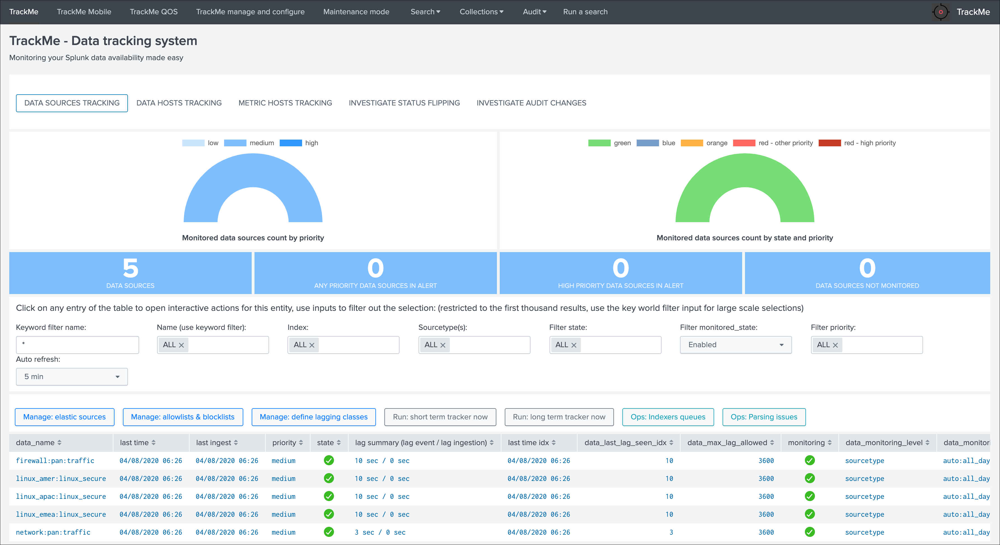

.. tip:: **If the UI is empty and no data sources are showing up:**

   - You can wait for the short term trackers execution which are scheduled to run every 5 minutes
   - Or manually run the data sources tracker by clicking on the button "Run: short term tracker now" (we will come back to the tracker notion later in this guide)

Main navigation tabs
--------------------------

**Now that TrackMe is deployed, and it discovered data available in your environment, let's review the main tabs provided in the UI:**

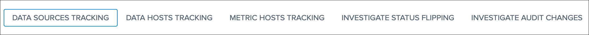

- ``DATA SOURCES TRACKING`` shows the tracking of data sources, by default a data source is a breakdown of your data on a per ``index + ":" + sourcetype``
- ``DATA HOSTS TRACKING`` shows data discovered for each ``host sending events`` to Splunk
- ``METRIC HOSTS TRACKING`` shows metrics discovered for each ``host sending metrics`` to Splunk
- ``INVESTIGATE STATUS FLIPPING`` shows the detection of an entity switching from a state, example green, to another state like red
- ``INVESITAGE AUDIT CHANGES`` shows all changes performed within the UI for auditing and review purposes

Data Sources tracking and features
----------------------------------

Data Source main screen
^^^^^^^^^^^^^^^^^^^^^^^

**Let's click on any entry in the table:**

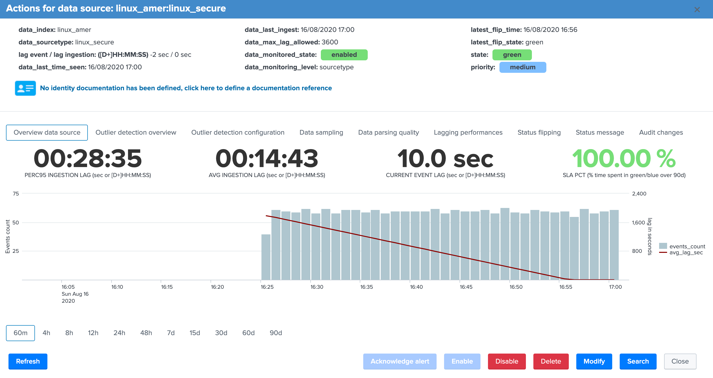

.. warning:: If you do not see the full window (called modal window), review your screen resolution settings, TrackMe requires a minimal high enough resolution when navigating through the app*

The modal window "open-up" is the user main interaction with TrackMe, depending on the context different information, charts, calculations and options are provided.

**In the context of the data sources tracking, let's have a deeper look at top part of the window:**

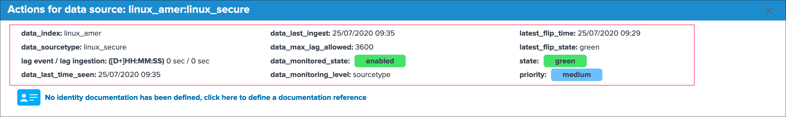

**Let's review these information:**

*group 1 left screen*

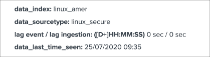

- ``data_index`` is the name of the Splunk index where the data resides
- ``data_sourcetype`` is the Splunk sourcetype for this entity
- ``lag event / lag ingestion: ([D+]HH:MM:SS)`` exposes the two main lagging metrics handled by TrackMe, the lag from the event point of view, and the lag from the ingestion point of view, we will come back to that very soon
- ``data_last_time_seen`` is the last date time TrackMe has detected data available for this data source, from the event time stamp point of view

*group 2 middle screen*

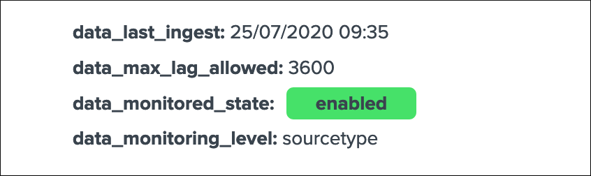

- ``data_last_ingest`` is the last date time TrackMe has detected data ingested by Splunk for the data source, this can differ from the very last event available in the data source (more after)
- ``data_max_lag_allowed`` is the value in seconds that TrackMe will use as the main information to define the status of the data source, by default it is defined to 1 hour (3600 seconds)
- ``data_monitored_state`` is a flag which tells TrackMe that this data source should be actively monitored, this is "enabled" by default and be defined within the UI to "disabled" (the red "Disable" button in the entity window)
- ``data_monitoring_level`` is a flag which tells TrackMe how to take into account other sourcetypes available in that same index when defining the current status of the entity

*group 3 right screen*

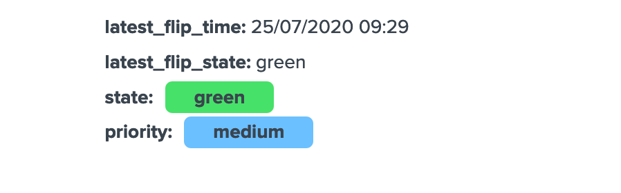

- ``latest_flip_time`` is the latest date time a change was detected in the state of the entity
- ``latest_flip_states`` is the state to which it moved at that time
- ``state`` is the current state, there are different states: green / orange / blue / grey / red (more explanations to come)
- ``priority`` represents the priority of the entity, by default all entities are added as "medium", priority is used in different parts of the app and alerts, there are 3 level of priority: low / medium / high

*group 4 bottom*


- ``Identity documentation card`` is a feature that allows you create an information card (hyperlink and a text note), and link that card to any number of data sources.
- By default, no identity card is defined which is exposed by this message, if an identity card is created and linked to the entity, the message will turn into a link that once clicked exposes in a new window the context of the card
- Use this feature to quickly reference the main information for someone accessing to TrackMe and when there is an issue on the data source, which would provide a link to whatever you want (your Confluence, etc) and a quick help text. (at least a hyperlink or a text note must be defined)

See :ref:`Data identity card` for more details about the feature.

Data source screen tabs
^^^^^^^^^^^^^^^^^^^^^^^

**Let's have a look now at next part of the modal window:**

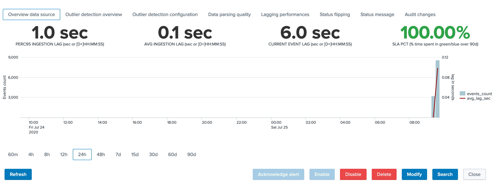

**Starting by describing the tabs available in this window:**

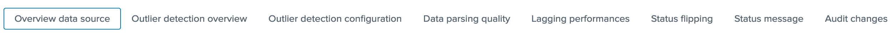

- ``Overview data source`` is the current view that exposes the main information and metrics for this entity
- ``Outlier detection overview`` exposes the event outliers detection chart
- ``Outlier detection configuration`` provides different options to configure the outliers detection
- ``Data sampling`` shows the results from the data sampling & event format recognition engine
- ``Data parsing quality`` exposes indexing time parsing issues such as truncation issues for this sourcetype, if any.
- ``Lagging performances`` exposes the event lag and ingestion lag recorded metrics in the metric index
- ``Status flipping`` exposes all status flipping events that were stored in the summary index
- ``Status message`` exposes the current status of the data source in a human friendly manner
- ``Audit changes`` exposes all changes recorded in the audit KVstore for that entity

Overview data source tab
^^^^^^^^^^^^^^^^^^^^^^^^

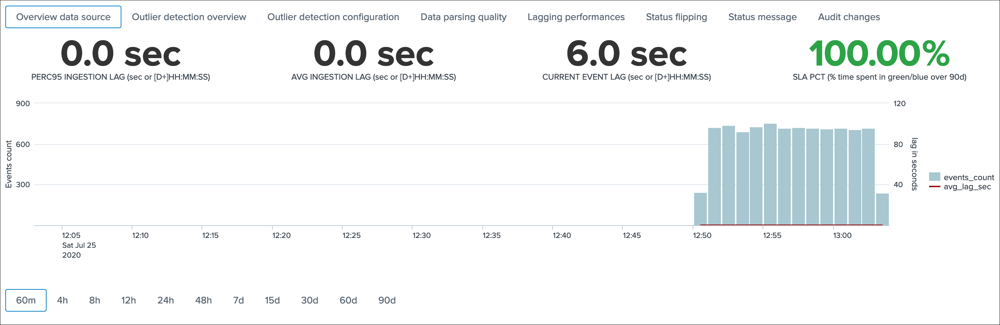

**This screen exposes several single forms with the following calculations:**

- ``PERC95 INGESTION LAG`` is the percentile 95 of the lag ingestion determined for this entity ( ``_indextime - _time`` )
- ``AVG INGESTION LAG`` is the average lag ingestion for that entity
- ``CURRENT EVENT LAG`` is the current event lag calculated for this entity ( ``now() - _time`` ), this basically exposes how late this data source compared between now and the very last event in the entity
- ``SLA PCT`` is the SLA percentage which basically exposes the percent of time that entity has spent in a not green / blue state

Finally, a chart over time exposes the event count and the ingestion lag for that entity.

Outlier detection overview
^^^^^^^^^^^^^^^^^^^^^^^^^^

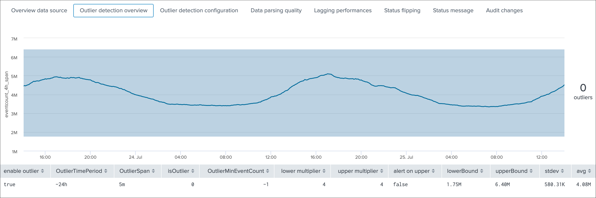

**This screen exposes the events outliers detection results over time, the purpose of the outliers detection is to provide advanced capabilities to detect when the number of events produced in the scope of an entity goes below or above a certain level, which level gets automatically defined upon the historical behaviour of the data.**

For this purpose, every time the short term tracker runs, it records different metrics which includes the number of events on per 4 hours time window. (which matches the time frame scope of the short term tracker)

Then in short, a scheduled report runs every hour to perform lower bound and upper bound calculations depending on different configurable factors.

Assuming the outliers detection is enabled, if the workflow detects a significant gap in the event count, and optionally an increase too, the state of the entity will be affected and potentially turn red.

**The table at the bottom of the screen provides additional information:**

- ``enable outlier`` can be true or false and defines if the outliers detection is taken into account for the state definition of that entity
- ``OutlierTimePeriod`` is a time frame period between a list of restricted values, which defines the time period the backend will be looking at during for the lower bound, upper bound and standard deviation calculation
- ``OutlierSpan`` is used when rendering the outliers over time chart and does not influence the detection (for example if a data source emits data every 30 minutes you will want to apply a more relevant value for a better rendering)
- ``isOutlier`` is the current status, a value of 0 indicates that no outliers are currently active for this entity, a value of 1 indicates TrackMe detected outliers currently
- ``OutlierMinEventCount`` is an optional static value that can be defined for the lower bound, this is useful if you want to statically specific the minimal per 4 hours event count to be accepted
- ``lower multiplier`` is a multiplier that is used for the automatic definition of the lower bound, decreasing or increasing will impact the value of the lower bound definition
- ``upper multiplier`` is a multiplier that is used for the automatic definition of the upper bound, decreasing or increasing will impact the value of the upper bound definition
- ``alert on upper`` defines if upper outliers should be taken into account and affect the state if an abnormal number of events is coming in, default is false
- ``lowerBound`` is the lower threshold, an event count below this value will be considered as outliers
- ``upperBound`` is the upper threshold, an event count above this value will be considered as outlier, but will only impact the state if the alert on upper is true
- ``stdev`` is the standard deviation calculated by the workflow for this entity, and is used as the reference for the lower and upper bound calculation associated with the lower and upper multipliers
- ``avg`` represents the average 4 hours amount of event count for this entity

See :ref:`Outliers detection and behaviour analytic` for more details about the feature.

Outlier detection configuration
^^^^^^^^^^^^^^^^^^^^^^^^^^^^^^^

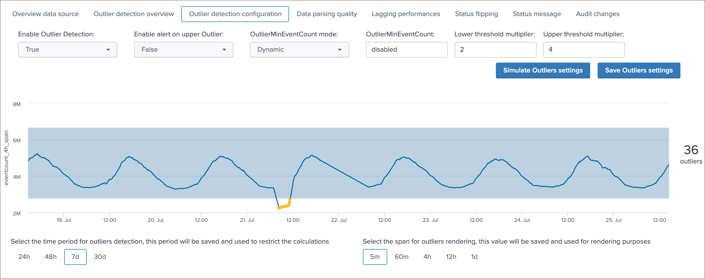

**This is the screen provided to configure the outliers detection for a given entity, which exposes a simulation of the results over time, allowing you to train your settings before they are applied.**

**On the top part of the screen you will interact with the settings exposes in the previous section:**

- ``Enable Outlier Detection:`` you can choose to disable the Outliers detection for a given entity, default is enabled
- ``Enable alert on upper Outlier:`` you can choose to alert on upper outliers detection, default is false
- ``OutlierMinEventCount mode:`` you can choose to let the workflow defining dynamically the lower bound value, or define yourself a static threshold if you need it
- ``OutlierMinEventCount:`` static lower bound value if static threshold is used
- ``Lower threshold multiplier:`` the multiplier for the lower band calculation, must be a numerical value which will impact the lower bound calculation (the lower the multiplier is, the closer to the actual standard deviation the calculation will be) 
- ``Upper threshold multiplier:`` the multiplier for the upper band calculation, must be a numerical value which will impact the upper bound calculation (the lower the multiplier is, the closer to the actual standard deviation the calculation will be)

**Finally, there are two time related settings to interact with:**

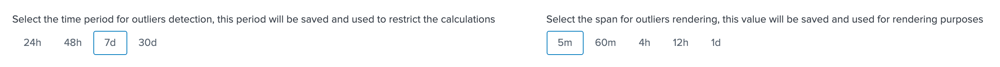

- ``time period for outliers detection`` defines the time frame TrackMe will be looking at for the outliers calculations (lower/upper bands etc) which is using the recorded metrics every time the short term trackers ran
- ``span for outliers rendering`` is an additional setting which impact the graphical rendering within the outliers screen, but not the results of the outliers detection itself

See :ref:`Outliers detection and behaviour analytic` for more details about the feature.

Data sampling
^^^^^^^^^^^^^

**The data sampling tab exposes the status of the data sampling and format recognition engine:**

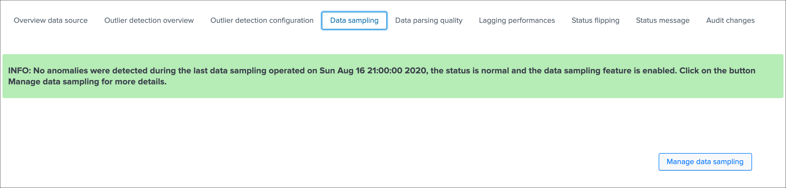

The data sampling message can be:

- ``green:`` if no anomalies were detected
- ``blue:`` if the data sampling did not handle this data source yet
- ``orange:`` if conditions do not allow to handle this data source, which can be multi-format detected at discovery, or no identifiable event formats (data sampling will be deactivated automatically)
- ``red:`` if anomalies were detected by the data engine, anomalies can be due to a change in the event format, or multiple events formats detected post discovery

The button **Manage data sampling** provides summary information about the data samping status and access to data sampling related features:

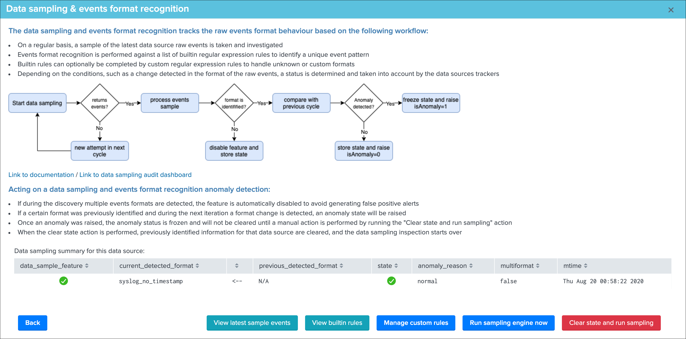

**Quick button access:**

- ``View latest sample events:`` open in search access to the last sample of raw events that were processed (raw events and identified format)
- ``View builtin rules:`` view the builtin rules (builtin rules are regular expressions rules provided by default)
- ``Manage custom rules:`` view, create and delete custom rules to handle any format that would not be recognized by the builtin rules
- ``Run sampling engine now:`` runs the sampling engine now for this data source
- ``Clear state and run sampling:`` clears the previously known states and run the sampling engine as it was the first time the engine handles this data source

See :ref:`Data sampling and event formats recognition` for more details about the feature.

Data parsing quality
^^^^^^^^^^^^^^^^^^^^

**The data parsing quality screen exposes if there are any indexing time parsing issues found for this sourcetype:**

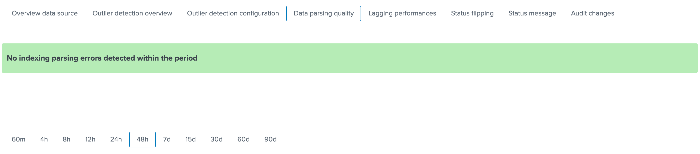

*Note: for data sources, the scope of indexing time parsing issues happens on the sourcetype level from a Splunk point of view, this means that if there are any parsing issues found for this sourcetype, this can be linked to this data source but as well with any other data source that looks at the same sourcetype.*

**Under normal conditions, this screen should not show any parsing errors, if there are any, these should be fixed.**

Lagging performances
^^^^^^^^^^^^^^^^^^^^

**This screen exposes the event and ingestion lagging metrics that have been recorded each time the short trackers ran, these metrics are stored via a call to the mcollect command and stored into a metric store index:**

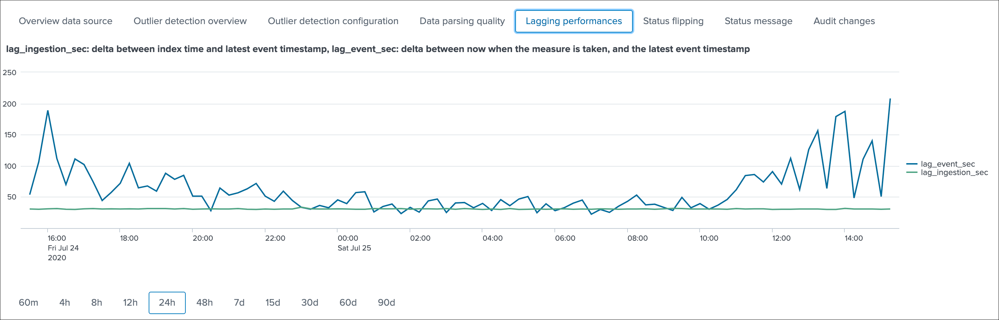

**The following mcatalog search can be used to expose the metrics stored in the metric store and the dimensions:**

::

   | mcatalog values(metric_name) values(_dims) where index=* metric_name=trackme.*

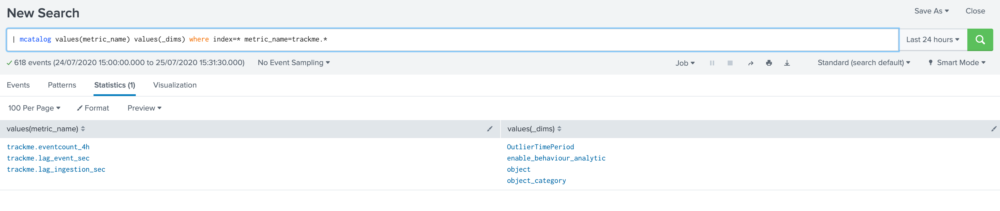

**The main dimensions are:**

- ``object_category`` which represents the type of entities, being data_source or data_host
- ``object`` which is the entity unique identifier, data_name for data sources, data_host for data hosts

Status flipping
^^^^^^^^^^^^^^^

**This screen exposes all the flipping status events that were recorded for that entity during the time period that is selected:**

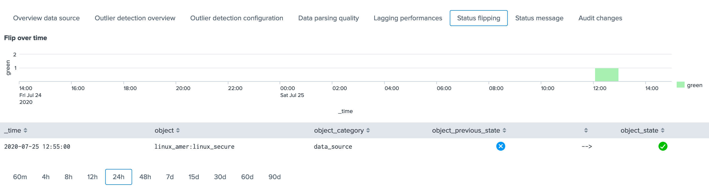

**Key information:**

- Anytime an entity changes from a state to another, a record is generated and indexed in the summary index
- When an entity is first added to the collection during its discovery, the origin state will be discovered
- The target state is the state (green / red and so forth) that the entity has switched to

Status message
^^^^^^^^^^^^^^

**This screen exposes a human friendly message describing the current state of the entity, depending on the conditions the message will appear as green, red, orange or blue:**

*example of a green state:*

.. image:: img/first_steps/img018.png
   :alt: img/first_steps/img018
   :align: center

*example of a red state due to lagging conditions not met:*

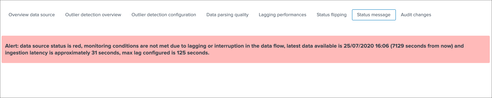

*example of a red state due to outliers detection:*

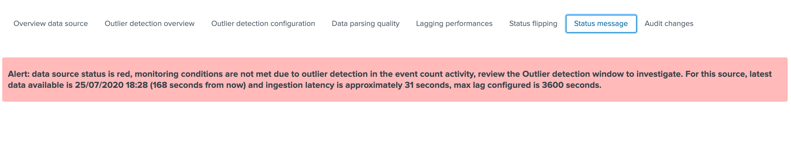

*example of a red state due to data sampling anomalies detected:*

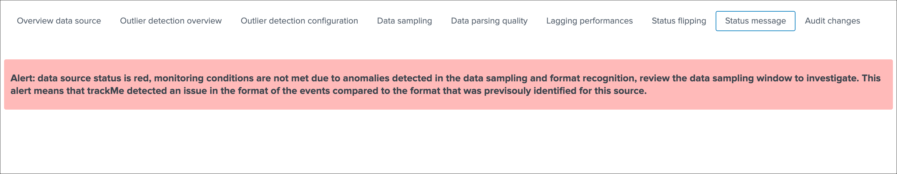

*example of a red state due to hosts dcount threshold not reached:*

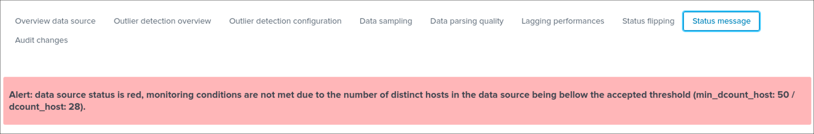

*example of a blue state due to logical groups monitoring conditions not met (applies to data hosts and metrics hosts only):*

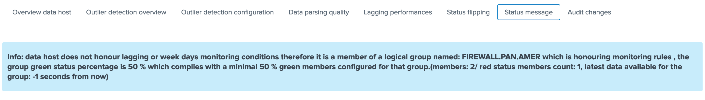

*example of an orange state due to data indexed in the future:*

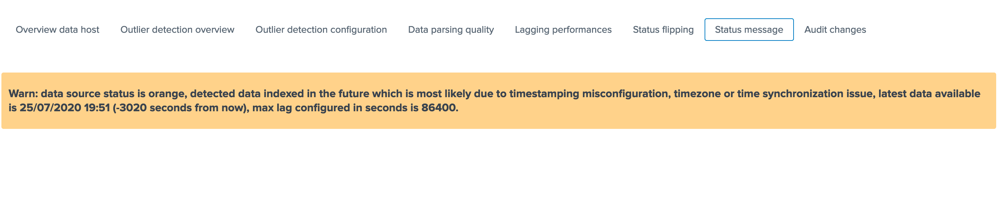

*In addition, an integration using the timeline custom view provides an enhanced overview of the entity status over time:*

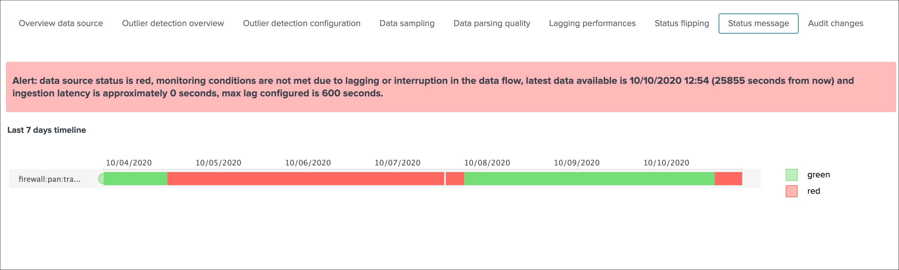

Audit changes
^^^^^^^^^^^^^

**This final screen exposes all changes that were applied within the UI to that entity which are systematically recorded in the audit KVstore:**

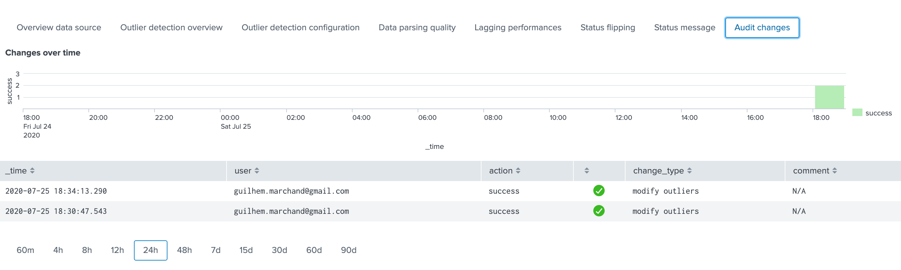

See :ref:`Auditing changes` for more details about the feature.

Action buttons
^^^^^^^^^^^^^^

**Finally, the bottom part of the screen provides different buttons which lead to different actions:**

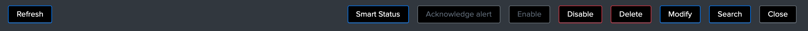

**Actions:**

- ``Refresh`` will refresh all values related to this entity, it will actually run a specific version of the tracker and update the KVstore record of this data source. Charts and other calculations are refreshed as well.
- ``Acknowledge alert`` can only be clicked if the data source is effectively in a red state, acknowledging an alert prevent the out of the box alerts from triggering a new alert for this entity until the acknowledgment expires.
- ``Enable`` can only be clicked if the monitoring state is disabled, if clicked and confirmed, the value of the field ``data_monitored_state`` will switch from disabled to enabled
- ``Disable`` opposite of the previous
- ``Modify`` provides access to the unified modification window which allows interacting with different settings related to this entity
- ``Search`` opens a search window in a new tab for that entity

See :ref:`Alerts acknowledgment` for more details about the acknowledgment feature

See :ref:`Data source unified update` for more details about the unified update UI for data sources

Data Hosts tracking and features
--------------------------------

Rather than duplicating all the previous explanations, let's expose the differences between the data sources and data hosts tracking.

Data host monitoring
^^^^^^^^^^^^^^^^^^^^

Data hosts monitoring does data discovery on a per host basis, relying on the ``Splunk host Metadata``.

To achieve this, TrackMe uses tstats based queries to retrieve and record valuable Metadata information, in a simplistic form this is very similar to the following query:

::

   | tstats count, values(sourcetype) where index=* by host

Particularities of data hosts monitoring
^^^^^^^^^^^^^^^^^^^^^^^^^^^^^^^^^^^^^^^^

**The features are almost equivalents between data sources and data hosts, with a few exceptions:**

- ``state condition:`` the data host entity state depends on the global data host alerting policy (which is defined globally and can be overriden on a per host basis)
- Depending on the policy, he host state will turn red if either no more sourcetypes are generating data (track per host policy), or any of the sourcetypes monitored for the host has turned red (track per sourcetype policy)
- Using ``allowlists and blocklists`` provide additional granularity to define what data has to be included or is excluded during the searches
- ``Outliers detection`` is available for data hosts too and would help detecting significant changes such as a major sourcetype that is not ingested anymore
- ``logical group``: a data host can be part of a logical group, this feature is useful for example to handle a couple of active / passive entities (example with firewalls) where the passive entity will not be generating any data actively
- ``object tags``: this is an additional feature to data hosts and metric hosts that allows looking against a third party lookup, such as your CMDB data stored in Splunk, or the Splunk Enterprise Security assets knowledge, to provide an active link and access quickly these enrichment information

See :ref:`Logical groups (clusters)` for more details on this feature

See :ref:`Enrichment tags` for more details om this feature

**Additionally, if there has been indexes migrations, or if one or more sourcetypes have been decomissioned, this will affect the state of a given host if the alert policy is defined to track per sourcetype, you can reset the knowledge of indexes and sourcetypes on a per host basis via the reset button:**

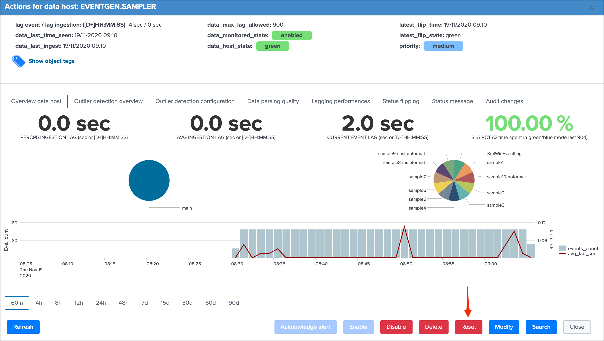

Metric Hosts tracking and features
----------------------------------

Metric hosts tracking is the third main notion in TrackMe, and deals with tracking hosts sending metrics to the Splunk metric store, let's expose the feature particularities.

Metric host monitoring
^^^^^^^^^^^^^^^^^^^^^^

The metric hosts feature tracks all metrics send to the Splunk metric store on a per host basis.

In a very simplistic form, the notion is similar to performing a search looking at all metrics with mstats on a per host basis and within a short time frame:

::

   | mstats latest(_value) as value where index=* metric_name="*" by metric_name, index, host span=1s

Then, the application groups all metrics on per metric metric category (the first metric name segment) and a per host basis.

Particularities of metric hosts monitoring
^^^^^^^^^^^^^^^^^^^^^^^^^^^^^^^^^^^^^^^^^^

**Compared to data sources and data hosts tracking, metric hosts tracking provides a similar level of features, with a few exceptions:**

- ``state condition:`` the metric host state is conditioned by the availability of each metric category that was discovered for that entity
- Shall a metric category stop from being emitted, the state will be affected accordingly
- Using ``allowlists and blocklists`` provide additional granularity to define the include and exclude conditions of the metric discovery
- ``Outliers detection`` is not available for metrics hosts
- ``logical group``: a metric host can be part of a logical group, this feature is useful for example to handle a couple of active / passive entities (example with firewalls) where the passive entity will not be generating any metrics actively
- ``object tags``: this is an additional feature to data hosts and metric hosts that allows looking against a third party lookup, such as your CMDB data stored in Splunk, or the Splunk Enterprise Security assets knowledge, to provide an active link and access quickly these enrichment information
- Metric hosts tracking relies on the ``default max lag allowed`` per ``metric category`` which is defined by default to 5 minutes (300 seconds) and can be managed by creating ``metric SLA policies``
- The entity screen provides some metric specific search options to provide insights against these specific entities and their metrics

**Additionally, if a metric category stops being emitted this affects the global status of the entity, if these metrics are decomissioned you can reset the host metrics knowledge:**

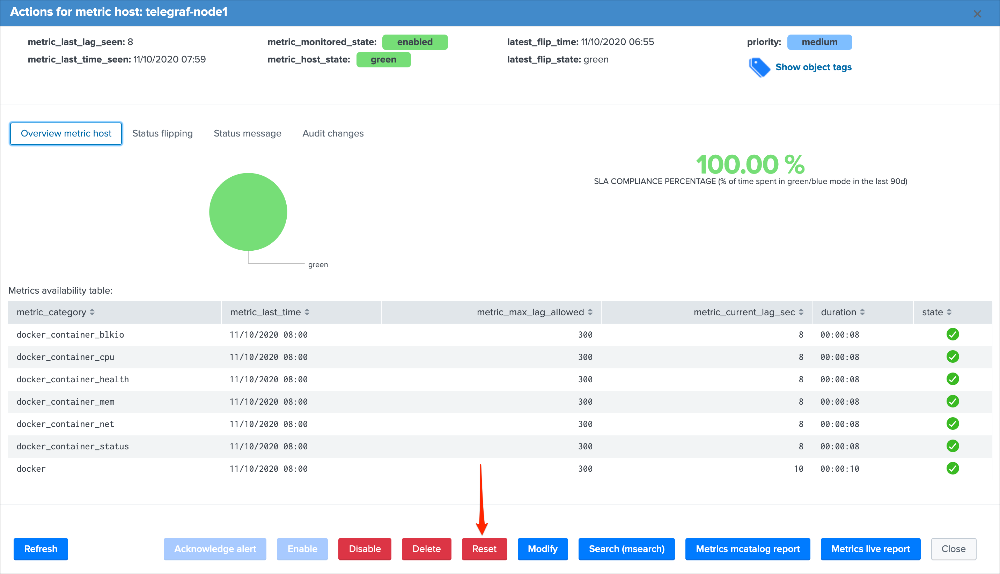

Triggering this action will remove the current knowledge of metric categories for this entity only and trigger a fresh discovery without losing additional settings like the priority.

See :ref:`Logical groups (clusters)` for more details on this feature

See :ref:`Enrichment tags` for more details om this feature

Unified update interface
========================

**For each type of tracking, a unified update screen is available by clicking on the modify button when looking at a specific entity:**

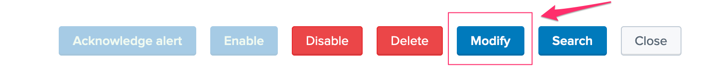

These interfaces are called unified as their main purpose is to provide a central place in the UI where the modification of the main key parameters would be achieved.

In this screens, you will define the priority level assignment, modify the lagging policy, manage logical groups, etc.

Data source unified update
--------------------------

.. image:: img/first_steps/img024.png
   :alt: img/first_steps/img024
   :align: center

Data hosts unified update
-------------------------

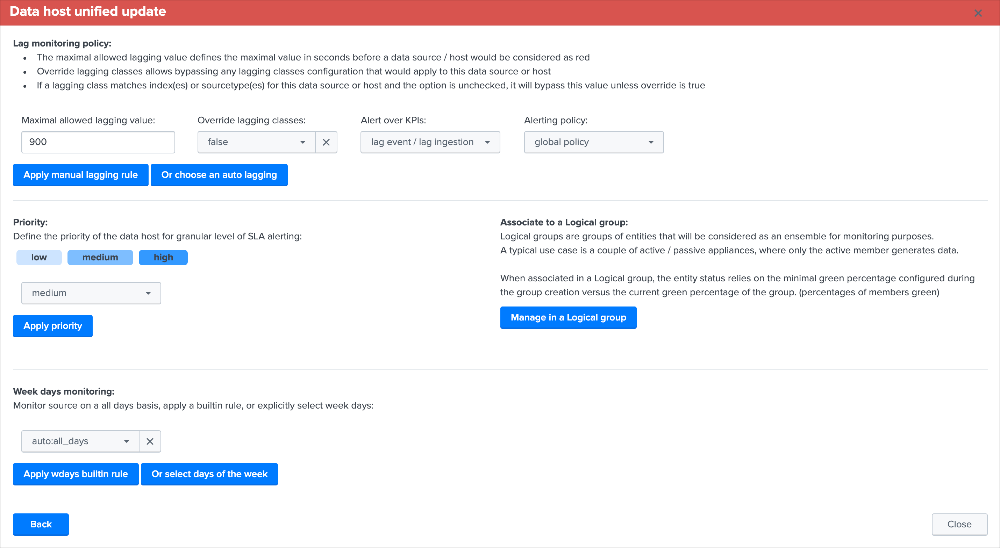

Metric hosts unified update
---------------------------

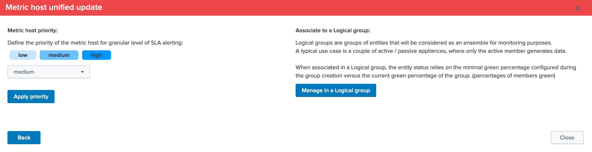

Unified update interface features
---------------------------------

**Lag monitoring policy:**

In this part of the screen you will define:

- The ``max lag allowed`` value that conditions the state definition of the entity depending on the circumstances
- This value is in ``seconds`` and will be taken into account by the trackers to determine the colour of the state
- ``Override lagging classes`` allows bypassing any lagging class that would have defined and could be matching the conditions (index, sourcetype) of this entity
- You can choose which ``KPIs`` will be taken into account to determine the state regarding the ``max lag allowed`` and the two main lagging performance indicators
- For data hosts, the ``alerting policy`` allows controlling how to consider the green/red state assignment in regards with the state of each sourcetype indexed by the host

See :ref:`Lagging classes` for more details about the lagging classes feature.

See :ref:`Alerting policy for data hosts` for more details about the alerting policy feature.

**Priority:**

This is where you can define the priority of this entity.
The priority is by default set to medium can by any of:

- ``low``
- ``medium``
- ``high``

Using the priority allows granular alerting and improves the global situation visibility of the environment within the main screens.

See :ref:`Priority management` for more details about this feature

**Week days monitoring:**

Week days monitoring allows using specific rules for data sources and data hosts regarding the day of the week, by default monitoring rules are always applied, therefore using week days rules allow influencing the ``red`` state depending on the current day of the week. (which would switch to ``orange`` accordingly)

See :ref:`Week days monitoring` for more details about this feature

**Monitoring level:**

This option allows you to ask TrackMe to consider the very last events available at the index level rather than the specific sourcetype related to the entity.

This influences the state definition:

- If a data source or host is set to ``sourcetype``, what conditions the state is meeting the monitoring rules for that sourcetype only (default behaviour)
- If it is set to ``index``, instead of defining a red state because the monitoring conditions are not met, we will consider if there are events available at the index level according to the monitoring rules
- The purpose of this feature is to allow interacting with this data source (in that context let's talk about sourcetypes) without generating an alert as long as data is actively sent to that index

**Associate to a logical group:**

This option allows grouping data hosts and metric hosts into logical groups which are taken in consideration by groups rather than per entity.

See :ref:`Logical groups (clusters)` for more details about this feature.

**Alerting policy: (data hosts only)**

This option allows controlling on a per host basis the behaviour regarding the sourcetypes monitoring per host.

See :ref:`Alerting policy for data hosts` for more details about this feature.

**Host distinct count threshold: (data sources only)**

In some cases, you may want to be alerted when the number of distinct count hosts underneath a data source goes bellow a certain threshold.

*Expected values are:*

- "any" (default) which disables any verification against the hosts distinct count number
- A positive integer representing the minimal threshold for the dcount of hosts, if the current dcount goes bellow this value, the data source turns red

Elastic sources
===============

Introduction to Elastic sources
-------------------------------

.. admonition:: Elastic sources feature

   - The Elastic sources feature provides a builtin workflow to create virtual data sources based on any constraints and any Splunk language
   - This extends TrackMe builtin features to allow dealing with any use case that the default data source concept does not cover by design
   - Elastic Sources can be based on ``tstats``, ``raw``, ``from (datamodel and lookup)`` and ``mstats`` searches
   - In addition, Elastic Sources can be executed over a ``rest`` remote query which allows tracking data that the search head(s) hosting TrackMe cannot access otherwise (such as a lookup that is only available to a Search Head Cluster while you run TrackMe on a monitoring utility search head)

As we have exposed the main notions of TrackMe data discovery and tracking in :ref:`Main navigation tabs`, there can be various use cases that these concepts do not address properly, considering some facts:

- Breaking by index and sourcetype is not enough, for instance your data pipeline can be distinguished in the same sourcetype by breaking on the ``Splunk source Metadata``
- In a similar context, enrichment is performed either at indexing time (ideally indexed fields which allow the usage of tstats) or search time fields (evaluations, lookups, etc), these fields represent the keys you need to break on to address your requirements 
- With the default ``data sources`` tracking, this data flow will appear as one main entity and you cannot ``distinguish`` a specific part of your data covered by the standard data source feature
- Specific ``custom indexed fields`` provide ``knowledge`` of the data in your context, such as ``company``, ``business unit`` etc and these pipelines cannot be distinguished by relying on the ``index`` and ``sourcetype`` only
- You need to address any use case that the default main features do not allow you to

.. hint:: 

   The Elastic source feature allows you to fulfil any type of requirements from the data identification and search perspective, and transparenly integrate these virtual entities in the normal TrackMe workflow with the exact same features.

We will address some easily understandable examples in this documentation.

**The name of notion and name of "Elastic Sources" is proper to TrackMe, and is linked to the complete level of flexibility the feature provides you to address any kind of use cases you might need to deal with.**

**In a nutshell:**

- An Elastic source can be added to the ``shared tracker``, or created as an ``independent tracker``
- The search language can be based on ``| tstats``, ``raw`` searches, ``| from`` and ``| mstats`` commands
- The shared tracker is a specific scheduled report named ``TrackMe - Elastic sources shared tracker`` that tracks in a single schedule execution all the entities that have been declared as shared Elastic sources via the UI
- Because the ``shared tracker`` performs a ``single execution``, there are performance considerations to take into account and the shared tracker should be restricted to very efficient searches in term of run time
- In addition, ``Elastic sources shared`` have time frame restrictions which are the earliest and latest values of the tracker, you can restrict a shared entity time scope below these values but not beyond 
- A ``dedicated Elastic source`` is created via the UI which generates a new tracker especially for it
- As the dedicated Elastic source has its ``own schedule report``, this provides more capabilities to handle fewer performing searches and as well more freedom to address basically any kind of customisation
- ``Dedicated Elastic sources`` can be configured to address any time scope you need, and any search that is required including any advanced customisation you would need

Accessing the Elastic source creation UI
----------------------------------------

First, let's expose how to access the Elastic sources interface, from the data sources tab in the main UI, click on the ``Elastic Sources`` button:

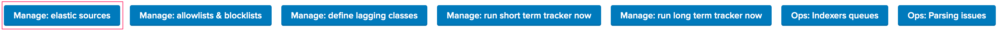

The following screen appears:

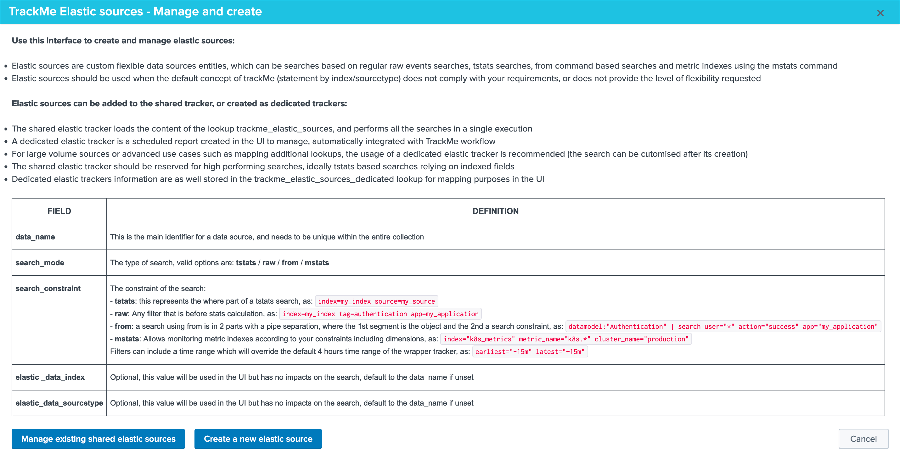

Elastic source example 1: source Metadata
-----------------------------------------

**Let's take our first example, assuming we are indexing the following events:**

*data flow1 : firewall traffic for the region AMER*

::

   index="network" sourcetype="pan:traffic" source="network:pan:amer"

*data flow2 : firewall traffic for the region APAC*

::

   index="network" sourcetype="pan:traffic" source="network:pan:apac"

*data flow3 : firewall traffic for the region EMEA*

::

   index="network" sourcetype="pan:traffic" source="network:pan:emea"

It is easy to understand that the default standard for data source ``index + ":" + sourcetype`` does not allow us to distinguish which region is generating events properly, and which region would not:

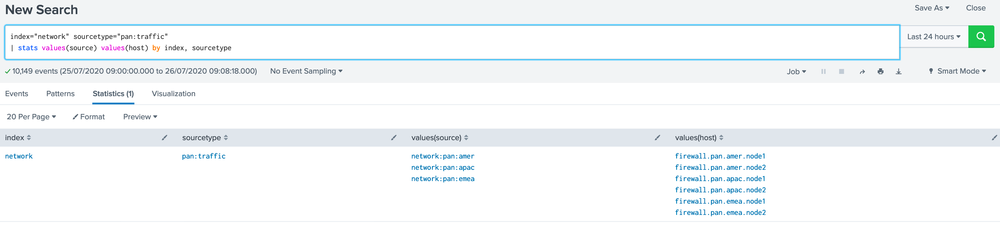

In TrackMe data sources, this would appear as one entity and this is not helping me covering that use case:

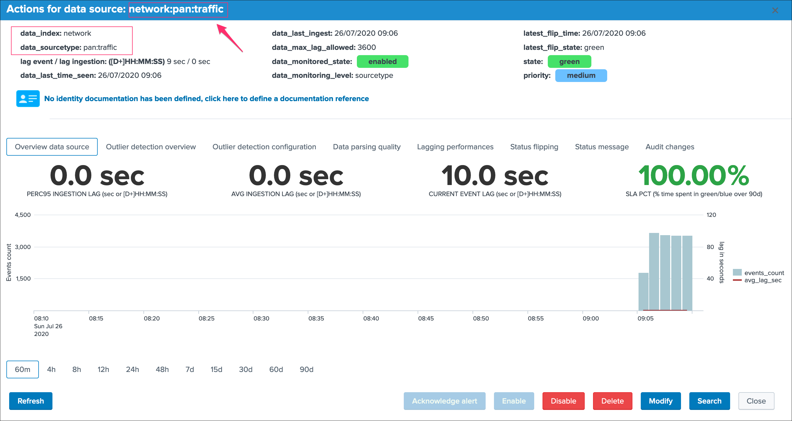

What if I want to be monitoring the fact that the EMEA region continues to be indexed properly ? and other regions ?

Elastic Sources is the TrackMe answer which allows you to extend the default features with agility and address easily any kind of requirement transparently in TrackMe.

Elastic source example 2: custom indexed fields
-----------------------------------------------

**Let's extend a bit more the first example, and this time in addition with the region we have a company notion.**

At indexing time, two custom indexed fields are created representing the "region" and the "company".

Custon indexed fields can be created in many ways in Splunk, it is a great and powerful feature as long as it is properly implemented and restricted to the right use cases.

This example of excellence allows our virtual customer to work at scale with performing searches against their two major enrichment fields.

**Assuming we have 3 regions (AMER / EMEA / APAC) and per region we have two companies (design / retail), to get the data of each region / company I need several searches:**

::

   index="firewall" sourcetype="pan:traffic" region::amer company::design
   index="firewall" sourcetype="pan:traffic" region::amer company::retail
   index="firewall" sourcetype="pan:traffic" region::apac company::design
   index="firewall" sourcetype="pan:traffic" region::apac company::retail
   index="firewall" sourcetype="pan:traffic" region::emea company::design
   index="firewall" sourcetype="pan:traffic" region::emea company::retail

*Note the usage of "::" rather than "=" which indicates to Splunk that we are explicitly looking at an indexed field rather a field potentially extracted at search time.*

Indeed, it is clear enough that the default data source feature does not me with the answer I need for this use case:

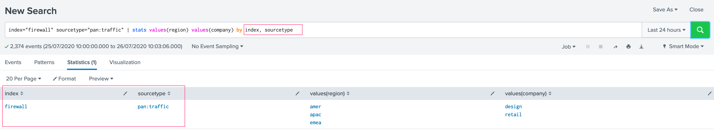

Rather than one data source that covers the index/sourcetype, the requirement is to have 6 data sources that cover each couple of region/company.

Any failure on the flow level which is represented by these new data sources will be detected.
On the opposite, the default data source breaking on on the sourcetype would need a total failure of all pipelines to be detected.

**By default, the data source would show up with a unique entity which is not filling my requirements:**

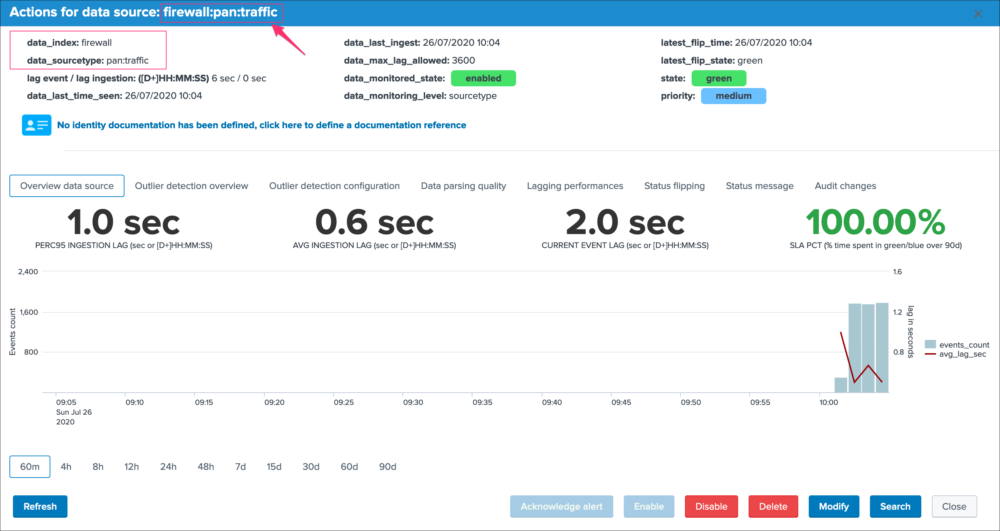

The default concept while powerful does not cover my need, but ok there we go and let's extend it easily with Elastic sources!

Elastic source example 3: tracking lookups update
-------------------------------------------------

It is a very common and powerful practice to generate and maintain lookups in Splunk for numbers of purposes, which can be file based lookups (CSV files) or KVstore based lookups.

Starting with TrackMe 1.2.28, it is possible to define an Elastic Source and monitor if the lookup is being updated as expected.

A common caveheat with lookups is that their update is driven by Splunk searches, there are plenty of reasons why a lookup could stop being populated and maintained, such as scheduling issues, permissions, related knowledge objects updates, lack or changes in the data, and many more.

The purpose of this example is to provide a builtin and effiscient way of tracking Splunk lookup updates at scale in the easy way, and get alerted if an update issue is detected in the lookup according to the policies defined in TrackMe.

*Let's consider the simplistic following example, the lookup acme_assets_cmdb contains our ACME assets and is updated every day, we record in the field "lookupLastUpdated" the date and time of the execution of the Lookup gen report in Splunk. (in epoch time format)*

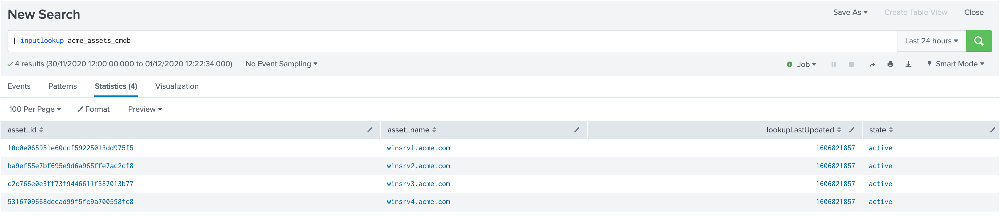

The unique requirement for TrackMe to be able to monitor a lookup is to have a time concept which can use to define as the ``_time`` field which TrackMe will rely on.

Lookups have no such thing of a concept of ``_indextime`` (time of ingestion in Splunk), therefore TrackMe will by default make the index time equivalent to the latest _time from the lookup, unless the Splunk search that will be set in the Elastic Source defines a value based on information from the lookup.

Elastic source example 4: rest searches
---------------------------------------

**In some cases, the Splunk instance that hosts the TrackMe application may not not be able to access to a data you wish to monitor.**

**A very simple to understand use case would be:**

- You have a Splunk Search Head Cluster, hosting for example your premium application for ITSI or Enterprise Security
- In addition, you either use your monitoring console host or a dedicated standalone search head for your Splunk environment monitoring, which is where TrackMe is deployed
- A lookup exists in the SHC which is the object you need to monitor, this lookup is only available to the SHC members and TrackMe cannot access to its content transparently

Using a ``rest`` command, you can hit a Splunk API search endpoint remotely, and use the builtin Elastic Source feature to monitor and track the lookup just as if it was available directly on the TrackMe search head.

*In short, on the SHC you can run:*

::

   | inputlookup acme_assets_cmdb

*On the TrackMe Splunk instance, we will use a search looking like:*

::

   | rest splunk_server_group="dmc_searchheadclustergroup_shc1" /servicesNS/admin/search/search/jobs/export search="| from lookup:acme_assets_cmdb | eval _time=strftime(lookupLastUpdated, \"%s\") | eventstats max(_time) as indextime | eval _indextime=if(isnum(_indextime), _indextime, indextime) | fields - indextime | eval host=if(isnull(host), \"none\", host) | stats max(_indextime) as data_last_ingest, min(_time) as data_first_time_seen, max(_time) as data_last_time_seen, count as data_eventcount, dc(host) as dcount_host | eval data_name=\"rest:from:lookup:example\", data_index=\"pseudo_index\", data_sourcetype=\"lookup:acme_assets_cmdb\", data_last_ingestion_lag_seen=data_last_ingest-data_last_time_seen" output_mode="csv"

*Notes and technical details:*

- See https://docs.splunk.com/Documentation/Splunk/latest/RESTTUT/RESTsearches for more information about running searches over rest
- See https://docs.splunk.com/Documentation/Splunk/latest/SearchReference/Rest for more information about the rest search command
- ``rest`` based searches support all forms of searches supported by Elastic Sources: ``tstats``, ``raw``, ``from:datamodel``, ``from:lookup``, ``mstats`` 
- Search Heads you wish to target need to be configured as distributed search peers in Splunk, same requirement as for the Splunk Monitoring Console host (MC, previously named DMC)
- Most of the calculation part is executed on the target search head size, TrackMe will not attempt to retrieve the raw data first before performing the calculation for obvious performance gain purposes
- You can target a search head explicity using the ``splunk_server`` argument, or you can target a group of search heads (such as your SHC) using the ``splunk_server_group`` argument
- When targeting a group of search heads, the query is executed on every search that is matched by the splunk_server_group, therefore you should limit using a target group to very effiscient and low cost searches such as a from lookup for example
- TrackMe in anycase will only consider the first result from the rest command (so only one search head answer during the rest execution, assuming search heads from the same group have the same data access), and will discard other search head replies
- The search needs to be properly performing, and should complete in a acceptable time window (use timeout argument which defaults to 60 seconds)
- Each result from the rest command, during the tracker execution or within the UI, passes through a Python based custom command to parse the CSV structure resulting from the rest command, to finally create the Splunk events during the search time execution
- Except for ``| from lookup:`` rest searches, other types of searches automatically append the configured earliest and latest as arguments to the rest command (earliest_time, latest_time)
- Earliest and Latest arguments are configurable for dedicated trackers only, shared trackers will use earliest:"-4h" and latest:"+4h" statically
- Additional parameters to the rest command can be added within the first pipe of the search constraint during the Elastic Source creation (such as timeout, count etc)

.. warning:: Currently the rest command generates a warning message "Unable to determine response format from HTTP Header", this message can be safety ignored as it does not impact the results in anyway, but cannot unfortunately be removed at the moment, until it is fixed by Splunk. 

**Examples for each type of search:**

*tstats over rest:*

::

   splunk_server="my_search_head" | index=* sourcetype=pan:traffic

*raw search over rest:*

::

   splunk_server="my_search_head" | index=* sourcetype=pan:traffic

*from datamodel over rest:*

::

   splunk_server="my_search_head" | datamodel:"Authentication" action=*

*from lookup over rest:*

::

   splunk_server="my_search_head" | from lookup:acme_assets_cmdb | eval _time=strftime(lookupLastUpdated, "%s")

*mstats over rest:*

::

   splunk_server="my_search_head" | index=* metric_name=docker*

As a conclusion, using the rest based searches features successfully completes the Elastic Sources level of features, such that every single use case can be handled in TrackMe, whenever the Splunk instance cam access or not to the data you need to track!

Elastic source example 1: creation
----------------------------------

**Now, let's create our first Elastic Source which will meet our requirement to rely on the Splunk source Metadata, click on create a new Elastic source:**

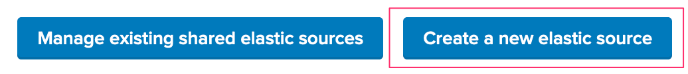

**Which opens the following screen:**

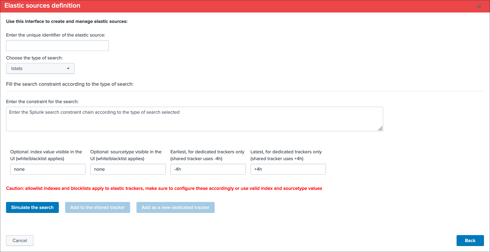

**Summary:**

- Define a name for the entity, this name is the value of the field ``data_name`` and needs to be unique in TrackMe
- Shall that name you provide not be unique, a little red cross and a message will indicate the issue when we run the simulation
- We choose a ``search language``, because the source field is a Metadata, this is an indexed field and we can use the tstats command which is very efficient by looking at the tsdidx files rather than the raw events
- We define our search constraint for the first entity, in our case ``index=network sourcetype=pan:traffic source=network:pan:emea``
- We choose a value for the index, this is having ``no influence`` on the search itself and its result but determines how the entity is classified and filtered in the main UI
- Same for the sourcetype, which does ``not influence`` the search results
- Finally, we can optionally decide to define the earliest and latest time range, in our example we can leave that empty and rely on the default behaviour

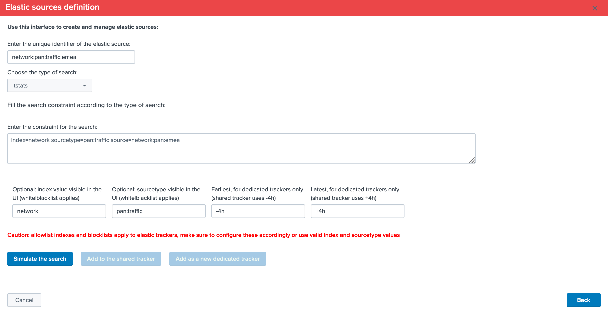

**Let's click on this nice button!**

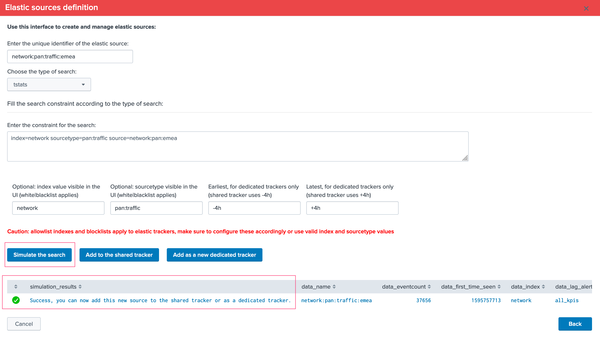

This looks good isn't it?

**Shared tracker versus dedicated tracker:**

In this context:

- Because this is a very efficient search that relies on tstats, creating it as a shared tracker is perfectly fair
- Shall I want to increase the earliest or the latest values beyond the shared tracker default of -4h / +4h, this would be reason to create a dedicated tracker
- While tstats searches are very efficient, a very high volume of events might mean a certain run time for the search, in such a case a dedicated tracker shall be used
- If you have to achieve any additional work, such as third party lookup enrichment, this would be a reason to create a dedicated tracker too

**Fine? Let's cover both, and let's click on "Add to the shared tracker" button:**

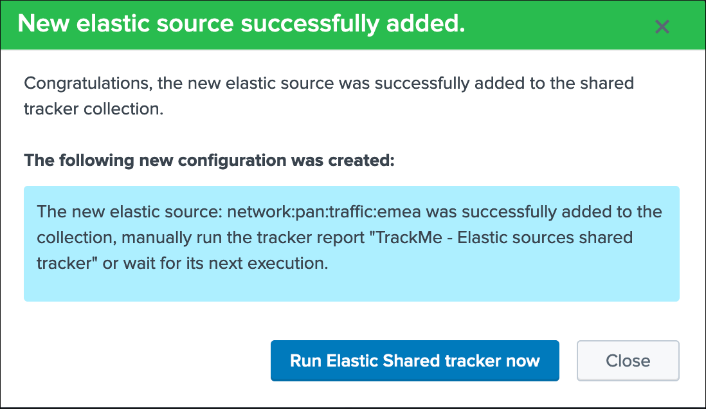

Nice! Let's click on that button and immediately run the shared tracker, upon its execution we can see an all brand new data source entity that matches what we created:

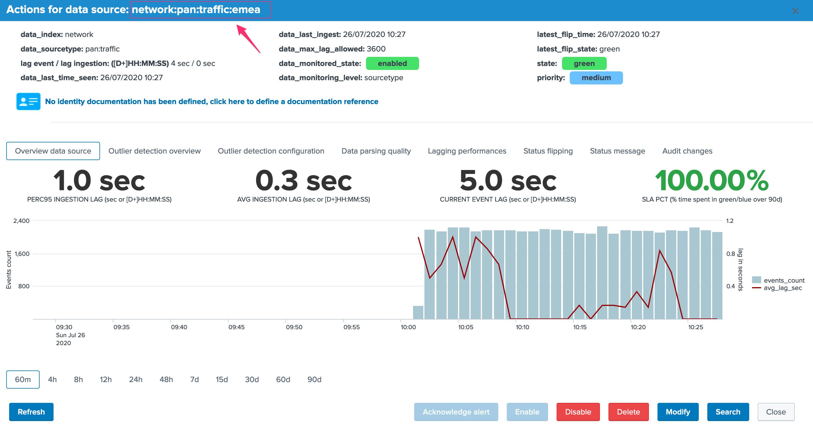

Ok that's cool! 

*Note: if you disagree with this statement, you are free to leave this site, free to uninstall TrackMe and create all of your own things we are not friends anymore that's it.*

**repeat the operation, which results in 3 new entities in TrackMe, one for each region:**

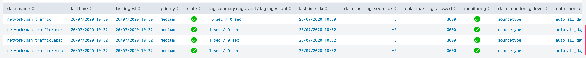

"What about the original data source that created automatically?".

We can simply disable the monitoring state via the disable button et voila!

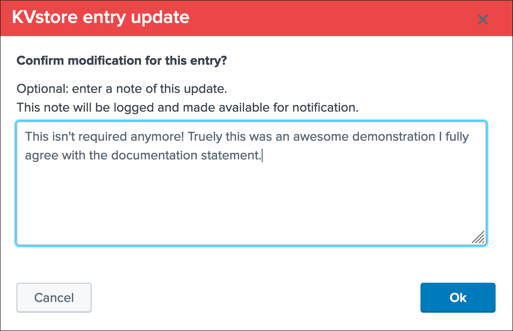

Elastic source example 2: creation
----------------------------------

*Now that we had so much fun with the example 1, let's have a look at the second example which relies on custom indexed fields.*

::

   source="network:pan:[region]:[company]"

For the purposes of the demonstration, we will this time create Elastic dedicated sources.

*Let's create our first entity:*

**Summary:**

- Define a name for the entity, this name is the value of the field ``data_name`` and needs to be unique in TrackMe
- Shall that name you provide not be unique, a little red cross and a message will indicate the issue when we run the simulation
- We choose a ``search language``, because the source field is a Metadata, this is an indexed field and we can use the tstats command which is very efficient by looking at the tsdidx files rather than the raw events
- We define our search constraint for the first entity, in our case ``index=firewall sourcetype=pan:traffic region::emea company::retail``
- We choose a value for the index and the sourcetype, this is having ``no impacts`` on the search itself and its result but determines how the entity is classified and filtered in the main UI
- Finally, we can optionally decide to define the earliest and latest time range, in our example we can leave that empty and rely on the default behaviour

**Note about the search syntax:**

- We use ``"::"`` as the delimiter rather than ``"="`` because these are indexed fields, and this indicates Splunk to treat them as such

**Let's create our first entity:**

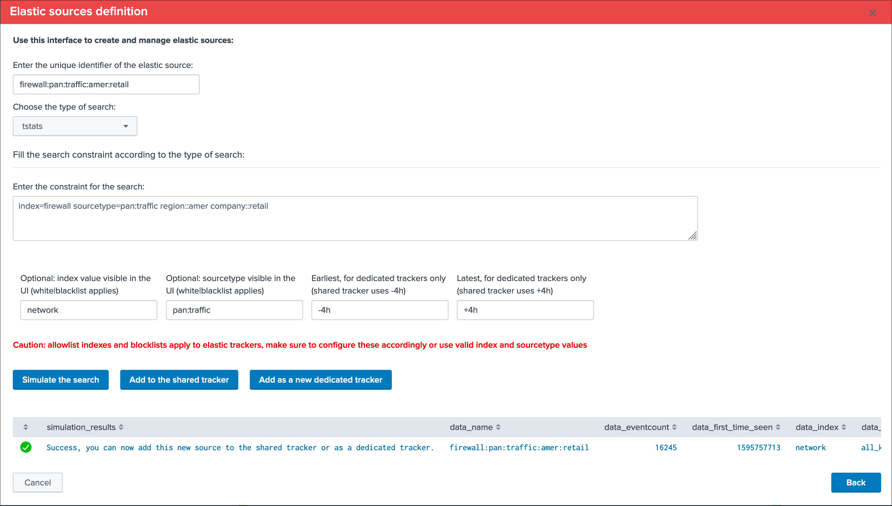

**Once again this is looking perfectly good, this time we will create a dedicated tracker:**

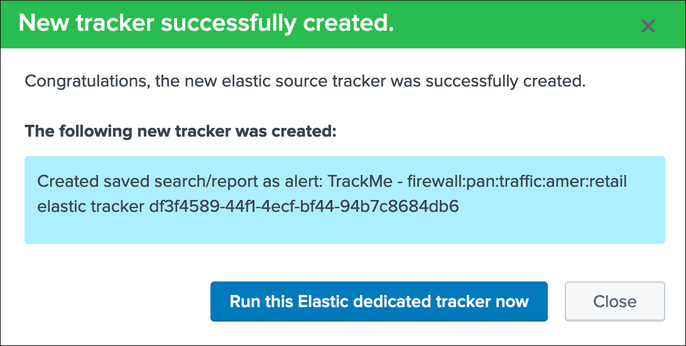

**Nice, let's click on the run button now, and repeat the operation for all entities!**

**Once we did and created all the six entities, we can see the following in the data sources tab:**

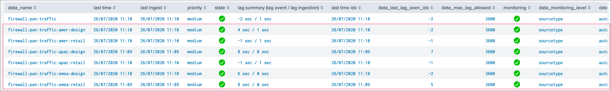

As we did earlier in the example 1, we will simply disable the original data source which is not required anymore.

**Finally, because we created dedicated trackers, let's have a look at the reports:**

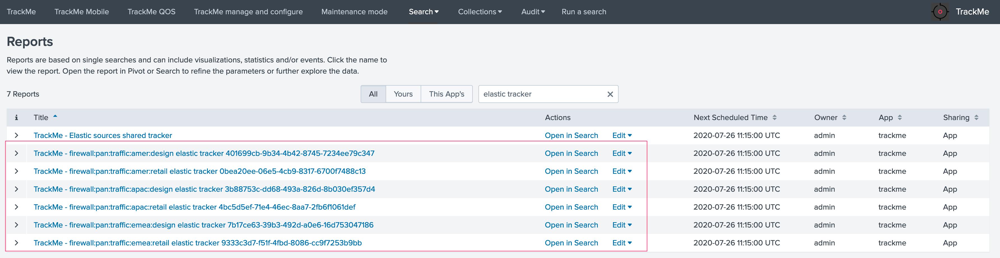

We can see that TrackMe has created a new scheduled report for each entity we created, it is perfectly possible to edit these reports up to your needs.

Voila, we have now covered two complete examples of how and why creating Elastic Sources, there are many more use cases obviously and each can be very specific to your context, therefore we covered the essential part of the feature.

Elastic source example 3: creation
----------------------------------

*Let's create our lookup based Elastic Source, for this we rely on the Splunk from search command capabilities to handle lookup, and we potentially define additional statements to set the _time and _indextime (if any)*

Litteraly, we are going to use the following SPL search to achieve our target:

::

   | from lookup:acme_assets_cmdb | eval _time=strftime(lookupLastUpdated, "%s")

If our lookupLastUpdated would have been in a human readable format, we could have used the stptime function to convert it into an epoch time, for example:

::

   | from lookup:acme_assets_cmdb | eval _time=strptime(lookupLastUpdated, "%d/%m/%Y %H:%M:%S")

*Applied to TrackMe in the Elastic Sources UI creation:*

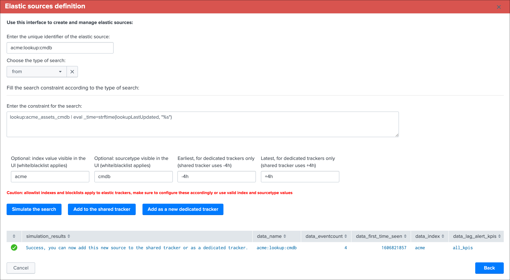

Notes:

- The "from " key word is not required and will be subsititued by TrackMe automatically (once you selected from in the dropdown)
- earliest and latest do not matter for a lookup, so you can leave these with their default values
- The index and sourcetype are only used for UI filtering purposes, so you can define the values up to your preference
- Depending on the volume of records in the lookup and the time taken by Splunk to load its content, you may consider using the shared tracker mode, or a dedicated tracker for longer execution run times

*Once the Elastic Source has been created, and we ran the tracker:*

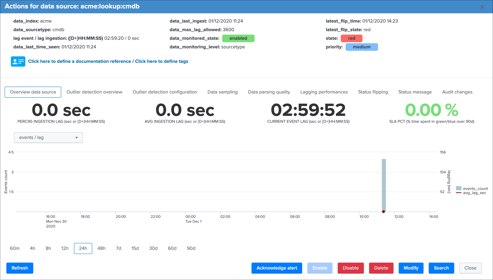

As we can see in the screen above, the data source appears in red state because it has more than an hour since the update of the lookup, and we haven't yet defined a policy.

This however validates that TrackMe is able to define a state based on our criterias very easily, and track the latest update from the lookup.

Finally, we would define a proper setting for the maximal lagging value, as our lookup example is updated once daily, we could define 90000 seconds to allow 1 day and 1 hour before triggering an alert:

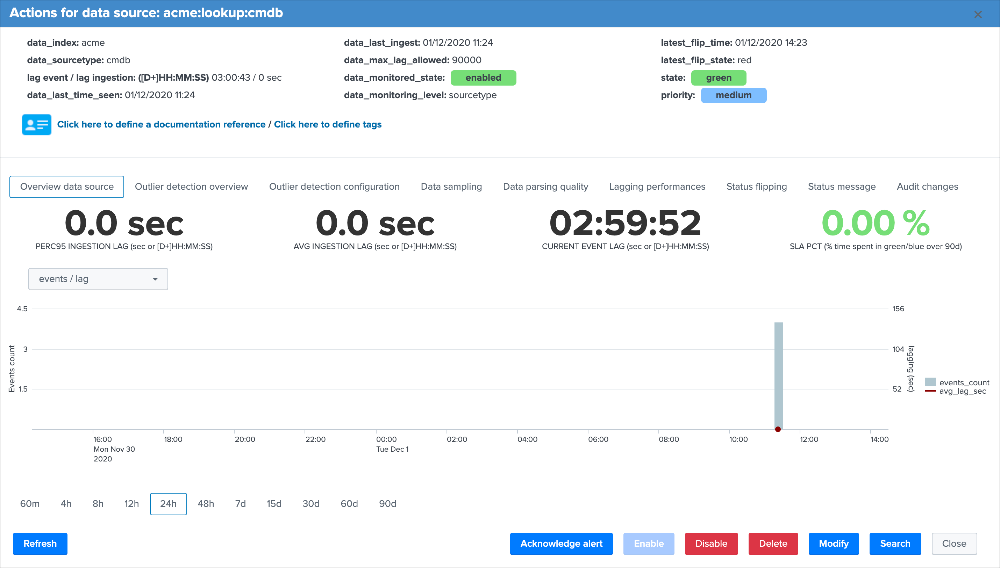

As we can see, the current lagging corresponds to the difference between now and the latest update of the lookup, TrackMe will immediately starts to compute all metrics, the event count corresponds to the number of records (which allows the usage of outliers detection too), etc.

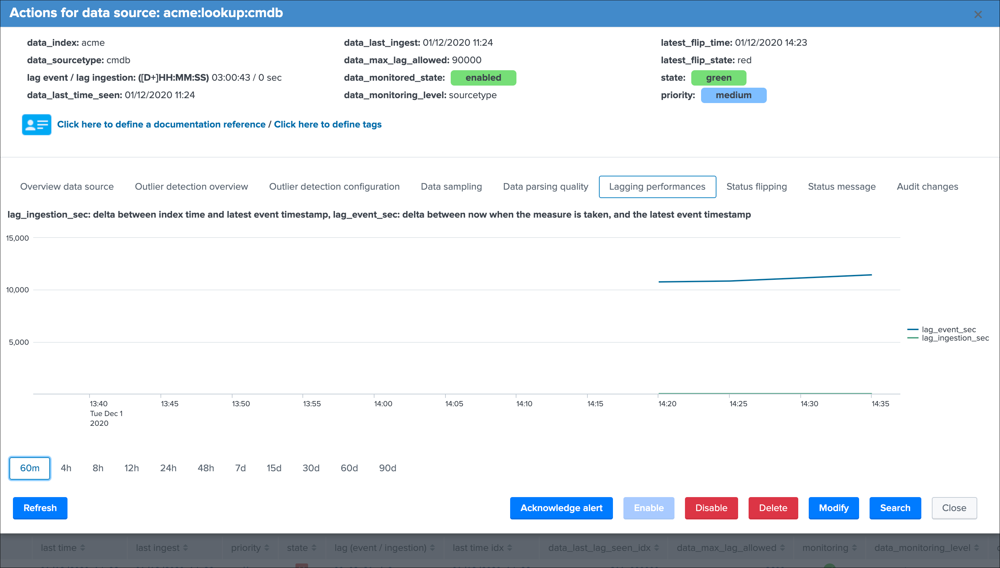

Elastic source example 4: creation
----------------------------------

As explained in the example 4 description, we can use a rest based search to monitor any data that is not available to the search head host TrackMe, let's consider the example a lookup hosted on a different search head.

On the search head that owns the lookup, we can use the following query:

::

   | from lookup:acme_assets_cmdb | eval _time=strftime(lookupLastUpdated, "%s")

Using a rest search, we will achieve the same job but this time remotely via a rest call to a search endpoint of the Splunk API using the rest command, the Elastic Source search syntax will be the following:

::

   splunk_server="my_search_head" | from lookup:acme_assets_cmdb | eval _time=strftime(lookupLastUpdated, "%s")

The first pipe needs to contain the arguments passed to the rest command, the only mandatory argument is either ``splunk_server`` to target a unique Splunk instance, or ``splunk_server_group`` to target a group of search heads.
As well, any additional agrument can be given to the rest command by ading these in the first pipe of the search constraint. (timeout, count, etc)

.. tip:: 

   - The Splunk server name needs to be between double quotes, ex: splunk_server="my_search_head"
   - In this example of a lookup, the knowledge objects needs to be shared properly such that it is available to be accessed via the rest API

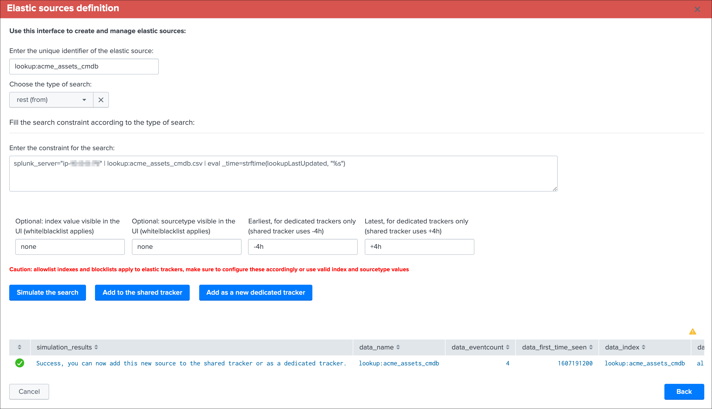

.. warning:: Currently the rest command generates a warning message "Unable to determine response format from HTTP Header", this message can be safety ignored as it does not impact the results in anyway, but cannot unfortunately be removed at the moment, until it is fixed by Splunk. 

Once the Elastic Source has been created, it will appear as for any other sources, example:

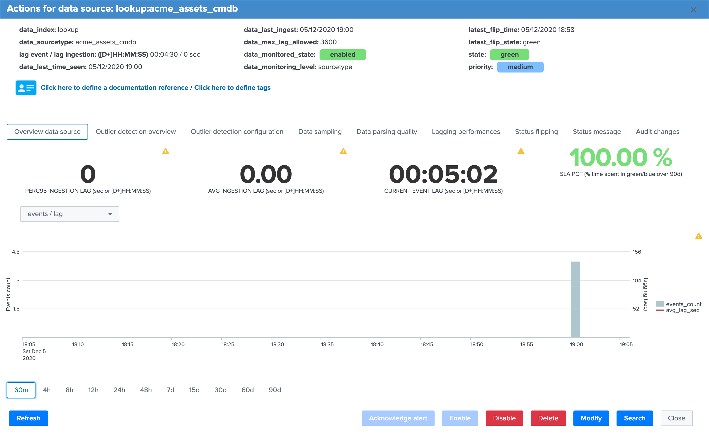

In the example of a lookup, the Search button would result in the following:

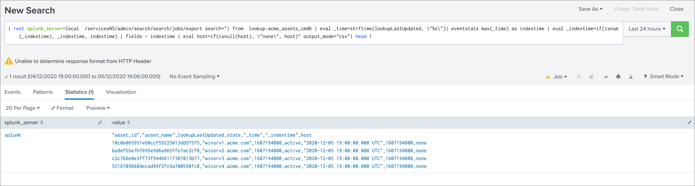

Elastic sources under the hood
------------------------------

**Some additional more technical details:**

Elastic sources shared
^^^^^^^^^^^^^^^^^^^^^^

Each elastic source definition is stored in the following KVstore based lookup:

``trackme_elastic_sources``

Specially, we have the following fields:

- ``data_name`` is the unique identifier
- ``search_constraint`` is the search constraint
- ``search_mode`` is the search command to be used
- ``elastic_data_index`` is the value for the index to be shown in the UI
- ``elastic_data_sourcetype`` is the value for the sourcetype to be show in the UI

When the Elastic Source shared tracker runs:

``TrackMe - Elastic sources shared tracker``

It calls a special saved search ``| savedsearch runSPL`` which expects in argument any number of SPL searches to be performed.

The tracker loads each record stored in the collection, and uses different evaluations to compose the final SPL search for each record.

Finally, it calls different shared knowledge objects that are commonly used by the trackers:

- Apply the TrackMe different macros and functions to calculate things like the lagging metrics, etc
- Calls all knowledge objects from TrackMe which insert and update the KVstore lookup, generate flipping status events, generate and records the metrics in the metric store

Besides the fact that Elastic sources appears in the data sources tab, there are no interactions between the data source trackers and the shared Elastic source trackers, there are independents.

In addition, the collection is used automatically by the main interface if you click on the ``Search`` button to generate the relevant search to access the events related to that entity.

Elastic sources dedicated
^^^^^^^^^^^^^^^^^^^^^^^^^

Each elastic source definition is stored in the following KVstore based lookup:

``trackme_elastic_sources_dedicated``

Specially, we have the following fields:

- ``data_name`` is the unique identifier
- ``search_constraint`` is the search constraint
- ``search_mode`` is the search command to be used
- ``elastic_data_index`` is the value for the index to be shown in the UI
- ``elastic_data_sourcetype`` is the value for the sourcetype to be show in the UI

When the dedicated Elastic source tracker runs, the following applies:

- The report contains the structured search syntax that was automatically built by the UI when it was created
- The report calls different knowledge objects that are common to the trackers to insert and update records in the KVstore, generate flipping status records if any and generate the lagging metrics to be stored into the metric store

Besides the fact that Elastic sources appears in the data sources tab, there are no interactions between the data source trackers and the dedicated Elastic source trackers, there are independents.

In addition, the collection is used automatically by the main interface if you click on the ``Search`` button to generate the relevant search to access the events related to that entity.

Outliers detection and behaviour analytic
=========================================

.. admonition:: Outliers detection feature

   Outliers detection provides a workflow to automatically detect and alert when the volume of events generated by a source goes beyond or over a usual volume determined by analysing the historical behaviour.

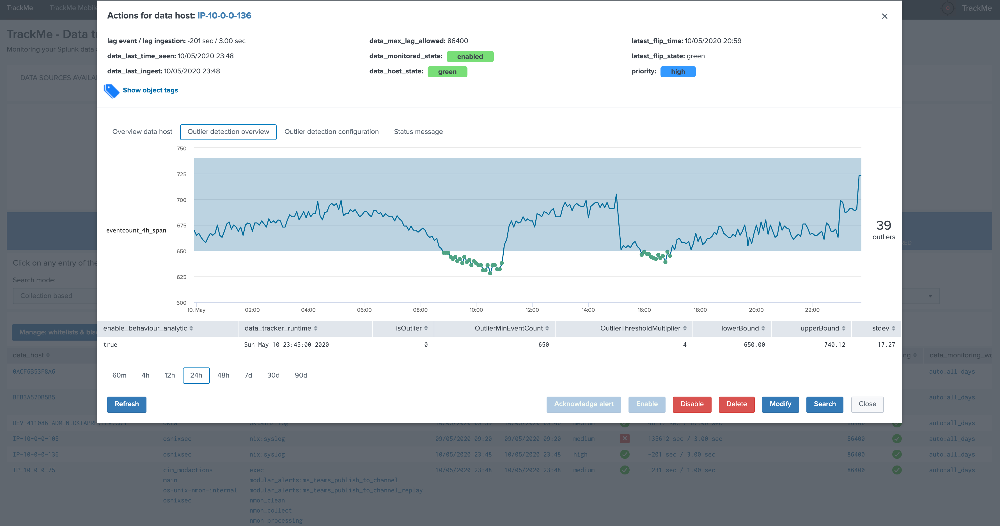

**How things work:**

- Each execution of the data trackers generates summary events which are indexed as summary data in the same time that the KVstore collections are updated
- These events are processed by the Summary Investigator tracker which uses a standard deviation calculation based approach from the Machine Learning toolkit
- We process standard deviation calculations based on a 4 hours event count reported during each execution of the data trackers
- The Summary Investigator maintains a KVstore lookup which content is used as a source of enrichment by the trackers to define essentially an "isOutlier" flag
- Should outliers be detected based on the policy, which is customisable om a per source basis, the source will be reported in alert
- Different options are provided to control the quality of the outliers calculation, as controlling lower and upper threshold multipliers, or even switching to a static lower bond definition
- Built-in views provide the key feature to quickly investigate the source in alert and proceed to further investigations if required

Behaviour Analytic Mode
-----------------------

**By default, the application operates in Production mode, which means that an outlier detection occurring over a data source or host will influence its state effectively.**

**The behaviour analytic mode can be switched to the following status:**

- production: affects objects status to the red state
- training : affects objects status to the orange state
- disabled: does nothing

**The mode can be configured via UI in the "TrackMe manage and configure" link in the navigation bar:**

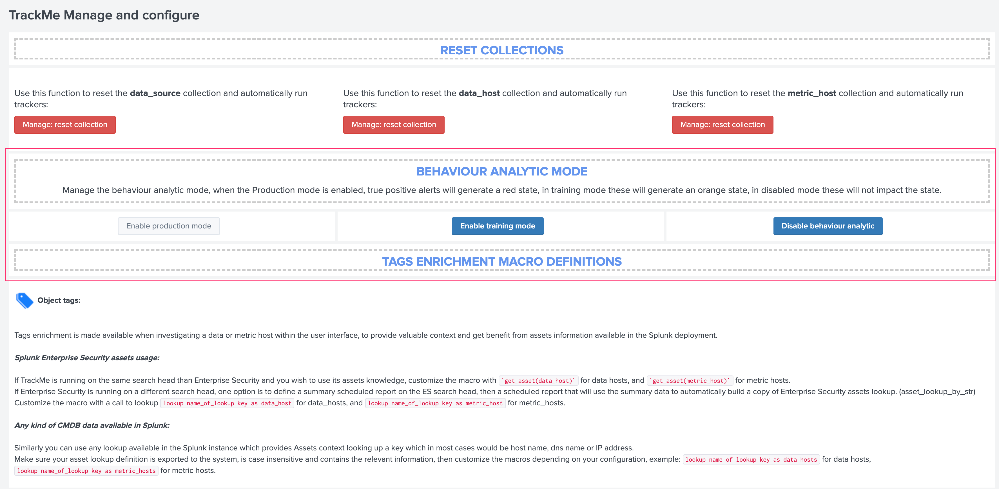

Using Outliers detection
------------------------

**By default, the outlier detection is automatically activated for each data source and host, use the Outliers Overview tab to visualize the status of the Outliers detection:**

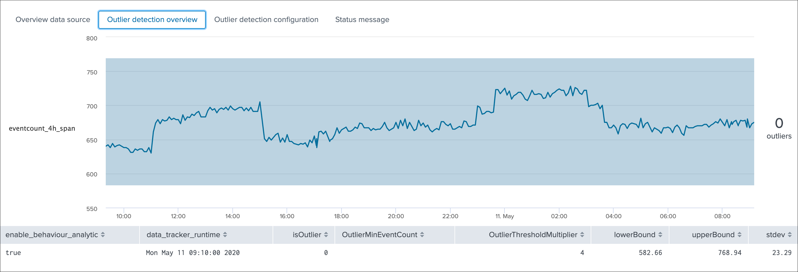

**The table exposes the very last result from the analysis:**

+--------------------------------------------+--------------------------------------------------------------------------------------------------------+
| field                                      |                     Purpose                                                                            |
+============================================+========================================================================================================+
| enable outlier                             | defines if behaviour analytic should be enabled or disabled for that source (default to true)          |
+--------------------------------------------+--------------------------------------------------------------------------------------------------------+
| alert on upper                             | defines if outliers detection going over the upper calculations (default to false)                     |
+--------------------------------------------+--------------------------------------------------------------------------------------------------------+
| data_tracker_runtime                       | last run time of the Summary Investigator tracker which defines the statuses of Outliers detection     |
+--------------------------------------------+--------------------------------------------------------------------------------------------------------+
| isOutlier                                  | main flag for Outlier detection, 0=no Outliers detected, 1=Outliers detected                           |
+--------------------------------------------+--------------------------------------------------------------------------------------------------------+
| OutlierMinEventCount                       | static lower bound value used with static mode, in dynamic mode this is not set                        |
+--------------------------------------------+--------------------------------------------------------------------------------------------------------+
| lower multiplier                           | default to 4, modifying the value influences the lower bound calculations based on the data            |
+--------------------------------------------+--------------------------------------------------------------------------------------------------------+
| upper multiplier                           | default to 4, modifying the value influences the upper bound calculations based on the data            |
+--------------------------------------------+--------------------------------------------------------------------------------------------------------+
| lowerBound/upperBound                      | exposes latest values for the lower and upper bound                                                    |
+--------------------------------------------+--------------------------------------------------------------------------------------------------------+
| stddev                                     | exposes the latest value for the standard deviation calculated for that source                         |
+--------------------------------------------+--------------------------------------------------------------------------------------------------------+

Simulating and adjusting Outliers detection
-------------------------------------------

**Use the Outliers detection configuration tab to run simulations and proceed to configuration adjustments:**

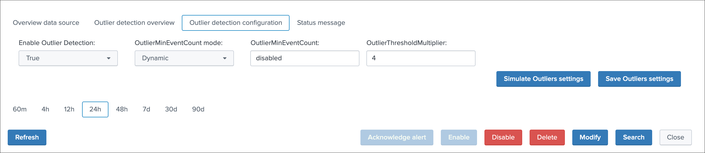

**For example, you can increase the value of the threshold multiplier to improve the outliers detection in regard with your knowledge of this data, or how its distribution behaves over time:**

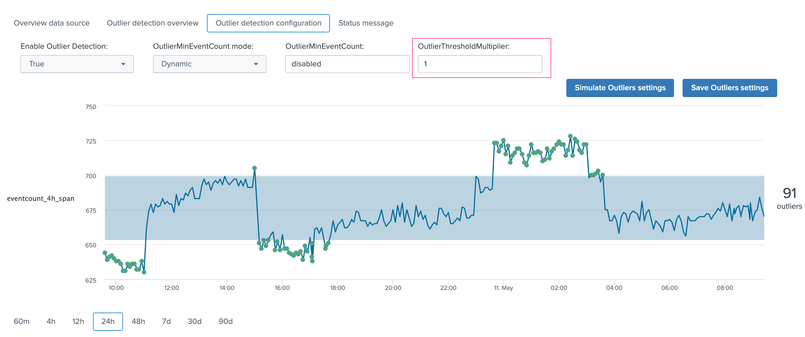

**As well, in some cases you may wish to use a static lower bound value, if you use the static mode, then the outlier detection for the lower band is not used anymore and replaced by this static value as the minimal number of events:**

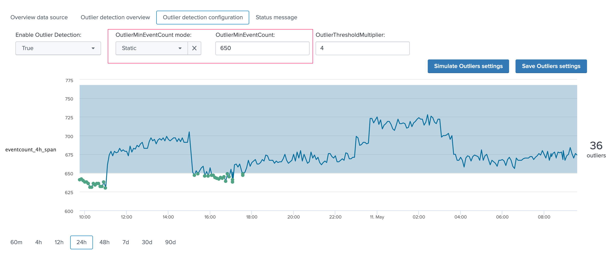

**Upper bound outliers detection does not affect the alert status by default, however this option can be enabled and the threshold multiplier be customised if you need to detect a large increase in the volume of data generated by this source:**

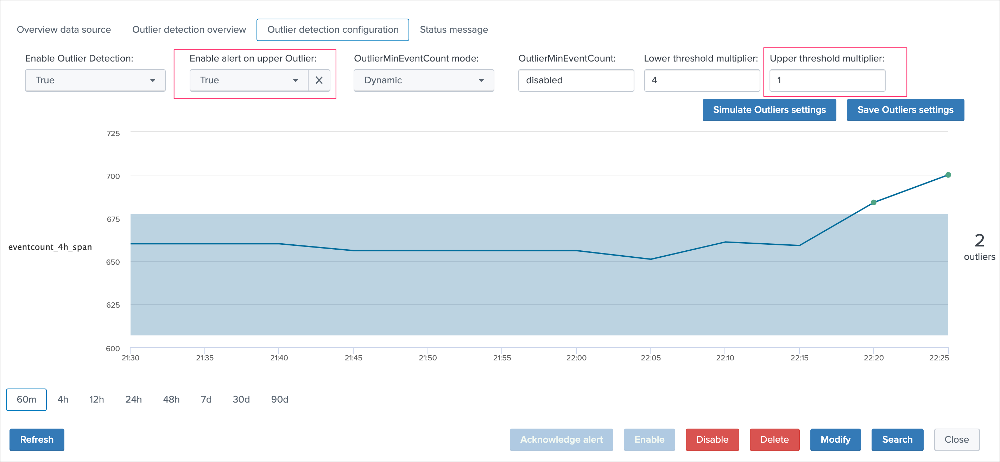

Saving the configuration
------------------------

**Once you have validated the results from the simulation, click on the save button to immediately record the values to the KVstore collection.**

When the save action is executed, you might need to wait a few minutes for it to be reported during the next execution of the Summary Investigator report.

Data sampling and event formats recognition
===========================================

.. admonition:: Data sampling and event format recognition

   The Data sampling and event format recognition feature is a powerful automated workflow that provides the capabilities to monitor the raw events formats to automatically detect anomalies and misbehaviour at scale.

**You access to the data sample feature on a per data source basis via the data sample tab:**

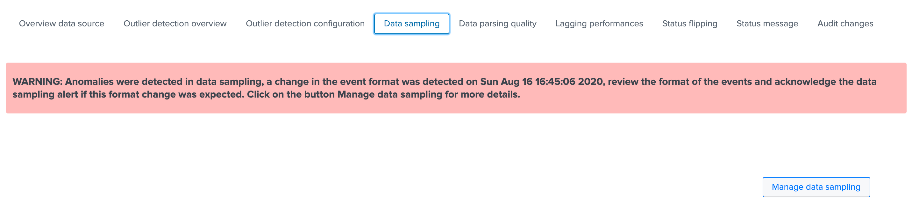

**How things work:**

- The scheduled report named ``TrackMe - Data sampling and format detection tracker`` runs by default every 15 minutes
- The report uses a builtin function to determine an ideal number of data sources to be processed according to the total number of data sources to be processed, and the historical performance of the search (generates a rate per second extrapolated to limit the number of sources to be processed)
- For each data source to be processed, a given number of raw events is sampled and stored in a KVstore collection named ``trackme_data_sampling``
- The number of raw events to be sampled depends on wether the data source is handled for the first time (discovery), or if it is a normal run
- On each sample per data source, the engine processes the events and applies custom rules if any, then builtin rules are processed
- Depending on the conditions, a status and additional informational fields are determined and stored in the lookup collection
- The status stored as the field ``isAnomaly`` is loaded by the data sources trackers and taken into account for the global data source state analysis

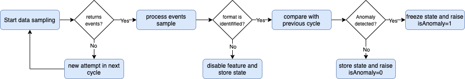

Summary statuses
----------------

**The data sampling message can be:**

- ``green:`` if no anomalies were detected
- ``blue:`` if the data sampling did not handle this data source yet
- ``orange:`` if conditions do not allow to handle this data source, which can be multi-format detected at discovery, or no identifiable event formats (data sampling will be deactivated automatically)
- ``red:`` if anomalies were detected by the data engine, anomalies can be due to a change in the event format, or multiple events formats detected post discovery

*Green state: no anomalies were detected, data sampling ran and is enabled*

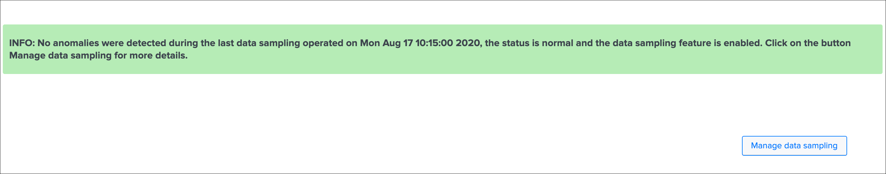

*Blue state: data sampling engine did not processed this data source yet*

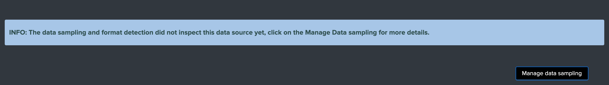

*Orange state: data sampling was disabled due to events format recognition conditions that would not allow to manage this data properly (multiformat, no event formats identification possible)*

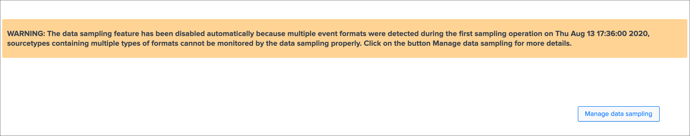

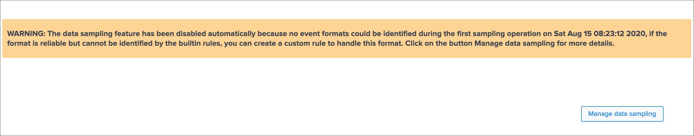

*Red state: anomalies were detected*

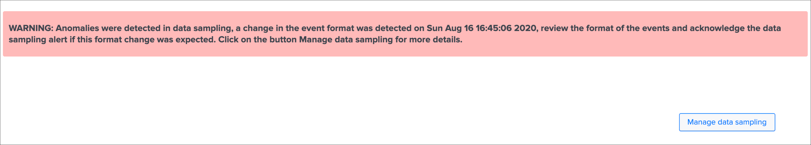

Manage data sampling
--------------------

**The Manage data sampling button provides access to functions to review and configure the feature:**


**The summary table shows the main key information:**

- ``data_sample_feature:`` is the data sampling feature enabled or disabled for that data source, rendered as an icon
- ``current_detected_format:`` the event format that has been detected during the last sampling
- ``previous_detected_format:`` the event format that was detected in the previous sampling
- ``state:`` the state of the data sampling rendered as an icon
- ``anomaly_reason:`` the reason why an anomaly is raised, or "normal" if there are no anomalies
- ``multiformat:`` shall more than one format of events be detected (true / false)
- ``mtime:`` the latest time data sampling was processed for this data source

View latest sample events
^^^^^^^^^^^^^^^^^^^^^^^^^

This button opens in the search UI the last sample of raw events that were processed for this data source, the search calls a macro which runs the events format recognitions rules as:

::

   | inputlookup trackme_data_sampling where data_name="<data_name>" | fields raw_sample | mvexpand raw_sample | `trackme_data_sampling_abstract_detect_events_format`

This view can be useful for trouble shooting purposes to determine why an anomaly was raised for a given data source.

View builtin rules
^^^^^^^^^^^^^^^^^^

This button opens a new view that exposes the builtin rules used by TrackMe, and the order in which rules are processed:

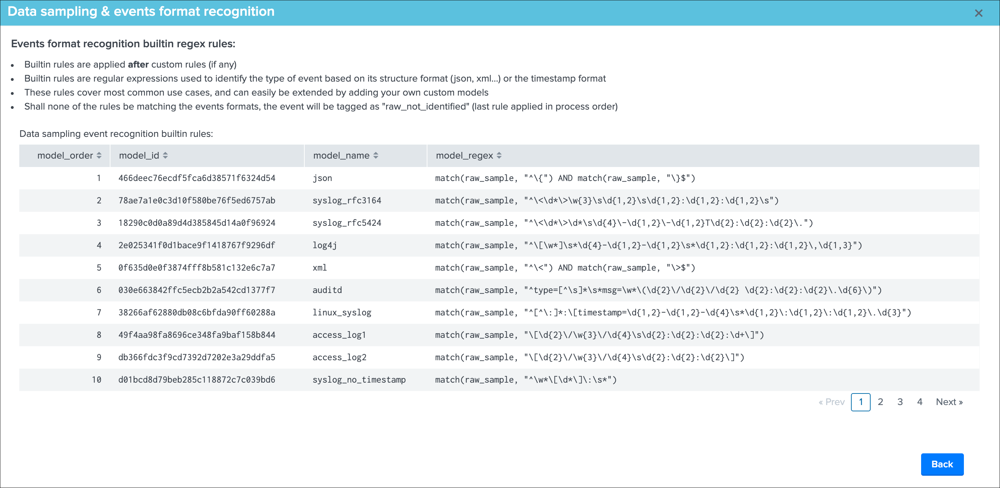

Builtin rules should not be modified, instead use custom rules to handle event formats that would not be properly identified by the builtin regular expression rules.

Manage custom rules
^^^^^^^^^^^^^^^^^^^

Custom rules provides a workflow to handle any custom sourcetypes and event formats that would not be identified by TrackMe, by default there are no custom rules and the following screen would appear:

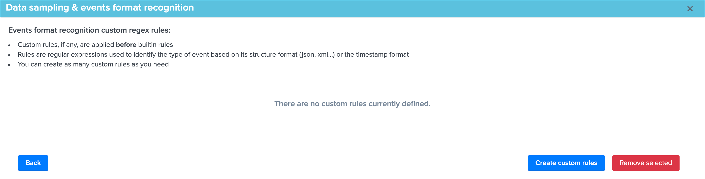

This view allows you to create a new custom rule (button Create custom rules) or remove any existing custom rules that would not be required anymore. (button Remove selected)

.. tip:: Since the version 1.2.26, it is possible to restrict the scope of custom rules to a list of explicit sourcetypes.

**Create custom rules**

This screen alows to test and create a new custom rule based on the current data source:

*Note: While you create a new custom rule via a specific data source, custom rules are applied to all data sources*

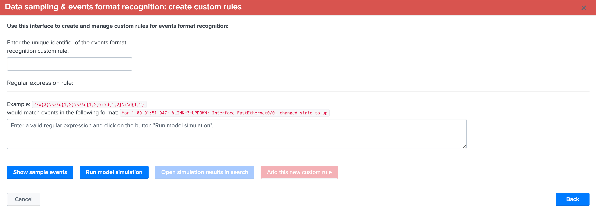

To create a new custom rule:

- Enter a name for the format, this name is a string of your choice that will be used to idenfity the format, it needs to be unique for the entire custom source collection and will be converted into an md5 hash automatically
- Enter a valid regular expression that uniquely identifies the events format
- Optionally restrict the scope of application by sourcetype, you can specify one or more sourcetypes under the form of a comma separated list of values
- Click on "Run model simulation" to simulate the exectution of the new models
- Optionnaly click on "Show sample events" to view a mini sample of the events within the screen
- Optionnaly click on ""Open simulation results in search" to open the details of the rules processing per event in the search UI
- Finally if the status of the simulation is valid, click on "Add this new custom rule" to permanently add this new custom rule

*Example:*

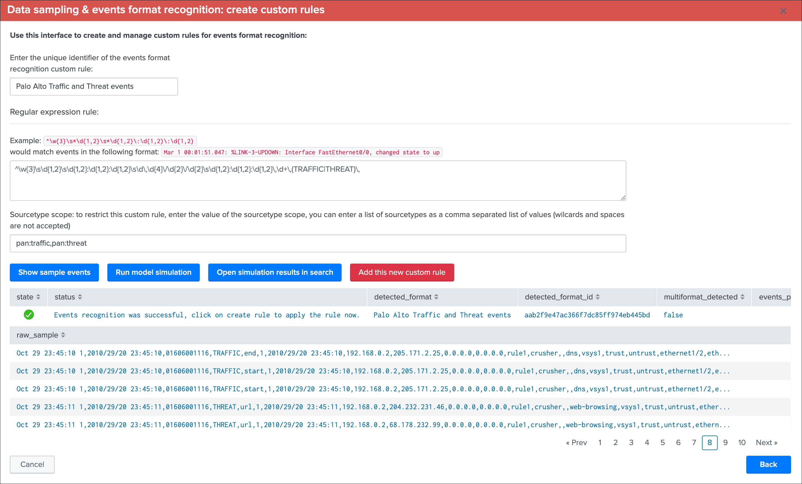

Once you have created a new custom rule, this rule will be applied automatically to future executions of the data sampling engine:

- If the format switches from a format idenfitied by the the builtin rules to a format identified by a custom rule, it will not appear in anomaly
- You can optionally clear the state of the data sampling for that data source to clean any previous states and force a new discovery

**Remove custom rules**

Once there is at least one custom rule defined, the list of custom rules appears in the table and can be selected for suppression:

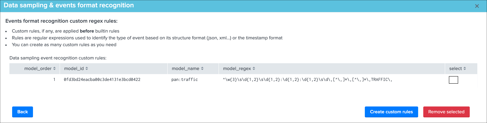

When a custom rule is removed, future executions of the data sampling engine will not consider the rule deleted anymore, optionally you can run the data sampling engine now or clear the state for a data source.

Custom rules are stored in a KVstore collection which can as well be manually edited if you need to update an exising rule, or modify the order in which rules are processed:

::

   trackme_data_sampling_custom_models

Run sampling engine now
^^^^^^^^^^^^^^^^^^^^^^^

Use this function to force running the data sampling engine now against this data source, this will not force a new discovery and will run the data sampling engine normally. (the current status is preserved)

*When to use the run sampling engine now?*

- You can can run this action at anytime and as often as you need, the action runs the data sampling engine for that data source only
- This action will have no effect if an anomaly was raised for the data source already, when an anomaly is detected the status is frozen (see Clear state and run sampling)

Clear state and run sampling
^^^^^^^^^^^^^^^^^^^^^^^^^^^^

Use this function to clear any state previously determined, this forces the data source to be considered as it was the first time it was investigated by the data sampling engine. (a full sampling is processed and there are no prior status taken into account)

*When to use the clear state and run sampling?*

- Use this action to clear any known states for this data source and run the inspection from zero, just as if it was discovered for the first time
- You can use this action to clear an anomaly that was raised, when an alert is raised by the data sampling, the state is frozen until this anomaly is reviewed, once the issue is understood and fixed, run the action to clear the state and restart the inspection workflow for this data source

Data sampling Audit dashboard
-----------------------------

An audit dashboard is provided in the audit navigation menu, this dashboard provides insight related to the data sampling feature and workflow:

*Menu Audit / TrackMe - Data sampling and events formats recognition audit*

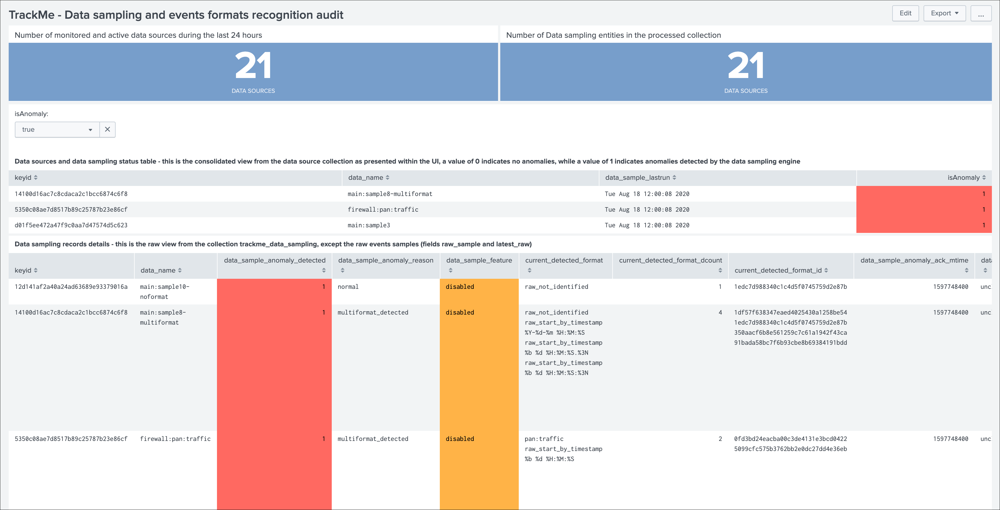

Priority management
===================

Priority levels
---------------

.. admonition:: Priority

   TrackMe has a notion of priority for each entity, you can view the priority value in any of the tables from the main interface, in the header when you click on a given entity, and you can modify it via the unified modification UI.

There 3 level of priorities that can be applied:

- ``low``
- ``medium``
- ``high``

Priority feature
----------------

The purpose of the priority is to provide more granularity in the way you can manage entities.

First, the UI exposes the current status depending on the priority of the entities:

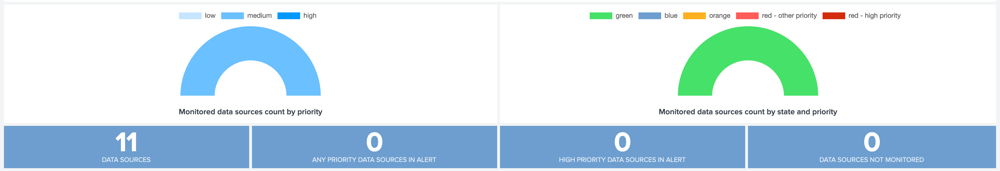

As well, the priority can be easily filtered:

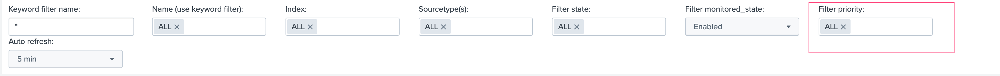

The priority is visible in the table too:

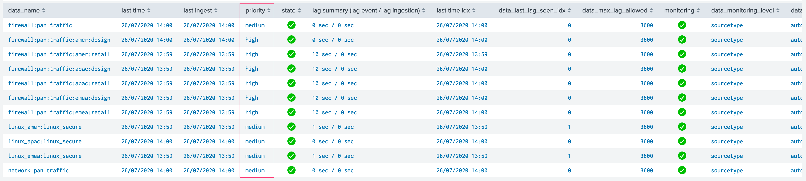

When clicking on an entity, the priority is shown on top with a blue colour scheme that starts from light blue for low, blue for medium and darker blue for high:

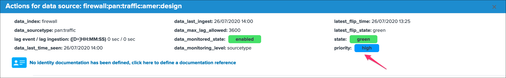

The default priority assigned is "medium" and managed by the following macro:

- ``trackme_default_priority``

Out of the box alerts filter automatically on certain types of priorities, by default ``medium`` and ``high``, which is managed by the following macro:

- ``trackme_alerts_priority``

Modify the priority
-------------------

**The priority of an entity can be modified in the UI via the unified modification window:**


Bulk update the priority
------------------------

If you wish or need to bulk update or maintain the priority of entities such as the data hosts against a third party lookup, such a thing could be easily performed in a single search.

*Example:*

::

   | inputlookup trackme_host_monitoring | eval key=_key
   | lookup <the third party lookup> data_host as host OUTPUT priority as new_priority | eval priority=if(isnotnull(new_priority), new_priority, priority)
   | outputlookup trackme_host_monitoring append=t key_field=key

This search above for instance would bulk update all matched entities.

Monitored state (enable / disable buttons)
==========================================

.. admonition:: Monitored state

    - Entities have a so called "monitored state", which can be ``enabled`` or ``disabled``.
    - When disabled, an entity disappears from TrackMe UI, will stop being considered for any alert or data generation purposes.

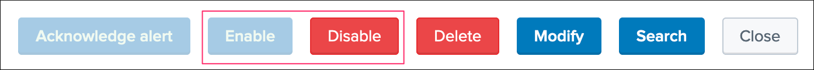

If an entity is set to ``disabled``, it will not appear anymore in the main screens, will not be part of any alert results, and no more metrics will be collected for it.

The purpose of this flag is to allow disabling an entity that is discovered automatically because the scope of the data discovery (allowlist / blocklist) allow it.

Week days monitoring
====================

.. admonition:: Week days monitoring

   You can modify the rules for days of week monitoring, which means specifying for which days of the week an entity will be monitored actively.

*Week days monitoring rules apply to event data only (data sources and hosts)*

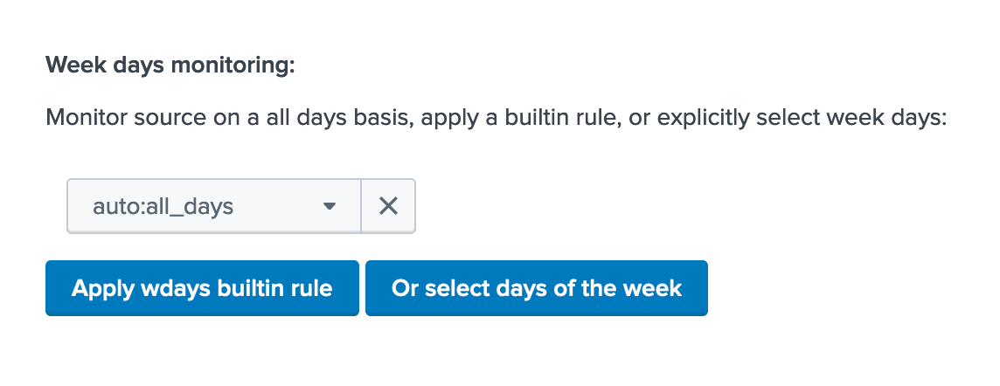

**Several built-in rules are available:**

* manual:all_days
* manual:monday-to-friday
* manual:monday-to-saturday

**Or you can select explicitly which days of the week:**

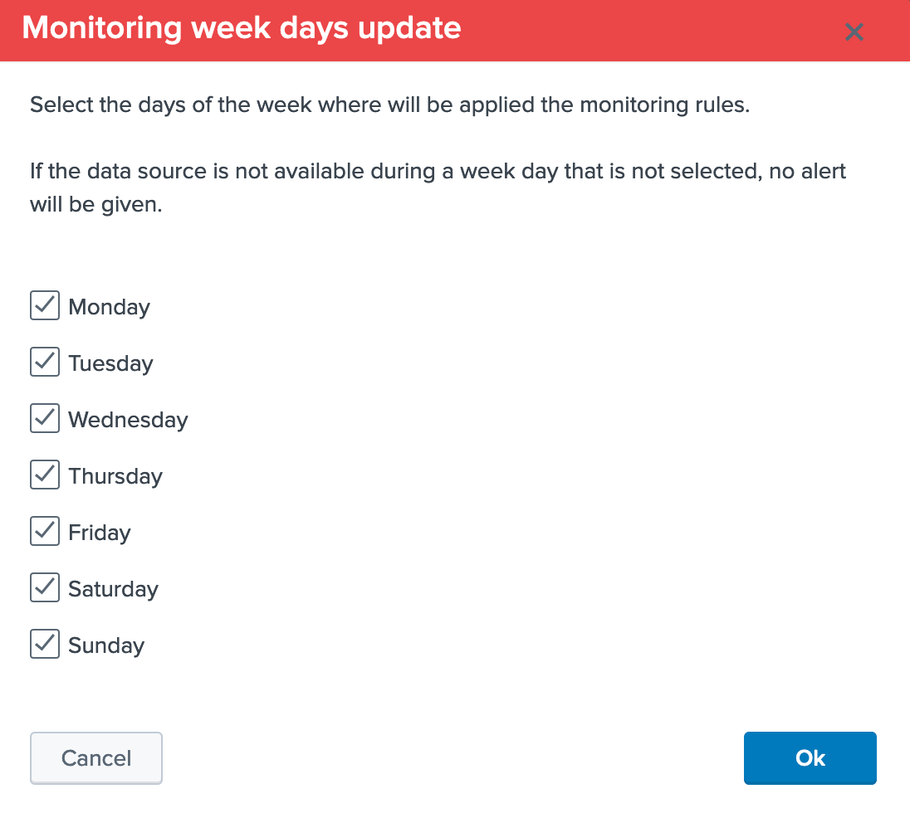

**Which is visible in the table:**

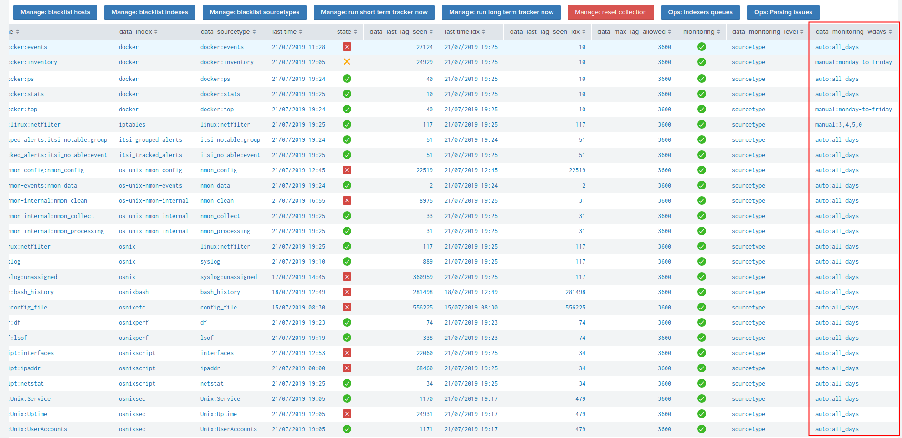

Monitoring level
================

**For data sources, you can define if the monitoring applies on the sourcetype level (default) or the index level:**

.. admonition:: Monitoring level

    - The monitoring level can be defined for a data source to either the ``sourcetype`` level (default) or ``index`` level.
    - When defined against the index, the data source will be considered live until no more data sources generate data in the enitre index hosting the data source.

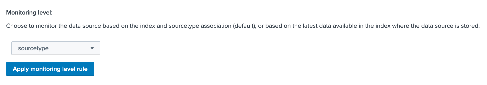

Feature behaviour:

- When the monitoring of the data source applies on the sourcetype level, if that combination of index / sourcetype data does not respect the monitoring rule, it will trigger.
- When the monitoring of the data source applies on the index level, we take in consideration what the latest data available is in this index, no matter what the sourcetype is.

This option is useful for instance if you have multiple sourcetypes in a single index, however some of these sourcetypes are not critical enough to justify raising any alert on their own but these need to remain visible in Trackme for context and troubleshooting purposes.

For example:

- An index contains the sourcetype "mybusiness:critical" and the sourcetype "mybusiness:informational"
- "mybusiness:critical" is set to sourcetype level
- "mybusiness:informational" is set to index level
- "mybusiness:critical" will generate an alert if lagging conditions are not met for that data source 
- "mybusiness:informational" will generate an alert **only** if "mybusiness:critical" monitoring conditions are not met either
- The fact the informational data is not available in the same time than "mybusiness:critical" is a useful information that lets the engineer know that the problem is global for that specific data flow
- Using the index monitoring level for "mybusiness:informational" allows it to be visible in TrackMe without generating alerts on its own as long as "mybusiness:critical" meets the monitoring conditions

Maximal lagging value
=====================

.. admonition:: Lagging value

   The maximal lagging value defines the threshold to be used for alerting when a given entity goes beyond a certain value in seconds, against both lagging KPIs, or since the version 1.2.19 you can choose between different options.

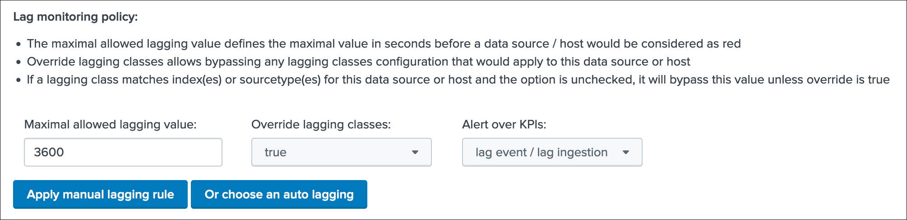

This topic is covered in details in first steps guide :ref:`Main navigation tabs` and :ref:`Unified update interface`.

Lagging classes
======================

.. admonition:: Lagging classes

   - The Lagging classes feature provides capabilities to manage and configure the maximal lagging values allowed in a centralised and automated fashion, based on different factors.
   - A lagging class can be configured based on index names, sourcetype values and the entities priority level. (priority based policies applied to data sources only)
   - Lagging classes apply on data sources and hosts, and classes can be created matching either both types of object, data sources or data hosts only.

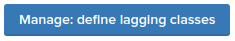

**Lagging classes are controlled by the following main rules:**

- For data sources: lagging classes are applied in the following order: index, sourcetype, priority (first match takes precedence)
- For data hosts: The highest lagging value takes precedence, if multiple sourcetypes, the host global max lag cannot be lower than the highest value between all sourcetypes

.. admonition:: Lagging classes override

   When a lagging class is defined and is matched for a data source or a data host, you can as well override this policy based lagging value by defining a lagging value on the object within the UI and enabling the override option.

Lagging classes behaviour for data sources
------------------------------------------

When a lagging class is configured and defined to apply on data sources (or all), the tracker reports retrieve the lagging class information via enrichment (lookup) and proceed to different conditional operations.

These operations in the case of data sources are proceeded in a specific order as follows:

- 1. index
- 2. sourcetype
- 3. priority

The first operation that matches a value takes precedence over any other value.

For instance, if a lagging class matches the index "network", every data source linked to this index will retrieve the maximal lagging value from the lagging class no matters if any other lagging classes would have matched. (priority for example)

As well, it is possible to override this behaviour and manually control the maximal lagging value for a given data source independently from any lagging class matching, this is configurable by modifying the data source configuration: (Modify button)

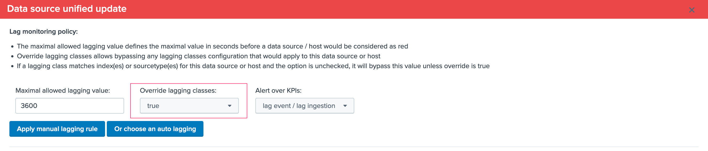


Lagging classes behaviour for data hosts
------------------------------------------

By definition, the data hosts monitoring is a more complex task which involves for a given entity (host) the monitoring of potentially numbers of sub-entities (sourcetypes).

**Main rules for data hosts lagging classes:**

- At first, TrackMe attempts to perform lagging class matching per host and per sourcetype
- For a given sourcetype, the higest lagging value between index based policies and sourcetype based policies is recorded per sourcetype
- Finally, the highest lagging value between all sourcetypes for the host is saved as the general maximal lagging value for the host

**Let's take the following example:**

- host: winsrv1.acme.com
- 3 sourcetypes indexed: XmlWinEventLog, Script:ListeningPorts, WinHostMon

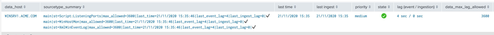

|:arrow_right:| by default, TrackMe applies a 3600 max lagging value per sourcetype and for the overall host

- A new lagging class is created to match the sourcetype ``WinHostMon`` to define a max lagging value of 86400 seconds

|:arrow_right:| Once the tracker report has been executed, the sourcetype maximal laggging value is defined accordingly, and the overall max lagging value of the host is set to the highest value between all sourcetypes monitored:

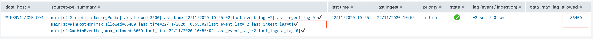

- Now let's create a new lagging class matching the sourcetype ``Script:ListeningPorts`` with a short max lagging class of 300 seconds
- The provider is stopped for the demonstration purposes
- After 5 minutes, the sourcetype appears in anomaly
- If the data hosts alerting policy is defined to track per sourcetype, the host turns red
- If the data hosts alerting policy is defined to track per host, the host remains green until none of the sourcetype have been indexing for at least the overall max lag of the host

**Alerting policy track per sourcetype:**

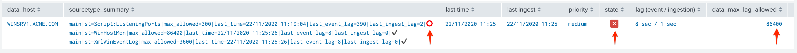

**Alerting policy track per host:**

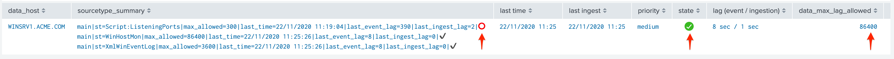

.. admonition:: Lagging classes override

   - TrackMe will use the higher value between all sourcetypes to define the max overall lagging value of the host
   - This value can as well be overriden on a per host basis in the host modification screen, but should ideally be controlled by automated policies based on indexes or sourcetypes

Allowlisting & Blocklisting
===========================

.. admonition:: Allowlisting & Blocklisting

   - TrackMe supports allowlisting and blocklisting to configure the scope of the data discovery.
   - Allowlisting provides a framework to easily restrict the entire scope of TracKme to an explicit list of allowed indexes.
   - Blocklisting provides the opposite feature on a per index / sourcetype / host feature.

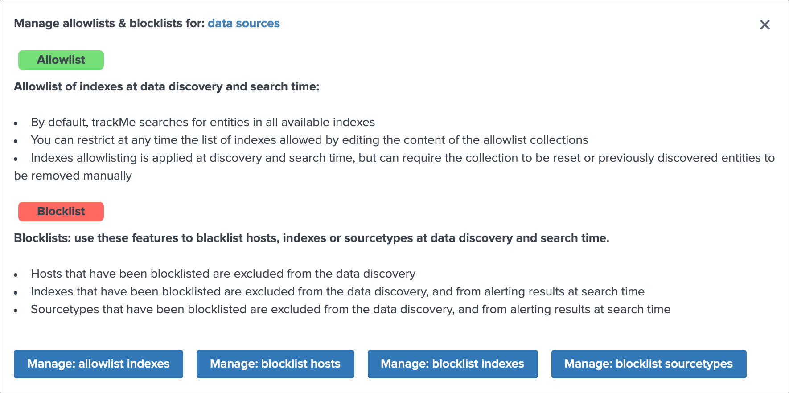

**The default behaviour of TrackMe is to track data available in all indexes, which changes if allowlisting has been defined:**

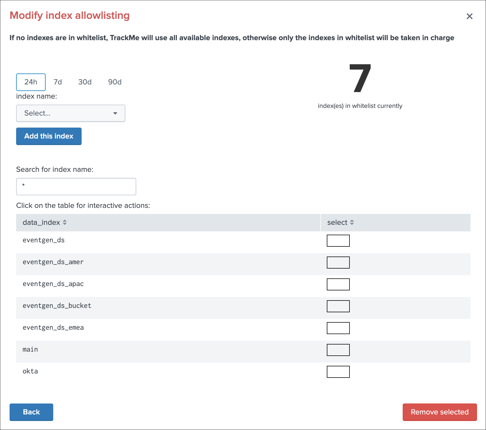

Different level of blocklisting features are provided out of the box, which features can be used to avoid taking in consideration indexes, sourcetypes and hosts.

*The following type of blocklisting entries are supported:**

- explicit names, example: ``dev001``
- wildcards, example: ``dev-*``
- regular expressions, example: ``(?i)dev-.*``

*regular expressions are supported starting version 1.1.6.*

*metric_category blocklisting for metric hosts supports explicit blacklist only.*

**Adding or removing a blocklist item if performed entirely and easily within the UI:**

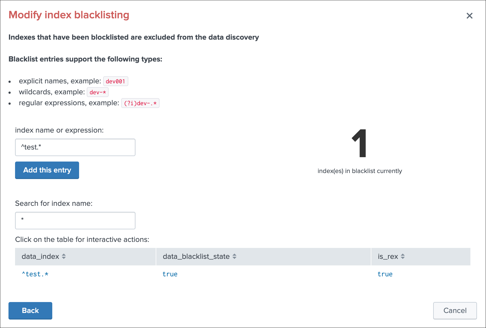

Resetting collections to factory defaults
=========================================

.. warning:: Resetting the collections will entirely flush the content of the data sources / hosts / metric hosts collections, which includes any custom setting that will be have been configured as such as the maximal lagging value.

**The TrackMe Manage and Configure UI provides way to reset the full content of the collections:**

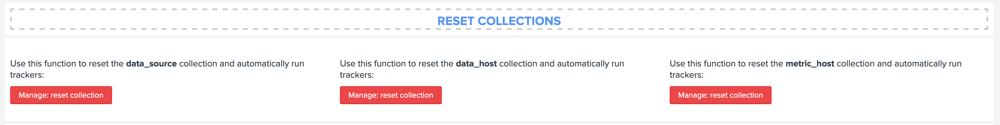

**If you validate the operation, all configuration changes will be lost (like week days monitoring rules changes, etc) and the long term tracker will be run automatically:**

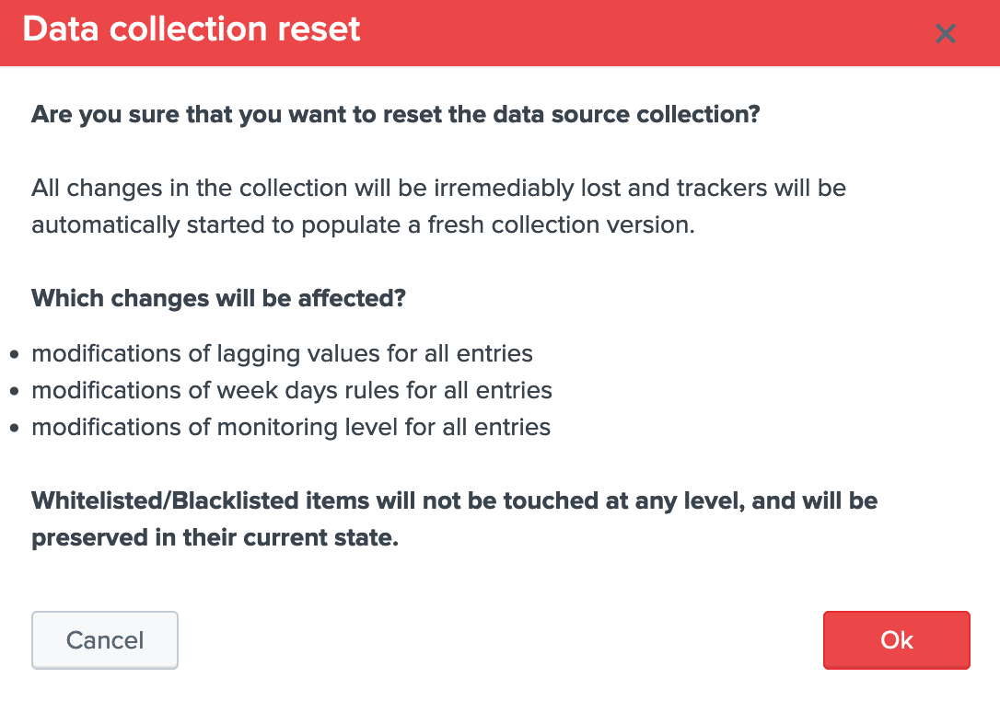

Once the collection has been cleared, you can simply wait for the trackers next executions, or manually perform a run of the short term and/or long term trackers.

Deletion of entities
====================

**You can delete a data source or a data host that was discovered automatically by using the built-in delete function:**

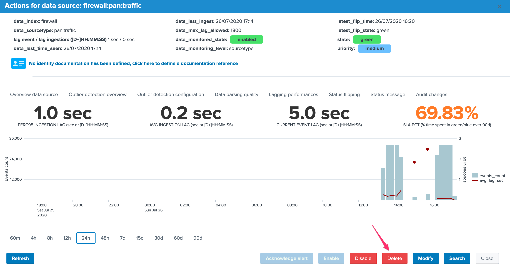

**Two options are available:**

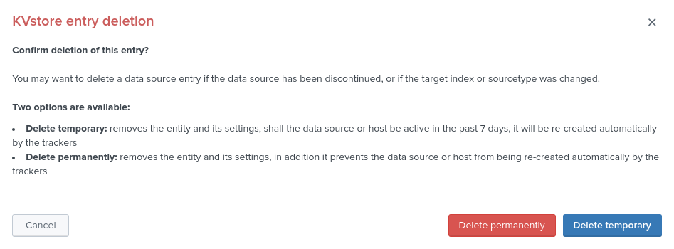

- When the data source or host is temporary removed, it will be automatically re-created if it has been active during the time range scope of the trackers.
- When the data source or host is permanently removed, a record of the operation is stored in the audit changes KVstore collection, which we automatically use to prevent the source from being re-created effectively.

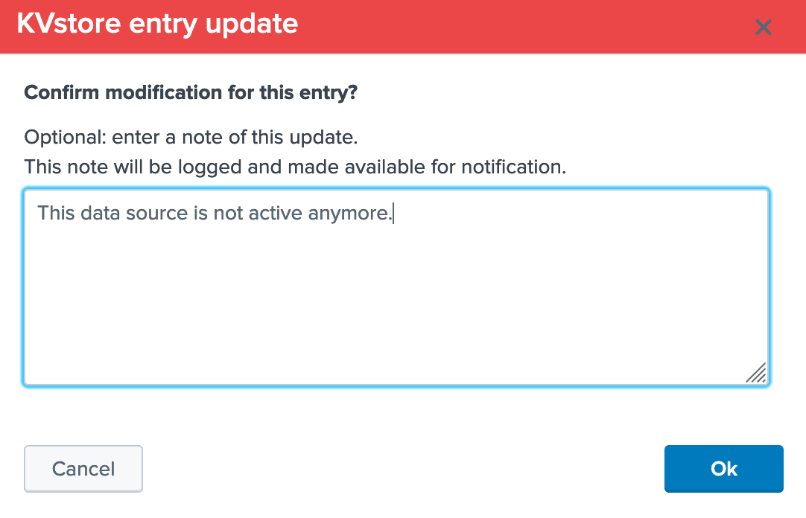

When an entity is deleted via the UI, the audit record exposes the full content of the entity as it was at the time of the deletion:

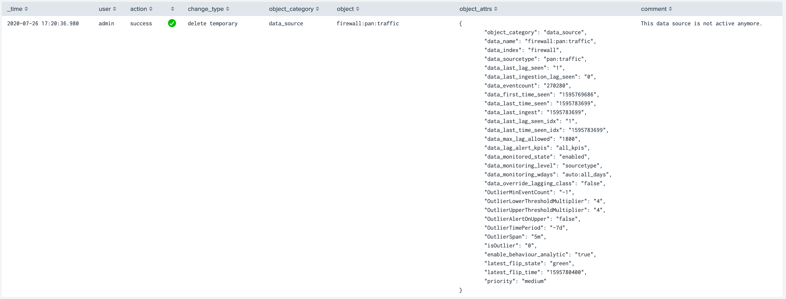

It is not possible at the moment to ``restore`` an entity that was previously deleted, however an active entity can be recreated automatically depending on the scope of the data discovery (the data must be available to TrackMe), and with the help of the audit record you could easily re-apply any settings that would be required.

If an entity was ``deleted permanently`` and you wish to get it recreated, the entity must first be actively sending data, TrackMe must be able to see the data (``allowlist`` and ``blocklist``) and you would need to remove the audit record in the following collection:

- ``trackme_audit_changes``

Once the record has been deleted, the entity will be recreated automatically during the execution of the trackers.

Icon dynamic messages
=====================

**For each type object (data sources / data hosts / metric hosts) the UI shows a status icon which describes the reason for the status with dynamic information:**

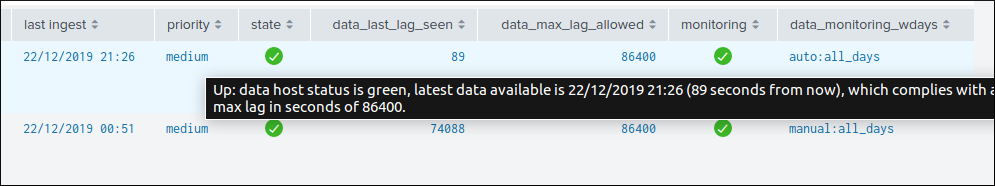

.. image:: img/icon_message2.png
   :alt: icon_message2.png
   :align: center

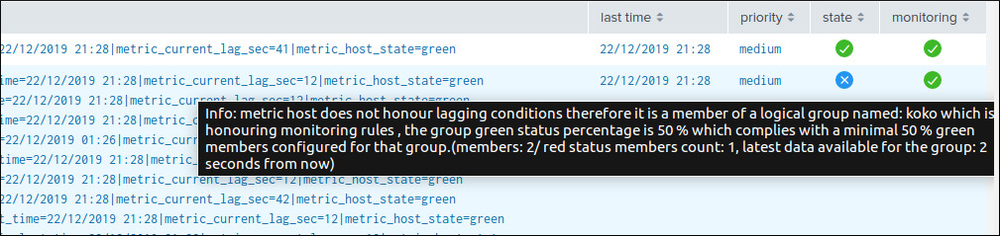

To access to the dynamic message, simply focus over the icon in the relevant table cell, and the Web browser will automatically display the message for that entity.

Logical groups (clusters)
=========================

Logical groups feature
----------------------

.. admonition:: Logical groups

   Logical groups are groups of entities that will be considered as an ensemble for monitoring purposes.

A typical use case is a couple of active / passive appliances, where only the active member generates data.

When associated in a Logical group, the entity status relies on the minimal green percentage configured during the group creation versus the current green percentage of the group. (percentages of members green)

*Notes: Logical groups are available to data hosts and metric hosts monitoring objects.*

Logical group example
---------------------

**Let's have a look at a simple example of an active / passive firewall, we have two entities which form together a cluster.**

Because the passive node might not generate data, we only want to alert if both the active and the passive are not actively sending data.

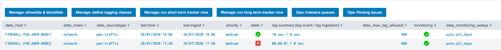

In our example, we have two hosts:

- ``FIREWALL.PAN.AMER.NODE1`` which is the active node, and green in TrackMe
- ``FIREWALL.PAN.AMER.NODE2`` which is the passive node, and hasn't sent data recently enough in TrackMe to be considered as green

**Let's create a logical group:**

For this, we click on the first host, then Modify and finally we click on the Logical groups button:

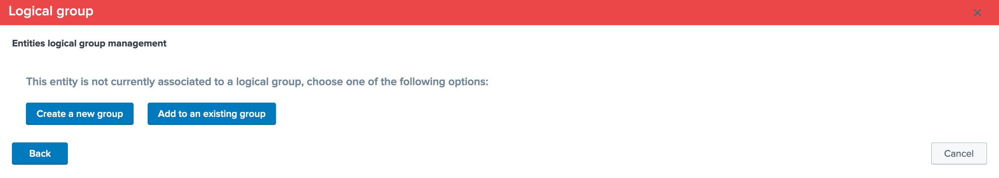

Since we don't have yet a group, let's create a new group:

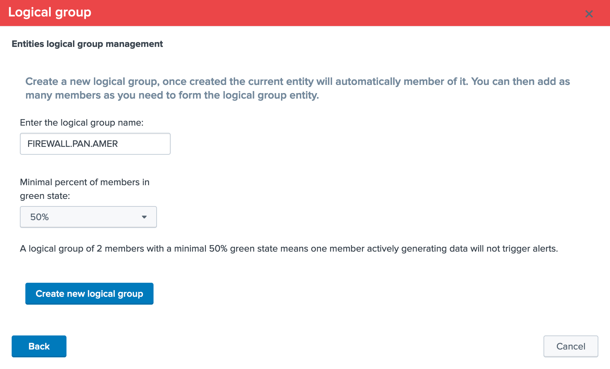

Once the group is created, the first node is automatically associated with the group, let's click on the second node and associate it with our new group:

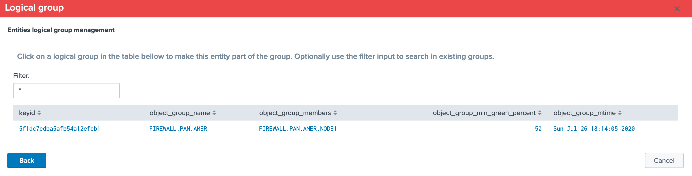

We clicked on the group which we want to associate the entity with, which performs the association automatically, finally we can see the state of the second host has changed from ``red`` to ``blue``:

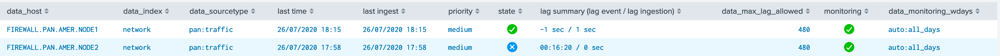

If we click on the entity and check the status message tab, we can observe a clear message indicating the reason of the state including the name of the logical group this entity is part of:

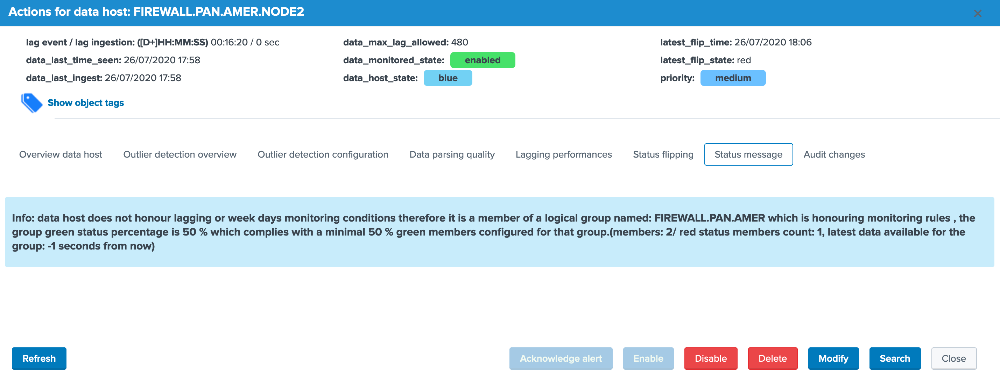

Shall later on the situation be inversed, the active node became passive and the passive became passive, the states will be reversed, since the logical group monitoring rules (50% active) are respected there will not be any alert generated:

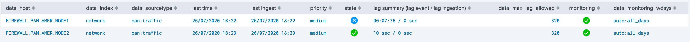

Finally, shall both entities be inactive, their status will be ``red`` and alerts will be emitted as none of these are meeting the logical group monitoring rules:

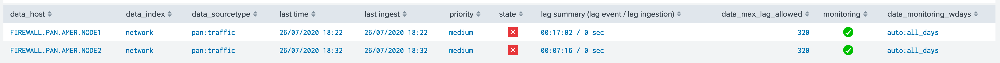

The status message tab would expose clearly the reason of the ``red`` status:

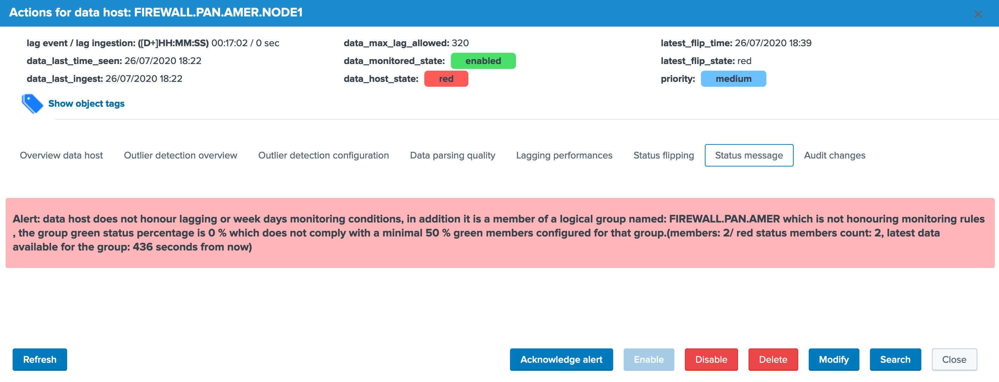

Create a new logical group
--------------------------

To create a new logical group and associate a first member, enter the unified modification window (click on an entity and modify button), then click on the "Manage in a Logical group" button:

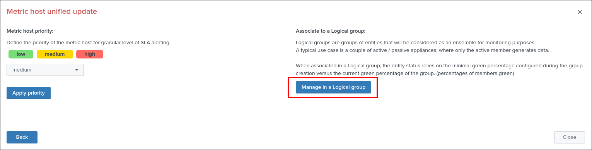

If the entity is not yet associated with a logical group (an entity cannot be associated with more than one group), the following message is displayed:

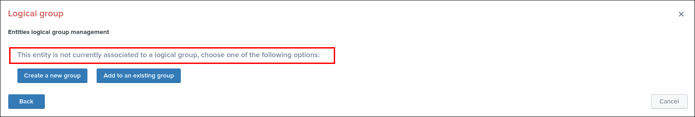

Click on the button "Create a new group" which opens the following configuration window:

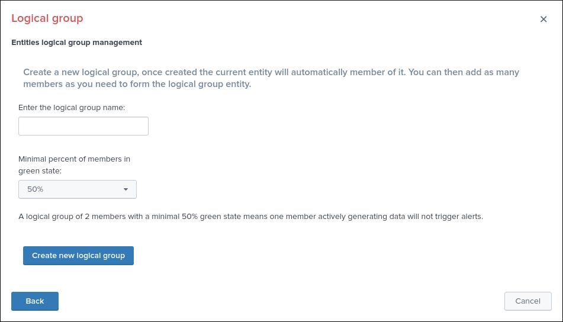

- Enter a name for the logical group (names do not need to be unique and can accept any ascii characters)

- Choose a minimal green percentage for the group, this defines the alerting factor for that group, for example when using 50% (default), a minimal 50% or more of the members need to be green for the logical group status to be green

Associate to an existing logical group
--------------------------------------

If a logical group already exists and you wish to associate this entity to this group, following the same path (Modify entity) and select the button "Add to an existing group":

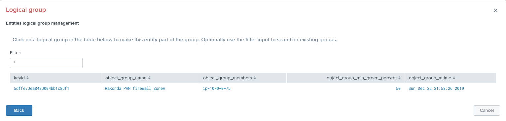

- Optionally use the filter input box to search for a logical group

- Click on then logical group entity table, and confirm association to automatically the entity in this logical group

How alerting is handled once the logical group is created with enough members
-----------------------------------------------------------------------------

Member of logical group is red but logical group is green
^^^^^^^^^^^^^^^^^^^^^^^^^^^^^^^^^^^^^^^^^^^^^^^^^^^^^^^^^

When an entity is associated to a logical group and if this entity is in red status, but the logical group complies with the monitoring rules, the UI will show a blue icon message which dynamically provides logical group information:

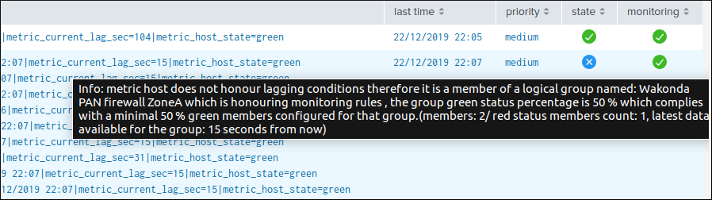

In addition, the entity will not be eligible to trigger any alert as long as the logical group honours the monitoring rules.(minimal green percentage of the logical group)

Member of logical group is red and logical group is red
^^^^^^^^^^^^^^^^^^^^^^^^^^^^^^^^^^^^^^^^^^^^^^^^^^^^^^^

When an entity associated to a logical group is red, and the logical group is red as well (for example in a logical group of 2 nodes where both nodes are down), the UI shows the following:

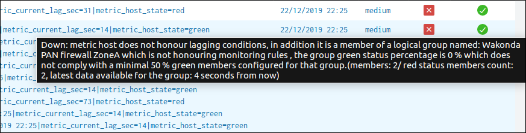

Alerts will be generated for any entities part of the logical groups which are in red status, and where the monitoring state is enabled.

Remove association from a logical group
---------------------------------------

To remove an association from a logical group, click on the entry table in the initial logical group screen for that entity:

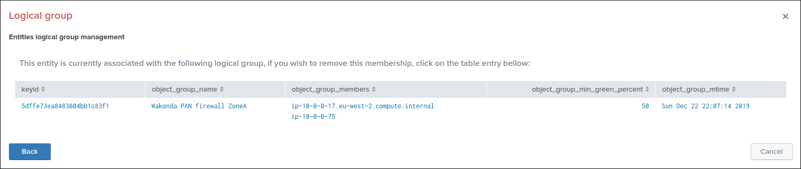

Once the action is confirmed, the association is immediately removed and the entity acts as any other independent entities.

Alerting policy for data hosts
==============================

.. admonition:: Data hosts alerting policy management

   - The alerting policy controls how the state of a data host gets defined depending on the sourcetypes that are emitting data
   - The global default mode named "track per host" instructs TrackMe to turn an host to red only if no sourcetypes are being indexed and respecting monitoring rules
   - The global alternative mode named "track per sourcetype" instructs TrackMe to consider sourcetypes and their monitoring rules individually on a per host basis, to finally define the overall state of the host
   - This global mode can optionally be overriden on a per host basis via the configuration screen of the data host

See :ref:`Data hosts global alerting policy` to control the global policy settings.

**An host emitting multiple sourcetypes will appear in the UI with a multi value summary field describing the state and main information of sourcetypes:**

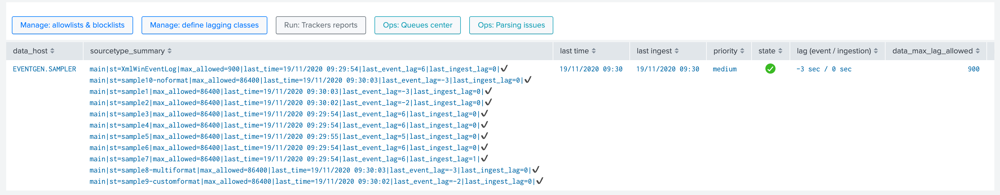

**Zooming on the summary sourcetype field:**

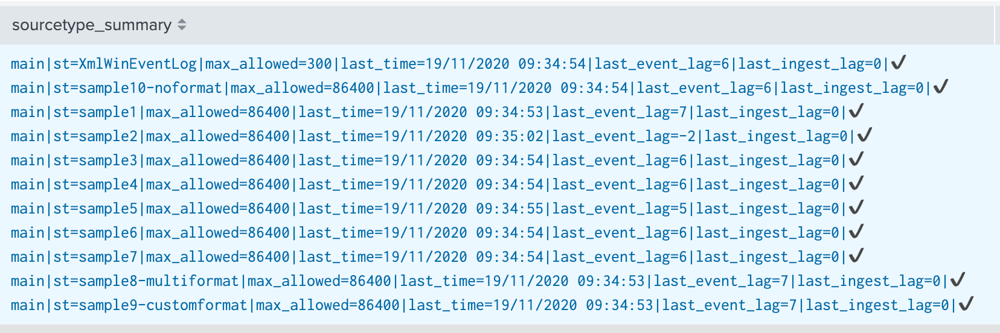

**The field provides visibility against each sourcetype known to the host, a main state (red / green) represented by an ASCII emoji and the KPI main information about the sourcetypes:**

- ``max_allowed``: the maximal laggging value allowed for this sourcetype according to the monitoring rules (lagging classes, default lagging)
- ``last_time``: A human readable format of the latest events available for that host from the event timestamp point of view (_time)
- ``last_event_lag``: The current event lag value in seconds (difference between now and the latest _time available for this host/sourcetype)
- ``last_ingest_lag``: The current indexing lag value in seconds (difference between the event timestamp and the indexing time)
- ``state``: for readability purposes, the state green/red is represented as an ASCII emoji

**Should any sourcetype not being indexed or not respecting the monitoring rules, the state icon will turn red:**

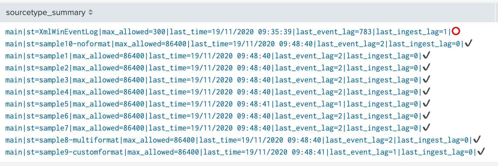

.. hint::

   If a sourcetypes turns ``red``, this will NOT impact the state of the host unless the global policy is set to ``track per sourcetype``, or the host policy is defined for that host especially

**To configure sourcetypes to be taken into account individually, you can either:**

- Define the global policy accordingly (note: this applies by default to all hosts), See :ref:`Data hosts global alerting policy`
- Define the alerting policy for that host especially in the data host configuration screen

**Defining a policy per host:**

*In the data host UI, click on the modify button to access to the alerting policy dropdown:*

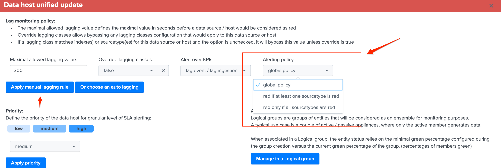

**Three options are available:**

- ``global policy``: instructs the data host settings to rely on the global alerting policy
- ``red if at least one sourcetype is red``: instructs TrackMe to turn the host red if at least one sourcetype is in a red state (track per sourcetype)
- ``red only if all sourcetypes are red``: instructs TrackMe to turn the host red only if none of the sourcetypes are respecting monitoring rules (track per host)

*When a mode is defined for a given host that is not equal to the global policy, then the global alerting policy is ignored and replaced by the setting defined for that host.*

**Behaviour examples:**

*Alerting policy track per sourcetype:*


*Alerting policy track per host:*


Tags
====

.. admonition:: Tags feature

   - Tags are keywords that can be defined per data source, this feature provides additional filtering options to group multiple data sources based on any custom criterias.
   - Tags are available for data sources monitoring only.

**Tags can be defined using:**

- Tags policies, which are regular expressions rules that you can define to automatically apply tags conditionally
- Manual tags, which you can define manually via the Tags UI on a per data source basis 

**Tags feature purpose:**

*For instance, you may want to tag data sources containing PII data, such that data sources matching this criteria can be filtered on easily in the main TrackMe UI:*

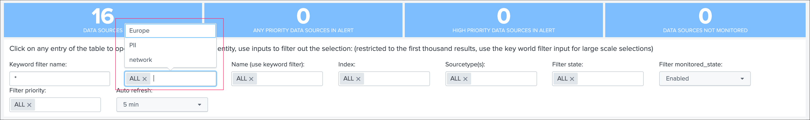

Tags policies
-------------

**The tags policies editor can be opened via the data sources main screen tab, and the button Tags policies:**

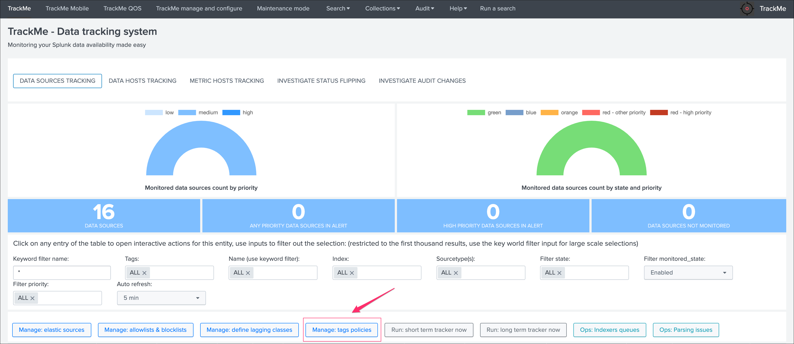

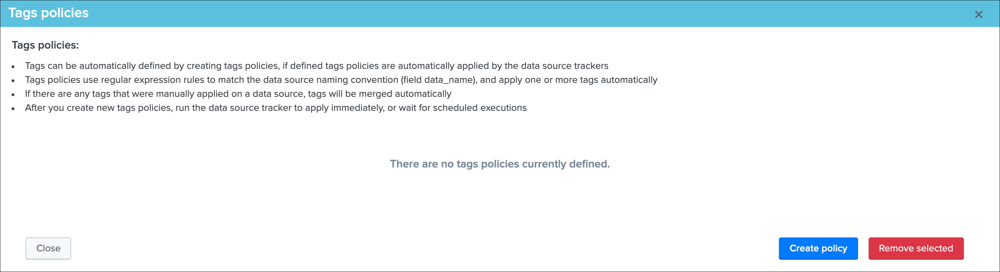

Create a new tags policy
^^^^^^^^^^^^^^^^^^^^^^^^

**To create a new tags policy, click on the Create policy button:**

.. image:: img/tags_policies_img003.png
   :alt: tags_policies_img003.png
   :align: center

**Fill the UI with the required information:**

- **Enter a unique name for this policy:** this id will be used and stored as the value for the field tags_policy_id in the KVstore collection
- **Regular expression rule:** this is the regular expression that will be used to conditionally apply the tags against the data_name field for every data source
- **List of tags:** the tags to be applied when the regular expression matches, multiple tags can be specified in a comma separated fashion 

Tags policies are applied sequentially in the order the entries are stored in the KVstore collection, should a regular expression match, the execution for this specific data source stops at the first match. 

*Example:*

- Assuming you have a naming convention for indexes, where all indexes starting by "linux\_" contain OS logs of Linux based OS
- Automatically, the following tags will be defined for every data source that matches the regular expression rule, "OS,Linux,Non-PII"

*The following policy would be defined:*

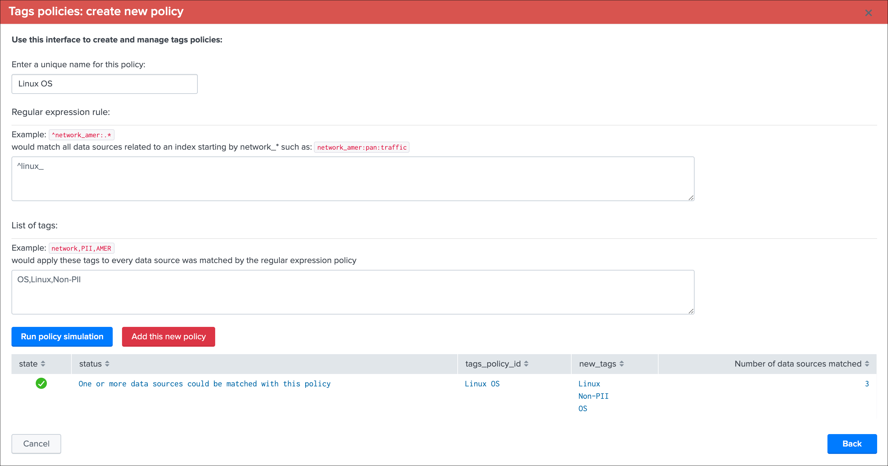

*Once the simulation was executed, click on the red button "Add this new policy":*

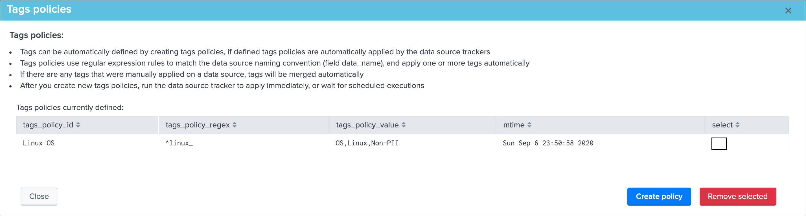

*Tags policies are applied automatically by the data source trackers, you can wait for scheduled executions or manually run the tracker (short term or long term, or both) to immediately assign the tags:*

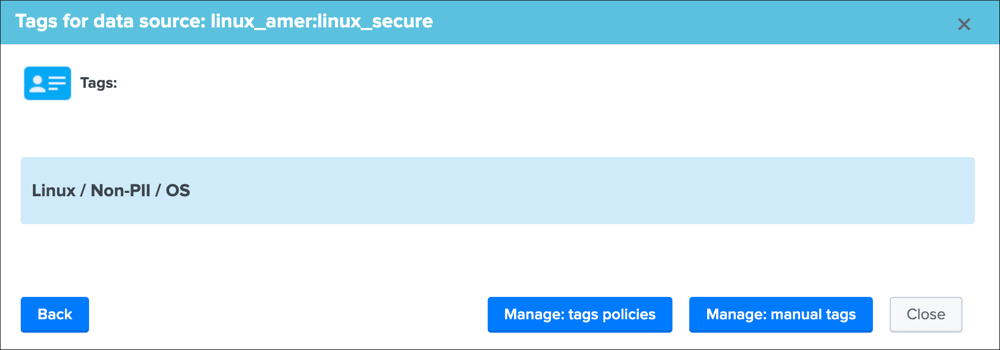

Update and delete tags policies
^^^^^^^^^^^^^^^^^^^^^^^^^^^^^^^

**You cannot update tags policies via the UI, if you need to change a tags policy, you have to delete and re-create the policy using the UI:**

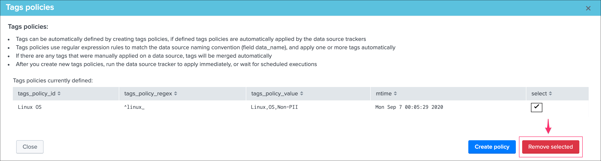

Manual tags
-----------

**Manual tags are available per data source, and allows manually defining a list of tags via the UI:**

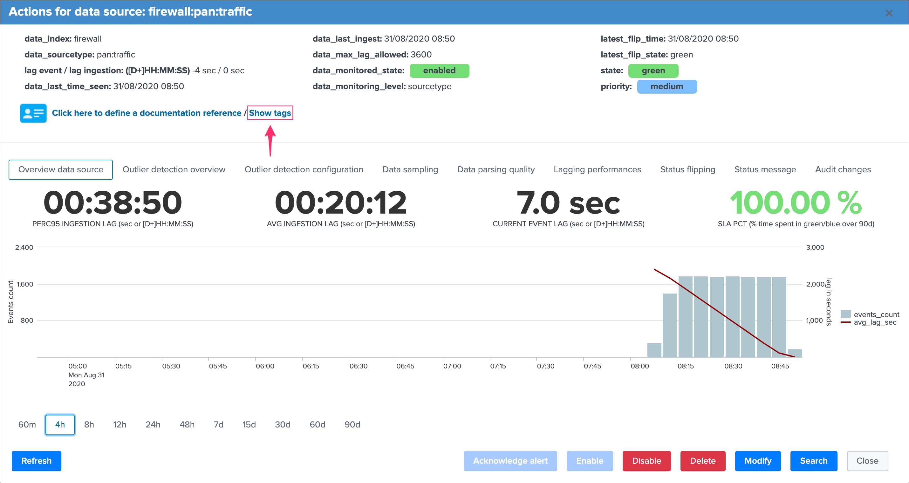

**When no tags have been defined yet for a data source, the following screen would appear:**

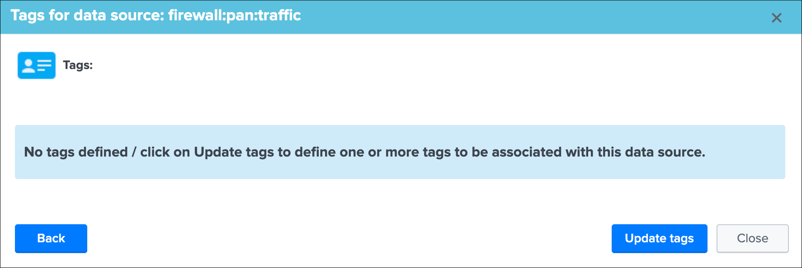

**When tags have been defined for a data source, the following screen would appear:**

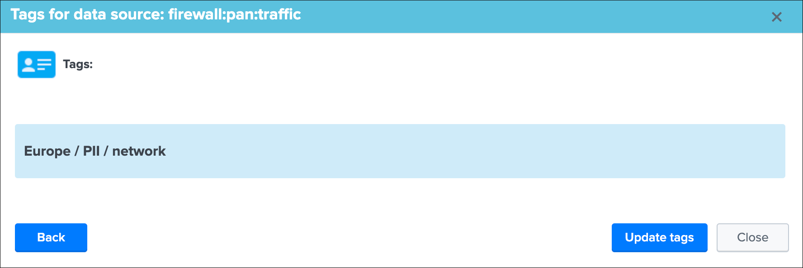

**You can click on the "Manage: manual tags" button to define one or more tags for a given data source:**

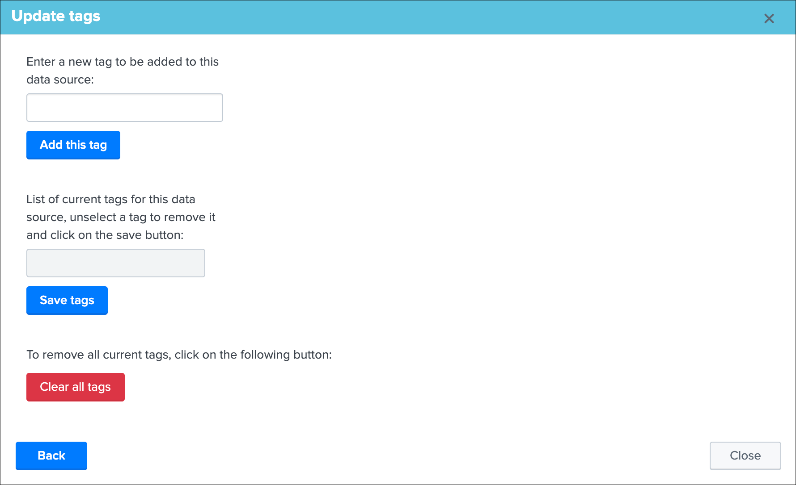

*Tags are stored in the data sources KVstore collection in a field called "tags", when multiple tags are defined, the list of tags is defined as a comma separated list of values.*

Adding new tags
^^^^^^^^^^^^^^^

**You can add a new tag by using the Add tag input and button, the tag format is free, can contain spaces or special characters, however for reliability purposes you should keep things clear and simple.**

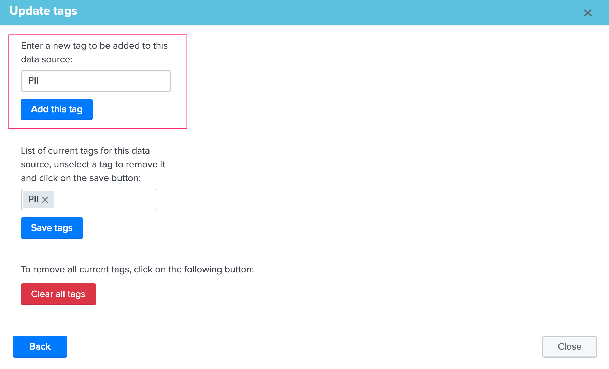

Once a new tag is added, it is made available automatically in the tag filter from the main Trackme data source screen.

Updating tags
^^^^^^^^^^^^^

**Note: Tags that have been defined by a tags policies will be defined again as long as the policy applies, to update tags applied by policies, the policy has to be updated**

**You can update tags using the multi-select dropdown input, by update we mean that you can clear one or more tags that are currently affected to a given data source, which updates immediately the list of tags in the main screen tags filter form.**

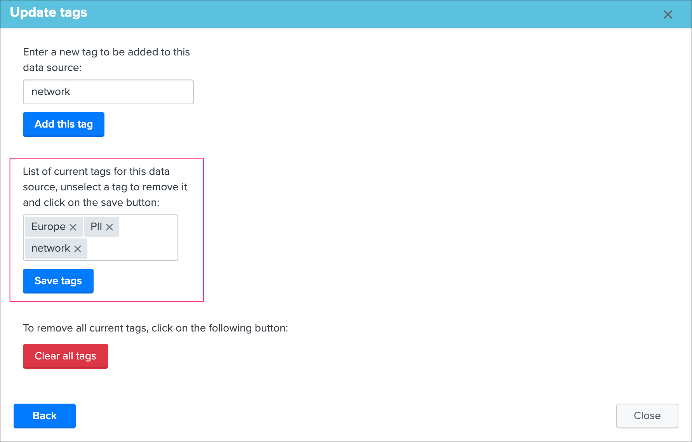

Clearing tags
^^^^^^^^^^^^^

**Note: Tags that have been defined by a tags policies will be defined again as long as the policy applies, to update tags applied by policies, the policy has to be updated**

**You can clear all tags that are currently affected to a data source, by clicking on the Clear tags button, you remove all tags for this data source.**

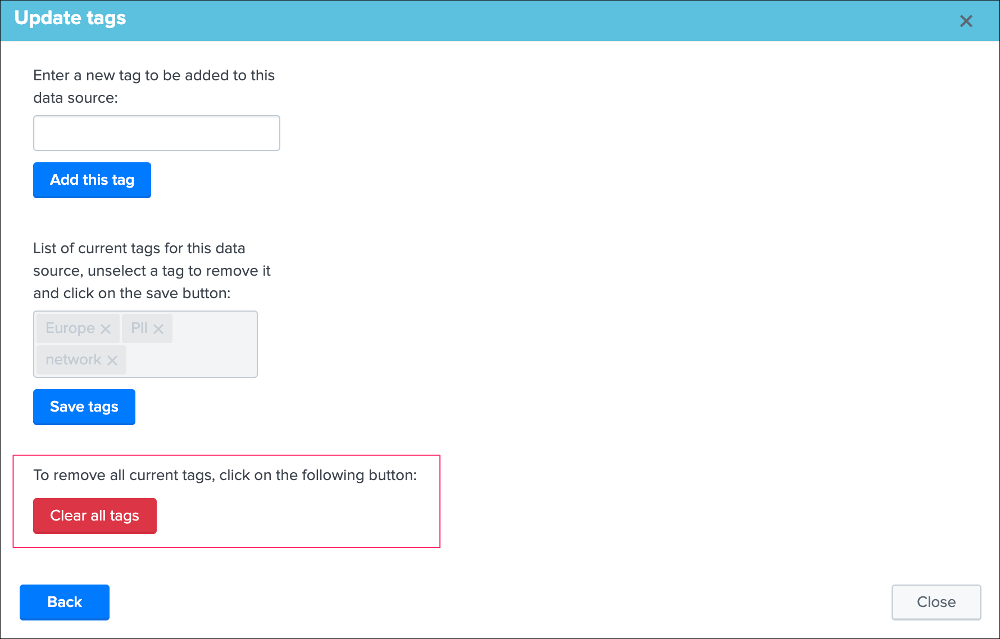

Data identity card
==================

.. admonition:: Data identity card

   - Data identity cards allow you to define a Web link and a documentation note that will be stored in a KVstore collection, and made available automatically via the UI and the out of the box alert.
   - Data identity cards are managed via the UI, when no card has been defined yet for a data source, the following message is shown.
   - Data identity cards are available for data sources monitoring only.

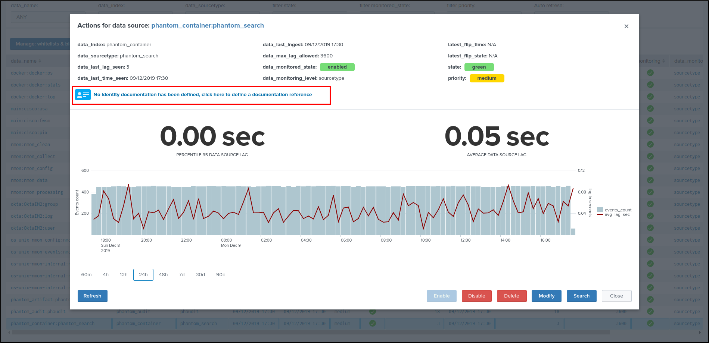

**You can click on the link to create a new identity card:**

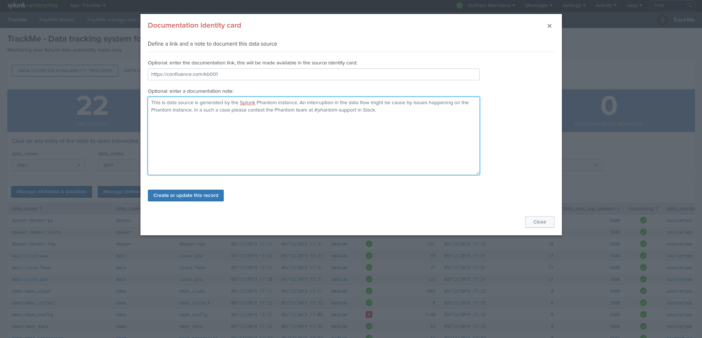

**Once the identity card has been created, the following message link is shown:**

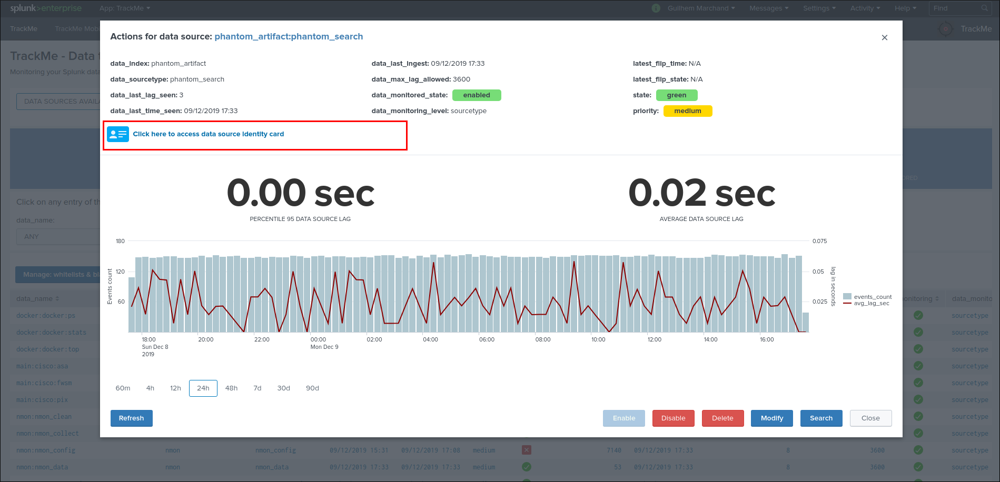

**Which automatically provides a view with the identity card content:**

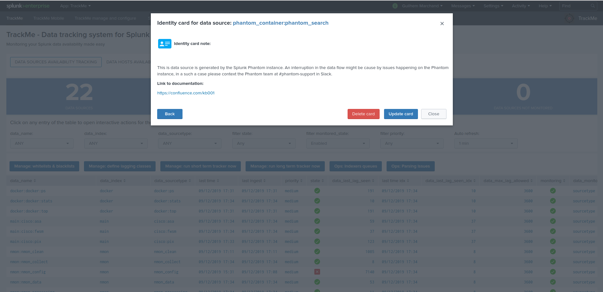

In addition, the fields "doc_link" and "doc_note" are part of the default output of the default alert, which can be recycled eventually to enrich a ticketing system incident.

**Finally, multiple entities can share the same identity record via the identity card association feature and button:**

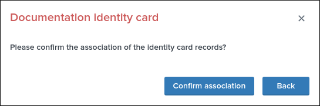

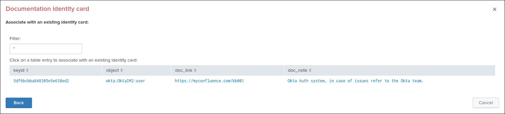

Auditing changes
================

.. admonition:: Auditing

   Every action that involves a modification of an object via the UI is stored in a KVstore collection to be used for auditing and investigation purposes.

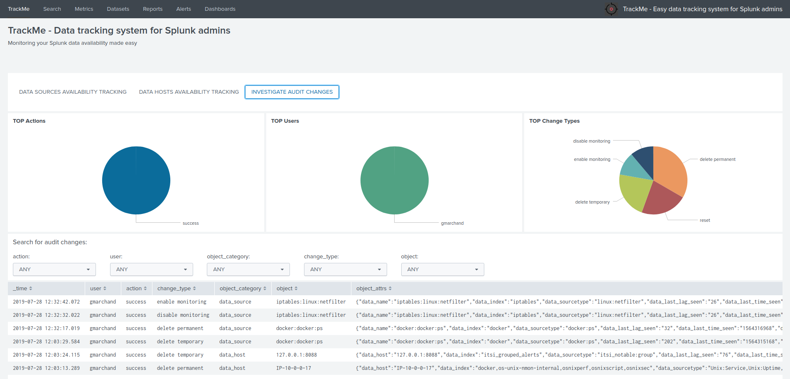

Different information related to the change performed are stored in the collection, such as the user that performed the change, the type of object, the existing state before the change is performed, and so forth.

**In addition, each audit change record has a time stamp information stored, which we use to purge old records automatically, via the scheduled report:**

- ``TrackMe - Audit changes night purge``

The purge is performed in a daily fashion executed during the night, by default every record older than 90 days will be purged.

**You can customize this value using the following macro definition:**

- ``trackme_audit_changes_retention``

Finally, the auditing change collection is automatically used by the trackers reports when a permanent deletion of an object has been requested.

Flipping statuses auditing
==========================

.. admonition:: Flipping statuses

   Every time an entity status changes, for example from green to red, a record of that event is stored as a summary flipping status event.

```trackme_idx` source="flip_state_change_tracking"```

Using the UI, you can easily monitor and investigate the historical changes of a given a data source or host over time:

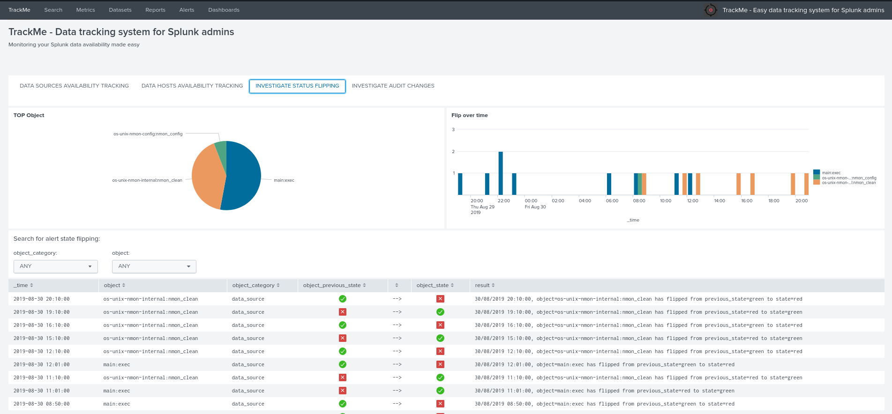

These events are automatically generated by the tracker reports, and are as well used for SLA calculation purposes.

Ops: Queues center
==================

.. admonition:: Splunk queues usage

   The Queue center provides quick access to the main Splunk queues statistics.

**The Ops view for Splunk indexing queues is accessible from the "Ops: Queues center" button in the main Trackme screen:**

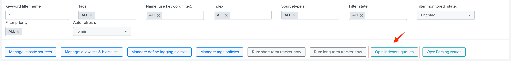

**This view shows Splunk pipeline queues usage in your environment, using the filtering results from the macro trackme_idx_filter, make sure this macro is configured to filter on indexers and heavy forwarders:**

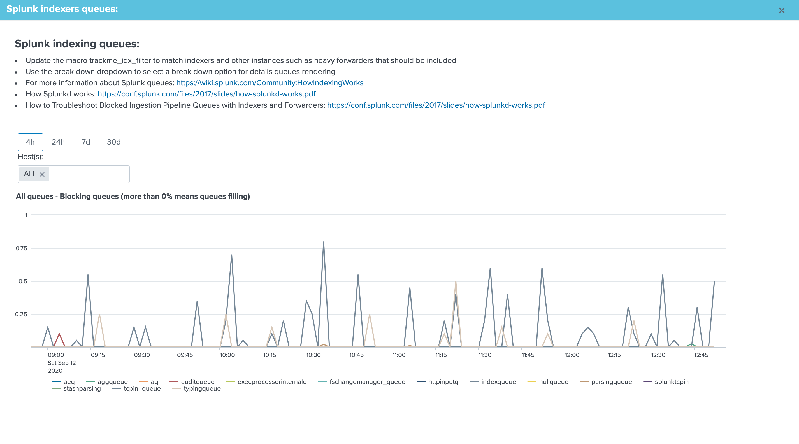

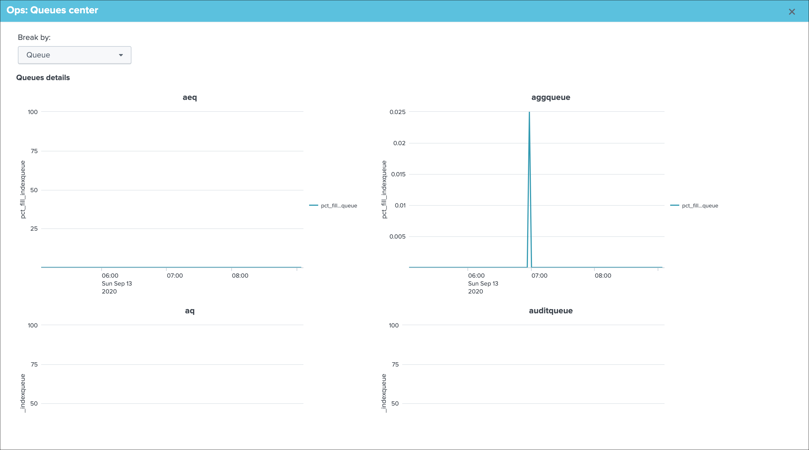

**Options in the view:**

- You can use the multiselect form to choose instances to be considered
- You can select a time range between the provided options
- Scroll down within the window, and choose different break down options in the detailed queue usage treillis charts dependending on your needs

Ops: Parsing view
=================

.. admonition:: Splunk parsing errors

   - The Ops view for Splunk indexing time parsing failures and warnings is available from the TrackMe main screen via the "Ops: Parsing view" button.
   - This UI shows the different types of parsing error happening in Splunk at the ingestion time.

.. image:: img/ops_parsing_001.png
   :alt: ops_parsing_001.png
   :align: center

**This view shows parsing errors happening in your environment, using the filtering results from the macro trackme_idx_filter, make sure this macro is configured to filter on indexers and heavy forwarders:**

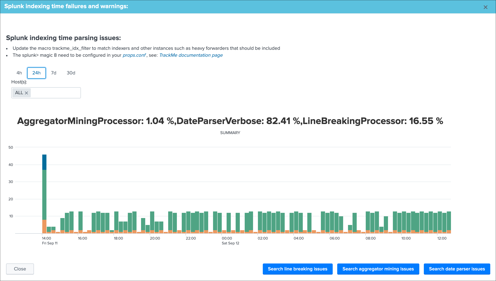

.. image:: img/ops_parsing_003.png
   :alt: ops_parsing_003.png
   :align: center

**Options in the view:**

- You can use the multiselect form to choose instances to be considered
- You can select a time range between the provided options
- Scroll down within the window to review the top root causes of the parsing issues

Splunk 8 magic props configuration
----------------------------------

**The "Splunk> magic 8" are good practice configuration items to be configured in your props.conf for the best performing and the best quality sourcetype definition:**

::

   [mySourcetype]

   TIME_PREFIX = regex of the text that leads up to the timestamp

   MAX_TIMESTAMP_LOOKAHEAD = how many characters for the timestamp

   TIME_FORMAT = strftime format of the timestamp
   # for multiline events: SHOULD_LINEMERGE should always be set to false as LINE_BREAKER will speed up multiline events

   SHOULD_LINEMERGE = false
   # Wherever the LINE_BREAKER regex matches, Splunk considers the start
   # of the first capturing group to be the end of the previous event
   # and considers the end of the first capturing group to be the start of the next event.
   # Defaults to ([\r\n]+), meaning data is broken into an event for each line

   LINE_BREAKER = regular expression for event breaks

   TRUNCATE = 0
   # Use the following attributes to handle better load balancing from UF.
   # Please note the EVENT_BREAKER properties are applicable for Splunk Universal
   # Forwarder instances only. Valid with forwarders > 6.5.0

   EVENT_BREAKER_ENABLE = true

   EVENT_BREAKER = regular expression for event breaks

**This configuration represents the ideal sourcetype definition for Splunk, combining an explicit and controled definition for a reliable event breaking and time stamp recognition, as much as it is possible you should always target this configuration.**

Out of the box alerts
=====================

.. admonition:: Out of the box alerts

   Pre-built alerts are provided if you want to get alerting based in the data sources and hosts monitoring.

- ``TrackMe - Alert on data source availability``
- ``TrackMe - Alert on data host availability``
- ``TrackMe - Alert on metric host availability``

.. warning:: These alerts are disabled by default, and need to be manually enabled if you wish to use them in your global alerting workflow.

Built-in alerts are Splunk alerts which can be extended to be integrated in many powerful ways, such as your ticketing system (Service Now, JIRA...) or even mobile notifications with Splunk Cloud Gateway.

Alerts acknowledgment
=====================

.. admonition:: Acknowledgement

   When using built-in alerts, you can leverage alert acknowledgments within the UI to silent an active alert during a given period.

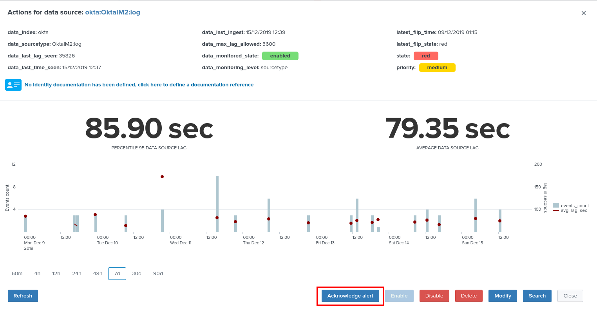

**Acknowledgments provides a way to:**

- Via the user interface, acknowledge an active alert
- Once acknowledged, the entity remains visible in the UI and monitored, but no more alerts will be generated during the time of the acknowledge
- An entity (data source, etc) that is in active alert and has been acknowledged will not generate any new alert for the next 24 hours by default, which value can be increased via the input selector
- Therefore, if the entity flips to a state green again, the acknowledge is automatically disabled
- If the entity flips later on to a red state, a new acknowledge should be created

**Acknowledgment workflow:**

- Via the UI, if the entity is in red state, the "Acknowledgment" button becomes active, otherwise it is inactive and cannot be clicked
- If the acknowledge is confirmed by the user, an active entry is created in the KVstore collection named "kv_trackme_alerts_ack". (lookup definition trackme_alerts_ack)
- The default duration of acknowledges is define by the macro named "trackme_ack_default_duration"
- Every 5 minutes, the tracker scheduled report named "TrackMe - Ack tracker" verifies if an acknowledge has reached its expiration and will update its status if required
- The tracker as well verifies the current state of the entity, if the entity has flipped again to a green state, the acknowledge is disabled
- An acknowledge can be acknowledged again within the UI, which will extend its expiration for another cycle

**Acknowledge for an active alert is inactive:**

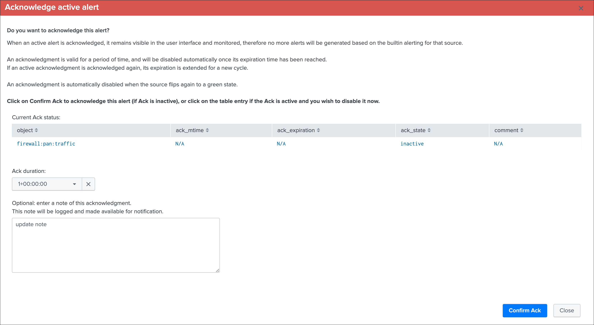

**Acknowledge for an active alert is active:**

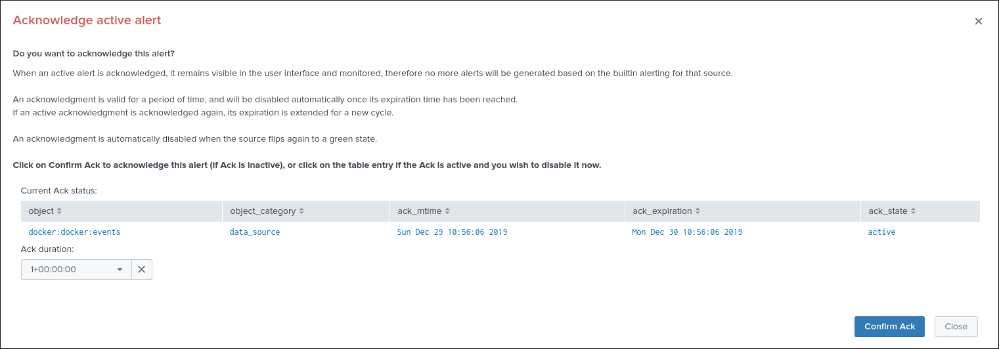

**Once active, an acknowledge can be disabled on demand by clicking on the Ack table:**

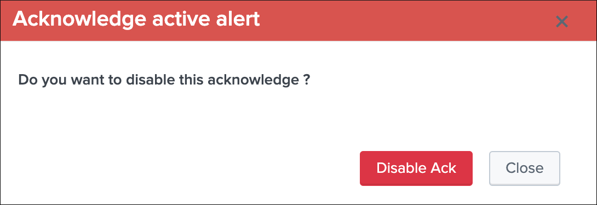

**All acknowledgement related actions are recorded in the audit collection and report.**

.. tip:: When an acknowledgment is active, a specific icon replaces the red state icon which easily indicates that an acknowledgement is currently active for that object.

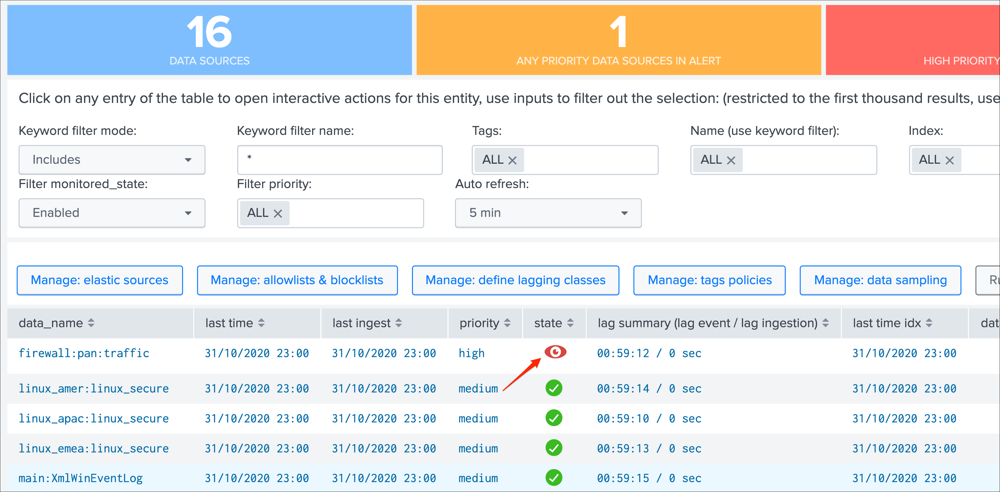

Connected experience dashboard for Splunk Mobile & Apple TV
===========================================================

**TrackMe provides a connected experience dashboard for Splunk Cloud Gateway, that can be displayed on Mobile applications & Apple TV:**

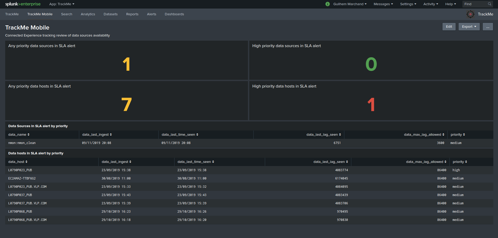

This dashboard is exported to the system, to be made available to Splunk Cloud Gateway.

Team working with trackMe alerts and audit changes flow tracker
===============================================================

**Nowadays it is very convenient to have team workspaces (Slack, Webex Teams, MS-Teams...) where people and applications can interact.**

Fortunately, Splunk with alert actions and addon extensions allows interacting with any kind of platform, TrackMe makes it very handy with the following alerts:

*Out of the box alerts can be communicating when potential issues data sources, hosts or metric hosts are detected:*

- ``TrackMe - Alert on data source availability``
- ``TrackMe - Alert on data host availability``
- ``TrackMe - Alert on metric host availability``

*In addition, the notification change tracker allows sharing automatically updates performed by administrators, which could be sent to a dedicated channel:*

- TrackMe - Audit change notification tracker

**Example in a Slack channel:**

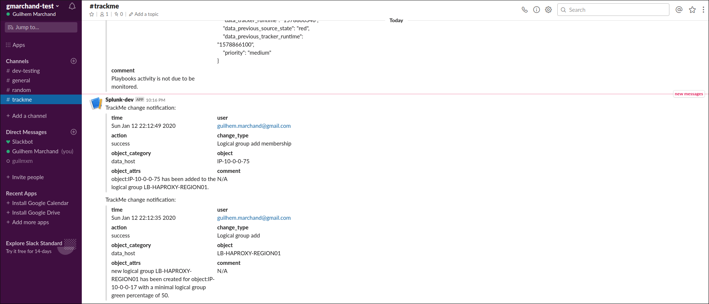

*For Slack integration, see*

- https://splunkbase.splunk.com/app/2878

Many more integration are available on Splunk Base.

Enrichment tags
===============

.. admonition:: Enrichment tags

   Enrichment tags are available for data and metric hosts to provide context for your assets based on the assets data available in your Splunk deployment.

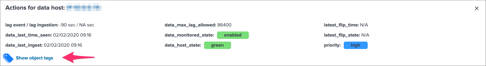

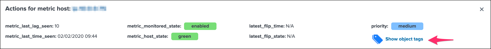

Once configured, enrichment tags provides access to your assets information to help analyst identifying the entities in alert and facilitate further investigations:

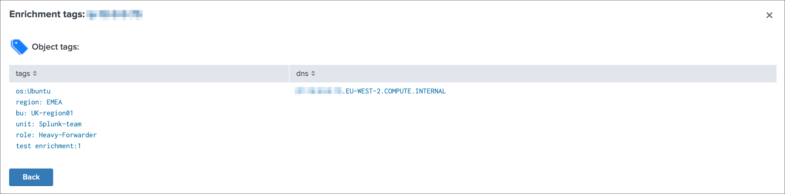

Maintenance mode
================

.. admonition:: Maintenance mode

   The maintenance mode feature provides a builtin workflow to temporary silent all alerts from TrackMe for a given period of time, which can be scheduled in advance.

All alerts are by default driven by the status of the maintenance mode stored in a KVstore collection.

Shall the maintenance be enabled by an administrator, Splunk will continue to run the schedule alerts but none of them will be able to trigger during the maintenance time window.

When the end of maintenance time window is reached, its state will be automatically disabled and alerts will be able to trigger again.

A maintenance time window can start immediately, or be can be scheduled according to your selection.

Enabling or extending the maintenance mode
------------------------------------------

- Click on the enable maintenance mode button:

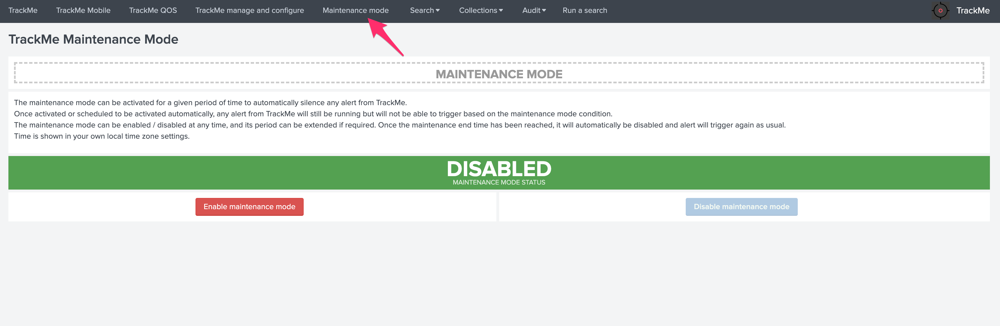

- Within the modal configuration window, enter the date and hours of the end of the maintenance time window:

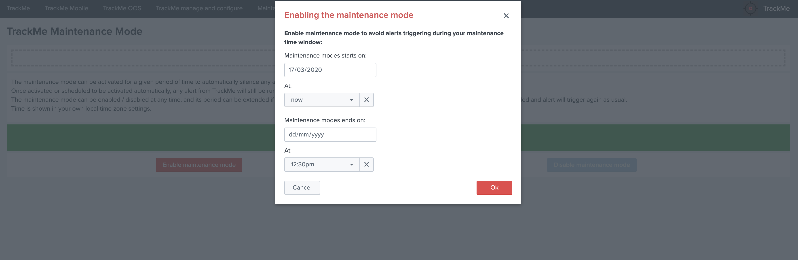

- When the date and hours of the maintenance time window are reached, the scheduled report "Verify Kafka alerting maintenance status" will automatically disable the maintenance mode.

- If a start date time different than the current time is selected (default), this action will automatically schedule the maintenance time window.

Disabling the maintenance mode
------------------------------

During any time of the maintenance time window, an administrator can decide to disable the maintenance mode:

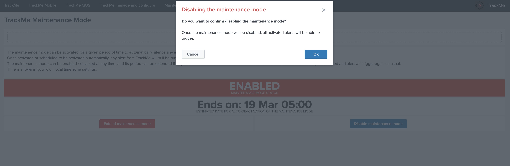

Scheduling a maintenance window
-------------------------------

You can configure the maintenance mode to be automatically enabled between a specific date time that you enter in the UI.

- When the end time is reached, the maintenance mode will automatically be disable, and the alerting will return to normal operations.

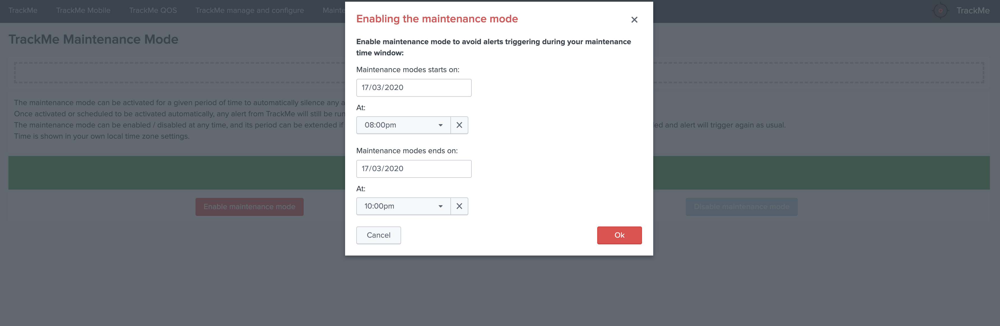

- When a maintenance mode window has been scheduled, the UI shows a specific message with the starts / ends on dates:

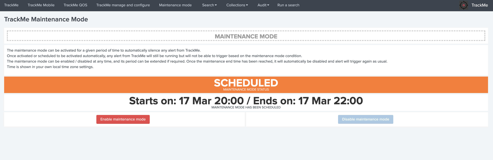
