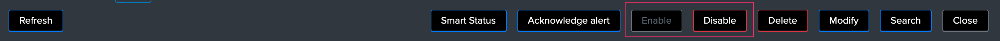

User guide
##########

First steps with the application
================================

**Open up the application:**

.. image:: img/minilabel.png
   :alt: minilabel.png
   :align: center

**If the trackers jobs have not been executed yet (scheduled every 5 minutes), the home user interface will show the following message:**

.. image:: img/incomplete_installation.png
   :alt: incomplete_installation.png
   :align: center

**Click on "Update collection now" to immediately run the long term tracker and start working with the application:**

.. image:: img/incomplete_installation_runtracker.png
   :alt: incomplete_installation_runtracker.png
   :align: center

Data sources availability tracking
==================================

.. image:: img/data_source_main.png
   :alt: data_source_main.png
   :align: center

**The data sources availability tracking is the first and default active tab in the user interface, it provides:**

- Single form overview of the total number of data sources discovered ("DATA SOURCES")
- Single form overview of the number of data sources in alert ("DATA SOURCES IN ALERT")
- Single form overview of the total number of data sources that are not being monitored ("DATA SOURCES NOT MONITORED")
- Filters for investigations
- A dynamic and interactive table representation of the data sources content. (see bellow)

**Data sources state table:**

The data sources state table exposes the information and the state of each data source:

- **data_name:** the concatenation of the index and the sourcetype, used as the unique identifier for that data source
- **data_index:** the name of the index where resides the data
- **data_sourcetype:** the name of the sourcetype
- **last time:** a human readable value of the latest time data was seen for this data source (respectively from limitations of the short and long term trackers time range scopes)
- **last ingest:** a human readable value of the latest time data was indexed for this data source (respectively from limitations of the short and long term trackers time range scopes)
- **state:** the state of the data source based on the monitoring rules for this data source
- **data_last_lag_seen:** the latest lag value in seconds seen for that data source
- **data_last_seen_index:** a human readable value of the latest time data was seen in this index (can be used to monitor on a per index basis rather than on a per sourcetype basis)
- **data_last_lag_seen_idx:** the latest lag value in seconds seen for that index (can be used to monitor on a per index basis rather than on a per sourcetype basis)
- **data_max_lag_allowed:** the maximal value of lag accepted for this data source
- **monitoring:** the monitoring state of this data source, can be enabled or disabled
- **data_monitoring_level:** defines the criteria level of the data source monitoring, valid values are sourcetype (default) or index
- **data_monitoring_wdays:** defines the week days monitoring rule for the data source, different values are possible and exposed further in this documentation

**Trackers:**

The update of the data source monitoring collection is driven by the execution of the data source scheduled tracker reports:

- TrackMe - Data sources availability short term tracker, runs every 5 minutes over the last 4 hours
- TrackMe - Data sources availability short term tracker, runs every hour over the last 7 days

Both tracker reports rely on extremely fast and cost less tstats queries.
Even on very large environments, the tracker's run time and running costs are very limited.

Data hosts availability tracking
================================

.. image:: img/data_host_main.png
   :alt: data_host_main.png
   :align: center

**The data hosts availability tracking is the second available tab in the user interface, it provides:**

- Single form overview of the total number of data hosts discovered ("DATA HOSTS")
- Single form overview of the number of data hosts in alert ("DATA HOSTS IN ALERT")
- Single form overview of the total number of data hosts that are not being monitored ("DATA HOSTS NOT MONITORED")
- Filters for investigations
- A dynamic and interactive table representation of the data hosts content. (see bellow)

**Data host state table:**

The data hosts state table exposes the information and the state of each data host:

- **data_host:** the discovered name of the host
- **data_index:** the name of the index(es) where resides the data
- **data_sourcetype:** the name of the sourcetype(s)
- **last time:** a human readable value of the latest time data was seen for this data source (respectively from limitations of the short and long term trackers time range scopes)
- **last ingest:** a human readable value of the latest time data was indexed for this data source (respectively from limitations of the short and long term trackers time range scopes)
- **state:** the state of the data source based on the monitoring rules for this data source
- **data_last_lag_seen:** the latest lag value in seconds seen for that data source
- **data_max_lag_allowed:** the maximal value of lag accepted for this data source
- **monitoring:** the monitoring state of this data source, can be enabled or disabled
- **data_monitoring_wdays:** defines the week days monitoring rule for the data source, different values are possible and exposed further in this documentation

**Trackers:**

The update of the data source monitoring collection is driven by the execution of the data source scheduled tracker reports:

- TrackMe - Data hosts availability short term tracker, runs every 5 minutes over the last 4 hours
- TrackMe - Data hosts availability short term tracker, runs every hour over the last 7 days

Both tracker reports rely on extremely fast and cost less tstats queries.
Even on very large environments, the tracker's run time and running costs are very limited.

Interactive drilldown and administration of objects
===================================================

The main concept of the user interface resides in providing an easy and interactive user experience, which first starts by a drilldown action on the object in the table.

*Accessing a data source overview and options:*

.. image:: img/data_source_drilldown.png
   :alt: data_source_drilldown.png
   :align: center

*Accessing a data host overview and options:*

.. image:: img/data_host_drilldown.png
   :alt: data_host_drilldown.png
   :align: center

*Both tracking provides the same types of access to the administration options:*

.. image:: img/drilldown_mainoptions.png
   :alt: drilldown_mainoptions.png
   :align: center

Modification of data sources or hosts monitoring rules
======================================================

Enabling / Deactivating monitoring
----------------------------------

Each object, either a data source or a data host, has a monitoring state that will be enabled or disabled.

The monitoring state drives different aspects of the restitution within the UI, and as well the fact that this object will result in an alert trigger or not.

**You can enable or disable the state within the UI, which modification gets stored in the KVstore based lookups:**

.. image:: img/monitored_state.png
   :alt: monitored_state.png
   :align: center

Modifying a data source / data host
-----------------------------------

.. image:: img/modify_main.png
   :alt: modify_main.png
   :align: center

**Data sources and hosts can be modified with:**

- The days of the week pre-built monitoring rule, or a manual selection of the week days

- The level of monitoring for data sources only, which means that we can take in consideration the latest data available at the sourcetype level (default) or a the index level

- The maximal lagging value in seconds that we accept before assuming a state of the data source or data host

Modifying monitoring week days
------------------------------

**You can modify the rules for days of week monitoring, which means specifying for which days of the week a data will be monitored actively:**

.. image:: img/week_days1.png
   :alt: week_days1.png
   :align: center

**Several builtin rules are available:**

* manual:all_days
* manual:monday-to-friday
* manual:monday-to-saturday

**Or you can select explicitly which days of the week:**

.. image:: img/week_days2.png
   :alt: week_days2.png
   :align: center

**Which is visible in the table:**

.. image:: img/week_days_table.png
   :alt: week_days_table.png
   :align: center

Modifying the monitoring level (data sources only)
--------------------------------------------------

**For data sources, you can define if the monitoring applies on the sourcetype level (default) or the index level:**

.. image:: img/monitoring_level.png
   :alt: monitoring_level.png
   :align: center

When the monitoring of the data source applies on the sourcetype level, if that combination of index / sourcetype data does not respect the monitoring rule, it will trigger.

When the monitoring ot the data source applies on the index level, we take in consideration what the latest data available is in this index, not matter what the sourcetype is.

Modifying the monitoring lag value:
-----------------------------------

**The maximal lagging value in seconds is the most essential item to be configured and defines the maximal time in seconds we accept a lack of data for that data source / host:**

.. image:: img/modify_lagging.png
   :alt: modify_lagging.png
   :align: center

Modifying this value can be done via the UI, which value has to be a positive integer.

Custom Lagging classes
======================

**Custom lagging classes allows defining custom default values of maximal lagging allowed based on index or sourcetype.**

.. image:: img/lagging_class_main.png
   :alt: lagging_class_main.png
   :align: center

**A custom lagging class can apply to both data sources and hosts monitoring, based on the following rules:**

- For data sources: index based lagging class wins over sourcetype based lagging class
- For data hosts: if multiple lagging class match, the highest lagging value wins

.. image:: img/lagging_class_selection.png
   :alt: lagging_class_selection.png
   :align: center

When a lagging class is defined and is matched for a data source or a data host, you can still override this lagging value by defining a lagging value on the object within the UI.

**An override option is provided:**

.. image:: img/lagging_class_override.png
   :alt: lagging_class_override.png
   :align: center

**As explained within the UI:**

- The maximal allowed lagging value defines the maximal value in seconds before a data source / host would be considered as red
- Override lagging classes allows bypassing any lagging classes configuration that would apply to this data source or host
- If you define a custom lagging value for a specific data source or host, use this option to avoid conflicts with lagging classes
- If a lagging class matches index(es) or sourcetype(es) for this data source or host and the option is unchecked, it will bypass this value

Finally, when a custom lagging value is defined for an object, a value of "true" is created for the field named "data_override_lagging_class", which value is used to determine the actual value for that object.

Blacklisting features
=====================

**Different level of blacklisting features are provided out of the box, which features can be used to avoid taking in consideration indexes, sourcetypes and hosts.**

.. image:: img/blacklist_btns.png
   :alt: blacklist_btns.png
   :align: center

**Adding or removing a blacklist item if performed entirely and easily within the UI:**

.. image:: img/blacklist_example.png
   :alt: blacklist_example.png
   :align: center

Manual run of the trackers
==========================

**For both data sources and hosts, you can manually execute the tracker jobs directly within the UI, that is exactly the same thing than running the relevant scheduled reports manually.**

.. image:: img/run_tracker_btns.png
   :alt: run_tracker_btns.png
   :align: center

**Once the job has been started, please wait until the end of the execution which takes up to several minutes on very large envionments:**

.. image:: img/run_tracker.png
   :alt: run_tracker.png
   :align: center

Reset the collection to factory defaults
========================================

**This danger button allows to you to perform a flush and fill operation of the KVstore collection, that is shipping out the current content and running a fresh tracker report:**

.. image:: img/reset_btn.png
   :alt: reset_btn.png
   :align: center

**If you validate the operation, all configuration changes will be lost (like week days monitoring rules changes, etc) and the long term tracker will be run automatically:**

.. image:: img/reset1.png
   :alt: reset1.png
   :align: center

.. image:: img/reset2.png
   :alt: reset2.png
   :align: center

Deletion of entities
====================

**You can delete a data source or a data host that was discovered automatically by using the builtin delete function:**

.. image:: img/delete1.png
   :alt: delete1.png
   :align: center

**Two options are available:**

.. image:: img/delete2.png
   :alt: delete2.png
   :align: center

- When the data source or host is temporary removed, it will be automatically re-created if it has been active during the time range scope of the trackers.
- When the data source or host is permanently removed, a record of the operation is stored in the audit changes KVstore collection, which we automatically use to prevent the source from being re-created effectively.

Auditing changes
================

**Every action that involves a modification of an object via the UI is stored in a KVstore collection to be used for auditing and investigation purposes:**

.. image:: img/auditing1.png
   :alt: auditing1.png
   :align: center

Different information related to the change performed are stored in the collection, such as the user that performed the change, the type of object, the existing state before the change is performed, and so forth.

**In addition, each audit change record has a time stamp information stored, which we use to purge old records automatically, via the scheduled report:**

- TrackMe - Audit changes night purge

The purge is performed in a daily fashion executed during the night, by default every record older than 90 days will be purged.

**You can customize this value using the following macro definition:**

- trackme_audit_changes_retention

Finally, the auditing change collection is automatically used by the trackers reports when a permanent deletion of an object has been requested.
