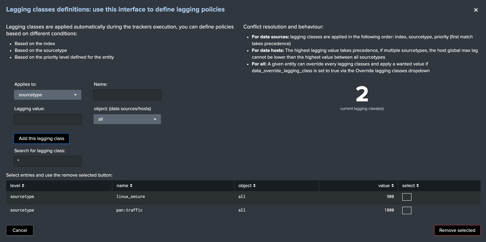
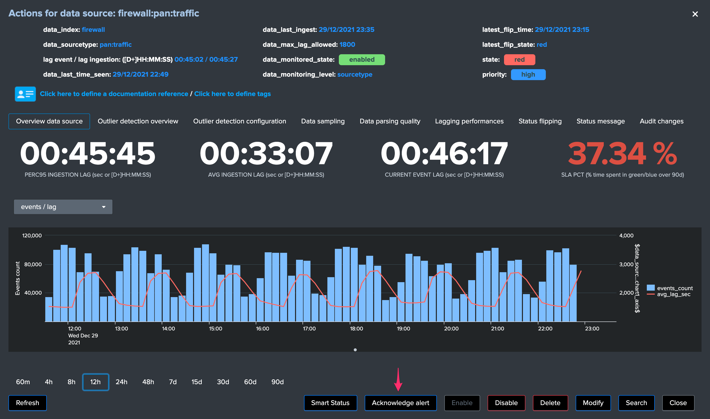

User guide
##########

First steps with the application
================================

**Open the application:**

.. image:: img/minilabel.png
   :alt: minilabel.png
   :align: center

**If the trackers jobs have not been executed yet (scheduled every 5 minutes), the home user interface will show the following message:**

.. image:: img/incomplete_installation.png
   :alt: incomplete_installation.png
   :align: center

**Click on "Update collection now" to immediately run the long term tracker and start working with the application:**

.. image:: img/incomplete_installation_runtracker.png
   :alt: incomplete_installation_runtracker.png
   :align: center

Data sources availability tracking
==================================

.. image:: img/data_source_main.png
   :alt: data_source_main.png
   :align: center

**The data sources availability tracking is the first and default active tab in the user interface, it provides:**

- Single form overview of the total number of data sources discovered ("DATA SOURCES")
- Single form overview of the number of data sources in alert ("ANY PRIORITY DATA SOURCES IN ALERT")
- Single form overview of the number of data sources in alert with an high priority ("HIGH PRIORITY DATA SOURCES IN ALERT")
- Single form overview of the total number of data sources that are not being monitored ("DATA SOURCES NOT MONITORED")
- Filters for investigations
- A dynamic and interactive table representation of the data sources content. (see bellow)

**Data sources state table:**

The data sources state table exposes the information and the state of each data source:

- **data_name:** the concatenation of the index and the sourcetype, used as the unique identifier for that data source
- **data_index:** the name of the index where resides the data
- **data_sourcetype:** the name of the sourcetype
- **last time:** a human readable value of the latest time data was seen for this data source (respectively from limitations of the short and long term trackers time range scopes)
- **last ingest:** a human readable value of the latest time data was indexed for this data source (respectively from limitations of the short and long term trackers time range scopes)
- **priority:** a value that describes the priority (low / medium / high) of the data source, to be used for granular alerting purposes
- **state:** the state of the data source based on the monitoring rules for this data source
- **data_last_lag_seen:** the latest lag value in seconds seen for that data source
- **last time idx:** a human readable value of the latest time data was seen in this index (can be used to monitor on a per index basis rather than on a per sourcetype basis)
- **data_last_lag_seen_idx:** the latest lag value in seconds seen for that index (can be used to monitor on a per index basis rather than on a per sourcetype basis)
- **data_max_lag_allowed:** the maximal value of lag accepted for this data source
- **monitoring:** the monitoring state of this data source, can be enabled or disabled
- **data_monitoring_level:** defines the criteria level of the data source monitoring, valid values are sourcetype (default) or index
- **data_monitoring_wdays:** defines the week days monitoring rule for the data source, different values are possible and exposed further in this documentation

**Trackers:**

The update of the data source monitoring collection is driven by the execution of the data source scheduled tracker reports:

- TrackMe - Data sources availability short term tracker, runs every 5 minutes over the last 4 hours
- TrackMe - Data sources availability short term tracker, runs every hour over the last 7 days

Both tracker reports rely on extremely fast and cost less tstats queries.
Even on very large environments, the tracker's run time and running costs are very limited.

Data hosts availability tracking
================================

.. image:: img/data_host_main.png
   :alt: data_host_main.png
   :align: center

**The data hosts availability tracking is the second available tab in the user interface, it provides:**

- Single form overview of the total number of data hosts discovered ("DATA HOSTS")
- Single form overview of the number of data hosts in alert ("ANY PRIORITY DATA HOSTS IN ALERT")
- Single form overview of the number of data hosts in alert with an high priority ("HIGH PRIORITY DATA HOSTS IN ALERT")
- Single form overview of the total number of data hosts that are not being monitored ("DATA HOSTS NOT MONITORED")
- Filters for investigations
- A dynamic and interactive table representation of the data hosts content. (see bellow)

**Data host state table:**

The data hosts state table exposes the information and the state of each data host:

- **data_host:** the discovered name of the host
- **data_index:** the name of the index(es) where resides the data
- **data_sourcetype:** the name of the sourcetype(s)
- **last time:** a human readable value of the latest time data was seen for this data host (respectively from limitations of the short and long term trackers time range scopes)
- **last ingest:** a human readable value of the latest time data was indexed for this data host(respectively from limitations of the short and long term trackers time range scopes)
- **priority:** a value that describes the priority (low / medium / high) of the data host, to be used for granular alerting purposes
- **state:** the state of the data source based on the monitoring rules for this data host
- **data_last_lag_seen:** the latest lag value in seconds seen for that data source
- **data_max_lag_allowed:** the maximal value of lag accepted for this data source
- **monitoring:** the monitoring state of this data host, can be enabled or disabled
- **data_monitoring_wdays:** defines the week days monitoring rule for the data source, different values are possible and exposed further in this documentation

**Trackers:**

The update of the data host monitoring collection is driven by the execution of the data host scheduled tracker reports:

- TrackMe - Data hosts availability short term tracker, runs every 5 minutes over the last 4 hours
- TrackMe - Data hosts availability short term tracker, runs every hour over the last 7 days

Both tracker reports rely on extremely fast and cost less tstats queries.
Even on very large environments, the tracker's run time and running costs are very limited.

Metric hosts availability tracking
==================================

.. image:: img/metric_host_main.png
   :alt: metrics_host_main.png
   :align: center

**Metric hosts availability tracking monitors hosts generating metrics stored into metrics indexes, it provides:**

- Single form overview of the total number of metrics hosts discovered ("METRIC HOSTS")
- Single form overview of the number of metric hosts in alert ("ANY PRIORITY METRIC HOSTS IN ALERT")
- Single form overview of the number of metric hosts in alert with an high priority ("HIGH PRIORITY METRIC HOSTS IN ALERT")
- Single form overview of the total number of metric hosts that are not being monitored ("METRIC HOSTS NOT MONITORED")
- Filters for investigations
- A dynamic and interactive table representation of the metric hosts content. (see bellow)

**Metric host state table:**

The metric hosts state table exposes the information and the state of each metric host:

- **metric_host:** the discovered name of the host
- **metric_index:** the name of the index(es) where resides the data
- **metric_category:** this field represents the main category of the metrics group, being the first segment of the metric_name value
- **metric_details_human:** A multi-value field which tracks for each metric category the individual status
- **latest time:** The very latest time a metric was seen for the host (between all metric categories)
- **priority:** a value that describes the priority (low / medium / high) of the metric host, to be used for granular alerting purposes
- **state:** the state of the metric host, by default shall any of the metric categories enters in a red state so will be the host state
- **monitoring:** the monitoring state of this host, can be enabled or disabled

**Trackers:**

The update of the metric host monitoring collection is driven by the execution of the metric host scheduled tracker report:

- TrackMe - metric hosts availability tracker, runs every 5 minutes over the last 5 minutes

The tracker uses the mstats command to retrieve the latest value and the according time on a per metric category.

These information are merged with the existing (if any) information stored in the KVstore collection, to finally define a state for each metric category, and a state for each host.

Interactive drilldown and administration of objects
===================================================

The main concept of the user interface resides in providing an easy and interactive user experience, which first starts by a drilldown action on the object in the table.

*Accessing a data source overview and options:*

.. image:: img/data_source_drilldown.png
   :alt: data_source_drilldown.png
   :align: center

*Accessing a data host overview and options:*

.. image:: img/data_host_drilldown.png
   :alt: data_host_drilldown.png
   :align: center

*Accessing a metric host overview and options:*

.. image:: img/metric_host_drilldown.png
   :alt: metric_host_drilldown.png
   :align: center

*Different options are available depending on the type of object:*

.. image:: img/drilldown_mainoptions.png
   :alt: drilldown_mainoptions.png
   :align: center

Modification of objects and monitoring rules
============================================

Enabling / Deactivating monitoring
----------------------------------

.. image:: img/enable_disable.png
   :alt: enable_disable.png
   :align: center

Each object has a monitoring state that will be enabled or disabled.

The monitoring state drives different aspects of the restitution within the UI, and as well the fact that this object will result in an alert trigger or not.

**You can enable or disable the state within the UI, which modification gets stored in the KVstore based lookups:**

.. image:: img/monitored_state.png
   :alt: monitored_state.png
   :align: center

Modifying the priority
----------------------

.. image:: img/modify_priority.png
   :alt: modify_priority.png
   :align: center

**The priority of an object can be modified in the UI via the unified modification window, the following values are valid and available:**

- low
- medium
- high

Modifying a data source / data host
-----------------------------------

.. image:: img/modify_main.png
   :alt: modify_main.png
   :align: center

**Data sources and hosts can be modified with:**

- The days of the week pre-built monitoring rule, or a manual selection of the week days

- The level of monitoring for data sources only, which means that we can take in consideration the latest data available at the sourcetype level (default) or a the index level

- The maximal lagging value in seconds that we accept before assuming a state of the data source or data host

Modifying monitoring week days
------------------------------

**You can modify the rules for days of week monitoring, which means specifying for which days of the week a data will be monitored actively:**

*Week days monitoring rules apply to event data only (data sources and hosts)*

.. image:: img/week_days1.png
   :alt: week_days1.png
   :align: center

**Several builtin rules are available:**

* manual:all_days
* manual:monday-to-friday
* manual:monday-to-saturday

**Or you can select explicitly which days of the week:**

.. image:: img/week_days2.png
   :alt: week_days2.png
   :align: center

**Which is visible in the table:**

.. image:: img/week_days_table.png
   :alt: week_days_table.png
   :align: center

Modifying the monitoring level (data sources only)
--------------------------------------------------

**For data sources, you can define if the monitoring applies on the sourcetype level (default) or the index level:**

.. image:: img/monitoring_level.png
   :alt: monitoring_level.png
   :align: center

When the monitoring of the data source applies on the sourcetype level, if that combination of index / sourcetype data does not respect the monitoring rule, it will trigger.

When the monitoring ot the data source applies on the index level, we take in consideration what the latest data available is in this index, not matter what the sourcetype is.

Modifying the monitoring lag value:
-----------------------------------

**The maximal lagging value in seconds is the most essential item to be configured and defines the maximal time in seconds we accept a lack of data for that data source / host:**

.. image:: img/modify_lagging.png
   :alt: modify_lagging.png
   :align: center

Modifying this value can be done via the UI, which value has to be a positive integer.

Custom Lagging classes
======================

**Custom lagging classes allows defining custom default values of maximal lagging allowed based on index or sourcetype.**

**A custom lagging class can apply to both data sources and hosts monitoring, based on the following rules:**

- For data sources: index based lagging class wins over sourcetype based lagging class
- For data hosts: if multiple lagging class match, the highest lagging value wins

.. image:: img/lagging_class_selection.png
   :alt: lagging_class_selection.png
   :align: center

When a lagging class is defined and is matched for a data source or a data host, you can still override this lagging value by defining a lagging value on the object within the UI.

**An override option is provided:**

.. image:: img/lagging_class_override.png
   :alt: lagging_class_override.png
   :align: center

**As explained within the UI:**

- The maximal allowed lagging value defines the maximal value in seconds before a data source / host would be considered as red
- Override lagging classes allows bypassing any lagging classes configuration that would apply to this data source or host
- If you define a custom lagging value for a specific data source or host, use this option to avoid conflicts with lagging classes
- If a lagging class matches index(es) or sourcetype(es) for this data source or host and the option is unchecked, it will bypass this value

Finally, when a custom lagging value is defined for an object, a value of "true" is created for the field named "data_override_lagging_class", which value is used to determine the actual value for that object.

Whitelisting & Blacklisting features
====================================

**TrackMe version 1.0.22 introduced builtin support for both whitelisting of indexes and blacklisting of indexes, sourcetypes and hosts.**

.. image:: img/whitelist_and_blacklist.png
   :alt: whitelist_and_blacklist.png
   :align: center

**The default behaviour of TrackMe is to track data available in all indexes, which changes if whitelisting has been defined:**

.. image:: img/whitelisting.png
   :alt: .png
   :align: center

**Different level of blacklisting features are provided out of the box, which features can be used to avoid taking in consideration indexes, sourcetypes and hosts.**

.. image:: img/blacklist_btns.png
   :alt: blacklist_btns.png
   :align: center

**Adding or removing a blacklist item if performed entirely and easily within the UI:**

.. image:: img/blacklist_example.png
   :alt: blacklist_example.png
   :align: center

Manual run of the trackers
==========================

**For both data sources and hosts, you can manually execute the tracker jobs directly within the UI, that is exactly the same thing than running the relevant scheduled reports manually.**

.. image:: img/run_tracker_btns.png
   :alt: run_tracker_btns.png
   :align: center

**Once the job has been started, please wait until the end of the execution which takes up to several minutes on very large envionments:**

.. image:: img/run_tracker.png
   :alt: run_tracker.png
   :align: center

Reset the collection to factory defaults
========================================

**This danger button allows to you to perform a flush and fill operation of the KVstore collection, that is shipping out the current content and running a fresh tracker report:**

.. image:: img/reset_btn.png
   :alt: reset_btn.png
   :align: center

**If you validate the operation, all configuration changes will be lost (like week days monitoring rules changes, etc) and the long term tracker will be run automatically:**

.. image:: img/reset1.png
   :alt: reset1.png
   :align: center

.. image:: img/reset2.png
   :alt: reset2.png
   :align: center

Deletion of entities
====================

**You can delete a data source or a data host that was discovered automatically by using the builtin delete function:**

.. image:: img/delete1.png
   :alt: delete1.png
   :align: center

**Two options are available:**

.. image:: img/delete2.png
   :alt: delete2.png
   :align: center

- When the data source or host is temporary removed, it will be automatically re-created if it has been active during the time range scope of the trackers.
- When the data source or host is permanently removed, a record of the operation is stored in the audit changes KVstore collection, which we automatically use to prevent the source from being re-created effectively.

Data identity card
==================

**This feature is currently supported only for data sources monitoring.**

**Data identity cards allow you to define a Web link and a documentation note that will be stored in a KVstore collection, and made available automatically via the UI and the out of the box alert.**

**Data identity cards are managed via the UI, when no card has been defined yet for a data source, the following message is shown:**

.. image:: img/identity_card1.png
   :alt: identity_card1.png
   :align: center

**You can click on the link to create a new identity card:**

.. image:: img/identity_card2.png
   :alt: identity_card2.png
   :align: center

**Once the identity card has been created, the following message link is shown:**

.. image:: img/identity_card3.png
   :alt: identity_card3.png
   :align: center

**Which automatically provides a view with the identity card content:**

.. image:: img/identity_card4.png
   :alt: identity_card4.png
   :align: center

In addition, the fields "doc_link" and "doc_note" are part of the default output of the default alert, which can be recycled eventually to enrich a ticketing system incident.

**Finally, multiple entities can share the same identity record via the identity card association feature and button:**

.. image:: img/identity_card5.png
   :alt: identity_card5.png
   :align: center

.. image:: img/identity_card6.png
   :alt: identity_card6.png
   :align: center

.. image:: img/identity_card7.png
   :alt: identity_card7.png
   :align: center

Auditing changes
================

**Every action that involves a modification of an object via the UI is stored in a KVstore collection to be used for auditing and investigation purposes:**

.. image:: img/auditing1.png
   :alt: auditing1.png
   :align: center

Different information related to the change performed are stored in the collection, such as the user that performed the change, the type of object, the existing state before the change is performed, and so forth.

**In addition, each audit change record has a time stamp information stored, which we use to purge old records automatically, via the scheduled report:**

- TrackMe - Audit changes night purge

The purge is performed in a daily fashion executed during the night, by default every record older than 90 days will be purged.

**You can customize this value using the following macro definition:**

- trackme_audit_changes_retention

Finally, the auditing change collection is automatically used by the trackers reports when a permanent deletion of an object has been requested.

Auditing and investigating status flapping
==========================================

**Each time a data source or host changes from a status, green for example, to another, a record of that change is saved to a KVstore based lookup named trackme_audit_flip.**

Using the UI, you can easily monitor and investigate the historical changes of a given a data source or host over time:

.. image:: img/audit_flipping.png
   :alt: audit_flipping.png
   :align: center

**The record saving operation are performed by the availability trackers that store the statuses of the data source, and the flapping tracker which compares previous statuses to current statuses:**

- TrackMe - Flip state change tracker

**In addition, a purge of old records (by default older than 90 days) are performed automatically by a night time job:**

- TrackMe - Flip state night purge

**If you wish to modify the retention period, customize the following macro:**

- trackme_flip_state_retention

Out of the box alerts
=====================

**Pre-built alerts are provided if you want to get alerting based in the data sources and hosts monitoring:**

- TrackMe - Alert on data source availability
- TrackMe - Alert on data host availability
- TrackMe - Alert on metric host availability

**The builtin alerts are disabled by default.**

Builtin alerts are Splunk alerts which can be extended to be integrated in many powerful ways, such as your ticketing system (Service Now, JIRA...) or even mobile notifications with Splunk Cloud Gateway.

Alerts acknowledgment
=====================

**When using builtin alerts, you can leverage alerts acknowledgments within the UI to acknowledge an active alert.**

**Acknowledgments provides a way to:**

- Via the user interface, acknowledge an active alert
- Once acknowledged, the entity remains visible in the UI and monitored, but no more alerts will be generated during the time of the acknowledge
- By default, acknowledges have an expiration duration of 24 hours
- This means that once acknowledged, an active alert will not generate a new alert for the next 24 hours
- Therefore, if the entity flips to a state green again, the acknowledge is automatically disabled
- If the entity flips later on to a red state, a new acknowledge should be created

**Under the wood, the acknowledgment workflow works the following way:**

- Via the UI, if the entity is in red state, the "Acknowledgment" button becomes active, otherwise it is inactive and cannot be clicked
- If the acknowledge is confirmed by the user, an active entry is created in the KVstore collection named "kv_trackme_alerts_ack". (lookup definition trackme_alerts_ack)
- The default duration of acknowledges is define by the macro named "trackme_ack_default_duration"
- Every 5 minutes, the tracker scheduled report named "TrackMe - Ack tracker" verifies if an acknowledge has reached its expiration and will update its status if required
- The tracker as well verifies the current state of the entity, if the entity has flipped again to a green state, the acknowledge is disabled
- An acknowledge can be acknowledged again within the UI, which will extend its expiration for another cycle of 24 hours from now

**Acknowledge for an active alert is inactive:**

.. image:: img/ack2.png
   :alt: ack2.png
   :align: center

**Acknowledge for an active alert is active:**

.. image:: img/ack3.png
   :alt: ack3.png
   :align: center

**Once active, an acknowledge can be disabled on demand by clicking on the Ack table:**

.. image:: img/ack4.png
   :alt: ack4.png
   :align: center

**All acknowledge related actions are recorded in the audit collection and report.**

Connected experience dashboard for Splunk Mobile & Apple TV
===========================================================

**TrackMe provides a connected experience dashboard for Splunk Cloud Gateway, that can be displayed on Mobile applications & Apple TV:**

.. image:: img/connected_dashboard.png
   :alt: connected_dashboard.png
   :align: center

This dashboard is exported to the system, to be made available to Splunk Cloud Gateway.
